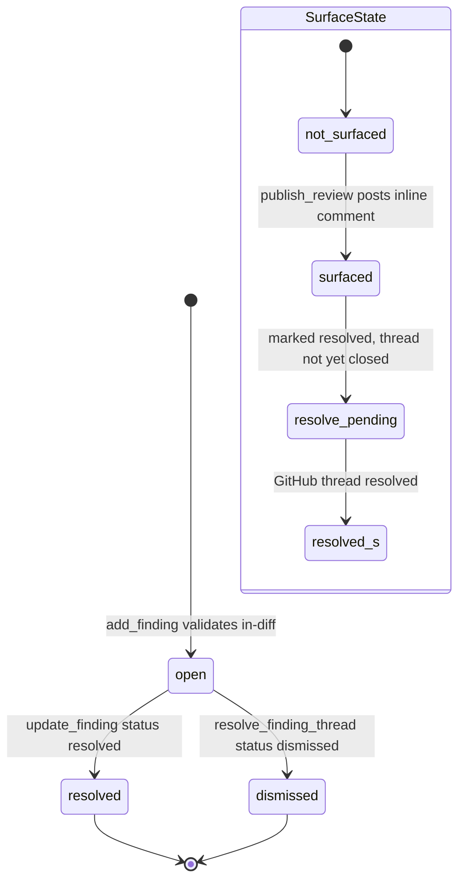
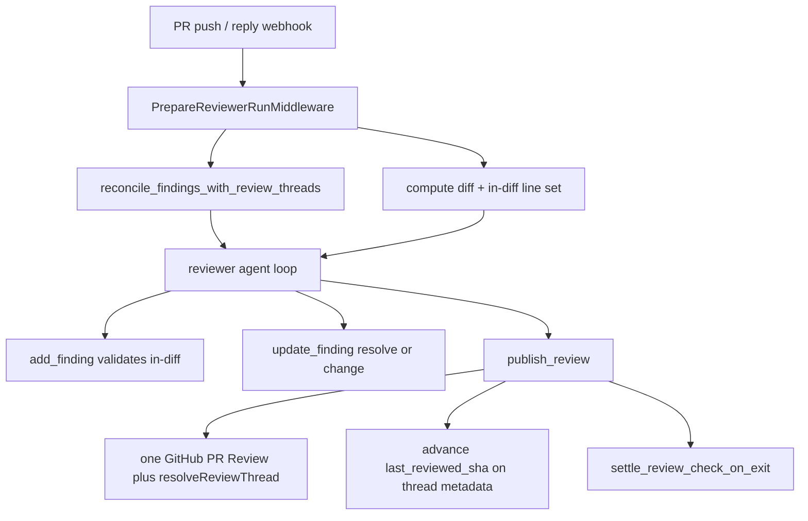

# Reviewer & Review-Style Analyzer Graphs

This page documents two related deep-agent graphs registered in
`langgraph.json`: `reviewer` (`agent.graphs.reviewer:traced_reviewer_agent`)
and `analyzer` (`agent.graphs.analyzer:traced_analyzer`). The reviewer reviews a
single GitHub pull request and publishes exactly one evolving review; the
analyzer mines a repository's history and finding outcomes to synthesize a
per-repo review-style prompt that the reviewer later injects. Both reuse the
coding agent's sandbox + `gh` lifecycle but are configured very differently from
it.

Related reading: the coding [agent graph](./agent-graph.md), the
[middleware stack](./middleware-stack.md), and the system
[overview](./overview.md).

## The reviewer graph

### Responsibilities and read-only contract

The reviewer is a specialized deep agent whose only job is to review one PR and
publish one review. It is strictly **read-only** on the repository: its prompt
forbids commits, pushes, and `gh pr review` / `gh api .../reviews`, and its
toolset omits every commit/push/PR-opening tool the coding agent has. All output
flows through the findings model and the `publish_review` tool, never through
raw GitHub review APIs invoked by the model.

### The factory: `get_reviewer_agent`

`get_reviewer_agent(config)` builds the agent per run. When there is no
`thread_id` or the graph is not loaded for execution, it returns an empty
deep agent (no sandbox, no tools). Otherwise it resolves the reviewer and
reviewer-subagent models (explicit `configurable` overrides win over team
defaults, both gated through `gate_fable_model`), attaches a cached sandbox
backend with a `reconnect_backend` closure, and constructs the deep agent with:

- a reviewer-only toolset — `fetch_review_diff`, `add_finding`,
  `update_finding`, `list_findings`, `publish_review`, `resolve_finding_thread`,
  `reply_to_finding_thread`, plus read helpers `web_search`, `fetch_url`,
  `http_request`;
- a single `reviewer` subagent that reviews an explicit, disjoint file
  partition and returns candidate defects only — it cannot call finding or
  publication tools, and the parent validates, records, and publishes;
- a leaner middleware list than the coding agent, led by
  `PrepareReviewerRunMiddleware` and closed by `settle_review_check_on_exit`.

The factory copies the incoming config before mutating it (it must not clobber
the caller's `recursion_limit`).

### Deterministic run preparation

`PrepareReviewerRunMiddleware._prepare` does the deterministic, non-LLM setup so
the model never burns tokens narrating repo prep:

1. `_ensure_reviewer_sandbox_for_thread` mints a GitHub App installation token
   scoped to the repo, caches it as a bot token for the thread, wires the
   sandbox GitHub proxy, and ensures a sandbox.
2. `prepare_review_repo` clones-or-fetches and force-checks-out the PR head in
   the sandbox before the first model call; `materialize_trusted_skills` pulls
   repo-shipped reviewer skills from the trusted base ref.
3. It computes the review diff (`fetch_pr_diff` + `materialize_review_diff` over
   the `review_diff_range`) and derives the in-diff `(file, line)` set with
   `compute_diff_line_set`, storing both `diff_text` and `diff_line_set` in run
   state so `add_finding` can validate at creation time instead of at
   GitHub-publish time.
4. It gathers context concurrently: PR title/body, existing PR review threads
   (reconciled first — see below), the learned repo style prompt, org
   guidelines, `AGENTS.md`/`CLAUDE.md` (root and scoped, from the base ref),
   an API-standards skill, and an optional author trace context.
5. It renders the full system prompt and a first-review / re-review /
   finding-reply context block, and kicks off diff grouping in the background.

The middleware fingerprints its inputs so a checkpointed prep is not re-run
unnecessarily.

### Prompt discipline and untrusted data

The reviewer prompt pins a strict bar: file a finding only when it anchors to a
specific changed line, names a concrete failure mode, and is inside the PR diff.
Out-of-diff findings are disabled, style/naming nits and speculation are
rejected, and same-bug fan-out across N files must collapse to one finding.
Author-controlled inputs — PR title/body, existing review-thread comments,
finding replies, and the author trace — are wrapped in XML data blocks whose
closing tags are neutralized (`_escape_for_data_block`) and whose logins are
validated against the GitHub username grammar, so a PR body cannot break out of
its wrapper or inject instructions.

### The findings model

Findings are the reviewer's single source of truth. Each `Finding`
(`agent/review/findings.py`) carries severity, confidence, category, title,
file + `start_line`/`end_line`/`side`, `in_diff`, description, optional
suggestion, status (`open`/`resolved`/`dismissed`), the SHAs it was first seen
and last confirmed at, GitHub identity lists (comment/thread/resolved-thread
ids), a `surface_state`, human-reply bookkeeping, a `diff_hunk` snapshot, a
content `fingerprint`, and an interactions log.

Findings persist in **LangGraph thread metadata** under the canonical reviewer
thread for the PR, not in the sandbox. This survives sandbox eviction, is
queryable cross-thread by filtering `metadata.kind == "reviewer"`, and matches
the codebase's pattern for durable non-secret run state. Legacy record shapes
are folded to the canonical fields on read, and surface states only ever move
forward.

Finding status and surface-state lifecycle (surface state only moves forward).

### add_finding validation

`add_finding` normalizes the title, validates the severity/confidence/side
enums, and resolves the diff context from run state (falling back to
`configurable` or a fresh `fetch_pr_diff`). It rejects any finding whose
`start_line..end_line` range is not in the diff (`is_range_in_diff`), returning
`success: false` with `in_diff: false` so the model does not re-anchor or retry.
On success it stores the extracted `diff_hunk` on the finding and appends it to
the reviewer thread; duplicates (by fingerprint) are surfaced via a `duplicate`
flag rather than double-recorded.

### Publishing

`publish_review` (tool) posts current eligible findings as one GitHub PR Review.
`agent/review/publish.py` batches findings above the severity threshold
(default `medium`, `status=open`, capped at `REVIEW_FINDING_CAP`) into a single
review with a fixed host-formatted summary line and one inline comment per
surfaced finding, appending a fenced `suggestion` block when the finding carries
a short suggestion. Each inline comment embeds an
`<!-- open-swe-review-comment {json} -->` marker so future runs can re-locate the
finding's thread by id. After posting, GitHub comment/thread ids are stored back
on each finding, findings that moved to `resolved` have their GitHub threads
closed via the GraphQL `resolveReviewThread` mutation, and the reviewer thread's
`last_reviewed_sha` advances to the reviewed head so subsequent pushes review
only the delta.

`publish_review` returns a structured result the model must inspect:
`success: true` alone does not mean a review was posted. `review_id: null` with
`skipped_empty_re_review: true` means an empty re-review was deliberately
skipped; `dry_run: true` means eval-mode simulation; `unresolvable_findings`
lists findings that could not be posted (the model must resolve or re-anchor
them rather than blindly retry). On thread-loss (`thread_not_found`) the tool
returns a do-not-retry result. On graph exit, `settle_review_check_on_exit`
settles the tracked GitHub review check run.

### Reconciliation with GitHub review threads

Before each run, `reconcile_findings_with_review_threads`
(`agent/review/reconcile.py`) syncs tracked findings against the current GitHub
review-thread state. It indexes threads by thread id, comment id, and embedded
marker id; matches each finding; records new GitHub comment/thread ids and marks
findings surfaced; folds a finding to `resolved` when all its threads are
resolved/outdated; and captures the latest human reply after the bot comment
(with a `needs_reassessment` interaction and a reconciliation note) so the next
run knows to reconsider. This closes the loop for watch-mode re-reviews and
human pushback.

Reviewer run flow from trigger through reconcile, review, and publish.

### Thread tagging, lifecycle, and sandbox replacement

Reviewer threads are tagged with `REVIEWER_THREAD_KIND = "reviewer"` in their
metadata (`set_reviewer_thread_metadata` always writes `kind`), which is how
findings storage, usage rollups, and the review UI find reviewer threads. The
thread id is deterministic: `reviewer_thread_id(owner, repo, pr_number)` derives
a UUID5, so webhooks, the dashboard, and the reviewer all re-derive the same id
to find the existing thread. There is therefore **one reviewer thread per PR**,
re-triggered on every push, and it **outlives its sandbox**.

Because a reviewer sandbox holds nothing but a checkout that
`prepare_review_repo` re-derives every run, and the thread (not the sandbox) is
the durable home of findings, `_ensure_reviewer_sandbox_for_thread` opts into
`allow_replacement=True`. Refusing to replace an unreachable sandbox would brick
reviews on that PR permanently; instead an unreachable sandbox is replaced. Only
when replacement also fails does the run die, posting a typed
sandbox-unreachable notification on the PR so it does not silently look
unreviewed.

## The analyzer graph

### Responsibilities

The analyzer (`agent/analyzer.py`) learns a per-repo review-style prompt for the
reviewer. It mines historical human PR review feedback and the reviewer's own
past finding outcomes (resolved / dismissed / 👍👎) to teach what a team flags
and skips, then persists a repository-specific prompt that the reviewer injects
under "Repository-specific review style". It reuses the sandbox + `gh` pattern;
the dashboard user's OAuth token (or a GitHub App installation token) is wired
into the sandbox proxy so `gh` works even on public repos where the App is not
installed.

### Bootstrap vs continual modes

`analyzer_mode` in `configurable` selects the run mode; each mode maps to a
bundled skill playbook (`agent/utils/analyzer_skills.py`):

- **bootstrap** (`bootstrap-repo-analysis`): cold-start. There is no outcomes
  history, so the agent crawls historical merged-PR review feedback with `gh`
  (plus any pre-collected samples) until it has enough human examples, extracts
  the team's norms, and saves the first prompt. Started by
  `start_bootstrap_analysis`, which collects samples up front and seeds them
  into `configurable`.
- **continual** (`continual-learning`): refinement. The agent calls
  `read_finding_outcomes` to read confirmed vs dismissed findings, promotes bug
  patterns the team actually fixes, demotes false positives, reconciles against
  the current prompt, and re-saves. Started nightly by the cron or on demand by
  `start_continual_run`.

The base prompt only orients the agent and points it at the mode's skill via
`skill_path_for_mode`; the `SKILL.md` playbook is authoritative for the
procedure. `REVIEWER_STYLE_THEMES` is injected so the learned style stays
aligned with the reviewer's high-signal, diff-anchored bar.

### Skills served as virtual files

The two `SKILL.md` playbooks live under `agent/skills/` and are served to the
deepagents `SkillsMiddleware` as virtual files: `get_analyzer` mounts a
`StateBackend` at the `/skills/` route inside a `CompositeBackend`, and
`build_skill_files` seeds the run input's `files` channel with the skill
contents (keys stripped of the `/skills` prefix). The agent reads them with
`read_file("/skills/<name>/SKILL.md")` without anything ever being written to the
execution sandbox.

### save_review_style_prompt and cron registration

The analyzer's terminal action is `save_review_style_prompt`, which persists the
synthesized `custom_prompt` (plus summary, reviewers, and sample counts) to the
`REVIEW_STYLES` store, keyed by the repo `review_style_full_name` from config,
marking the record completed. Immediately after a successful save it calls
`ensure_continual_cron`, which **idempotently** registers one daily LangGraph
cron per repo that fires a continual-learning run. The schedule is staggered by
a hash of the repo name (05:00–08:59 UTC) to avoid a thundering herd. Because
the nightly cron is threadless, the continual run configurable pins the repo's
deterministic `review_style_thread_id` — otherwise `get_analyzer` would
early-return an empty agent and no-op — while carrying no message history so
runs do not accumulate across nights. Continual runs authenticate via a GitHub
App installation token resolved inside `get_analyzer`.

## Testing

The reviewer and analyzer behavior is exercised by the `tests/reviewer/` suite
and related tests. Notable examples: `test_reviewer.py` covers prompt assembly,
data-block escaping, and in-diff line-set population from the GitHub API;
`test_reviewer_findings.py` covers findings storage and the `kind == "reviewer"`
metadata tag; `test_reviewer_publish.py` covers the publish path and comment
markers; `test_reviewer_sandbox_recovery.py` asserts the reviewer opts into
sandbox replacement while the coding agent does not; and
`test_factory_config_isolation.py` asserts `get_reviewer_agent` does not mutate
the caller's config. See the testing overview for how these fit the wider suite.
