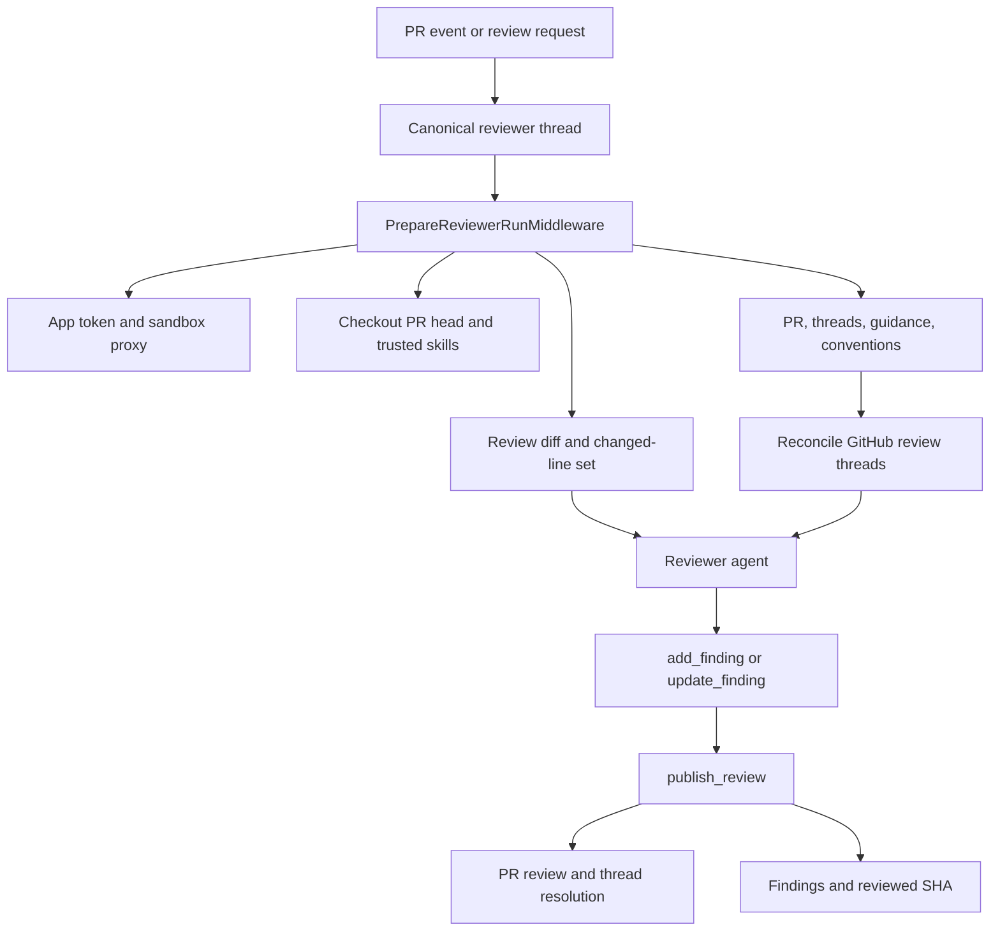
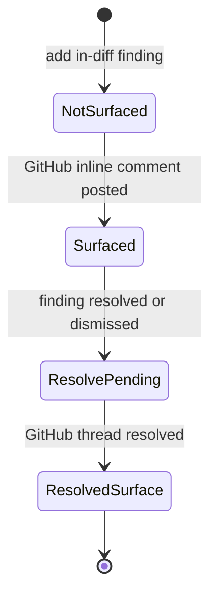
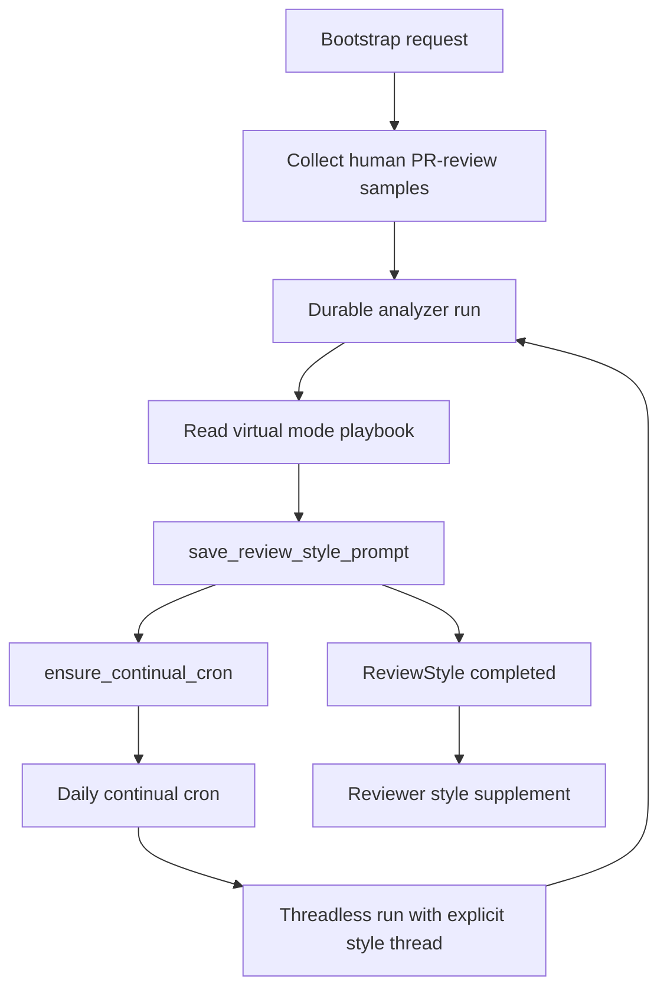

# Pull Request Reviewer and Style Analyzer

Open SWE exposes two specialized deep-agent graphs: `reviewer` (`agent.graphs.reviewer:traced_reviewer_agent`) and `analyzer` (`agent.graphs.analyzer:traced_analyzer`). The reviewer evaluates a GitHub pull request using durable, per-PR findings; the analyzer learns a repository-specific supplement to that review policy. They share sandbox infrastructure but deliberately have different authority, state, and launch paths.

For trigger routing and webhook behavior, see [PR Review Workflow](../workflows/pr-review.md). For sandbox provider and recovery behavior, see [Sandbox Lifecycle](sandbox-lifecycle.md), and for credential boundaries, see [Authentication and Security](../concepts/auth-and-security.md).

## Reviewer: constrained PR assessment

### Authority, identity, and construction

The reviewer is read-only with respect to the repository. Its review-specific toolset omits coding, commit, push, and PR-opening tools; review mutation is centralized in `publish_review` and finding-thread tools. The reviewer may inspect the checkout and use read-oriented external helpers, but it cannot make repository changes as an agent action.

Each PR has a deterministic `reviewer_thread_id(owner, repo, pr_number)`, derived with UUID5. Webhook dispatch creates or reuses that canonical thread, writes PR metadata and `kind: "reviewer"`, and dispatches the `reviewer` graph against it. Findings therefore survive sandbox eviction and can be located cross-thread by filtering `metadata.kind == "reviewer"`; changing the ID formula would orphan existing durable state.

`get_reviewer_agent(config)` builds the graph per run. It shallow-copies the outer config and its `configurable` mapping before supplying a default recursion limit, so it does not clobber the caller's configuration. If the run has no `thread_id`, or graph execution is disabled, it deliberately returns an empty deep agent rather than provisioning a sandbox.

For an executable run, the factory selects reviewer and subagent models from configuration or workspace defaults, applies the Fable model gate, and attaches a cached sandbox backend with a reconnect closure. Its explicit tools are:

- review lifecycle: `fetch_review_diff`, `add_finding`, `update_finding`, `list_findings`, `publish_review`, `resolve_finding_thread`, and `reply_to_finding_thread`;
- read-oriented external helpers: `web_search`, `fetch_url`, and `http_request`.

It permits one `reviewer` subagent. The parent assigns a disjoint file partition; the subagent returns candidate defects only and has neither finding nor publication tools. The parent remains responsible for validation, persistence, and publication.

### Run preparation and re-review

`PrepareReviewerRunMiddleware` performs deterministic setup before the first model call. For a configured source repository, it mints a repository-scoped GitHub App installation token, caches it as the thread's bot token, and supplies it to the sandbox GitHub proxy. It then ensures a sandbox with `allow_replacement=True`, clones or fetches the repository, force-checks out the PR head, and materializes trusted repository skills from the base revision.

The middleware computes the review range and unified diff, including delta-only re-review ranges, then derives the changed `(file, side, line)` set. It puts `diff_text` and `diff_line_set` in run state. This lets `add_finding` validate anchors when a finding is created rather than waiting for GitHub to reject a publish batch.

In parallel, preparation fetches the PR title and body, existing GitHub review threads, saved repository style, organization guidelines, root and scoped `AGENTS.md`/`CLAUDE.md` from the base SHA, an API standards skill, and optional author trace context. Existing threads are reconciled before their prompt block is rendered. Once the diff is available, scoped instructions are selected for changed files. The rendered context selects first-review, re-review, or finding-reply guidance. Diff grouping is started as a background best-effort task and never blocks the review.

A ready-for-review event detects a re-review from a persisted `last_reviewed_sha`; a push dispatches a re-review with that SHA. Both reuse the canonical PR thread and ask the reviewer to reconcile existing findings, add only net-new findings, and publish once. A fresh GitHub check is created on the new head because GitHub shows checks only on a PR's current head commit.

Reviewer setup and publication flow. Context retrieval is concurrent during preparation; the same durable thread connects initial review and re-review.

If sandbox replacement itself fails with `SandboxUnreachableError`, preparation posts a typed unreachable-sandbox notification on the PR and fails the run rather than silently leaving it unreviewed. Replacement is safe because the checkout is re-derived each run and findings are not sandbox state.

### Prompt and input-safety constraints

The prompt requires a concrete, changed-line-anchored failure mode and rejects speculation, ordinary style or naming nits, pre-existing defects, and duplicate fan-out for one defect across files. Explicit repository-convention violations remain reviewable when anchored in the diff and tied to a concrete failure mode. Suggestions are restricted to small, obvious fixes.

PR title/body, existing review-thread comments, and finding replies are attacker-controlled GitHub content. The renderer places them in XML data blocks, treats their contents as data rather than instructions, validates login attributes against the GitHub login grammar, and neutralizes wrapper closing tags with `_escape_for_data_block`. Author trace context is also untrusted and must not be published.

### Durable finding lifecycle

A `Finding` records its location and side, severity and confidence, title/description/suggestion, diff membership and hunk, status, first- and last-confirmed SHAs, publication identities, surface state, human-reply/reconciliation fields, fingerprint, and interaction history. Legacy persisted shapes are normalized on read. Surface state is monotonic: normalization resolves contradictory legacy data by retaining the furthest state.

Surface state moves forward independently of the finding's `open`, `resolved`, or `dismissed` status.

`add_finding` validates title, severity, confidence, side, and ordered line range. It resolves diff context from injected run state first, then `configurable`, then a fresh authenticated PR diff. A line-anchored range absent from the relevant diff side returns `success: false` and `in_diff: false`; the prompt tells the model not to re-anchor or retry. Successful findings retain an extracted diff hunk when diff text is available, clip suggestions beyond four lines, and deduplicate through their content fingerprint.

Before every normal run, `reconcile_findings_with_review_threads` matches findings to GitHub threads first by embedded marker, then recorded thread or comment identity. It backfills comment/thread IDs and marks matched findings surfaced. A finding becomes resolved only when all matched threads are resolved; an outdated-but-unresolved thread does not resolve it. The latest non-bot reply after the bot comment is retained as a `human_reply` interaction with `needs_reassessment`, giving a later run a durable reason to reconsider.

### Publication and failure semantics

`publish_review` filters unpublished, in-diff, open findings at or above its severity threshold (default `medium`) and caps the batch at `REVIEW_FINDING_CAP` (6). One call posts one GitHub PR Review containing a fixed host-generated summary and one inline comment per renderable finding; a suggestion becomes a fenced `suggestion` block. Each comment includes an `open-swe-review-comment` JSON marker with finding identity and anchor metadata, which supports reconciliation and recovery of lost IDs.

On successful publication, the tool records GitHub review/comment/thread identities, resolves threads for resolved findings through GraphQL `resolveReviewThread`, advances `last_reviewed_sha`, records usage, clears the started-review comment, and settles the GitHub review check. On a re-review, findings already represented by a GitHub comment are not posted again; only unpublished findings first seen at the current head are eligible.

Callers must inspect the structured result: `success: true` with `review_id: null` and `skipped_empty_re_review: true` is a valid no-post outcome; `dry_run: true` is evaluation simulation. A numeric `review_id` confirms a real review. If GitHub reports an unresolved anchor, the tool filters invalid findings and retries once with valid anchors when possible; otherwise it returns `unresolvable_findings` and a remediation hint, avoiding blind retries. A missing durable thread is likewise a structured do-not-retry result.

## Analyzer: repository review-style learning

### Graph, modes, and virtual playbooks

The analyzer creates a repository-specific review-style prompt for the reviewer. Its preparation resolves repository identity and mode, ensures a sandbox, and configures the LangSmith GitHub proxy with either the dashboard-provided OAuth token or a GitHub App installation token. The analyzer has two domain tools: `read_finding_outcomes` and `save_review_style_prompt`. Its middleware applies input sanitization, tool-error and timeout handling, response sanitization, and an 80-model-call limit.

Like the reviewer, `get_analyzer` returns an empty agent when no `thread_id` is supplied or graph execution is disabled. Unlike the reviewer factory, it writes the default recursion limit directly into its incoming config; callers that need configuration isolation must not assume the reviewer behavior applies here.

`analyzer_mode` selects the procedure:

- **`bootstrap`** uses `bootstrap-repo-analysis`, a cold-start procedure that mines historical merged-PR feedback with `gh`, seeking substantive human comments and reviewer norms before synthesizing an initial prompt.
- **`continual`** uses `continual-learning`, which reads confirmed and dismissed reviewer outcomes, promotes recurring confirmed patterns, demotes recurring false-positive patterns, and refines rather than replaces the current prompt.

The base prompt directs the model to the mode playbook and supplies `REVIEWER_STYLE_THEMES`, keeping learned advice bounded by the reviewer's high-signal, diff-anchored policy. The playbook, rather than the short base prompt, defines the operational procedure.

Both playbooks are packaged as virtual files. Launchers seed `build_skill_files()` into the input `files` channel; `get_analyzer` mounts a `StateBackend` at `/skills/` in a `CompositeBackend`. The agent reads `/skills/<name>/SKILL.md`, while the backend receives prefix-stripped paths. This avoids writing bundled procedural content into the execution sandbox.

### Style store and launch paths

`REVIEW_STYLES`, a typed store in the `review_styles` namespace keyed by `owner/repo`, owns a `ReviewStyle` record: analysis status, saved prompt and summary, sampled-reviewer/count metadata, analysis thread/run IDs, cron ID, error, and audit timestamps. The reviewer retrieves `custom_prompt` fail-soft during preparation: a store failure omits style guidance rather than failing a PR review. When available, it is appended under **Repository-specific review style**, and applies only when consistent with the global review bar.

`start_bootstrap_analysis` first collects review samples with the caller's GitHub token, then marks the record running and creates a durable analyzer run on `review_style_thread_id(owner, repo)`. It passes sample metadata, OAuth token, bootstrap mode, and virtual skill files. Collection or durable-run startup failures mark the style record failed. `start_continual_run` creates an immediate outcome-driven durable run using the same deterministic style thread.

The terminal tool, `save_review_style_prompt`, requires a nonempty `custom_prompt` and `review_style_full_name`; it persists the trimmed prompt, summary, reviewers, and sample counts as a completed record. Empty output marks the record failed. After saving, it attempts cron registration but does not undo the saved style if registration fails.

### Continual cron operations

A successful save calls `ensure_continual_cron`. If the style record already has a cron ID, registration is idempotent. Otherwise it creates a daily LangGraph cron targeting `analyzer`, with `kind: "analyzer_continual"` metadata and a stable SHA-256-derived time between 05:00 and 08:59 UTC, then stores the returned cron ID. `remove_continual_cron` deletes a registered remote cron best-effort and clears the stored ID.

The scheduled invocation is threadless, but its configurable explicitly provides the deterministic `review_style_thread_id`; without it, `get_analyzer` would create an empty graph and no-op. Its input has no accumulating message history, while the explicit thread still keys sandbox and metadata by repository. The scheduled configurable selects `continual`; because it carries no fresh user token, analyzer preparation obtains a GitHub App installation token. The same input seeds the bundled skills required by the playbook.

Style-analysis launch, persistence, and continual scheduling flow. Bootstrap supplies historical samples; continual learning uses the repository's recorded finding outcomes.

## Focused tests

The reviewer suite covers config isolation, diff and tool validation (including `LEFT`-side anchors), durable finding behavior, publication and marker rendering, reconciliation, background diff groups, trace context, trigger/watch behavior, and review API/chat paths. `test_factory_config_isolation.py` protects the reviewer config-copy invariant; `test_reviewer_tools.py` exercises validation and persistence decisions; `test_reviewer_reconcile.py` covers marker backfill and terminal-thread rules; and `test_reviewer_publish.py` covers markers, suggestions, re-review suppression, and publish failure handling. `tests/analyzer/test_analyzer_cron.py` verifies cron creation, idempotence, removal, seeded continual skill files, explicit thread configuration, and the deterministic schedule window.
