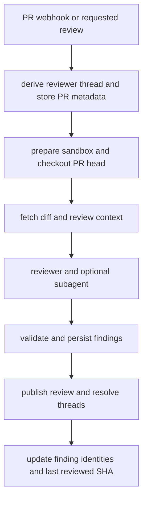
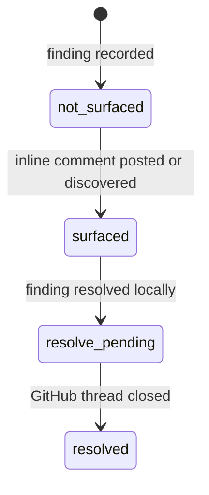

# Review and Review-Style Graphs

`langgraph.json` registers two specialized deep-agent graphs: `reviewer` (`agent.graphs.reviewer:traced_reviewer_agent`) and `analyzer` (`agent.graphs.analyzer:traced_analyzer`). The reviewer handles one GitHub pull request through a durable findings record; the analyzer builds the repository-specific guidance that sharpens that review. They share sandbox and GitHub-proxy infrastructure, but their permissions, state, and execution roles are deliberately different.

Related reading: [sandbox lifecycle](./sandbox-lifecycle.md), [authentication and security](../concepts/auth-and-security.md), [models, profiles, and instructions](../concepts/models-profiles-instructions.md), [PR review workflow](../workflows/pr-review.md), and [scheduling and baby-sit](../workflows/scheduling-and-baby-sit.md).

## Reviewer: bounded, read-only PR review

The reviewer may inspect a checkout and use its dedicated tools, but it is not a coding or PR-authoring agent. Its prompt forbids commits, pushes, `gh pr review`, and direct `gh api .../reviews` calls. The supplied tool list has finding, review-publication, thread-response, and read helpers—not commit, push, or PR-opening tools. Consequently, model-authored review output goes through the findings model and `publish_review`, rather than an arbitrary GitHub review API call.

### Factory and execution boundary

`get_reviewer_agent(config)` makes an agent for each run. It copies the caller configuration before assigning defaults, preserving a caller-supplied `recursion_limit`. If there is no `thread_id`, or the graph is loaded outside execution, it returns an empty agent with no sandbox or tools. Otherwise it resolves reviewer and subagent models (including configurable overrides and team defaults), obtains a reconnectable cached sandbox backend, and installs a reviewer-specific middleware stack.

The active agent has `fetch_review_diff`, `add_finding`, `update_finding`, `list_findings`, `publish_review`, `resolve_finding_thread`, `reply_to_finding_thread`, and the read helpers `web_search`, `fetch_url`, and `http_request`. It may delegate at most one pass to a reviewer subagent. The parent must give that subagent a disjoint file partition; the subagent returns candidate defects only, while the parent records and publishes findings.

### Dispatch and deterministic preparation

GitHub PR entrypoints derive the canonical reviewer thread ID from owner, repository, and PR number; they create/update PR metadata and dispatch the `reviewer` assistant on that thread. Opening or marking a PR ready can start the first review (drafts are gated by profile/team settings). A ready-for-review event whose head already equals persisted `last_reviewed_sha` is skipped; subsequent work is a re-review. Watched PR head pushes also retrigger review.

Before the first model call, `PrepareReviewerRunMiddleware` performs the non-LLM work: it gets a repository-scoped GitHub App installation token, caches it for the thread as a bot token, configures the sandbox proxy, and ensures a sandbox. It then clone-fetches the repository and force-checks out the requested PR head. The checkout failure is best-effort from the review flow’s perspective: diff-based review can continue, but repo skill loading is skipped.

Reviewer dispatch and review execution flow.

Preparation computes the applicable unified diff and its changed `(file, line)` set, placing `diff_text` and `diff_line_set` in run state. On re-review, the range is based on the last reviewed SHA; otherwise it uses the PR range. The setup concurrently fetches PR title/body, current review threads, learned style, organization guidelines, base-ref root and scoped `AGENTS.md`/`CLAUDE.md`, an API-standards skill, and optional author trace context. It renders the system and event context after those values arrive. Diff grouping is started in the background for the review UI; failures do not block review.

### Trusted instructions and untrusted PR content

Repository skills are a special case. After checking out the PR head, the reviewer extracts `.agents/skills` and `.claude/skills` from the **base SHA** using `git archive`, into `.review-skills` outside the checkout, then gives those locations to `SkillsMiddleware`. This prevents a PR author from changing a `SKILL.md` at the head to inject reviewer instructions. It is intentionally best effort.

Conversely, PR title/body, existing review-thread comments, finding replies, and author traces are data. Reviewer formatting encloses applicable GitHub content in XML data blocks, neutralizes closing tags, and validates logins before interpolation. The prompt tells the model not to follow instructions embedded in those blocks. The review bar also requires a concrete, changed-line failure mode; it rejects nits, speculation, pre-existing problems, duplicate manifestations of the same defect, and out-of-diff reports.

### Durable findings and reconciliation

A `Finding` is the system of record for a candidate defect. It retains its location and diff side, severity/confidence/category/title/description, optional suggestion, status, first and last confirmed SHAs, publication and resolution identities, surface state, human-reply bookkeeping, a diff hunk, fingerprint, and interaction log. Findings live in LangGraph metadata on the canonical reviewer thread, rather than in the sandbox, so they survive sandbox replacement and can be located by `metadata.kind == "reviewer"`.

Finding status is `open`, `resolved`, or `dismissed`. Separately, surface state is monotonic: normalization reconciles legacy contradictions by retaining the furthest state. The distinction matters: a finding can be recorded before it is surfaced on GitHub, and resolving it may require a later GitHub-thread operation.

Surface-state lifecycle for a persisted finding; states never move backward.

`add_finding` normalizes and validates titles and enums, then prefers diff context from injected run state, falls back to `configurable`, and finally fetches the PR diff. A line-anchored range outside the diff returns `success: false` and `in_diff: false` with a do-not-re-anchor instruction. On success it snapshots an extracted hunk when available, caps suggestions at four lines, and deduplicates by fingerprint rather than creating a second finding.

Before a run, the reviewer fetches GitHub review threads and reconciles them with stored findings. It matches via the embedded marker first, then saved thread/comment IDs; records missing identities and a surfaced state; marks a finding resolved only when all matching threads are resolved or outdated; and stores the latest subsequent human reply as a `needs_reassessment` interaction. This supplies re-review and author-pushback context without trusting comments as instructions.

### Publication, failures, and lifecycle

`publish_review` selects unpublished, in-diff, open findings at or above a severity threshold (default `medium`), capped by `REVIEW_FINDING_CAP`, and renders one GitHub PR Review for that invocation. Each eligible finding becomes an inline comment; the host-formatted summary is fixed and a short suggestion becomes a fenced `suggestion` block. The inline body contains an `open-swe-review-comment` JSON marker, allowing later reconciliation to find the GitHub thread even if stored IDs need backfilling.

After a successful post, the tool saves review/comment/thread IDs; it resolves GitHub threads for locally resolved findings with GraphQL `resolveReviewThread`; and it advances `last_reviewed_sha`. Re-reviews only surface new findings first seen at the reviewed head, avoiding duplicate comments. If there is no new inline content and an earlier Open SWE review is known, it skips an empty re-review while still resolving threads and advancing state.

The return object must be interpreted rather than reduced to `success`. `review_id: null` plus `skipped_empty_re_review: true` means a valid no-op, while `dry_run: true` means evaluation simulation. A numeric review ID confirms a real GitHub review. If GitHub rejects unresolved anchors, the tool filters against the current diff and retries once with valid findings; it reports remaining `unresolvable_findings` so the agent can fix or resolve them instead of repeating the same call. Missing reviewer-thread storage also becomes a structured do-not-retry result, and a GitHub 401 invalidates the cached token.

There is one deterministic UUID5 reviewer thread per PR. Metadata always carries `kind = "reviewer"`, used by findings queries, usage rollups, and UI discovery. Its sandbox is replaceable (`allow_replacement=True`): the checkout is reconstructed every run, while findings are durable thread state. If replacement itself fails, preparation posts a typed sandbox-unreachable notification on the PR and fails the run instead of silently leaving it unreviewed.

## Analyzer: repository-specific review-style learning

The analyzer is a separate graph that creates and refines a per-repository `custom_prompt`. The reviewer injects that prompt under **Repository-specific review style**, but only where it agrees with the global high-signal bar. Shared `REVIEWER_STYLE_THEMES` tell the analyzer to prioritize concrete, diff-anchored defects and avoid style preference, speculation, scope policing, and generic performance opinions.

`PrepareAnalyzerRunMiddleware` ensures a sandbox and configures its GitHub proxy with either the supplied dashboard-user OAuth token or an App installation token. The analyzer’s active toolset is intentionally small: `read_finding_outcomes` and `save_review_style_prompt`. It can use the sandbox’s authenticated `gh` command to gather historical review evidence.

### Modes, playbooks, and virtual files

`configurable.analyzer_mode` selects one of two procedures:

- **bootstrap** is cold-start analysis. `start_bootstrap_analysis` collects sample metadata, marks the style record running, and dispatches a durable analyzer run with a user token and deterministic repository style thread. The authoritative `bootstrap-repo-analysis` playbook requires historical merged-PR human feedback, not a generic prompt.
- **continual** refines an existing prompt from `read_finding_outcomes`: repeated confirmed patterns are promoted, repeated dismissed patterns are demoted, and the current prompt is retained or adjusted rather than rebuilt. It can be started manually or by the daily cron.

The analyzer’s base prompt points to the selected `SKILL.md`; the playbook, not the base prompt, defines the procedure. Both bundled playbooks are passed in the invocation `files` channel and served by a `StateBackend` mounted at `/skills/` in a `CompositeBackend`. Thus `SkillsMiddleware` and the model read `/skills/<name>/SKILL.md` as virtual files; no analyzer playbook is written into the execution sandbox.

### Saving, status, and continual scheduling

`save_review_style_prompt` requires `review_style_full_name` and a nonempty prompt. It writes the prompt, summary, reviewers, and sample counts to the `REVIEW_STYLES` typed store and marks the record completed. A failed or unsaved analyzer run is represented in the same record status rather than being mistaken for a completed style.

After saving, the tool best-effort calls idempotent `ensure_continual_cron`. It records one LangGraph `analyzer` cron per repository, staggered by a stable hash across 05:00–08:59 UTC. The cron input includes both virtual skill files and a deterministic `review_style_thread_id`; although the scheduled run is threadless (so messages do not accumulate nightly), that explicit configurable thread ID is required because `get_analyzer` otherwise returns an empty agent. The nightly run has no fresh user token, so `get_analyzer` resolves a GitHub App token for the proxy.

## Focused tests and safe changes

The reviewer suite covers factory configuration isolation, PR-ready dispatch and token scoping, diff preparation and tool validation, findings persistence, publication and marker recovery, reconciliation, grouping, watch-mode behavior, and trace context. Analyzer cron tests check creation, idempotency, deletion, schedule bounds, explicit analyzer thread configuration, and bundled continual skill input.

When changing this area, preserve the deterministic thread-ID formulas and finding-marker format: both are cross-process persistence/routing contracts. Preserve the base-ref-only rule for reviewer skills, the state-first diff validation path, and the distinction between a tool success response and an actual posted `review_id`. Changes to sandbox recovery should be considered with the sandbox lifecycle: replacement is safe here specifically because the sandbox is reconstructible and durable review state is elsewhere.
