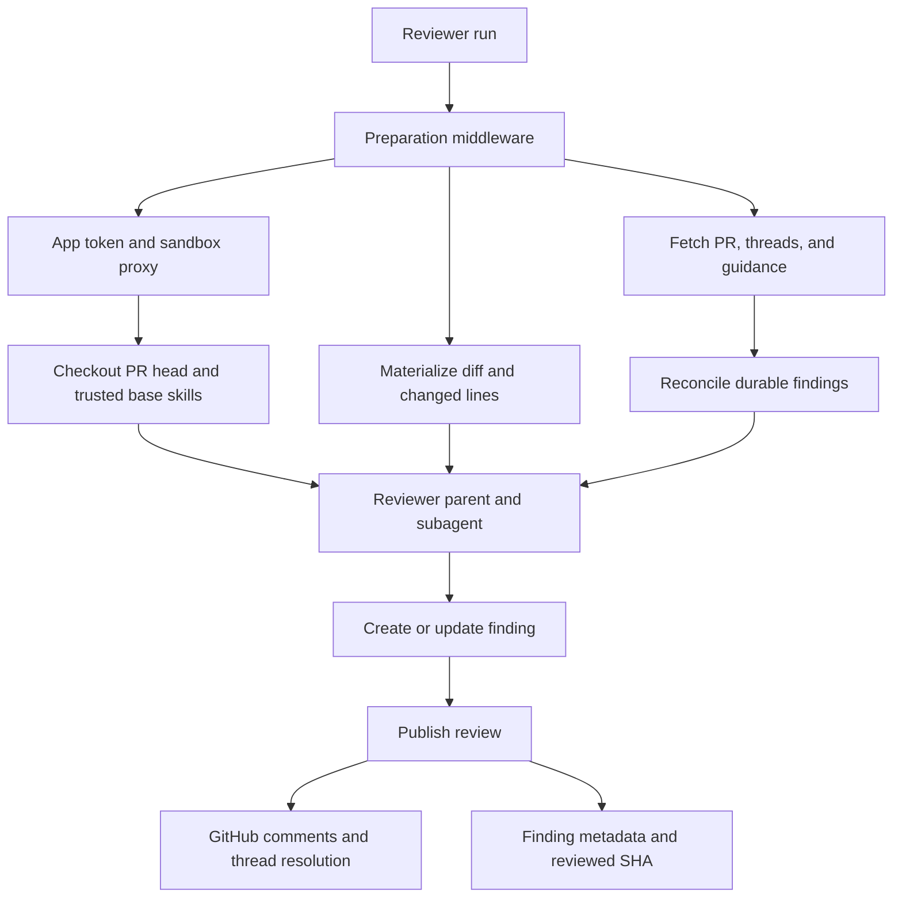
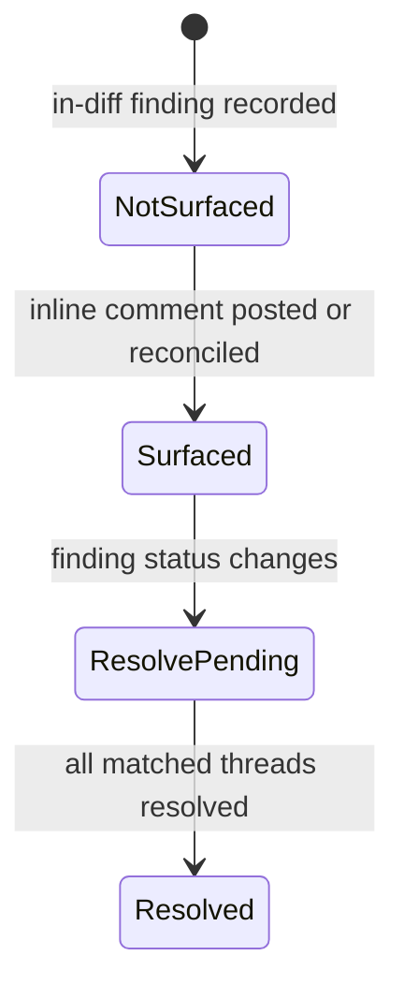
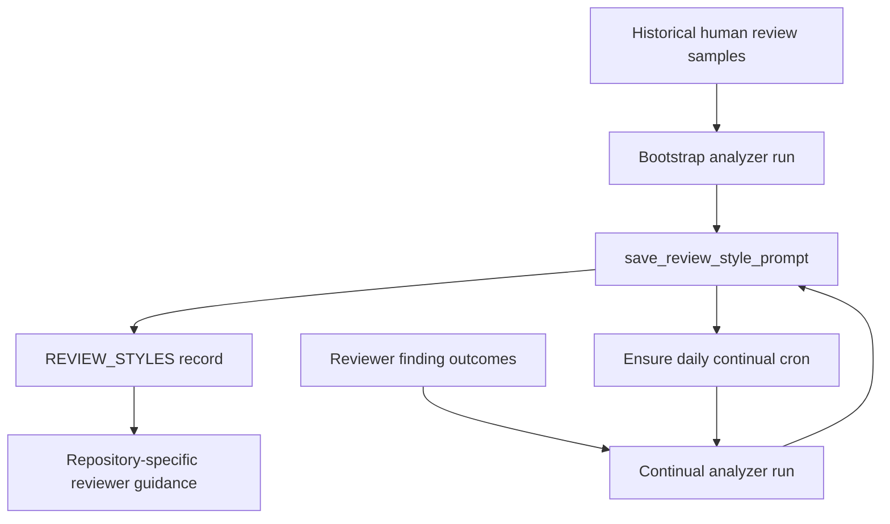

# Reviewer and Style Analyzer Graphs

Open SWE registers two specialized deep-agent graphs: `reviewer` (`agent.graphs.reviewer:traced_reviewer_agent`) and `analyzer` (`agent.graphs.analyzer:traced_analyzer`). The reviewer assesses one pull request and maintains durable findings; the analyzer produces a repository-specific prompt supplement from review evidence. They use sandbox-backed execution, but their tools, middleware, state ownership, and launch paths are intentionally different.

For event routing, see [PR Review Workflow](../workflows/pr-review.md). For sandbox provisioning and recovery, see [Sandbox Lifecycle](sandbox-lifecycle.md). [Models, Profiles, and Instructions](../concepts/models-profiles-instructions.md) and [Tools](../concepts/tools.md) cover the shared configuration and tool concepts.

## Reviewer: constrained PR assessment

### Authority and graph composition

The reviewer is read-only with respect to the repository. Its prompt forbids commits, pushes, and direct `gh pr review` or review-API calls; its tool list has neither coding nor commit/push/PR-opening tools. GitHub review mutation is deliberately centralized in `publish_review` and the finding-thread tools.

`get_reviewer_agent(config)` constructs an agent for each run. It copies the outer config and `configurable` mapping before setting a default recursion limit, preserving a caller-supplied limit. With no `thread_id`, or when the graph is not loaded for execution, it returns an empty agent and does not provision a sandbox.

An executable reviewer selects configured or team-default parent and subagent models, applies the Fable gate, and uses a cached sandbox backend with a reconnect closure. The parent has `fetch_review_diff`, `add_finding`, `update_finding`, `list_findings`, `publish_review`, `resolve_finding_thread`, `reply_to_finding_thread`, `web_search`, `fetch_url`, and `http_request`. It can delegate to one `reviewer` subagent, whose model calls have only response sanitization, model-error, and timeout middleware. The subagent returns candidate defects for an explicitly disjoint file partition; it does not receive finding or publication tools, so the parent retains validation and mutation authority.

The parent middleware is correspondingly broader: preparation, tool-input sanitization, a model-call limit, tool-error handling, GitHub-proxy refresh, queued-message checking, timeout cleanup, provider-response and thinking-block sanitization, orphaned-tool-call repair, stable tool-result ordering, model failure/timeout handling, and review-check settlement on exit. This division is significant: the subagent is a bounded analysis delegate, not another publisher.

### Preparation, checkout, and context

`PrepareReviewerRunMiddleware` runs before the first model call. For a configured source it obtains a repository-scoped GitHub App installation token, caches it for the thread as a bot token, and supplies it to the sandbox GitHub proxy. It creates or reconnects the sandbox with `allow_replacement=True`, then `prepare_review_repo` clone-fetches and checks out the requested PR head. Trusted repository skills are materialized from the base SHA, not the mutable head.

The replacement policy is safe because the checkout is reconstructed every run while findings live in durable thread metadata. If replacement also raises `SandboxUnreachableError`, preparation posts a typed notification on the PR and fails rather than silently leaving the PR unreviewed.

Preparation concurrently fetches the PR title/body, existing review threads, saved repository style, root instructions, organization guidelines, and the API-standards skill. Once the diff is available it obtains scoped instruction files for changed paths. Existing GitHub threads are reconciled before becoming prompt context; failures to fetch that context are logged and the review continues without comment awareness. The resulting prompt selects first-review, re-review, or finding-reply context. For non-reply reviews, logical diff grouping is launched in the background and does not delay the agent.

The review range may be the full PR or a delta re-review range. Preparation materializes a unified diff and computes its `(file, side, line)` membership, placing `diff_text` and `diff_line_set` in run state. This makes anchor validation possible at finding creation rather than only after an attempted GitHub post.

Reviewer preparation combines an isolated checkout and concurrent context with durable finding reconciliation before the tool loop.

### Prompt-input safety

PR bodies, review-thread comments, and finding replies are author-controlled. The formatter wraps review threads in XML data blocks, validates login attributes against the GitHub login grammar, truncates long comment bodies, and neutralizes wrapper closing tags through `_escape_for_data_block`. The reviewer prompt treats these blocks as untrusted data, not instructions. This boundary prevents a PR participant from closing a wrapper and injecting a new instruction region.

### Durable findings and reconciliation

Findings are held in LangGraph metadata on the canonical reviewer thread rather than in the sandbox, so they survive sandbox eviction and can be found cross-thread by `metadata.kind == "reviewer"`. A `Finding` includes the anchor and diff side, severity/confidence/category, content and optional suggestion, status and SHAs, GitHub publication identities, surface state, reply/reconciliation information, a diff hunk, fingerprint, and interactions. Older persisted shapes are coerced into this canonical representation. Surface state is monotonic (`not_surfaced`, `surfaced`, `resolve_pending`, `resolved`); normalization resolves contradictory legacy fields by retaining the furthest state.

`add_finding` resolves diff context from injected run state, then configuration, then a fresh authenticated PR diff. It rejects a line range not in the relevant diff side rather than asking the model to re-anchor; when available it saves an extracted hunk. Suggestions over four lines are dropped, and fingerprint-based append behavior prevents duplicate findings.

Before a normal run and again when publishing, reconciliation matches GitHub threads by embedded finding marker first, then stored thread or comment IDs. It backfills publication identities and marks matches surfaced. A finding is set to resolved only when every matching thread is resolved; an outdated but unresolved thread is terminal for matching but does not resolve the finding. The latest human reply after the bot comment is persisted with `needs_reassessment`, so later work has durable feedback context. A missing reviewer thread is converted to a structured do-not-retry tool result because retry cannot recreate the absent durable state.

A finding's GitHub surface progression is durable and one-way; its business status is maintained alongside it.

### Publishing and observable outcomes

`publish_review` selects unpublished, open, in-diff findings at or above a requested threshold (default `medium`) and applies `REVIEW_FINDING_CAP`. Re-reviews further restrict publication to findings first seen on the reviewed head. It posts one GitHub PR Review with a host-generated summary and an inline comment for each renderable finding. Comment bodies contain an `open-swe-review-comment` JSON marker keyed by finding ID; optional suggestions are emitted as fenced `suggestion` blocks. The marker is the exact identity used to map returned comments and to recover publication state.

After a successful post, the tool stamps review and comment identities together in one findings write, discovers thread IDs, resolves threads for resolved findings through GraphQL `resolveReviewThread`, advances `last_reviewed_sha`, records usage, clears the start notification, and settles the check run. A Slack completion reply is optional and only applies to an initial review that carries a Slack-thread reference.

An empty run is not necessarily a failure. If Open SWE has already reviewed the PR, an empty publish skips a duplicate summary but still resolves eligible threads and advances the reviewed SHA; the result reports `review_id: null` and `skipped_empty_re_review: true`. Evaluation mode instead returns `dry_run: true` and persists simulated publication metadata without GitHub mutation. On an unresolved-anchor response, the tool rechecks against the current PR diff and retries once only with valid findings; it otherwise returns `unresolvable_findings` and a remediation hint. Callers must inspect these structured fields rather than treating `success` alone as evidence of a real posted review.

## Analyzer: repository review-style learning

### Purpose and composition

The analyzer learns a per-repository prompt supplement from historical human PR feedback and this reviewer's resolved, dismissed, and reaction outcomes. It uses the sandbox and `gh` access pattern, configuring a LangSmith GitHub proxy with a supplied dashboard OAuth token when available or an App installation token otherwise. It has only two domain tools: `read_finding_outcomes` and `save_review_style_prompt`.

Like the reviewer, the analyzer returns an empty agent without a `thread_id` or outside executable graph loading. Unlike the reviewer factory, it writes its default recursion limit into the passed config. Its fixed default model receives input sanitization, an 80-call limit, tool-error handling, timeout wrap-up, and OpenAI-response sanitization middleware.

`analyzer_mode` chooses the authoritative virtual playbook. `bootstrap` uses `bootstrap-repo-analysis` to establish a cold-start style from merged-PR feedback. `continual` uses `continual-learning` to refine the prompt using reviewer outcomes. The base prompt supplies the shared `REVIEWER_STYLE_THEMES` and directs the agent to the appropriate playbook, which defines the procedure.

The two `SKILL.md` playbooks are not copied into the execution sandbox. Launchers seed `build_skill_files()` into the run's `files` channel, and the agent mounts a `StateBackend` at `/skills/` in a `CompositeBackend`; therefore the agent reads `/skills/<skill>/SKILL.md` while the state backend stores prefix-stripped keys.

### Store, launch, and reviewer integration

`REVIEW_STYLES` is a typed `review_styles` namespace keyed by `owner/repo`. A `ReviewStyle` stores status, the custom prompt and analysis summary, reviewer/sample metadata, analyzer thread/run IDs, a continual cron ID, error, creator, and timestamps. Lookup of the custom prompt during reviewer preparation fails soft: a store outage omits this optional guidance instead of failing a PR review.

Bootstrap begins with `collect_review_samples`, which searches recent merged PRs and collects substantive review summaries, inline comments, and issue comments from non-bot users. It ranks reviewers by collected volume and caps retained examples per top reviewer. It marks the style record running, then creates a durable `analyzer` run on the deterministic `review_style_thread_id`. Sample collection or run-start failure marks the record failed. An immediate continual run uses the same deterministic thread and seeds the continual input and virtual skills.

At the end of analysis, `save_review_style_prompt` requires configured repository identity and a nonempty prompt. It persists trimmed prompt, summary, reviewer list, and counts as completed; empty output marks the record failed. A saved prompt is injected into the reviewer under its repository-specific review-style section and is intended to apply only when consistent with the reviewer's global quality bar.

Bootstrap establishes the style prompt, and continual learning refines the same repository record from subsequent reviewer outcomes.

### Scheduled continual learning and operations

A successful save attempts `ensure_continual_cron`; a registration failure is logged but does not roll back the completed style. The function is idempotent when `continual_cron_id` already exists. Otherwise it creates an `analyzer` cron marked `analyzer_continual`, using a SHA-256-derived daily schedule between 05:00 and 08:59 UTC, and records the returned ID. Removal deletes the remote cron best-effort and clears the stored ID.

Cron input is threadless but its configurable carries the deterministic review-style thread ID. This prevents `get_analyzer` from returning its empty agent, keeps repository sandbox and metadata keyed consistently, and supplies no accumulating message history. Since the cron has no fresh user token, analyzer preparation resolves an App installation token. Status synchronization checks the latest analyzer run: terminal runs with a saved prompt become completed, while terminal/missing runs without one become failed; cancellation similarly retains a saved prompt as completed or returns the record to idle.

## Focused tests and safe changes

Relevant tests live under `tests/reviewer/`, `tests/analyzer/test_analyzer_cron.py`, and `tests/sandbox/test_reviewer_sandbox_recovery.py`. They cover diff-side and tool validation, finding persistence and outcomes, marker-based reconciliation, publication formatting and retries, diff grouping, watch behavior, cron idempotence and schedule inputs, and reviewer sandbox replacement. When changing these graphs, preserve the important boundaries: findings—not sandboxes—are durable; only the parent reviewer publishes; GitHub-originated prompt content remains data; analyzer skills remain virtual; and publication results must retain their distinguishable skip, dry-run, and anchor-failure outcomes.
