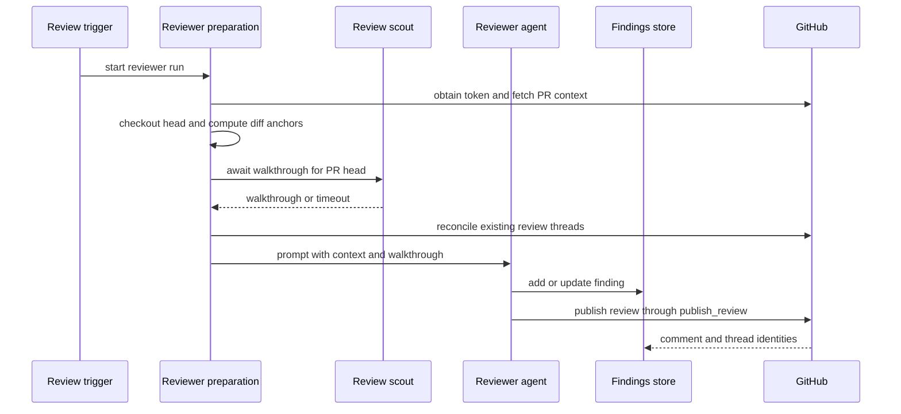

# Review, Style Analysis, and Review Scout Graphs

Open SWE registers three specialized LangGraph deep-agent graphs: `reviewer`, `analyzer`, and `review-scout`. The reviewer assesses a pull request and is the only graph in this group that can publish review output. The analyzer learns a repository-specific supplement to the reviewer’s policy. The review scout prepares a human-readable walkthrough of a PR’s diff; it is an aid to review, not a finding producer.

For routing into these graphs, see [PR Review Workflow](../workflows/pr-review.md). For generic sandbox creation and recovery, see [Sandbox Lifecycle](sandbox-lifecycle.md); for shared agent tools, see [Tools](../concepts/tools.md).

## Roles and authority boundaries

| Graph | Durable scope | Repository and GitHub authority | Primary output |
| --- | --- | --- | --- |
| `reviewer` | Deterministic reviewer thread and PostgreSQL finding records per PR | Read-only checkout; its explicit tools can record findings and publish or manage GitHub review threads | Inline PR review, tracked findings, and review state |
| `analyzer` | One deterministic review-style thread and a `review_styles` record per repository | Sandbox with repository GitHub proxy; only reads outcomes and saves style guidance | Repository-specific review-style prompt and daily continual-learning cron |
| `review-scout` | One deterministic scout thread and a PostgreSQL walkthrough per PR head | A disposable Git checkout reconstituted from the PR; it makes local synthetic commits only | Ordered walkthrough steps and optional human-input summary |

The reviewer prompt prohibits commits, pushes, and direct `gh pr review` or review-API calls. Its repository mutation boundary is therefore enforced both by prompt and tool selection: `publish_review` and finding-thread tools centralize GitHub review mutations, while the agent lacks coding, commit, push, and PR-opening tools. It may delegate one disjoint file partition to its `reviewer` subagent, but that subagent returns candidate defects only and has no finding or publication tools; the parent validates, persists, and publishes.

All three graph factories return an empty tool-less deep agent when there is no `thread_id` or the graph is not loaded for execution. The reviewer and scout copy the incoming config and `configurable` mapping before adding a default recursion limit; this avoids changing the caller’s mapping. The analyzer instead writes its default recursion limit into the provided config.

## Review preparation, findings, and publication

`PrepareReviewerRunMiddleware` runs deterministically before the reviewer’s first model call. For a source-backed repository it mints a repository-scoped GitHub App installation token, caches it as the thread bot token, and configures the sandbox GitHub proxy. It permits sandbox replacement because the checkout is regenerated every run. If replacement still raises `SandboxUnreachableError`, it posts a typed PR notification and fails rather than silently leaving the PR unreviewed.

The middleware clones or fetches the PR and checks out its head, materializes trusted repository skills from the base SHA, and concurrently gathers the PR overview, GitHub review threads, saved style prompt, organization guidance, root instructions, API standards, and the diff. It constructs the appropriate first-review, re-review, or finding-reply context. Re-review diff ranges are based on the last reviewed SHA; the resulting unified diff and changed `(file, side, line)` set are retained in run state, allowing tools to reject bad anchors before GitHub receives a batch. Existing GitHub threads are reconciled before being rendered as context, and scoped instructions are selected after changed files are known.

Reviewer preparation, optional scout walkthrough, finding persistence, and publication. A scout failure or its 600-second wait limit does not prevent review; the reviewer proceeds without a walkthrough.

Untrusted GitHub text is not treated as instructions. PR title/body, existing review comments, and finding replies are rendered into XML data blocks; closing tags are neutralized and login attributes are validated. The review policy requires an in-diff, concrete failure mode, rejects speculative and duplicate findings, and limits suggestions to small obvious fixes.

### Finding state and publishing

Findings now live in PostgreSQL under the pull request, addressed through the reviewer thread; only thread-level PR identity, head SHA, and related state remain in LangGraph metadata. A compatibility migration copies legacy metadata findings on first access. The typed finding includes location/side, severity and confidence, prose and optional suggestion, diff membership and hunk, status, SHAs, GitHub publication identifiers, monotonic surface state, human-reply/reconciliation fields, fingerprint, interactions, and rank.

`add_finding` resolves diff data from run state first, then configured values, and finally a fresh authenticated PR diff. It rejects a line range not present on the relevant diff side with `success: false` and `in_diff: false`; this is intentionally a do-not-reanchor signal. It deduplicates via a content fingerprint, stores a diff hunk when available, and drops suggestions longer than four lines. Missing reviewer-thread state is also converted to a structured do-not-retry result.

Before a normal review, reconciliation maps stored findings to current GitHub threads using the embedded finding marker and recorded identities. It backfills identities, marks matching findings surfaced, resolves a finding only when all matching threads are resolved or outdated, and records the newest human reply for reassessment.

`publish_review` selects unpublished, open, in-diff findings at or above its severity threshold (default `medium`) and applies `REVIEW_FINDING_CAP`. It posts one PR review with a generated summary and one inline comment per renderable finding; suggestions are fenced. The comment marker carries the finding ID and anchor metadata so later reconciliation can recover thread associations. On success it records review/comment/thread IDs, resolves threads for resolved findings, updates `last_reviewed_sha`, and settles associated review status. Re-reviews do not repost published findings; an empty re-review may successfully return `review_id: null` and `skipped_empty_re_review: true`. Evaluation dry runs also return no real review ID. If GitHub rejects anchors, the tool filters invalid findings and retries at most once, otherwise returning `unresolvable_findings` and a remediation hint.

## Review scout: an ordered diff walkthrough

The reviewer starts a scout for the same PR head unless handling a finding reply or an evaluation. `ReviewScoutTarget` reuses an active run for that head, but a newer head starts its own run. It first returns a walkthrough already stored for the head. Otherwise it polls the durable scout run for up to `SCOUT_WAIT_SECONDS` (600); timeout, unavailable PostgreSQL, or failure yields `None`, so the reviewer remains available without this enhancement.

Scout preparation requires repo, PR number, base SHA, and head SHA. It mints and caches an App token, replaces unreachable sandboxes safely, prepares the PR checkout, and transforms the working tree into the complete PR diff as unstaged changes on the merge base. The agent has only `commit_walkthrough_step` and `record_human_input`, a 150-call cap, and standard input, timeout, response, and tool-error middleware. The human-input tool is removed when there is no stored steering history.

The scout’s local commits are not repository writes: they are synthetic commits in the isolated sandbox. `commit_walkthrough_step` requires an `other: true` pass before normal steps, so the agent groups nonessential changes first and then commits reviewable steps. Finalization guarantees that the final synthetic tree equals the PR head, uses forward and reverse blame to assign changed added and deleted lines to steps in the PR diff’s numbering, and puts unclaimed changes in a final **Other changes** step. `StoreWalkthroughMiddleware` replaces the persisted walkthrough only when meaningful non-`other` steps exist, pinning it to the head SHA and storing the human-input summary.

## Analyzer: review-style learning

The analyzer learns a per-repository prompt from historical human review feedback and outcomes of the reviewer’s prior findings. Its preparation resolves the repository workspace, ensures a sandbox with a GitHub proxy restricted to the configured repository, and renders a prompt that names the selected procedure and supplies `REVIEWER_STYLE_THEMES`. Its two domain tools are `read_finding_outcomes` and `save_review_style_prompt`; it has an 80-model-call limit and sanitization, tool-error, timeout, and response middleware.

`analyzer_mode` chooses a bundled playbook. `bootstrap` is a cold-start process which samples historical merged-PR feedback and may use `gh` for further evidence. `continual` reads recorded finding outcomes to promote recurring confirmed patterns and demote recurring false positives. The playbooks are virtual input files: launchers seed `build_skill_files()` into the run `files`, while the graph mounts a `StateBackend` at `/skills/` in a `CompositeBackend`. Thus the procedural files are not written into the execution sandbox.

`REVIEW_STYLES` is a typed store in the `review_styles` namespace keyed by `owner/repo`. A `ReviewStyle` tracks analysis status, prompt and approval policy, summary and sampling data, analysis thread/run IDs, cron ID, error, and timestamps. Reviewer lookup is fail-soft: a store outage omits the style supplement rather than failing code review. When present, the prompt is injected as repository-specific guidance bounded by the reviewer’s global quality bar.

Bootstrap collection marks a record running and starts a durable analyzer run on the deterministic review-style thread; collection and start failures mark it failed. A manual continual run uses the same thread. The terminal save tool rejects an empty prompt, otherwise persists the completed style metadata and tries to register a daily continual cron. Registration is idempotent and hash-staggers repositories between 05:00 and 08:59 UTC. The scheduled run has no accumulated message history, but explicitly supplies the deterministic thread ID—without it the analyzer factory would return its empty agent—and seeds the virtual skills. Since the cron carries no user token, preparation obtains access through the configured sandbox GitHub proxy/App path.

## Focused tests and safe changes

`tests/reviewer/test_factory_config_isolation.py` protects config-copy behavior. Reviewer tests cover diff anchors, finding persistence and outcomes, reconciliation, publishing markers and suggestions, API/chat/review-session behavior, approval policy, and trigger/watch handling. `tests/reviewer/test_review_scout_git.py` verifies that synthetic steps retain exact PR-diff line ownership, preserve paths with spaces, place `Other changes` last, and end with the exact PR-head tree. `tests/analyzer/test_analyzer_cron.py` covers cron creation, idempotence/removal, explicit scheduled thread configuration, seeded skills, and the staggered schedule.
