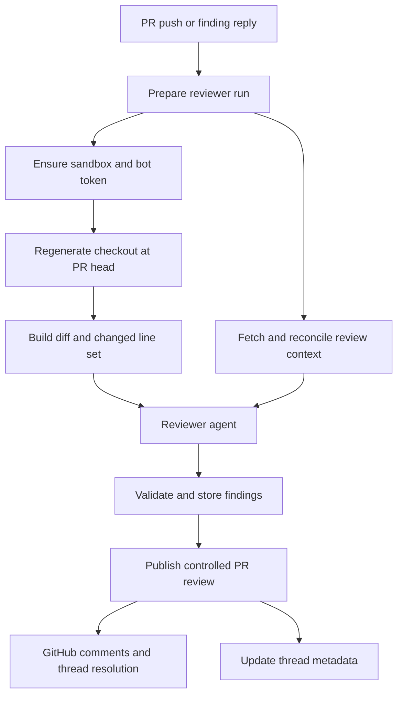
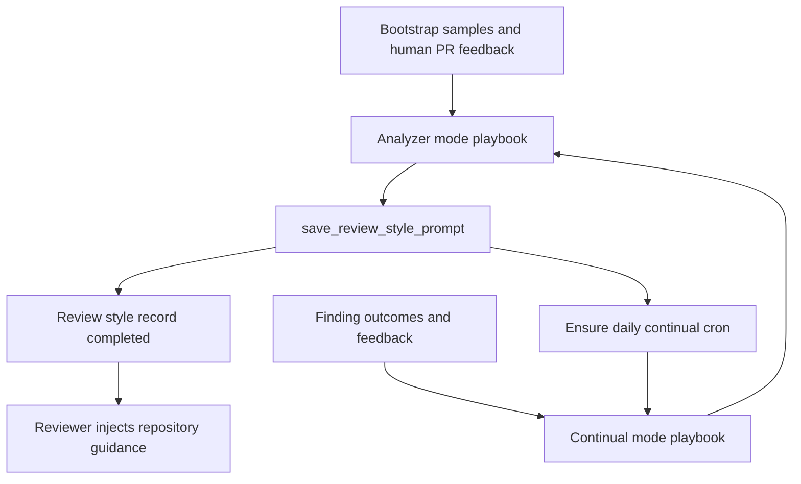

# Review and review-style graphs

Open SWE separates automated PR review, repository-style learning, and review-page chat into different graphs. `reviewer` and `analyzer` are registered LangGraph graphs; `chat` is a third graph used by the dashboard's “chat with this PR” feature. The reviewer owns a PR's evolving review and is deliberately read-only with respect to repository code. The analyzer creates guidance for that reviewer. PR chat is an explanatory boundary, not a way to modify the PR.

## Reviewer: read-only review of one PR

`get_reviewer_agent` creates a run-scoped deep agent. It copies the incoming configuration before adding defaults, so callers retain their own `recursion_limit`; it returns an empty agent when no thread is available or execution is not loaded. The active agent has review tools (`fetch_review_diff`, finding lifecycle tools, and `publish_review`) plus read helpers. Its prompt forbids commits, pushes, and direct `gh pr review` or reviews API use. The only publishing route exposed to the model is the controlled findings-to-review path.

A single optional `reviewer` subagent can inspect one explicit, disjoint file partition. It only returns candidate defects; the parent validates candidates, writes findings, and publishes. This keeps review state changes and GitHub side effects centralized.

### Preparation and replacement safety

Before the first model call, `PrepareReviewerRunMiddleware` performs deterministic setup:

1. It obtains a repository-scoped GitHub App installation token, caches it for the reviewer thread as a bot token, configures the sandbox proxy, and ensures a sandbox.
2. `prepare_review_repo` clone-fetches as needed and force-checks out the PR head. Trusted repository skills are materialized from the base ref.
3. It calculates the review range and unified diff, then derives the changed `(file, side, line)` positions into `diff_line_set` alongside `diff_text`.
4. Concurrent tasks fetch PR metadata, prior review threads, repository style guidance, organization guidance, base-ref `AGENTS.md`/`CLAUDE.md` instructions (including instructions scoped to changed files), API standards, and optional author trace context. Existing GitHub review threads are reconciled before they enter the prompt.
5. It renders first-review, re-review, or finding-reply context, then starts best-effort logical diff grouping for the UI without blocking the review.

Reviewer preparation and publication: durable state is separate from the regenerated checkout.

The reviewer uses `allow_replacement=True` when ensuring its sandbox. That is safe specifically because the sandbox contains only a checkout regenerated on every run, while durable findings live in the reviewer thread. An unreachable sandbox can therefore be replaced rather than permanently blocking reviews; if replacement also fails, preparation posts a typed PR notification and fails the run.

## Diff discipline, untrusted inputs, and findings

The prompt requires an in-diff changed-line anchor and a concrete current failure mode. It rejects speculative concerns, style and naming preferences, architectural critiques, pre-existing issues, and repeated reports of the same defect. PR title/body, existing review comments, finding replies, and trace content are untrusted data: the prompt wraps relevant GitHub text in XML-like data blocks, neutralizes matching closing tags, and validates usernames before placing them in attributes.

`add_finding` validates title, severity, confidence, side, and line ordering. It resolves diff context from state first, then configuration, then a fresh GitHub diff. When a requested range is outside the changed-line set, it returns `success: false` and `in_diff: false` with an explicit do-not-retry instruction; it does not silently re-anchor the finding. Accepted findings store an extracted diff hunk when diff text is present, cap suggestions at four lines, and deduplicate with a content fingerprint.

Findings are durable records in LangGraph metadata on the canonical reviewer thread, whose deterministic UUID5 derives from owner, repository, and PR number. Threads carry `kind: reviewer`, enabling the review UI and other consumers to query them. A finding records its review judgment and location, lifecycle status, source SHAs, GitHub review/comment/thread identities, presentation state, resolution and human-reply information, fingerprint, hunk, and interaction log. Legacy records normalize to this schema; surface state only advances (`not_surfaced`, `surfaced`, `resolve_pending`, `resolved`) so contradictory legacy fields resolve to the furthest state.

## Reconciliation and publication

At preparation, reconciliation matches stored findings to live GitHub review threads through stored IDs and embedded finding markers. It stamps new GitHub identities, recognizes surfaced items, resolves a finding when all of its threads are resolved or outdated, and records a later human response as an interaction requiring reassessment.

`publish_review` selects unpublished, open, in-diff findings at or above the requested threshold (default `medium`), subject to `REVIEW_FINDING_CAP`, and posts them in one GitHub PR review. Every inline body has a machine-readable `open-swe-review-comment` marker carrying its finding ID and anchor; suggestions are rendered as GitHub suggestion fences. The publisher persists review/comment/thread IDs, posts resolution notes and calls GraphQL `resolveReviewThread` for resolved findings, advances `last_reviewed_sha`, and settles the review check.

The tool result, not `success` alone, determines what happened. A numeric `review_id` confirms a posted review. An empty re-review can return `review_id: null` with `skipped_empty_re_review`; evaluation mode returns `dry_run`; and an anchor failure can identify `unresolvable_findings` so the agent resolves or corrects them instead of repeating the same publication request. As a defensive fallback, a GitHub unresolved-anchor response causes one filtered retry with invalid entries removed.

## PR chat is not reviewer execution

The dashboard exposes review-page chat only after the canonical reviewer thread exists. It creates private, per-viewer `review_chat` threads scoped by GitHub login and PR coordinates, verifies that ownership and scope for every proxied request, and lazily creates the thread on its first run.

The chat proxy seeds `/pr/overview.md`, `/pr/diff.patch`, and `/pr/findings.md` as virtual files. It refreshes these when the PR head changes; an established chat retains its last seeded context if a refresh temporarily fails. `get_chat_agent` has **no sandbox** and excludes shell and filesystem mutation tools. It can read virtual PR data, make read-only repository/finding queries, and consult web sources, but cannot run tests, edit files, commit, or open a PR. Thus PR chat cannot mutate code and must not be treated as a reviewer rerun.

## Analyzer: learning repository review guidance

The analyzer is a distinct sandbox-backed graph that produces a per-repository `custom_prompt`. Its preparation ensures a sandbox, obtains either the supplied user OAuth token or an App installation token, configures the GitHub proxy, and supplies a prompt that identifies the selected mode and its authoritative playbook. The reviewer later fetches the saved prompt and adds it as repository-specific guidance; the shared `REVIEWER_STYLE_THEMES` ensures learned preferences do not weaken the global high-signal, diff-anchored bar.

`analyzer_mode` chooses one of two procedures:

- **bootstrap** is a cold-start analysis. The launcher gathers available samples and the agent can inspect historical merged-PR human feedback through authenticated `gh` to synthesize initial team norms.
- **continual** is outcome-driven refinement. It uses `read_finding_outcomes` to compare past reviewer findings with resolutions, dismissals, and feedback, then adjusts the existing prompt rather than relearning blindly.

The procedures are bundled `SKILL.md` files. The launcher seeds them into the LangGraph `files` state channel, and `get_analyzer` mounts a `StateBackend` at `/skills/` within a `CompositeBackend`; the agent reads the playbooks as virtual files, not as files written into the execution sandbox.

Analyzer feedback loop: human history bootstraps guidance, while reviewer outcomes continually refine it.

`save_review_style_prompt` rejects an empty prompt, then persists the prompt, analysis summary, reviewers, and sample counts in `REVIEW_STYLES` keyed by normalized `owner/repo`, marking the record complete. It also attempts idempotent registration of one daily `analyzer` continual cron per repository. The deterministic schedule spreads repositories between 05:00 and 08:59 UTC. Cron input is threadless, but its configurable includes the deterministic `review_style_thread_id`; without it, `get_analyzer` would return an empty agent. It supplies no prior message history, preventing conversations from accumulating between nightly runs, and analyzer preparation obtains an App token when no user token is supplied.

## Change and test focus

Changes to reviewer preparation should preserve the distinction between disposable checkout state and durable thread metadata; that distinction justifies sandbox replacement but does not permit repository mutation. Changes to finding schema, markers, or reconciliation must preserve existing review-thread recoverability. Changes to review chat must retain per-viewer authorization, virtual context seeding, and its sandbox-less read-only capability.

Focused tests cover config isolation, preparation's diff-line set and replacement option, in-diff validation, publishing and retry behavior, reconciliation, diff grouping, and chat thread scoping plus context reseeding. `tests/analyzer/test_analyzer_cron.py` verifies cron creation, idempotency, removal, stable schedule bounds, injected continual mode/thread ID, and seeded skill files.
