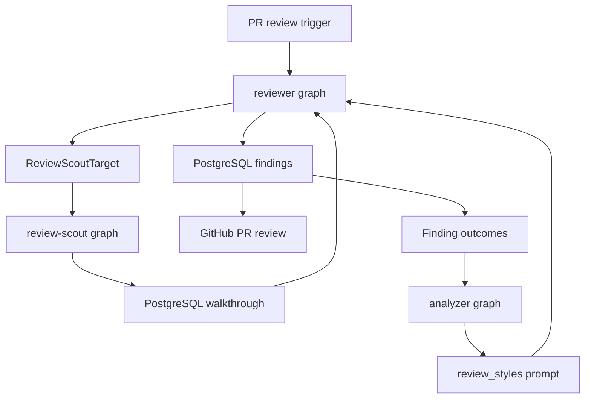
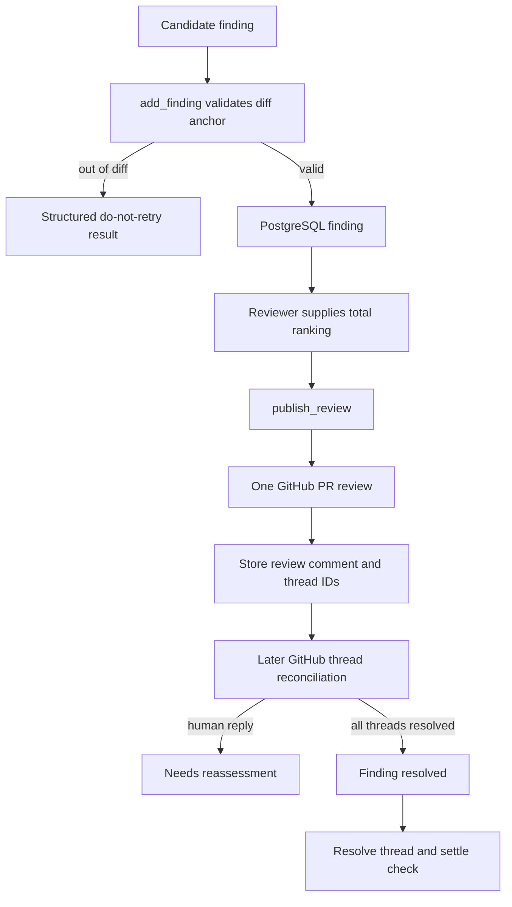

# Review, Analyzer, and Scout Graphs

Open SWE registers three specialized deep-agent graphs: `reviewer`, `analyzer`, and `review-scout`. The reviewer evaluates one pull request and is the only one that records and publishes review findings. The scout first turns a PR diff into an ordered walkthrough; the analyzer learns a repository-specific prompt supplement from review feedback and outcomes. All three are separate graph factories with their own deterministic thread and sandbox lifecycle.

For trigger routing, see [PR Review Workflow](../workflows/pr-review.md). For common middleware semantics, see [Middleware Stack](middleware-stack.md), and for sandbox provider behavior, see [Sandbox Lifecycle](sandbox-lifecycle.md).

```mermaid
flowchart TD
    Trigger["PR review trigger"] --> Reviewer["reviewer graph"]
    Reviewer --> ScoutTarget["ReviewScoutTarget"]
    ScoutTarget --> Scout["review-scout graph"]
    Scout --> Walkthrough["PostgreSQL walkthrough"]
    Walkthrough --> Reviewer
    Reviewer --> Findings["PostgreSQL findings"]
    Findings --> Publish["GitHub PR review"]
    Findings --> Outcomes["Finding outcomes"]
    Outcomes --> Analyzer["analyzer graph"]
    Analyzer --> Style["review_styles prompt"]
    Style --> Reviewer
```

Relationship of the specialized graphs and their durable review artifacts. The reviewer waits for a scout walkthrough when available, while the analyzer feeds later reviews through the saved style prompt.

## Reviewer: constrained assessment and preparation

`get_reviewer_agent` copies the caller configuration and nested `configurable` mapping, sets a default recursion limit only when absent, and returns an empty agent if no `thread_id` is present or the graph is not executing. For an executable run it selects workspace or configured reviewer and subagent models, applies the Fable gate, attaches a reconnectable cached sandbox backend, and installs preparation, tool-error, queue/proxy refresh, sanitization, retry/timeout, and review-check-settlement middleware.

The reviewer is deliberately not a coding agent. Its tools are `fetch_review_diff`, finding lifecycle tools (`add_finding`, `update_finding`, `list_findings`, `publish_review`, `resolve_finding_thread`, `reply_to_finding_thread`), and read helpers (`web_search`, `fetch_url`, `http_request`); there are no commit, push, or PR-opening tools. It may delegate to one `reviewer` subagent. That subagent has only its model and safety middleware, so the parent retains responsibility for durable finding mutation and publication.

### Deterministic PR setup

Before the first model call, `PrepareReviewerRunMiddleware`:

1. Mints a repo-scoped GitHub App token when the run has a source, caches it as a bot token for the thread, and restricts the sandbox GitHub proxy to the reviewed repository.
2. Ensures a sandbox with `allow_replacement=True`, checks out the PR head through `prepare_review_repo`, and materializes trusted repository skills from the **base** revision. Replacement is safe because the checkout is reconstructed every run; durable review state is elsewhere. If replacement still raises `SandboxUnreachableError`, it posts an unreachable-sandbox notification and fails the run.
3. Materializes the full or incremental re-review diff and its changed-line set. It places `diff_text` and `diff_line_set` in agent state, which makes anchor validation an intake-time operation rather than a GitHub batch failure.
4. Fetches concurrent context: PR overview, GitHub review threads, repository style prompt, root and scoped `AGENTS.md`/`CLAUDE.md`, organization guidelines, approval policy read at the base SHA, and API standards. GitHub-thread reconciliation is attempted before thread context is rendered; a fetch failure logs and continues without that context.

PR title/body, thread comments, finding replies, and scout material are untrusted. The reviewer renders author-controlled PR and thread data in XML-like data blocks, neutralizes closing tags, and validates login attributes. The selected context produces first-review, re-review, or finding-reply instructions. Evaluation runs deliberately omit workspace guidelines, repository-style guidance, and API standards.

## Scout: readable PR walkthrough

The reviewer asks `ReviewScoutTarget.await_walkthrough()` except for finding-reply and evaluation runs. It uses a deterministic scout thread per PR. If a walkthrough for the current head exists, it is reused; otherwise the target starts or joins a scout run for that head, polls it for up to 600 seconds, and returns `None` on failure or timeout so review proceeds without a walkthrough. A newer head prevents an older-head run from being reused.

The scout gets its own App-token sandbox, checks out the PR, computes a merge base, and exposes only `commit_walkthrough_step` and conditional `record_human_input`. The agent stages portions of the PR diff as ordered synthetic commits. `commit_walkthrough_step` requires an `other: true` pass before ordinary steps, rejects empty stages, and limits title and summary length. After the agent finishes, `StoreWalkthroughMiddleware` finalizes those commits into steps and replaces the PR's stored walkthrough only when at least one non-`other` step exists. Each step records changed file paths and added/deleted line ranges; the stored walkthrough is pinned to the reviewed head and merge base, and includes an optional bounded summary of steering history.

## Findings: durable lifecycle and reconciliation

Findings live in PostgreSQL under their pull request; reviewer-thread metadata holds PR identity, review head, and related thread-level state. Legacy findings in LangGraph metadata are migrated on first access. A finding includes severity, confidence, category, title, path and range/side, diff membership and hunk, status and SHAs, GitHub review/comment/thread identity lists, monotonic surface state, human-reply bookkeeping, fingerprint, interactions, and rank. The monotonic surface ordering lets legacy normalization retain the furthest visible state when old fields conflict.

`add_finding` validates title, severity, confidence, side, and ordered range. It resolves diff data from injected state, then run configuration, then a fresh authenticated PR-diff fetch. A range not in the diff returns `success: false` and `in_diff: false` with an explicit do-not-retry instruction. For an accepted finding it stores the current review head, optional extracted hunk, and a suggestion only if it has at most four lines; fingerprint-based append logic avoids duplicates. Missing reviewer-thread state is converted to a structured do-not-retry result because retries cannot restore evicted, evaluation-only, or never-created durable state.

Before normal runs, reconciliation matches GitHub threads by embedded finding marker first, then stored thread/comment IDs. It backfills identities and marks matching findings surfaced. Only when every matched thread is terminal **and** resolved does it resolve the finding; an outdated-only thread does not resolve it. The latest human reply after the bot comment is captured as a `human_reply` interaction requiring reassessment.

```mermaid
flowchart TD
    Candidate["Candidate finding"] --> Validate["add_finding validates diff anchor"]
    Validate -->|"out of diff"| Reject["Structured do-not-retry result"]
    Validate -->|"valid"| Stored["PostgreSQL finding"]
    Stored --> Rank["Reviewer supplies total ranking"]
    Rank --> Publish["publish_review"]
    Publish --> GitHub["One GitHub PR review"]
    GitHub --> Ids["Store review comment and thread IDs"]
    Ids --> Reconcile["Later GitHub thread reconciliation"]
    Reconcile -->|"human reply"| Reassess["Needs reassessment"]
    Reconcile -->|"all threads resolved"| Resolved["Finding resolved"]
    Resolved --> Settle["Resolve thread and settle check"]
```

Findings-to-publication flow, including the persistence boundary before GitHub mutation and the later reconciliation boundary.

## Publication and check settlement

`publish_review` must be the only tool call in its turn and requires a complete, duplicate-free ranking of all eligible candidates. In evaluation mode it records a dry-run publication instead of contacting GitHub. For live reviews it resolves the current review head from metadata (rather than trusting a stale run configuration), backfills from PR threads, filters unpublished open in-diff findings at or above the threshold, and limits output through the publishing filter. Re-reviews publish only findings first seen at the current head.

One GitHub PR review carries the host-rendered summary and one inline payload per renderable finding. Inline bodies include an `open-swe-review-comment` JSON marker containing finding and anchor identity; an optional suggestion becomes a fenced `suggestion` block. Once GitHub accepts the review, the tool records review/comment IDs, backfills missing IDs if needed, stores GitHub thread IDs, resolves threads for already-resolved findings, links the PR to the reviewer thread, advances `last_reviewed_sha`, records usage, clears the started-review comment, and settles the review check.

Failure semantics are intentional: a stale approval assessment cannot publish; a 401 invalidates the cached token and asks for reauthentication. If GitHub rejects anchors, the tool revalidates against the current diff and retries once with remaining valid comments; otherwise it returns `unresolvable_findings` and a remediation hint. When there are no new comments but Open SWE has already reviewed the PR, it skips a duplicate empty review while still resolving eligible threads, advancing the SHA, and settling the check. Consumers must therefore inspect `review_id`, `dry_run`, `skipped_empty_re_review`, and `unresolvable_findings`, not merely `success`.

## Analyzer: style-learning lifecycle

`get_analyzer` creates a distinct deep agent with only `save_review_style_prompt` and `read_finding_outcomes`, an 80-call limit, a sandbox backend, and a virtual `/skills/` `StateBackend` route in a `CompositeBackend`. It returns an empty agent without a thread or outside execution. Unlike the reviewer, it writes its default recursion limit into the supplied config. Preparation resolves workspace ownership, ensures a repository-proxy sandbox, then renders an analyzer prompt naming the repository, mode, work directory, mode-specific skill, and reviewer themes.

`analyzer_mode` selects one authoritative virtual playbook: `bootstrap` uses `bootstrap-repo-analysis` to inspect historical merged-PR feedback, whereas `continual` uses `continual-learning` to refine guidance from recorded reviewer outcomes. Launchers seed both bundled `SKILL.md` files into the run `files` channel using route-prefix-stripped keys; the agent accesses them below `/skills/` without writing them into the execution sandbox.

`ReviewStyle` records are typed-store entries in the `review_styles` namespace keyed by normalized `owner/repo`. They track status, editable prompt, approval mode, analysis summary, sampled reviewers/counts, analysis thread/run IDs, cron ID, errors, and timestamps. The reviewer looks up `custom_prompt` fail-soft and applies it as repository-specific guidance only alongside its global review bar.

Bootstrap first collects samples with the caller token, marks the record running, then creates a durable analyzer run on the deterministic review-style thread. Sample collection or startup failure marks the record failed. Continual runs use the same thread and an outcome-driven input. At completion, `save_review_style_prompt` rejects an empty prompt, otherwise persists the trimmed prompt and metadata as completed; it then attempts, but does not require, cron registration.

`ensure_continual_cron` is idempotent: after the first saved prompt it creates one `analyzer` daily cron with `analyzer_continual` metadata. A SHA-256-derived minute/hour staggers repositories from 05:00 through 08:59 UTC. The scheduled run is threadless but explicitly passes the deterministic analyzer `thread_id`; it carries no accumulated message history yet reuses repository-scoped sandbox and metadata. With no user token in cron configuration, the analyzer's sandbox path relies on its deployment credentials. Cron removal is best-effort and clears the stored ID.

## Focused tests

`tests/reviewer/test_factory_config_isolation.py` protects reviewer config isolation. `test_reviewer.py` exercises sandbox repository scoping, token absence, context sanitization, and degraded thread retrieval. `test_reviewer_tools.py`, `test_reviewer_findings.py`, `test_reviewer_reconcile.py`, and `test_reviewer_publish.py` cover anchor validation, persistence/migration, marker and reply reconciliation, ranking, stale assessments, and publishing failure paths. `test_review_scout_git.py` verifies that synthetic steps own exact PR-diff lines, retain deletions, put the `other` step last, and reproduce the PR head tree. `tests/analyzer/test_analyzer_cron.py` checks cron idempotence and deterministic scheduling bounds.
