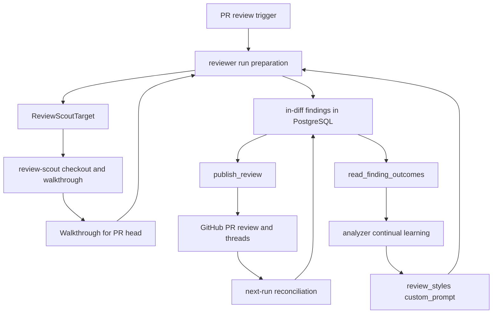

# Review, Scout, and Style-Analysis Graphs

Open SWE registers three specialized deep-agent graphs: `reviewer`, `review-scout`, and `analyzer`. They have complementary roles rather than a shared mutable workspace: the scout turns a PR into a walkthrough, the reviewer evaluates the PR and owns publication, and the analyzer maintains a repository-specific supplement to review guidance. All are sandbox-backed, but their durable state has different owners.

For webhook routing and user-facing review sessions, see [PR Review Workflow](../workflows/pr-review.md). For sandbox allocation and recovery, see [Sandbox Lifecycle](sandbox-lifecycle.md); for prompt construction principles, see [Context Engineering](../workflows/context-engineering.md).

## Roles and authority

| Graph | Durable unit | Primary output | Authority boundary |
| --- | --- | --- | --- |
| `reviewer` | deterministic reviewer thread and PR finding records | GitHub PR review and finding lifecycle | It assesses code; it does not edit, commit, push, or open PRs. Finding and review mutations are mediated by its tools. |
| `review-scout` | deterministic scout thread and `Walkthrough` for a PR head | ordered PR walkthrough plus a summary of requester input | It uses a derived working tree to construct explanatory commits; these are not repository changes. |
| `analyzer` | deterministic review-style thread and `review_styles` record | repository-specific `custom_prompt` | It reads historical feedback/outcomes and saves guidance; it does not publish PR findings. |

`langgraph.json` maps them to `agent.graphs.reviewer:traced_reviewer_agent`, `agent.graphs.review_scout:traced_review_scout`, and `agent.graphs.analyzer:traced_analyzer`. Each factory returns an empty agent when it has no `thread_id` or the graph is not loaded for execution. Reviewer and scout factories copy the incoming configuration before adding defaults, protecting a caller's configuration; the analyzer sets its recursion limit on the supplied configuration.

## Review and scout execution

### Reviewer setup and context

`get_reviewer_agent` builds a per-run deep agent with review lifecycle tools—`fetch_review_diff`, `add_finding`, `update_finding`, `list_findings`, `publish_review`, `resolve_finding_thread`, and `reply_to_finding_thread`—plus read-only web helpers. A reviewer subagent may inspect an explicitly disjoint file partition, but returns candidate defects only; the parent validates, persists, ranks, and publishes them.

Before its first model call, `PrepareReviewerRunMiddleware` deterministically:

1. obtains and caches a repository-scoped GitHub App installation token for source-triggered reviews, configures the sandbox proxy, and ensures a replaceable sandbox;
2. clones or fetches and force-checks out the PR head, then materializes trusted repository skills from the base SHA;
3. derives the first-review or re-review diff and changed `(file, side, line)` set; and
4. concurrently obtains the PR overview, existing review threads, organization guidance, base-ref `AGENTS.md` and changed-path scoped instructions, API standards, approval policy, saved style prompt, and—outside eval/finding-reply modes—the scout walkthrough.

The reviewer waits up to 600 seconds for a missing walkthrough; a scout failure or timeout is non-fatal and the review proceeds without it. Existing GitHub review threads are reconciled before being rendered into the reviewer context. PR bodies, existing thread comments, and finding replies are untrusted data: XML wrappers, closing-tag neutralization, and validated GitHub-login attributes prevent them from escaping the data boundary.

The checkout is deliberately disposable. The reviewer enables `allow_replacement=True` because it can reconstruct the checkout on every run; if even replacement fails with `SandboxUnreachableError`, preparation posts a typed notification on the PR and fails rather than silently omitting the review.

### Scout walkthroughs

A `ReviewScoutTarget` is keyed by owner, repository, and PR number, and requests a walkthrough for one head SHA. It first reuses a stored walkthrough for that head or joins an active scout run for the same head. A newer head does not join an older run: it starts work for the current head so an obsolete walkthrough is not written.

Scout preparation also creates a replaceable App-token sandbox, checks out the PR, and builds a working tree at the merge base. The graph can call `commit_walkthrough_step` and, only when requester history exists, `record_human_input`. After the agent finishes, `StoreWalkthroughMiddleware` finalizes the synthetic commits into ordered steps and atomically replaces the PR-head `Walkthrough`; no usable non-`other` step means no walkthrough is stored. The reviewer consumes the stored walkthrough and its human-input summary as context, not as instructions or an independently published review.

```mermaid
flowchart TD
    Trigger["PR review trigger"] --> Reviewer["reviewer run preparation"]
    Reviewer --> ScoutTarget["ReviewScoutTarget"]
    ScoutTarget --> Scout["review-scout checkout and walkthrough"]
    Scout --> Walkthrough["Walkthrough for PR head"]
    Walkthrough --> Reviewer
    Reviewer --> Findings["in-diff findings in PostgreSQL"]
    Findings --> Publish["publish_review"]
    Publish --> GitHub["GitHub PR review and threads"]
    GitHub --> Reconcile["next-run reconciliation"]
    Reconcile --> Findings
    Findings --> Outcomes["read_finding_outcomes"]
    Outcomes --> Analyzer["analyzer continual learning"]
    Analyzer --> Style["review_styles custom_prompt"]
    Style --> Reviewer
```

This source-grounded flow shows the reviewer’s optional scout dependency, the only publication path, and the feedback loop that returns finding outcomes as future review guidance.

## Finding persistence and publication

### Durable finding state

Reviewer-thread metadata still owns PR identity, live and last-reviewed SHAs, watch state, and the `kind: "reviewer"` tag used by UI and usage lookup. Findings themselves now live in PostgreSQL under the pull request, not in sandbox or ordinary thread metadata. On first access, legacy metadata findings are copied once into a PR-scoped finding state that records its reviewer thread. This survives checkpointer eviction and permits finding interactions to link a GitHub login to a registered user. Evaluation runs are intentionally different: they use bounded in-process run-scoped findings so repeated benchmark runs do not contend for the production PR record.

A finding contains anchor, severity, confidence, category, explanation and optional short suggestion; PR/diff and SHA information; GitHub review/comment/thread identities; status and monotonic surface state; fingerprint, rank, reconciliation fields, and interaction history. Normalization fills legacy fields and resolves conflicting surface states toward the furthest state.

`add_finding` normalizes and validates title, severity, confidence, side, and line order. It uses the prepared state’s diff first, then configured diff context, then a freshly fetched authenticated diff. A line range outside the corresponding PR-diff side returns `success: false` and `in_diff: false`, explicitly telling the model not to re-anchor or retry. It extracts a diff hunk where available, drops suggestions longer than four lines, and deduplicates open findings with a stable content fingerprint. A missing reviewer thread is a structured do-not-retry result, not an invitation to regenerate findings indefinitely.

Before a normal run, reconciliation matches current GitHub threads by embedded finding marker before remembered thread or comment IDs. It backfills publication identities, marks matches surfaced, preserves the newest human reply as a `needs_reassessment` interaction, and resolves an open finding only when every matched terminal thread is actually resolved. An outdated-only thread is terminal for reconciliation but does not by itself set the finding to resolved.

### Publication contract

`publish_review` must be the only tool call in its turn and requires a best-first ranking containing every publish candidate exactly once. It selects unpublished, open, in-diff findings at or above the requested threshold (default `medium`); re-reviews select only findings first seen at the current head. Eligible findings are ordered by that rank, then a stable severity/location fallback, and rendered as one GitHub review with one inline comment per renderable finding. Inline comments carry an `open-swe-review-comment` JSON marker, allowing later reconciliation to recover a finding even if local identities were lost. Suggestions render as fenced `suggestion` blocks.

After GitHub accepts publication, the tool records review and per-comment/thread identities in the finding records, resolves eligible resolved threads through GraphQL `resolveReviewThread`, updates `last_reviewed_sha`, and settles review bookkeeping. If GitHub rejects anchors, it rechecks the PR diff, removes only invalid anchors, and retries once; otherwise it reports `unresolvable_findings` with remediation rather than blind retries. A successful empty re-review can return `review_id: null` and `skipped_empty_re_review: true`; evaluation mode reports `dry_run: true`. Consumers must inspect those fields rather than treating `success` alone as proof that GitHub received a review.

## Repository-style analysis

The analyzer learns a bounded repository supplement rather than replacing the reviewer’s global bar. Bootstrap mode mines historical merged-PR human feedback; continual mode reads the reviewer’s recorded outcomes and refines recurring useful and false-positive patterns. Both modes point the agent to an authoritative bundled skill. The skill files are seeded in the run input and mounted at `/skills/` through a `StateBackend` in a `CompositeBackend`, so playbooks are not written into the sandbox.

Analyzer preparation resolves the repository and mode, provisions a sandbox and repository GitHub proxy, and injects the repository name, supplied samples, selected skill path, and `REVIEWER_STYLE_THEMES`. It exposes only `read_finding_outcomes` and `save_review_style_prompt`, with an 80-call limit plus tool-error and response-sanitization middleware. Workspace resolution supplies appropriate sandbox credentials; the bootstrap launcher provides the initiating GitHub token, while scheduled continual runs obtain App credentials during preparation.

`REVIEW_STYLES` is a typed `review_styles` namespace keyed by `owner/repo`. Its `ReviewStyle` record tracks lifecycle status, prompt and summary, sampled reviewers/counts, analysis thread/run, cron, error, approval mode, and timestamps. Reviewer lookup of `custom_prompt` fails soft: an unavailable style store removes only this optional context. When present, the prompt is added as repository-specific guidance and is subordinate to the global reviewer policy.

Bootstrap collection occurs before the durable analyzer run; either collection or run-start failure marks the record failed. `save_review_style_prompt` rejects empty output, otherwise saves the trimmed prompt and metadata as completed, then attempts continual-cron registration without rolling back a successful save if registration fails. An immediate continual run uses the same deterministic review-style thread.

A saved prompt causes idempotent registration of one daily `analyzer` cron per repository, staggered by SHA-256 hash between 05:00 and 08:59 UTC. The cron run has no accumulating message history but explicitly supplies the deterministic style thread ID, `continual` mode, and virtual skills; without that `thread_id`, `get_analyzer` would return an empty graph. Removing a cron is best-effort remotely and clears the stored ID.

## Focused verification

The reviewer tests cover configuration isolation, finding validation and persistence, marker-based reconciliation, publishing/retry behavior, approval policy, review sessions, and style synchronization. `tests/reviewer/test_review_scout_git.py` uses real local Git to verify that scout steps own exactly the changed PR lines and that leftover changes become a final `other` step. `tests/analyzer/test_analyzer_cron.py` verifies idempotent cron registration and stable schedule bounds. These tests are useful change guards because they cover the boundary conditions—derived working trees, durable state, and scheduler configuration—rather than only agent prompt text.
