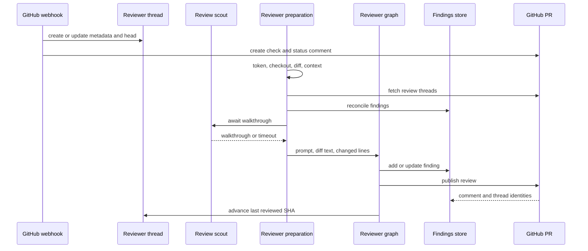
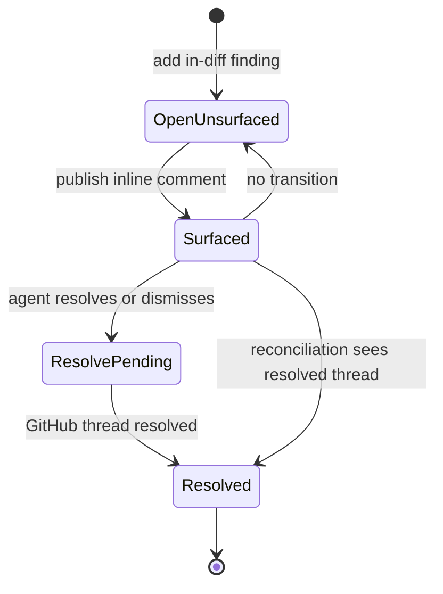

# Review, scout, and findings architecture

Open SWE has two distinct PR-oriented deep-agent graphs: `reviewer` assesses and publishes a pull-request review, while `review-scout` creates a shared walkthrough of the change. They are registered independently in `langgraph.json`. The reviewer owns durable findings and GitHub review mutation; the scout owns a best-effort, per-head explanation and partition of the diff. They intentionally use separate deterministic threads and disposable checkouts.

This page covers the review execution path. For webhook routing and user-facing trigger details, see [PR Review](../workflows/pr-review.md); for sandbox lifecycle, see [Sandbox Lifecycle](sandbox-lifecycle.md); and for the general tool model, see [Tools](../concepts/tools.md).

## Entry points and durable review identity

A review may start from a Slack/manual PR request or an automatic GitHub PR event. The dispatcher fetches PR metadata, rejects draft PRs for manual requests, creates the deterministic reviewer thread if needed, writes `kind: "reviewer"` plus PR identity, current head, and watch metadata, and starts a `reviewer` durable run. Automatic first reviews also create a GitHub check run and a transient “in progress” PR comment.

A watched reviewer thread is the re-review boundary. On a head-branch push, the webhook ignores deleted branches, disabled repositories, PRs without a reviewer thread, unwatched threads, and an unchanged head. If the PR diff is unchanged since `last_reviewed_sha`, it carries the review association forward, advances that SHA, and completes a fresh check as “No new changes to review” without invoking the model. Otherwise it reconciles existing GitHub review threads, records the new head, opens a check for that head, and dispatches a re-review over the changed range.

Reviewer thread metadata is intentionally small and durable: it identifies the PR, holds `head_sha`, `last_reviewed_sha`, watch state, optional Slack origin, and operational IDs such as the active check. The `kind` tag lets the UI and background code distinguish reviewer threads. Findings themselves are PostgreSQL records associated with the pull request; legacy findings in thread metadata are migrated on first access.

## Reviewer graph: constrained assessment

`get_reviewer_agent` makes a deep agent per executable run, copying the caller config and its `configurable` mapping before applying the default recursion limit. Without a `thread_id`, or when graph execution is disabled, it returns an empty agent and does not provision a sandbox. An executable graph receives review-specific tools—diff fetch, finding create/update/list, publish, resolve/reply thread—and read-only web helpers. It has no coding, commit, push, or PR-opening tool. A single `reviewer` subagent may investigate a partition, but it has no finding or publication tools; the parent records and publishes the result.

The factory resolves main and subagent models from per-run settings or workspace defaults, applies the Fable gate, caches a reconnectable sandbox backend, and installs model-call limits, tool-error handling, token-proxy refresh, message-queue handling, response sanitizers, retries/timeouts, and an exit hook that settles the review check.

### Isolated preparation before model calls

`PrepareReviewerRunMiddleware` makes review setup deterministic before the first model call:

1. It mints a repository-scoped GitHub App installation token, caches it as a bot token for the reviewer thread, and creates/reconnects the sandbox with a repository-limited GitHub proxy.
2. The sandbox is allowed to be replaced: it contains only a checkout that `prepare_review_repo` rebuilds on every run. If replacement still fails, the system posts an unreachable-sandbox notification and fails rather than silently leaving the PR unreviewed.
3. It clones or fetches and checks out the PR head, then materializes trusted repository skills from the base revision. A remote execution path instead declares its remote working directory already ready and performs no local sandbox checkout.
4. It computes a full or incremental re-review diff and a `(file, side, line)` membership map. Both are carried in graph state so finding creation can reject invalid anchors before GitHub publication.

Preparation fetches independent context concurrently: PR title/body, review threads, repository style guidance, root and scoped `AGENTS.md`, organizational guidelines, an approval policy read from the base commit, and API standards. It reconciles fetched review threads before rendering them into context. The reviewer also waits—up to ten minutes—for the optional scout walkthrough, but continues without one on timeout or scout failure.

Author-controlled PR fields, review comments, and finding replies are rendered as XML data blocks. Wrapper closing tags are neutralized and login attributes are grammar-checked, preventing content from escaping its data wrapper into the instruction context.

```mermaid
sequenceDiagram
    participant Hook as GitHub webhook
    participant Thread as Reviewer thread
    participant Scout as Review scout
    participant Prep as Reviewer preparation
    participant Agent as Reviewer graph
    participant Store as Findings store
    participant GitHub as GitHub PR
    Hook->>Thread: create or update metadata and head
    Hook->>GitHub: create check and status comment
    Prep->>Prep: token, checkout, diff, context
    Prep->>GitHub: fetch review threads
    Prep->>Store: reconcile findings
    Prep->>Scout: await walkthrough
    Scout-->>Prep: walkthrough or timeout
    Prep->>Agent: prompt, diff text, changed lines
    Agent->>Store: add or update finding
    Agent->>GitHub: publish review
    GitHub-->>Store: comment and thread identities
    Agent->>Thread: advance last reviewed SHA
```

Review execution uses a canonical reviewer thread, while scout completion is optional and does not block a review indefinitely.

## Review scout: a separate shared walkthrough

The `review-scout` graph plans an explanation of the PR in its own deterministic thread. Its invariant is coverage: every changed line is placed in an explicit chunk or in **Other**. A chunk describes a logical portion of the change; it is not a finding and it cannot publish GitHub review comments. If a plan carried forward to a new head already covers all remaining lines, the scout exits before a model call.

Its preparation mints a scoped App token, creates a replaceable sandbox, checks out and pins the base/head revision, and locates a `PlanWorkspace`. A stale scout head yields no work rather than overwriting a newer plan. The scout receives planning tools (`walkthrough_plan_chunk`, `walkthrough_move_to_other`, and `walkthrough_describe_other`), plus `record_human_input` only if stored author steering exists. Its finish middleware settles any unplanned lines into Other, saves a supplied human-input summary, and invalidates the PR UI record.

`ReviewScoutTarget.await_walkthrough()` first returns a completed walkthrough for the requested head. Otherwise it joins an active scout for the same head or launches a durable `review-scout` run, polls it for at most `SCOUT_WAIT_SECONDS` (600), and returns `None` when unavailable or late. A newer head supersedes an older scout run so only the latest walkthrough is written. The review page can also explicitly launch the scout and inspect its progress or latest error.

## Findings: lifecycle, storage, and reconciliation

A finding records location and diff side, severity/confidence/category, title and description, optional short suggestion and diff hunk, status, seen SHAs, publication IDs, surface state, reply/reconciliation fields, a fingerprint, interactions, and optional rank. Open findings deduplicate by their normalized content fingerprint. Surface state is monotonic (`not_surfaced` → `surfaced` → `resolve_pending` → `resolved`); normalization of legacy records resolves contradictions by retaining the most advanced state.

`add_finding` validates title, severity, confidence, side, and ordered range. It obtains diff context from injected state first, then configuration, and finally a freshly fetched authenticated PR diff. An anchor outside the reviewed diff yields `success: false` and `in_diff: false` with an explicit do-not-retry message. A valid finding receives the current live head SHA, an extracted diff hunk when available, and a suggestion capped at four lines. If the durable reviewer thread is missing, tools return a structured do-not-retry result rather than looping on a condition retry cannot repair.

```mermaid
stateDiagram-v2
    [*] --> OpenUnsurfaced: add in-diff finding
    OpenUnsurfaced --> Surfaced: publish inline comment
    Surfaced --> OpenUnsurfaced: no transition
    Surfaced --> ResolvePending: agent resolves or dismisses
    ResolvePending --> Resolved: GitHub thread resolved
    Surfaced --> Resolved: reconciliation sees resolved thread
    Resolved --> [*]
```

The surface-state progression is independent from a finding’s business `status`; reconciliation and publish record GitHub-facing progress without rolling it backward.

Each inline comment includes an `open-swe-review-comment` JSON marker containing the finding ID and anchor. Reconciliation trusts markers only on `open-swe` or `open-swe[bot]` comments, then falls back to recorded thread and comment IDs. It backfills identities and marks a matching finding surfaced. It records the newest human reply after the bot comment, truncates it for storage, and appends a `human_reply` interaction that requires reassessment. A finding is marked resolved only when all matching threads are terminal **and** all are actually resolved: outdated threads alone do not resolve it.

GitHub reply webhooks take a faster path for a known reviewer thread: they reconcile, locate the finding by parent comment ID, append a reassessment interaction, and dispatch a finding-reply reviewer run with the relevant reply context. This lets the reviewer explain, revise, dismiss, or resolve a finding using the same durable state.

## Publication and completion semantics

`publish_review` must be the only tool call in its model turn and requires a complete, unique best-first ranking of the findings it would publish. It filters open, in-diff findings at or above the requested severity threshold (default `medium`) and sorts by that rank before severity and location. Re-reviews only consider unposted findings first seen at the live head, preventing duplicate inline comments.

The tool posts one GitHub PR review with its summary and inline comments. It embeds the marker in every inline body and renders a fenced `suggestion` block only for a retained suggestion. After a successful post it records the review and comment IDs, backfills thread IDs if necessary, resolves eligible already-resolved finding threads via GitHub GraphQL, links the PR to the reviewer thread, advances `last_reviewed_sha`, clears the transient status comment, records usage, and settles the GitHub check.

A re-review with no new inline comments and an existing Open SWE summary intentionally skips a duplicate empty review, but still resolves completed threads and advances the reviewed SHA. Evaluation runs instead simulate publication, save the selected IDs in reviewer metadata, and return `dry_run: true`. A GitHub unresolved-anchor response causes one filtered retry with valid findings when possible; otherwise the structured result names `unresolvable_findings` and tells the model to resolve or correct them rather than retrying blindly.

## Optional Managed Deep Agents reviewer path

A manual PR request can opt into Managed Deep Agents (MDA), but only for public repositories and only when a remote reviewer client is configured. MDA moves the model loop, checkpoints, and sandbox checkout to a remote deployment; this backend continues to own preparation, persistent findings, GitHub App access, follow-up queue draining, check settlement, and all non-sandbox reviewer tools.

The remote reviewer calls this backend’s stateless MCP server for tools and POST hooks for preparation, queue drain, and settlement. Preparation produces a credential-free prompt and checkout specification and stores the per-invocation diff/approval context in the backend store so any replica can execute a later tool call. `fetch_review_diff` stays remote because it uses the remote sandbox; the rest of the reviewer tool catalog is served over MCP. The service verifies an HMAC-signed, expiring bearer token on every request and derives the thread, assistant, and configuration from its claims—not from model-controlled tool arguments.

## Review page and chat boundary

The review API requires repository access for review data, diffs, files, labels, manual re-review, and scout launch. Review chat is deliberately not the reviewer thread: opening chat creates or reuses a main `agent` thread associated with the PR and returns that thread plus `assistant_id: "agent"`. Every command, state, history, and event-stream proxy checks that the requested chat thread belongs to the requesting login’s PR threads before forwarding it to the dashboard-thread proxy.

## Focused tests

The reviewer tests cover config-copy isolation, PR-ready and watched-push decisions, diff anchoring (including left-side ranges), finding persistence and outcomes, publication/retry/marker rendering, reconciliation terminal-state rules, reviewer API behavior, review chat access, and MDA token/server boundaries. Particularly useful change guards are `test_reviewer_reconcile.py` for marker trust and resolved-vs-outdated behavior, `test_remote_runtime.py` for signed-token rejection and generated remote tool specification parity, and `test_review_conversation.py` / `test_review_chat.py` for the review-page interaction boundary.
