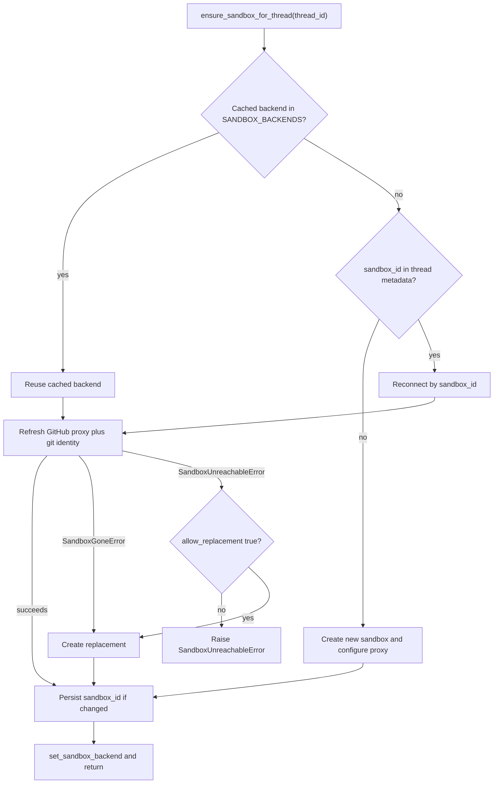

# Sandbox Lifecycle & Providers

Every agent run executes shell commands and file operations inside a **sandbox** —
an isolated compute environment that holds the repository checkout and the agent's
working tree. Each conversation thread is bound to exactly one sandbox, and that
sandbox persists across the many runs that make up a thread. This page documents
how a thread acquires and reconnects to its sandbox, how the provider is chosen,
how the LangSmith GitHub proxy injects credentials without writing a real token
into the box, and how the system distinguishes a *deleted* sandbox (safe to
replace) from a merely *unreachable* one (dangerous to replace).

Related pages: `integrations/sandbox-providers`, `concepts/auth`,
`operations/configuration`.

## Provider selection

The provider is selected at runtime from the `SANDBOX_TYPE` environment variable,
defaulting to `langsmith`. `SANDBOX_FACTORIES` in `agent/utils/sandbox.py` maps
each supported value to the `(module, function)` pair that constructs that
provider's backend, and `_load_sandbox_factory` imports and returns it, raising
`ValueError` for an unknown type. Supported values are `langsmith`, `daytona`,
`modal`, `runloop`, `e2b`, and `local`.

| `SANDBOX_TYPE` | Factory | Notes |
|---|---|---|
| `langsmith` (default) | `create_langsmith_sandbox` | Native async; honors snapshot/resource overrides; only provider with the GitHub proxy |
| `daytona` | `create_daytona_sandbox` | Requires `DAYTONA_API_KEY`; boots from `DAYTONA_SANDBOX_SNAPSHOT` |
| `modal` | `create_modal_sandbox` | Native async via `modal.Sandbox` |
| `runloop` | `create_runloop_sandbox` | Requires `RUNLOOP_API_KEY` |
| `e2b` | `create_e2b_sandbox` | Requires `E2B_API_KEY`; optional `E2B_TEMPLATE` |
| `local` | `create_local_sandbox` | No isolation; runs on the host — development only |

`create_sandbox` is the single entrypoint the rest of the codebase calls. It
selects the factory, then adapts to how each provider provisions: `langsmith` and
`modal` are awaited directly because they provision natively async, while `local`,
`daytona`, `e2b`, and `runloop` are run via `asyncio.to_thread` because their
setup binds synchronous SDK handles or performs synchronous filesystem I/O. Only
the `langsmith` factory receives the snapshot/resource/create-param overrides;
other providers ignore them.

`validate_sandbox_startup_config` is called from the FastAPI lifespan hook so that
configuration errors surface at boot rather than on the first sandbox creation.
For LangSmith it delegates to `LangSmithProvider.validate_startup_config`, which
warns (non-fatally) when `DEFAULT_SANDBOX_SNAPSHOT_ID` is unset and validates that
the numeric `DEFAULT_SANDBOX_*` sizing/TTL variables parse as integers.

### Per-provider integration modules

- **`langsmith`** — `LangSmithProvider.get_or_create` provisions via the async
  `AsyncSandboxClient` and converts the result to a sync handle with `to_sync()`,
  wrapped in `TimeoutLangSmithSandbox` so a wedged WebSocket execute stream cannot
  hang the graph forever. Reconnecting reuses the box by name; a missing box
  raises `SandboxGoneError`. This is the only provider with the GitHub proxy.
- **`modal`** — `create_modal_sandbox` reconnects with `modal.Sandbox.from_id` or
  creates against the `MODAL_APP_NAME` app.
- **`daytona`** — `create_daytona_sandbox` gets an existing sandbox by id or
  creates one from the configured snapshot.
- **`runloop`** — `create_runloop_sandbox` retrieves or creates a devbox.
- **`e2b`** — `create_e2b_sandbox` connects to an existing sandbox or creates one,
  optionally from `E2B_TEMPLATE`.
- **`local`** — `create_local_sandbox` runs a `LocalShellBackend` directly on the
  host with no isolation. It scopes `git config --global` to a sandbox-local
  `.gitconfig-sandbox` (including the developer's real `~/.gitconfig`) so the bot
  identity written each run does not clobber the host's git identity, and it
  excludes model/provider API keys from the inherited environment.

## In-memory state and thread binding

Two pieces of state track a thread's sandbox:

- **`SANDBOX_BACKENDS`** in `agent/utils/sandbox_state.py` is an in-process dict
  keyed by `thread_id`, holding a stable `SandboxBackendProxy` per thread. It is
  shared between the server and the middleware. Because it lives in process
  memory, it is a cache that survives across runs on the same worker but not
  across restarts.
- **`sandbox_id`** persisted in the thread's metadata is the durable binding. Any
  worker, on any later run, reconnects to the same sandbox by reading this id via
  `get_sandbox_id_from_metadata`. Metadata reads fall back to the live thread
  lookup and *fail open to "no sandbox"* on error.

`SandboxBackendProxy` is a stable handle whose underlying target can be replaced.
It subclasses `BaseSandbox` (not merely the protocol) so `FilesystemMiddleware`
recognizes it as capture-at-source capable and keeps the in-sandbox stdout size
cap on the `execute` offload path. The proxy is async-only: its synchronous
methods raise, and each `a`-prefixed method forwards to the current backend after
`_aget_backend` resolves it. `_aget_backend` lazily reconnects — via a registered
reconnect callback or, failing that, by creating a sandbox from the metadata
`sandbox_id` — serializing concurrent callers behind a lock and caching the
resolved backend back into `SANDBOX_BACKENDS`.

## The `ensure_sandbox_for_thread` lifecycle

`ensure_sandbox_for_thread` (in `agent/server.py`, re-exported through
`agent/runtime`) is the get-or-create-then-reconnect entrypoint that guarantees a
healthy sandbox bound to a thread. Dispatch uses
`multitask_strategy="interrupt"`, so a thread never provisions two sandboxes
concurrently and no cross-process sentinel is required. It handles three cases:

1. **Cached in memory** — a `SandboxBackendProxy` with a live backend already
   exists; reuse it and refresh the proxy auth.
2. **Reconnect** — no cached backend but the thread metadata has a `sandbox_id`;
   reconnect to that box and refresh the proxy auth.
3. **Create** — no cached backend and no `sandbox_id`; create a fresh sandbox and
   persist its id into thread metadata.

Crucially there is **no separate ping**: for cases 1 and 2 the proxy refresh
(`_refresh_github_proxy_or_fail`) has to reach the box anyway, and it raises the
same unreachable error when it cannot, so reachability is proven as a side effect
of doing real work.

*Decision flow for `ensure_sandbox_for_thread`: reuse, reconnect, or create, and how deleted versus unreachable sandboxes are handled.*

The thread is bound (its metadata `sandbox_id` written) only *after* the sandbox
is created and initialized, so a run that dies mid-creation leaves no id to adopt
a half-built box. The freshly resolved backend is published into
`SANDBOX_BACKENDS` **last**, via `set_sandbox_backend`, because publishing before
initialization completes would let the rest of the run use a backend whose failed
setup was only logged.

## Failure handling: deleted vs unreachable

Two distinct error types drive replacement policy:

- **`SandboxGoneError`** — the sandbox the thread is bound to no longer exists
  (the LangSmith reconnect got a `ResourceNotFoundError`). A deleted box holds no
  working tree, and the stale id in thread metadata is what every later run keeps
  reconnecting to, so it is **always replaced** — refusing would brick the thread
  permanently.
- **`SandboxUnreachableError`** — the sandbox did not answer *this* run. It says
  nothing about the next run, which reconnects to the same id and may succeed. It
  is **never resolved by creating a replacement by default**, because the sandbox
  holds the agent's only copy of its working tree: a fresh, empty box would
  silently discard uncommitted work while the agent believed it was still there.

`_connect_existing_sandbox` lets `SandboxGoneError` propagate untouched (so the
caller recreates) and converts any other reconnect/refresh failure into
`SandboxUnreachableError`. When replacement itself fails, the error is re-raised
as `SandboxUnreachableError` so callers still recognize "this run has no sandbox"
and can notify the user.

`allow_replacement=True` extends replacement to merely unreachable sandboxes, and
is reserved for callers whose sandbox holds nothing but a re-derivable checkout.
The **reviewer** is the sole such caller: it re-preps the review repo every run,
and reviewer threads (one per PR, re-triggered on every push) outlive their
sandboxes, so refusing to replace an unreachable box would brick reviews on that
PR for good.

## The LangSmith GitHub proxy

For LangSmith sandboxes, git and `gh` operations authenticate through a **proxy**
that injects credentials on the wire rather than writing a token to disk inside
the box. `_configure_github_proxy` PATCHes the sandbox's proxy config via the
LangSmith proxy-config API, installing header-injection rules built by
`_github_proxy_rules` from a GitHub App installation token:

- `github.com` / `*.github.com` receive an `Authorization: Basic` header
  (base64 of `x-access-token:<token>`) for git-over-HTTPS clone/pull/push.
- `api.github.com` receives an `Authorization: Bearer <token>` header for `gh`
  and REST API calls. The rule also injects a placeholder `GH_TOKEN` env var,
  because `gh` refuses to run without a token in its environment even though the
  proxy injects the real one on the wire.

**No real GitHub token ever lives in the sandbox.** The token exists only inside
the proxy configuration on the LangSmith control plane; the agent's shell sees
only the placeholder. The token is minted at runtime from the GitHub App
installation credentials (`_resolve_proxy_token`), never stored as a deployment
environment variable.

Because a proxy-config update is rejected on any sandbox that is not `ready`, a
`not ready` response triggers a best-effort `start_sandbox` (an idle box is merely
stopped, not deleted, so its filesystem returns) before retrying the PATCH.
Transient errors are retried with backoff.

### Token rotation and per-run re-application

GitHub App installation tokens expire after about one hour, so a long run would
start seeing 401s mid-flight. `agent/utils/github_proxy.py` records each thread's
token expiry (and the repository/permission scope it was minted with) so a
before-model middleware can re-mint and re-apply the token before it goes stale:
`maybe_refresh_proxy_token` refreshes once the token is within
`PROXY_TOKEN_REFRESH_WINDOW` (5 minutes) of expiry, or after
`PROXY_TOKEN_FALLBACK_TTL` (50 minutes) when the expiry is unknown. Refreshes
preserve the original repository and permission scope so a rotation never
broadens the token.

Independently, **every run** re-applies both the proxy auth
(`_refresh_github_proxy`) and the git identity (`_configure_git_identity`, writing
the bot `user.name`/`user.email`). Reused or reconnected sandboxes can lose their
`--global` git config, and Vercel preview deploys reject commits whose author
email cannot be resolved to a GitHub account, so the identity is rewritten on
every run rather than assumed to persist. The git identity write is kicked off in
parallel with proxy configuration because it needs only the box, not the proxy,
and on a cold sandbox that round trip is over a second of critical path before the
first model call.

## Extension and operations notes

- Add a provider by registering a `(module, function)` entry in
  `SANDBOX_FACTORIES` and implementing a factory with the
  `create_*_sandbox(sandbox_id=None)` signature returning a
  `SandboxBackendProtocol`. See `operations/configuration` for the required
  environment variables per provider.
- LangSmith sandbox reclamation is the platform's job (idle TTL and
  delete-after-stop set at create time); the application never deletes a bound
  sandbox off the stale metadata id, because that id can fail open and point at a
  live box.
- `reset_sandbox_for_thread` and `recreate_sandbox_for_thread` provide explicit,
  operator-driven replacement paths for LangSmith threads when a fresh box is
  actually wanted.
