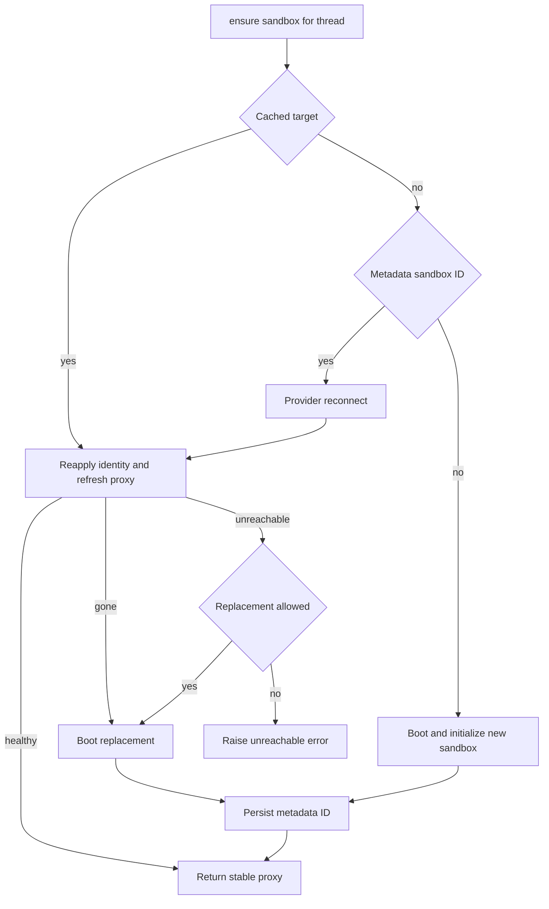

# Thread-Scoped Sandbox Lifecycle

A normal agent thread has one durable sandbox binding. Its checkout and uncommitted working tree are intended to survive runs, so lifecycle code separates durable identity from the worker-local object used by tools. This page describes that boundary and the deliberately conservative recovery rules around it.

Desktop runs are separate: they use a local backend rooted at an allowlisted project or desktop-created worktree instead of this remote thread lifecycle. Desktop artifact routes place internal results and evicted history outside the project, avoiding accidental inclusion in `git add -A`.

Related: [Agent graph](agent-graph.md), [Threads and state](../concepts/threads-and-state.md), [Auth and security](../concepts/auth-and-security.md), [Sandbox providers](../integrations/sandbox-providers.md), and [Configuration](../operations/configuration.md).

## Durable binding and stable handles

`thread.metadata["sandbox_id"]` is the durable provider identity. Metadata lookup first accepts inline run metadata and otherwise reads the live thread; failures yield no metadata. `SANDBOX_BACKENDS` is different: it is a worker-local map from thread ID to a stable `SandboxBackendProxy`, so it is lost at restart and must never be treated as persistence.

A proxy lets middleware and tools retain one handle while lifecycle code swaps its target. It is async-only: synchronous operations raise `NotImplementedError`, while `a*` operations resolve the current target and delegate. A missing target reconnects through a registered lifecycle callback, or—when no callback was registered—using `sandbox_id` from metadata. A lock and one shared startup task coalesce concurrent callers; shielding prevents cancellation of one waiter from cancelling the shared connection attempt.

The proxy subclasses `BaseSandbox`, preserving filesystem middleware's capture-at-source path and its in-sandbox output cap. `aexecute_with_offload` delegates to an offload-capable target; otherwise it executes normally and reports `offloaded=False`. The proxy supplies a default 300-second command timeout unless the caller specifies one.

## Provisioning inputs and provider boundary

`create_sandbox` is the provider-neutral create-or-reconnect boundary. `SANDBOX_TYPE` lazily selects `langsmith`, `daytona`, `modal`, `runloop`, `e2b`, or `local`; unsupported values fail explicitly. Only LangSmith receives snapshot, resource, and additional create-body options. Async factories are awaited, while synchronous factories run in a worker thread. LangSmith configuration is validated at server startup, including numeric sizing/retention settings, non-negative retention TTL, and extra creation JSON.

`SandboxCreateConfig.resolve` chooses an environment's ready immutable snapshot ID, falling back to the admin base snapshot. It also carries that environment's resource settings and allowed creation parameters into provisioning. Environment input validation rejects credentials and sensitive header names in creation parameters; proxy-injected credentials are the supported authentication path.

The local provider is not isolation: it runs commands on the host. It directs global Git configuration to `.gitconfig-sandbox` and explicitly removes model and provider API keys from the child environment. Treat it as a development provider rather than an equivalent production security boundary.

## Grounded get-or-create flow

`ensure_sandbox_for_thread` is the normal lifecycle entrypoint. It uses a cached target when present, otherwise reconnects to the durable ID, and creates only when neither exists. Existing targets are reconfigured with bot Git identity and—only for LangSmith—refreshed GitHub proxy credentials. Refreshing the proxy is the reachability check rather than a separate ping.

*The thread lifecycle chooses a target, distinguishes recovery outcomes, persists a new binding, and publishes the proxy last.*

Thread dispatch uses `multitask_strategy="interrupt"`; the design relies on that serialization rather than a cross-process `__creating__` sentinel. On a new or replacement sandbox, creation, proxy setup, identity setup, and freshness work finish before `sandbox_id` is persisted. The metadata update happens before `set_sandbox_backend`, so an initialization or persistence failure cannot expose a new target through the stable proxy.

## Preserve work: gone versus unreachable

A `SandboxGoneError` is an affirmative provider result: the sandbox no longer exists. It is always replaced, because the stale ID would otherwise make all future runs fail and the deleted box cannot hold the working tree.

A `SandboxUnreachableError` means the box could not be reached or reconfigured in this run, not that it was deleted. The default is to raise rather than replace: the current box may recover and may hold the only uncommitted work. If a permitted replacement itself fails, lifecycle code normalizes that failure to `SandboxUnreachableError` so callers retain this recovery contract.

The reviewer is the explicit exception. Its call enables `allow_replacement=True` because `prepare_review_repo` clone-or-fetches and force-checks out the requested PR head on every run. Reviewer threads persist per PR across pushes, so refusing replacement of an unreachable, re-derivable checkout would permanently block later review runs.

## GitHub proxy lifecycle

For LangSmith sandboxes, GitHub credentials are injected into outbound requests by proxy rules rather than stored in the sandbox. `api.github.com` uses a Bearer header; GitHub web hosts use Basic authentication for `x-access-token:<token>`. The sandbox receives only `GH_TOKEN=proxy-injected`, which allows `gh` to use the proxy without receiving the token itself.

The base proxy configuration is persisted as `sandbox_base_proxy_config` after creation and retained in worker-local proxy state. On refresh, configuration preserves its custom rules while replacing the managed GitHub rule and optionally adds Stagehand model credential rules. Proxy PATCH operations retry transient transport and selected HTTP failures; if configuration says the sandbox is not ready, the provider best-effort starts it and retries. A stopped sandbox is not treated as deleted because its filesystem remains recoverable.

GitHub App installation tokens expire after an hour. Per-thread proxy records retain expiry (or recorded time), repository scope, permission scope, and base configuration. Before each model call, middleware refreshes within five minutes of a known expiry, or after 50 minutes when expiry is unknown. A refresh reuses the recorded scope unless an explicit scope is supplied, so ordinary rotation does not widen repository or permission access; middleware logs a refresh failure and permits the model call to continue.

## Explicit replacement and reset

`recreate_sandbox_for_thread` and `reset_sandbox_for_thread` require an existing binding and reject provider results that reuse the old ID. They do not delete the old resource; it becomes detached from the thread.

- `recreate_sandbox_for_thread` creates a fresh sandbox through the regular resolved environment configuration, configures it, persists its new ID (and recorded base proxy configuration when present), then hands the stable proxy to the new target.
- `reset_sandbox_for_thread` is LangSmith-only and creates from raw provider parameters. It configures the new proxy and Git identity, persists the new ID and proxy configuration (including an explicit `None` when no base config exists), then swaps the target and records token expiry.

Both operations preserve the old cached target if metadata persistence fails. This ordering makes the thread binding atomic from consumers' perspective, although a successfully created but unbound provider sandbox can remain detached.

## Environment snapshot freshness

Environment snapshots are immutable IDs even though their Docker-style `name:latest` tag moves. A sandbox creation uses the record's ready ID, so a concurrent refresh does not change its base image. When an environment snapshot with an `update_script` has aged past the update interval, the newly created thread sandbox runs that script before the first model call with a short configured timeout. Failures and nonzero exits are logged but do not fail the usable sandbox.

The same creation schedules a background environment update when due. The builder boots from the current environment snapshot, runs the update script, and captures a replacement image; in sparse traffic this lets the triggering run receive fresh checkout work while later runs boot from a fresh snapshot. A failed refresh leaves the prior ready snapshot in place.

## Paths, review preparation, and verification

`resolve_sandbox_work_dir` makes repository operations provider-portable: it tries provider work directories, `pwd`, provider home/root paths, then `$HOME`; every candidate is checked for existence and writability, and the result is cached. `resolve_repo_dir` appends a non-empty repository name.

Reviewer preparation is best-effort: it returns `False` if cloning, fetching, checkout, or head verification fails, leaving the sandbox usable for a fetched-diff review. Trusted reviewer skills are more restrictive: they are extracted from the PR base reference into `.review-skills` outside the checkout, never from attacker-controlled PR-head content.

Focused tests cover proxy reconnection coalescing and offload fallback, new-binding publication order, reconnect and recovery decisions, reset/recreate handoff failures, and path and reviewer checkout behavior. In particular, reset tests assert that proxy-token records are not updated before metadata persistence succeeds.
