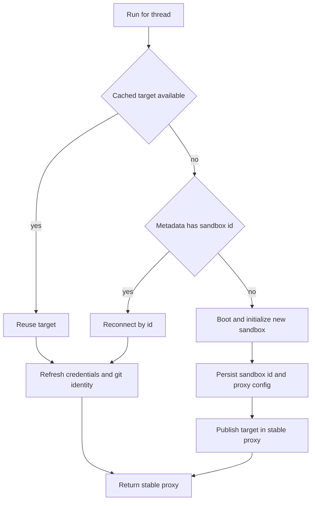

# Thread Sandbox Lifecycle

A sandbox is the thread's durable working environment: it contains the checkout and any uncommitted work across runs. The lifecycle deliberately separates a **durable binding** from a **worker-local handle**. It preserves the working tree when a box is temporarily unavailable, but can recover a binding whose sandbox was actually deleted.

Related pages: [Agent graph](/openwiki/architecture/agent-graph.md), [Threads and state](/openwiki/concepts/threads-and-state.md), [Authentication and security](/openwiki/concepts/auth-and-security.md), [Sandbox providers](/openwiki/integrations/sandbox-providers.md), and [Follow-up messages](/openwiki/workflows/follow-up-messages.md).

## Provider boundary and configuration

`agent.sandboxes.providers.registry.create_sandbox` is the provider-neutral create-or-reconnect entrypoint. It reads `SANDBOX_TYPE`, defaulting to `langsmith`, then lazy-imports the registered factory. The valid types are `langsmith`, `daytona`, `modal`, `runloop`, `e2b`, and `local`; an unknown value raises `ValueError`. Lazy loading means a deployment need not import SDKs for providers it does not select.

The registry awaits coroutine factories directly and runs synchronous factories in `asyncio.to_thread`. Provider-neutral callers can pass an existing `sandbox_id`; however, snapshot, resource, and `create_params` overrides are forwarded only to LangSmith. `validate_sandbox_startup_config` validates the selected LangSmith configuration at application startup rather than waiting for the first provisioning attempt.

`SandboxCreateConfig.resolve` supplies the policy for normal new boxes. For a selected environment, it prefers that environment's `ready_snapshot_id`, resources, and provider create parameters. Without an environment or ready snapshot it uses the admin base snapshot setting. `SandboxCreateConfig.boot` then passes the resolved snapshot, VM sizing, and create parameters to the registry.

The `local` provider is exceptional: it executes with `LocalShellBackend` on the host and has no isolation. It removes common model and provider API keys from the child environment and redirects `git config --global` to `.gitconfig-sandbox` under `LOCAL_SANDBOX_ROOT_DIR` (or the current directory), optionally including the developer's real Git configuration. This prevents the per-run bot identity from overwriting the developer's identity; it is intended only for local, human-supervised development.

## Binding state and stable handles

The durable binding is `sandbox_id` in LangGraph thread metadata. `get_sandbox_metadata` first uses inline run metadata when it includes a string id, otherwise reads the live thread; failed lookup yields `{}`, so callers treat it as no binding. Thus a later run can reconnect on another worker, while a metadata read outage does not itself delete anything.

`SANDBOX_BACKENDS` is a process-local mapping from `thread_id` to `SandboxBackendProxy`. It is a cache and stable indirection layer, not durable state. `set_sandbox_backend` replaces the target of an existing proxy rather than replacing the proxy object, so middleware and tools that already hold the handle observe a successful rebind.

The proxy is async-only and subclasses `BaseSandbox`. The latter matters because filesystem middleware recognizes the handle as capture-at-source capable, retaining the sandbox-side output-size cap on command offload. When no target is cached, `ready()`/an async operation serializes startup behind a lock, uses a registered reconnect callback if present, otherwise reads the metadata id and calls `create_sandbox`; the completed target is cached back in `SANDBOX_BACKENDS`. Synchronous methods intentionally raise `NotImplementedError`.

*Normal acquisition uses durable metadata for cross-worker reconnection and publishes only an initialized target.*

## Normal acquisition and initialization ordering

`ensure_sandbox_for_thread` in `agent.sandboxes.lifecycle` is the lifecycle entrypoint re-exported by `agent.runtime`. It reads both cache and metadata and follows three paths:

1. reuse a cached target;
2. reconnect with the persisted id when no target is cached; or
3. create and initialize a box when neither exists.

For an existing target, `_connect_existing_sandbox` reconnects if necessary, refreshes credentials, and reapplies the bot git identity. There is no separate reachability ping: refreshing the LangSmith proxy needs to reach the box anyway. Git identity and proxy configuration run concurrently because identity only needs the box; the context manager cancels the identity task if proxy setup fails, and otherwise awaits it. This is intentional both for cold-start latency and because reused boxes may have lost their global Git configuration.

For a new target, `_create_sandbox_with_proxy` resolves the create configuration, boots the box, writes the Git identity, and—only for `SANDBOX_TYPE=langsmith`—obtains and configures proxy credentials. `ensure_sandbox_for_thread` writes the new `sandbox_id` (and any base proxy configuration) to metadata only after initialization succeeds, then publishes the backend in `SANDBOX_BACKENDS` last. A provisioning, credential, identity, or metadata-write failure therefore neither exposes a half-initialized target through the cache nor changes a pre-existing binding.

The implementation relies on dispatch with `multitask_strategy="interrupt"` to prevent concurrent provisioning for one thread; it does not use a cross-process “creating” sentinel.

## Failure semantics: reconnect, replacement, and retry

The lifecycle distinguishes missing state from uncertain reachability:

- `SandboxGoneError` means the provider confirmed that the bound box no longer exists. It is always replaced: leaving its id in metadata would make every future run reconnect to a permanently missing working tree.
- `SandboxUnreachableError` means the box did not answer this run. By default it is propagated rather than replaced, because the old box may recover and contains the only uncommitted work. Replacing it with an empty filesystem would silently lose that work from the agent's perspective.
- `allow_replacement=True` permits replacement after an unreachable error only for callers with re-derivable state. The read-only reviewer opts in because it prepares a fresh PR checkout for each run; its PR thread can outlive a sandbox.
- If the replacement attempt fails, the lifecycle wraps that failure as `SandboxUnreachableError`, retaining a consistent signal for the caller to report that the run lacks a usable sandbox.

At command level, `retry_transient_sandbox_errors` retries only `SandboxRetryableConnectionError`, which the SDK defines as a failed WebSocket upgrade before the execute frame was sent. It makes at most four attempts using exponential backoff with jitter, so it cannot duplicate a command that might have started. Other errors are not retried by this helper. `TimeoutLangSmithSandbox` applies this retry boundary to commands and adds a client-side grace deadline: it kills a command that outlasts its server timeout plus grace rather than wedging the graph; WebSocket setup failures fall back to the base execution path.

## LangSmith proxy credentials

LangSmith is the only provider with the managed proxy path. During creation and every reuse/reconnect, the lifecycle resolves a GitHub App installation token and configures opaque header-injection rules through the LangSmith proxy-config API. `github.com` and `*.github.com` receive HTTP Basic credentials formed from `x-access-token:<token>` for Git transport; `api.github.com` receives a Bearer token. The API rule exposes only the placeholder `GH_TOKEN=proxy-injected` to the shell because `gh` requires an environment variable. The real token is not put in the sandbox environment.

The proxy configuration begins from the persisted base `proxy_config` and preserves its non-managed rules; it appends managed GitHub authentication and may append user LangSmith and Stagehand model rules. When a user LangSmith rule is used, the endpoint must be an absolute HTTPS URL without embedded credentials, query, or fragment, and the key remains an opaque header while the sandbox sees a placeholder. Proxy PATCHes retry retryable HTTP/transport errors. If the API rejects the update because a sandbox is not ready, the provider best-effort starts the stopped box—preserving its filesystem—and retries.

Proxy token expiry, repository scope, permission scope, and base proxy configuration are cached per thread by `agent.github.proxy`. A before-model caller can use `maybe_refresh_proxy_token`: it refreshes within five minutes of a known expiry or after 50 minutes when expiry is unknown. Refreshing reuses recorded repository and permission scope unless explicit scope is supplied, so token rotation does not accidentally broaden access. These mechanisms return early for non-LangSmith providers.

## Explicit rebind operations

Two tools intentionally discard the thread's *current association* while preserving the old box:

- `recreate_sandbox` creates a normal fresh sandbox from the thread's environment policy. It has none of the old working tree; after initialization it updates metadata and swaps the stable proxy target. The old sandbox is not deleted.
- Admin-only `sandbox_reset` is LangSmith-only and accepts a complete provider create body, including extra fields. It creates a distinct box, configures its GitHub proxy and Git identity, then records its id and proxy base configuration before handing the proxy over. It rejects attempts without a current binding or with a provider that returns the same id. Operators must not pass secrets or tokens as reset options.

Both operations deliberately update metadata before `set_sandbox_backend`. If persistence fails, the proxy continues to target the old box and the durable binding remains unchanged. That ordering is the same core safety invariant as normal provisioning.

## Portable repository preparation and focused verification

Provider filesystems do not share a universal working directory. `resolve_sandbox_work_dir` first tries provider-reported work directories, then shell `pwd`, provider home/root directories, and finally `$HOME`; it verifies each candidate exists and is writable and caches the result on the backend. `resolve_repo_dir` appends the repository name using POSIX path joining. Reviewer preparation uses this resolved directory to clone or fetch a repository, fetches relevant base/head refs, force-checks out the requested head, and verifies `HEAD`; failures are best-effort and leave the sandbox usable for diff-based review. Reviewer skills are extracted from the trusted base reference outside the PR checkout, never from PR-head-controlled files.

The sandbox tests cover provider dispatch and configuration, cache/metadata reconnection and publish ordering, reset/recreate handoff failures, proxy rule and credential behavior, identity/proxy overlap, recovery policy, retry safety, and portable paths. Together they make the important contract testable: preserve a usable old binding until a new, initialized binding is durably recorded.
