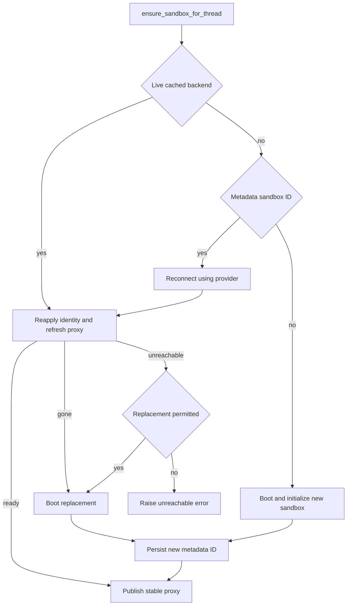

# Thread Sandbox Lifecycle

A normal agent thread has one durable sandbox binding: the sandbox contains its checkout and uncommitted working tree across runs. The binding is deliberately split between durable thread metadata and a worker-local handle. This distinction lets a later run on another worker reconnect, while avoiding exposing a partially initialized sandbox to tools.

Desktop runs are different: the agent factory supplies a `LocalShellBackend` rooted in an allowlisted project or a desktop-created worktree, rather than invoking the thread sandbox lifecycle. Desktop artifact routes put internal large-result and conversation-history files outside the project so they cannot be accidentally included in `git add -A`.

Related: [Agent graph](agent-graph.md), [Middleware stack](middleware-stack.md), [Threads and state](../concepts/threads-and-state.md), [Auth and security](../concepts/auth-and-security.md), and [Sandbox providers](../integrations/sandbox-providers.md).

## Binding and handles

`thread.metadata["sandbox_id"]` is the durable identity of a sandbox. `get_sandbox_metadata` first uses metadata supplied in the run configuration and otherwise reads the live LangGraph thread; a lookup failure returns `{}`, hence no ID. That fail-open behavior is safe for reading but is why provider interfaces intentionally have no delete operation keyed from this metadata: an unreliable lookup must not delete a live working tree.

`SANDBOX_BACKENDS` is an in-process dictionary from thread ID to a stable `SandboxBackendProxy`. It is a cache, not persistence, and therefore disappears with a worker restart. `set_sandbox_backend` retains the existing proxy and swaps its target when possible, so middleware and tools holding the proxy see a replacement backend instead of retaining a stale object.

The proxy is asynchronous. Synchronous backend methods fail with `NotImplementedError`; its `a*` methods resolve the current backend before delegating. If it has no target, resolution uses a registered reconnect callback, or falls back to the metadata ID and `create_sandbox`. A lock and shared startup task collapse concurrent first operations to one reconnect; `asyncio.shield` means cancellation of one waiter does not cancel shared startup. The proxy subclasses `BaseSandbox` so filesystem tooling recognizes capture-at-source support and can preserve the in-sandbox output cap. If an underlying backend lacks execute-offload support, the proxy explicitly falls back to ordinary execution.

## Provider selection and provisioning

`create_sandbox` is the provider-neutral creation and reconnection boundary. `SANDBOX_TYPE` selects a factory at runtime; the supported values are `langsmith` (default), `daytona`, `modal`, `runloop`, `e2b`, and `local`. The registry lazily imports only the selected factory and rejects an unknown value. LangSmith receives snapshot, VM resource, and raw create-body overrides; other providers receive only the optional existing ID. Native async factories are awaited, while synchronous factories are moved to `asyncio.to_thread`.

At server startup, `validate_sandbox_startup_config` validates the active LangSmith configuration rather than deferring errors until the first sandbox. It checks numeric size and retention settings, rejects negative TTLs, and validates `SANDBOX_CREATE_EXTRA_JSON` when present.

For a new thread sandbox, `SandboxCreateConfig.resolve` chooses an environment's ready snapshot when available, otherwise the admin base snapshot. It carries environment resource settings and create parameters into `create_sandbox`. The LangSmith provider also applies configurable idle and delete-after-stop retention to new boxes. Its creation path retries configured transient create failures; command retry is more conservative: only `SandboxRetryableConnectionError`, which guarantees the WebSocket upgrade failed before the command frame was sent, may be retried. Retries are bounded at four attempts with exponential jittered backoff, preventing a potentially executed command from being double-run.

The local provider is development-only: it runs commands directly on the host without isolation. It creates a project-local `.gitconfig-sandbox` that includes the developer's normal Git configuration, preventing per-run bot identity writes from overwriting the host identity. It also constructs an explicit environment excluding model and provider API keys.

## Get, reconnect, or create

`ensure_sandbox_for_thread` is the lifecycle entrypoint used by normal agent runs. The agent factory creates and starts a per-thread proxy early, with this function as its reconnect callback. Thread dispatch uses `multitask_strategy="interrupt"`, so one thread does not provision two sandboxes concurrently and no cross-process `__creating__` sentinel is used.

*Thread sandbox selection, recovery decision, durable binding, and final publication.*

The flow has three normal cases: reuse a live cached backend; reconnect using the durable ID; or boot a new backend when neither is available. Reconnect has no separate ping: for LangSmith, refreshing proxy configuration necessarily reaches the box, so that real operation is the reachability check. Git identity is re-applied every run because a reused box can lose its global config and commit authors must remain valid for downstream preview deployments. Identity configuration starts concurrently with proxy configuration because it requires the box but not proxy credentials.

Creation initializes the sandbox before writing `sandbox_id` to metadata. It writes the ID and persisted base proxy configuration before calling `set_sandbox_backend`; thus a creation or metadata failure leaves no new backend exposed through the proxy and a later run will create rather than adopt a half-initialized box.

## Gone is not unreachable

Recovery is intentionally data-preserving:

- `SandboxGoneError` means the provider confirms the bound box no longer exists. It cannot contain the working tree, while its stale metadata ID would make every future run reconnect to the same missing resource. `ensure_sandbox_for_thread` always creates and binds a replacement.
- `SandboxUnreachableError` means this run could not connect or reconfigure a box. The next run may succeed against the same ID. The default behavior is to raise rather than replace: silently switching to an empty filesystem could discard uncommitted work while the agent still believes that work exists. A failure while creating a chosen replacement is normalized to `SandboxUnreachableError`, preserving the caller's recovery contract.
- `allow_replacement=True` is reserved for the reviewer. Reviewer sandboxes hold only a checkout that `prepare_review_repo` clone-or-fetches and force-checks out to the PR head on every run, so an unreachable box can safely be replaced. Review threads persist per PR across pushes; refusing that replacement would permanently block subsequent reviews.

A command-level failure is not automatically a sandbox failure. The tool error path distinguishes pre-command transient gateway failures, which tell the model to retry, and command error frames, which remain normal tool errors. A non-transient connection failure notifies the user once and terminates the run rather than repeatedly executing against a dead backend.

## LangSmith credential proxy

The GitHub proxy is LangSmith-only. On sandbox creation and reuse, lifecycle code resolves either a supplied GitHub token or a GitHub App installation token, then configures the LangSmith proxy. GitHub credentials are injected as opaque request headers: `api.github.com` receives `Authorization: Bearer`, while `github.com` and `*.github.com` receive Basic authentication for `x-access-token:<token>`. The sandbox sees only the `GH_TOKEN=proxy-injected` placeholder required by `gh`; the real GitHub token is not written into its environment or filesystem.

Environment-provided proxy configuration is retained as a base configuration. It is persisted in thread metadata as `sandbox_base_proxy_config` after successful creation, so reconnects and token rotations preserve custom rules. The configuration procedure replaces its managed user-LangSmith rule, preserves other custom rules, and may add opaque Stagehand model credentials. A proxy PATCH retries retryable transport/status errors. If it receives the special not-ready response, it best-effort starts the stopped sandbox and retries; a stopped box retains its filesystem and is not equivalent to a deleted one.

GitHub App tokens expire after one hour. `record_proxy_token_expiry` keeps worker-local expiry, recorded time, repository scope, permission scope, and base proxy configuration per thread. The before-model `refresh_github_proxy_before_model` invokes `maybe_refresh_proxy_token`; it refreshes within five minutes of known expiry or after 50 minutes when expiry is unknown. Refresh remints with the original recorded scope unless a caller supplies a scope, so ordinary rotation does not broaden repository access or permissions. The middleware logs refresh failures rather than preventing a model call.

## Deliberate replacement operations

Both replacement operations require an existing bound sandbox and ensure the provider returns a distinct ID. Neither deletes the old sandbox; it remains preserved but detached from the thread.

- `recreate_sandbox` is the ordinary tool: it creates a fresh sandbox using the resolved environment configuration, configures it, persists the new ID, and only then replaces the cached backend. The fresh box has no prior files or worktree state.
- `sandbox_reset` is admin-gated and LangSmith-only. It accepts a raw LangSmith create-body request, configures GitHub proxy and git identity on the new box, persists both its ID and its base proxy configuration, then hands the proxy over. The tool warns callers never to put secrets or tokens in raw create options.

If metadata persistence fails in either operation, the existing cached proxy retains the old backend. This ordering makes an explicit replacement atomic from the thread's perspective even though the newly created provider resource may remain detached.

## Repository paths and reviewer preparation

Provider filesystems do not share a universal root. `resolve_sandbox_work_dir` first tries provider-exposed work-directory methods, then shell `pwd`, provider home/root methods, and finally `$HOME`; each candidate must exist and be writable. The resolved path is cached on the backend, and `resolve_repo_dir` appends a validated repository name. This keeps repository operations portable across provider wrappers.

The reviewer prepares its repo before the first model call: it clones once or fetches an existing checkout, fetches the PR head and base as needed, force-checks out the requested head SHA, and verifies `HEAD`. Preparation is best-effort, returning `False` on failure so the review can proceed from its fetched diff. Reviewer skills are treated separately: skill directories are extracted from the trusted base reference into `.review-skills` outside the PR checkout, never loaded from attacker-controlled PR-head content.

## Focused verification

The sandbox test suite exercises provider registry routing, startup settings, LangSmith proxy payloads and retries, thread binding order, gone/unreachable recovery, reset and recreate handoff ordering, proxy token refresh scope, paths, reviewer preparation, and local-provider behavior. In particular, tests assert concurrent proxy callers reconnect only once, initialization failures publish no backend, metadata update failures retain the old target, and retryable gateway errors are retried only when the SDK guarantees no command ran.
