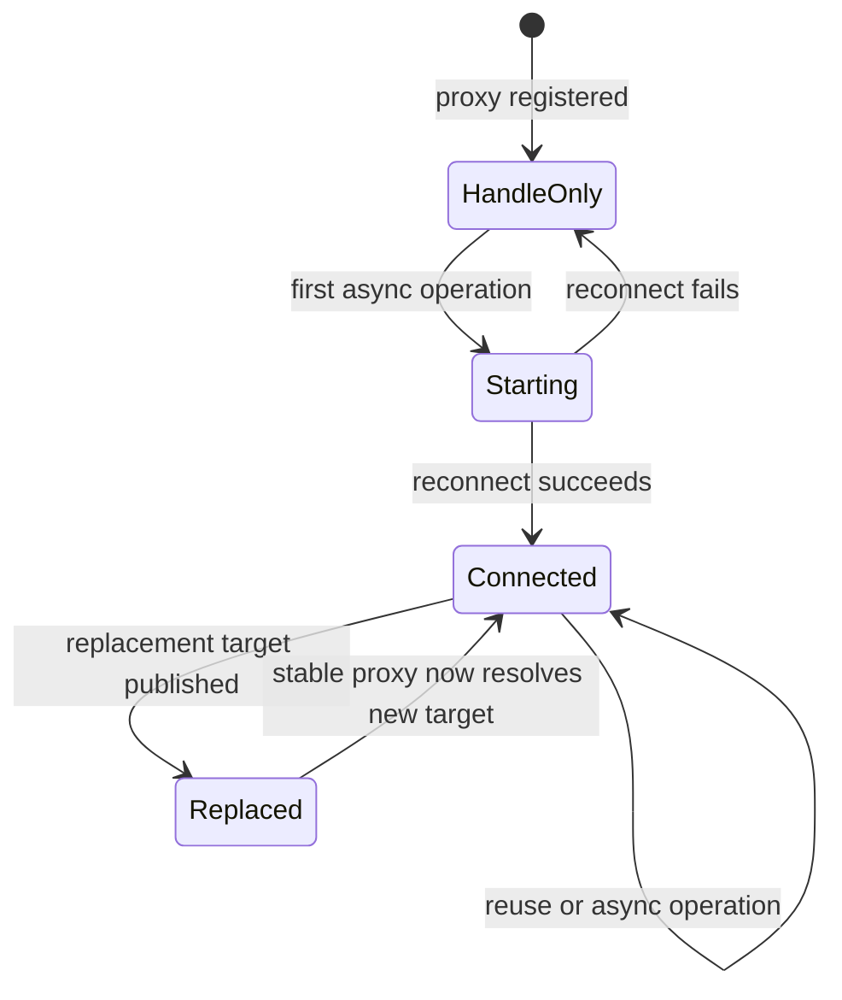
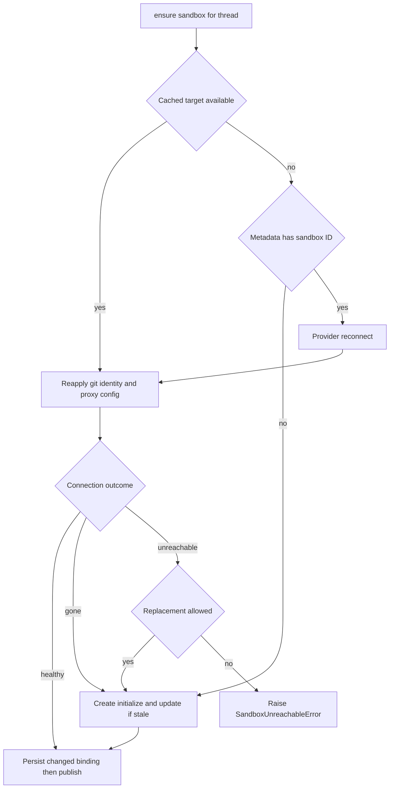

# Thread Sandbox Lifecycle

A normal agent thread is bound to a persistent sandbox that holds its checkout and uncommitted working tree across runs. The design separates that durable binding from a worker-local handle: a restart can reconnect using the thread record, while in-flight tools keep a stable proxy rather than a backend object that may be replaced.

Related: [Agent graph](agent-graph.md), [Threads and state](../concepts/threads-and-state.md), [Sandbox providers](../integrations/sandbox-providers.md), and [Configuration](../operations/configuration.md).

## Ownership and state

`thread.metadata["sandbox_id"]` is the durable provider identity. `get_sandbox_metadata` prefers inline run metadata containing that ID, otherwise reads the live thread; a failed lookup returns `{}`. The process-local `SANDBOX_BACKENDS` map instead associates a thread ID with its stable `SandboxBackendProxy`. It is a cache, not durable state. When a new backend is published, `set_sandbox_backend` replaces the target inside an existing proxy, so middleware and tools that retained the proxy follow the handoff.

The proxy is async-only: its synchronous filesystem and execution methods fail, while `a*` calls resolve the current target and delegate. A targetless proxy starts its registered reconnect callback, or reconnects directly from metadata if no callback was installed. An async lock and one shared startup task coalesce concurrent callers; shielding the task prevents cancellation of one waiter from cancelling the shared reconnect. It subclasses `BaseSandbox`, preserving FilesystemMiddleware's capture-at-source path and its in-sandbox output cap. `aexecute_with_offload` delegates to a capable target and otherwise reports a plain-execution fallback. Proxy execution supplies a 300-second default timeout when the caller does not specify one.

*The worker-local proxy lifecycle; thread metadata remains the durable binding throughout.*

## Provider boundary and bootstrap image

`create_sandbox` is the provider-neutral create-or-reconnect boundary. `SANDBOX_TYPE` selects a lazily imported factory: `langsmith`, `daytona`, `modal`, `runloop`, `e2b`, or `local`. LangSmith alone receives snapshot, resource, and raw create-body overrides; a native async factory is awaited and synchronous wrappers run in `asyncio.to_thread`. Startup validates active LangSmith sizing and retention settings, rejects negative retention TTLs, and parses `SANDBOX_CREATE_EXTRA_JSON` before the first creation.

`SandboxCreateConfig.resolve` selects the requested environment's `ready_snapshot_id`, falling back to the administrator base snapshot when no environment or ready snapshot exists. Its resources and create parameters travel into provisioning. With LangSmith, defaults include idle and delete-after-stop retention; provider reclamation, rather than application deletion, manages expired boxes. The provider interface deliberately has no delete operation because metadata reads fail open and an ID-keyed deletion could destroy the only uncommitted working tree.

### Environment freshness

An environment is a script-defined image: a full refresh boots a throwaway builder from its base snapshot, runs setup then update scripts, and captures only after every script succeeds. An update refresh boots from the current ready snapshot and runs only the update script. Snapshot captures publish a new immutable ID under the environment name's `latest` tag; runs use the recorded ID, not the mutable tag. A failed capture or refresh retains the prior ready snapshot.

A newly created thread sandbox whose selected environment snapshot is stale runs that environment's update script before the first model call, under the shorter sandbox-update timeout. Failure or nonzero exit is logged but does not fail an otherwise usable sandbox. The same creation schedules a background update refresh when due; it is rate-limited by the last attempt and an in-flight refresh lease. Full refreshes can be scheduled daily per environment, and builders are stopped after use for platform reclamation.

## Normal acquisition and data-preserving recovery

`ensure_sandbox_for_thread` is the normal entrypoint. It reads the cached target and durable metadata, then either reuses the target, reconnects using `sandbox_id`, or creates and initializes a box. Reuse and reconnect reapply bot Git identity and refresh LangSmith proxy credentials. Identity configuration runs concurrently with proxy configuration because both require the box but only the latter needs the token. Reapplying identity protects commits when a reused sandbox has lost global Git config.

*The replacement decision distinguishes a provider-confirmed deletion from a temporary inability to reach a working tree.*

`SandboxGoneError` means the provider confirmed that the bound resource no longer exists, so the stale ID is always replaced. `SandboxUnreachableError` means this run could not connect or reconfigure it; by default it is raised rather than replaced, since the next run may recover the sandbox and a fresh filesystem would silently lose uncommitted work. If an allowed replacement itself cannot be created, the lifecycle normalizes that failure to `SandboxUnreachableError`.

`allow_replacement=True` is reserved for reviewer runs. Reviewer threads persist for a PR across pushes, but `prepare_review_repo` clone-or-fetches then force-checks out and verifies the requested head every run, making its checkout re-derivable. Reviewer skill content is separately extracted from a trusted base reference into `.review-skills` outside the PR checkout, rather than loaded from attacker-controlled PR-head content.

For a newly created or replacement sandbox, initialization completes before metadata is updated. The ID and any persisted base proxy configuration are written before the backend is published to `SANDBOX_BACKENDS`. Consequently, a creation or metadata-write failure does not expose a half-initialized new target through the thread proxy.

## GitHub proxy and token renewal

GitHub proxy configuration applies only to LangSmith sandboxes. Creation or reuse resolves a supplied GitHub token or a GitHub App installation token. The LangSmith proxy injects it as `Authorization: Bearer` for `api.github.com`, and as Basic `x-access-token` authentication for `github.com` and `*.github.com`. The sandbox receives only `GH_TOKEN=proxy-injected`, which satisfies `gh`; the actual token is not placed in its environment or filesystem.

An environment's `proxy_config` is the base configuration. It is persisted as `sandbox_base_proxy_config` after successful creation so reconnect and rotation retain it. Proxy configuration retains custom rules while replacing managed GitHub rules, retries transient transport and selected status failures, and on the not-ready response best-effort starts the sandbox then retries. A stopped sandbox can retain its filesystem, so it is not treated as gone.

Proxy-token records are worker-local and include expiry, recording time, repository scope, permission scope, and base configuration. The before-model middleware invokes refresh logic for both normal and reviewer agents: it rotates within five minutes of a known expiry, or after 50 minutes when expiry is unavailable. Refresh remints using the recorded repository and permission scope unless an explicit scope is passed, avoiding a broadened token; middleware logs a refresh failure and allows the model call to continue.

LangSmith command retries are intentionally narrower than provisioning retries. Only `SandboxRetryableConnectionError` is retried because it denotes a rejected WebSocket upgrade before the command frame was sent. There are at most four attempts, with exponential jittered backoff, avoiding duplicate execution of a command that might have run.

## Explicit reset and recreate

Both operations require an existing binding, demand a provider-generated ID distinct from the old one, and retain rather than delete the old sandbox. This may leave a detached provider resource, but preserves a recoverable working tree.

- `recreate_sandbox_for_thread` creates a fresh sandbox from the resolved environment configuration, proxy-configures it, and rebinds the thread. It has no previous filesystem or worktree state.
- The admin-gated `sandbox_reset` tool is LangSmith-only. It accepts raw LangSmith create-body options, creates and configures the new sandbox, and persists its ID and proxy base configuration. Raw options must not contain secrets or tokens.

In both cases, the thread metadata update occurs before `set_sandbox_backend`. If persistence fails, the old proxy target stays live; token-recording for reset also waits until persistence succeeds. This is the handoff invariant that makes the thread view atomic despite non-atomic provider resource creation.

## Provider portability and local operation

Repository code does not assume a common provider filesystem root. `resolve_sandbox_work_dir` tries provider work directories, shell `pwd`, provider home/root methods, and shell `$HOME`, verifies each candidate is writable, then caches the selected directory. `resolve_repo_dir` appends a non-empty repository name.

The `local` provider runs directly on the developer host without isolation and is intended only for local development with human oversight. It uses a project-local `.gitconfig-sandbox` (unless `GIT_CONFIG_GLOBAL` is explicitly set) so per-run bot identity does not overwrite `~/.gitconfig`, while including the host config for helpers and aliases. Its explicit child environment excludes model-provider and LangSmith credentials. Desktop execution separately bypasses remote thread-sandbox provisioning and uses a local backend rooted in an allowlisted project or desktop-created worktree.

## Focused verification

The focused tests establish the safety boundaries rather than merely provider mechanics: concurrent proxy operations perform one reconnect; capture offload reaches capable targets and has a safe fallback; default execution timeouts apply; new sandboxes are not published before initialization and metadata persistence; reset/recreate retain the old target if persistence fails and reject a non-distinct ID. Environment refresh code additionally preserves a previous ready snapshot when a builder script or capture fails, so configuration or network failures degrade freshness rather than replace a known-good bootstrap image.
