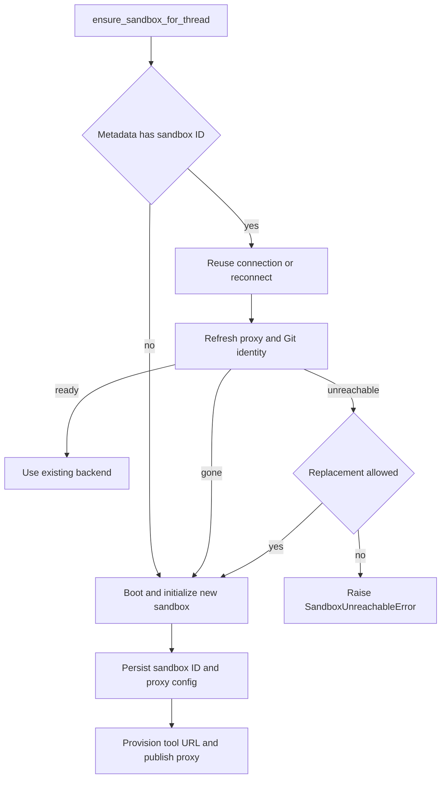

# Thread Sandbox Lifecycle

A normal agent thread is bound to one sandbox whose checkout and uncommitted working tree survive across runs. The design separates the durable binding from a worker-local connection so that a later worker can reconnect without allowing an incompletely initialized backend to reach tools. The central entrypoint is `ensure_sandbox_for_thread`.

Related: [Agent graph](agent-graph.md), [Threads and state](../concepts/threads-and-state.md), [Auth and security](../concepts/auth-and-security.md), and [Sandbox providers](../integrations/sandbox-providers.md).

## Identity, connections, and the stable handle

`thread.metadata["sandbox_id"]` is the durable identity. Metadata supplied by the active run configuration takes precedence when it contains a string ID; otherwise the lifecycle reads the live thread. A failure to retrieve live thread metadata is allowed to propagate rather than being interpreted as an unbound thread: treating an unavailable lookup as “no sandbox” could bind a fresh, empty box over the real one.

Two in-process maps complement that durable record:

- `SANDBOX_BACKENDS` maps a **thread ID** to its stable `SandboxBackendProxy`. It is a worker-local cache, not persistence.
- `SANDBOX_CONNECTIONS` maps a **sandbox ID** to a live provider backend. Keying it by sandbox rather than thread prevents a thread rebound elsewhere from receiving the box it left behind.

The proxy lets agent construction hand tools one object even while startup, reconnection, or deliberate rebinding changes the actual backend. It is async-only: synchronous filesystem and execution methods reject use, while `a*` methods resolve and delegate to the current target. With no target, it uses the registered lifecycle callback; without one, it retrieves the durable ID and connects through the provider registry. A lock and one shared startup task collapse concurrent first operations into one reconnect, and `asyncio.shield` prevents cancellation of one waiting caller from cancelling that shared work.

The proxy subclasses `BaseSandbox`, rather than merely satisfying the backend protocol. This retains the filesystem middleware’s capture-at-source path, including the in-sandbox output cap. `aexecute_with_offload` delegates to a capable provider backend and explicitly reports a normal-execution fallback when that capability is absent. Default command timeout at the proxy boundary is 300 seconds.

## Provisioning boundary and workspace snapshots

`create_sandbox` is the provider-neutral boundary for both creation and reconnection. `SANDBOX_TYPE` selects a lazily imported factory: `langsmith`, `daytona`, `modal`, `runloop`, `e2b`, or `local`. The optional third-party providers have explicit dependency-group diagnostics. LangSmith receives an existing ID or creation options including snapshot, CPU, memory, filesystem capacity, and raw create parameters; other factories receive an existing ID, and synchronous factories run in `asyncio.to_thread`.

`SandboxCreateConfig.resolve` turns lifecycle context into these creation options. In the ordinary `workspace` source it loads the selected (or default) workspace, uses its `ready_snapshot_id`, resource settings, and create parameters. In `base` source it intentionally skips workspace lookup and supplies no snapshot, leaving the provider’s base image path. A fresh sandbox runs a stale-workspace update script before the first model call, with a bounded timeout; failures only sacrifice freshness, not the run. It then triggers snapshot maintenance in the background for later creations.

At application startup `validate_sandbox_startup_config` checks the active provider configuration. For LangSmith it validates numeric resource and retention settings, rejects negative retention values, and parses extra create JSON before the first request. LangSmith command retries are deliberately narrow: only `SandboxRetryableConnectionError` is retried because it means the WebSocket upgrade was rejected before the command frame was sent. Attempts are bounded and use exponential jittered backoff, avoiding accidental double execution.

The `local` provider is for development, not isolation: it executes on the host. It scopes global Git configuration to `.gitconfig-sandbox` so bot identity writes do not overwrite the developer’s `~/.gitconfig`, and supplies an explicit child environment that excludes model and provider API keys.

## Normal get-or-create and publication ordering

Agent factories register `ensure_sandbox_for_thread` as the proxy reconnect callback and may start it before tools run. For a normal coding thread the function:

1. reads the durable metadata and an optional persisted base proxy configuration;
2. reuses the matching live connection when possible, otherwise connects by `sandbox_id`;
3. if there is no ID, boots a new sandbox from the resolved creation configuration;
4. refreshes LangSmith proxy credentials and reapplies Git identity on an existing connection; and
5. after a successful new boot, persists the ID and proxy base configuration, provisions the tool URL, and finally publishes/replaces the proxy target.

*The source-backed lifecycle decision: a missing or confirmed-deleted sandbox is created, while an unreachable one is normally surfaced as a failure.*

Creation is intentionally publish-last. The thread metadata is written only after creation, proxy configuration, Git identity, and optional update work have succeeded. The backend becomes available through the thread proxy only after that persistence and tool-URL provisioning. Therefore a failure during initialization or metadata update does not expose a half-built backend; a later run does not adopt it through a newly written ID. Thread dispatch normally uses `multitask_strategy="interrupt"`, which is relied on to avoid concurrent provisioning for the same thread rather than maintaining a cross-process creating sentinel.

Git identity is reapplied on every connection because a reused sandbox can lose global configuration; configuration runs concurrently with proxy refresh because both require the sandbox but identity does not require proxy credentials.

## Safety invariant: gone is not unreachable

Replacement is not ordinary recovery for a coding sandbox. Its filesystem may be the only location of uncommitted work.

- `SandboxGoneError` is a provider-confirmed deletion. The stale ID cannot recover and the deleted box cannot retain the worktree, so lifecycle always provisions and binds a replacement.
- `SandboxUnreachableError` means this run could not connect or reconfigure the box; a later run against the **same ID** may work. The default is to fail the run rather than silently replace it with an empty filesystem. If a selected replacement also cannot be created, the failure is normalized to `SandboxUnreachableError`.
- `allow_replacement=True` is used for read-only review and review-scout work. Those sandboxes contain a checkout that review preparation re-derives each run, and their per-PR threads are reused across pushes. They may safely replace an unreachable backend rather than leaving future reviews permanently blocked. This exception must not be generalized to coding threads.

For LangSmith, proxy refresh doubles as the reachability operation—there is no preliminary ping. A stopped sandbox is also not deleted: when proxy configuration is rejected because it is not ready, configuration best-effort starts it and retries, preserving its filesystem.

## GitHub access is proxied and refreshed

The GitHub sandbox proxy applies only to LangSmith. On creation and reuse, lifecycle obtains repository-scoped workspace access, then configures provider proxy rules. `api.github.com` receives an opaque `Authorization: Bearer` header; `github.com` and `*.github.com` receive Basic authentication for `x-access-token:<token>`. The sandbox itself gets only `GH_TOKEN=proxy-injected`, which satisfies `gh` without placing the actual credential in its environment or filesystem.

Workspace token resolution intersects requested repositories with the workspace’s configured repositories. If no installed repository matches, it returns no credentials; the installation-wide discovery token stays server-side. Proxy configuration starts with an environment/workspace base configuration, replaces managed GitHub and tool rules, and preserves unrelated custom rules. The successfully used base configuration is persisted as `sandbox_base_proxy_config` with new thread metadata, so reconnects and rotations preserve it. Retryable transport and status failures are retried; the special not-ready status causes a best-effort start followed by another patch.

GitHub App installation tokens expire after an hour. Worker-local proxy records retain expiry, record time, repository scope, normalized permission scope, workspace, and base proxy configuration. Before each model call, middleware refreshes a token within five minutes of known expiry, or after 50 minutes if expiry is unknown. A refresh retains the original scope; when a caller requests repositories, it intersects rather than broadens it. Refresh errors are logged and do not themselves block the model call.

## Explicit recreation and review checkout preparation

The `recreate_sandbox` tool calls `recreate_sandbox_for_thread` to deliberately bind a thread to a distinct fresh sandbox. It requires an existing binding, does not delete the former provider sandbox, and rejects a provider result with the same ID. `source="workspace"` uses the workspace snapshot; `source="base"` skips it. A request to boot a different workspace is private-admin gated.

The operation creates and configures the new backend, persists its ID (and available base proxy configuration), then swaps the existing stable proxy. If persistence fails, the old proxy target remains in place, even though a detached newly created provider resource can remain. This makes the handoff atomic from the thread’s perspective and preserves the old worktree.

Reviewer preparation makes its replacement exception safe: it clone-or-fetches the repository, fetches relevant base and head references, force-checks out the requested PR head, and verifies `HEAD`. A preparation failure returns `False` so the review can still use fetched diff context. Reviewer skills are a separate trust boundary: they are extracted from a trusted base reference into `.review-skills` outside the PR checkout, never read from PR-head content.

Repository paths are provider-portable. The resolver tries provider work-directory methods, shell `pwd`, provider home/root methods, then `$HOME`; every candidate must be an existing writable directory, and the chosen directory is cached. `resolve_repo_dir` appends a nonempty repository name.

## Focused verification and operations

Focused sandbox tests verify proxy reconnection collapsing, capture-offload fallback and the default timeout, publish-last initialization, normal and reviewer recovery decisions, recreation handoff ordering and distinct IDs, provider routing, retry safety, workspace update behavior, path discovery, and repository preparation. When operating this lifecycle, treat `SandboxUnreachableError` as a preservation signal: investigate or retry the existing sandbox ID; do not “fix” it by enabling replacement for coding workloads.

Desktop runs are outside this remote thread-sandbox lifecycle. They use a local backend rooted only in an allowlisted project or desktop-created worktree, and route agent artifact files outside the project to avoid accidental inclusion by `git add -A`.
