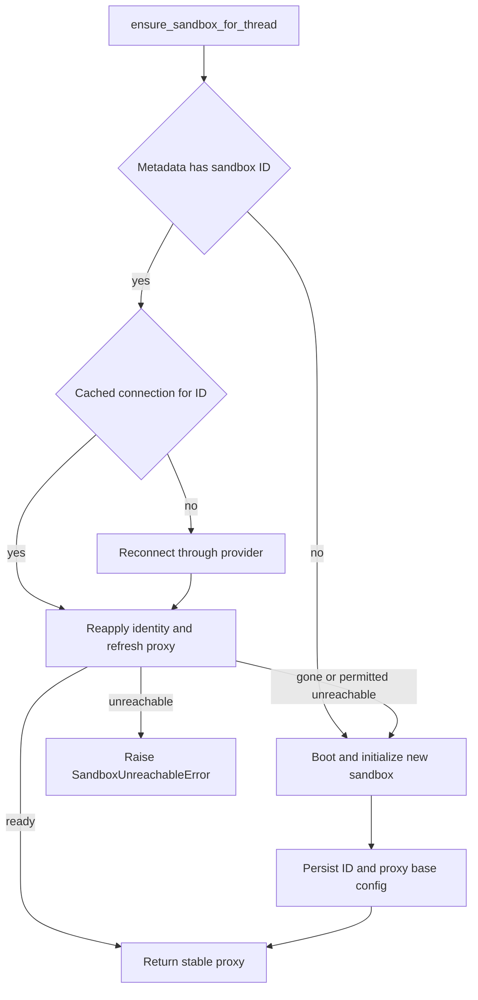

# Thread Sandbox Lifecycle

A normal agent thread is bound to one persistent sandbox, which preserves its checkout and uncommitted working tree between runs. The design separates that durable binding from a process-local connection so a later worker can reconnect without ever exposing a half-initialized backend. This page concerns normal remote thread runs; the server's reconnect callback instead returns a desktop backend for desktop runs.

Related: [Agent graph](agent-graph.md), [Threads and state](../concepts/threads-and-state.md), [Sandbox providers](../integrations/sandbox-providers.md), and [Follow-up messages](../workflows/follow-up-messages.md).

## Binding, cache, and stable handles

`thread.metadata["sandbox_id"]` is the durable provider identity. `get_sandbox_metadata` prefers inline metadata from the current run only when it contains a string `sandbox_id`; otherwise it reads the live LangGraph thread. Failure to read *inline* configuration falls through to that lookup, while a live-thread lookup error propagates rather than being interpreted as an unbound thread. This avoids rebinding a thread merely because its authoritative metadata could not be read.

`SANDBOX_BACKENDS` is an in-process map from thread ID to `SandboxBackendProxy`, not persistence. `SANDBOX_CONNECTIONS` separately caches a live connection by sandbox ID; when a thread is rebound, the old-ID connection is removed. `set_sandbox_backend` keeps an existing per-thread proxy and replaces its target, so middleware and tools that already hold the handle see the new backend.

The proxy is deliberately async-only: synchronous filesystem and execute methods raise `NotImplementedError`, while `a*` methods resolve the current backend and delegate. A missing target uses the callback registered for the run, or, when no callback exists, reads `sandbox_id` and calls `create_sandbox`. A lock and one shared startup task collapse concurrent requests into one reconnect; waiters shield that task from an individual waiter's cancellation, and a later call can retry a failed startup.

`SandboxBackendProxy` subclasses `BaseSandbox`, not just the protocol. That preserves filesystem middleware's capture-at-source route and its in-sandbox output cap. Its offload execution delegates when the underlying backend supports it; otherwise it performs ordinary execution and returns `offloaded=False`. The proxy supplies a default 300-second execute timeout when the caller does not supply one.

## Provisioning from providers and workspaces

`create_sandbox` is the provider-neutral create-or-reconnect boundary. `SANDBOX_TYPE` selects a lazily imported factory: `langsmith`, `daytona`, `modal`, `runloop`, `e2b`, or `local`. Only LangSmith receives snapshot, CPU, memory, filesystem, and raw create-body options; other factories receive an optional existing ID. Coroutine factories are awaited and synchronous factories are moved off the event loop with `asyncio.to_thread`.

For a new box, `SandboxCreateConfig.resolve` loads the selected (or default) workspace unless the caller explicitly requests `source="base"`. A workspace contributes its ready snapshot ID, resource settings, and create parameters. With no workspace—or with `base`—the snapshot ID is `None`, so LangSmith uses its provider root snapshot. The lifecycle configures Git identity and, for LangSmith, proxy authentication before treating the new backend as initialized.

A stale workspace snapshot can be freshened for the triggering run: after boot, the configured update script runs with a bounded timeout before the first model call. Its exception or nonzero exit is logged but is non-fatal because the captured image remains usable; snapshot capture/update is then triggered in the background for subsequent creations.

LangSmith validates its active startup configuration at server boot: configured resource and retention settings must parse as integers, retention values cannot be negative, and extra create JSON is parsed up front. New LangSmith boxes receive idle and delete-after-stop retention settings. The provider has no delete operation: a sandbox may contain the only uncommitted working tree, while metadata is not a safe basis for destructive action; platform retention reclaims resources instead.

Command retry is narrower than provisioning retry. A LangSmith command is retried only for `SandboxRetryableConnectionError`, whose rejected WebSocket upgrade occurs before the command frame was sent. Attempts are bounded at four and use exponential jittered backoff, avoiding duplicate execution of a command that might have run.

The `local` provider is for local development: it runs directly on the host without isolation. It redirects global Git writes to `.gitconfig-sandbox` (including the developer's normal configuration) and passes an explicit child environment that omits model and provider API keys.

## Get, reconnect, or create

The agent factory creates a per-thread proxy early, registers `ensure_sandbox_for_thread` as its reconnect callback, and starts it before agent construction. The lifecycle function reads durable metadata, then either reuses a matching live connection, reconnects through the selected provider, or provisions a new sandbox. Dispatch uses `multitask_strategy="interrupt"`, so its design relies on one thread not provisioning two sandboxes concurrently rather than a cross-process `__creating__` sentinel.

*The normal thread lifecycle: durable lookup, reconnect or create, initialization, then publication.*

There is no separate reachability ping. Reapplying the LangSmith proxy configuration is itself an operation that reaches the sandbox; failure is translated to `SandboxUnreachableError`. Git identity is reapplied each run, and runs concurrently with proxy configuration because both require the box but identity does not require credentials.

Creation and replacement have a strict visibility order: boot and initialization first, then persist `sandbox_id` and any `sandbox_base_proxy_config`, and only then publish through `set_sandbox_backend`. Thus creation or metadata failure does not make a new target reachable through the thread proxy; the provider resource can exist, but it is not adopted by the thread.

## Recovery preserves working trees

`SandboxGoneError` means the provider confirmed that the bound box no longer exists. It is always replaced: its stale ID would otherwise make all later runs reconnect to a resource that cannot contain work.

`SandboxUnreachableError` means this run could not reconnect or reconfigure a box; it says nothing about a later run. Normal agent threads raise it rather than silently replacing the sandbox, because a new filesystem would lose uncommitted work while the agent still believes that work exists. If a selected replacement cannot be created, the lifecycle normalizes that failure to the same typed unreachable error.

The reviewer is the intentional exception. It calls `ensure_sandbox_for_thread(..., allow_replacement=True)` because it reconstructs its repository each run and uses one enduring thread per PR across pushes. Before the reviewer model runs, `prepare_review_repo` clones or fetches, fetches the needed head/base, force-checks out the requested head SHA, and verifies `HEAD`; a preparation failure returns `False` and leaves review diff handling available. Reviewer skills are extracted from the trusted base reference into `.review-skills` outside the PR checkout, never from PR-head content.

At command level, the retryable pre-command gateway error remains a model-retry condition, while command error frames remain ordinary tool failures. A non-transient connection failure is not healed by replacement during the run; the error path can notify the user once and end the run rather than repeatedly operating against a dead backend.

## LangSmith GitHub credential proxy

The GitHub proxy applies only to LangSmith sandboxes. Lifecycle code obtains either a supplied GitHub token or a GitHub App installation token and configures LangSmith to inject it as opaque headers: `api.github.com` uses Bearer authentication, while `github.com` and `*.github.com` use Basic authentication for `x-access-token:<token>`. The sandbox receives only the `GH_TOKEN=proxy-injected` placeholder required by `gh`, not the actual GitHub token in its environment or filesystem.

Workspace-supplied proxy configuration is a base configuration. It is persisted with a newly bound thread and also maintained worker-locally, so reconnects and rotations retain custom rules. Configuration drops obsolete managed rules, retains unrelated custom rules, appends the managed GitHub rules, and PATCHes the provider configuration. Retryable transport/status failures are retried; if the provider reports the sandbox is not ready, the lifecycle best-effort starts it and retries the PATCH. A stopped sandbox is not deleted and retains its filesystem.

GitHub App tokens expire in one hour. Per-thread records retain expiry (or recording time), repository scope, permission scope, and base configuration. Before each model call, middleware refreshes a LangSmith proxy within five minutes of known expiry or after 50 minutes when expiry is unknown. Refreshing reuses the recorded repository and permission scope unless explicitly overridden, and middleware logs refresh failure rather than blocking the model call.

## Explicit recreation and portable paths

The `recreate_sandbox` tool deliberately rebinds the current thread. It requires an existing sandbox, creates and initializes a distinct replacement from either the workspace snapshot or `source="base"`, persists the new ID (and proxy base configuration when present), and only then replaces the cached proxy target. It never deletes the old sandbox. If metadata persistence fails, the old proxy target remains active, though the newly created provider resource is detached.

Providers expose different filesystem layouts. `resolve_sandbox_work_dir` tries provider work-directory methods, shell `pwd`, provider home/root methods, then shell `$HOME`; every candidate must exist and be writable. It caches the selected directory on the backend, and `resolve_repo_dir` appends a non-empty repository name. This keeps reviewer and repository operations portable across provider wrappers.

## Focused verification

`tests/sandbox/` covers the invariants that make lifecycle changes risky: concurrent lazy reconnect and cancellation, capture-offload behavior, publish-after-initialization ordering, create/reconnect recovery, reviewer replacement, recreation handoff, provider configuration, proxy retries and auth payloads, update-script failure tolerance, paths, and local-provider environment behavior. In particular, the tests assert that failed initialization publishes no backend and that a metadata write failure during recreation leaves the old target in place.
