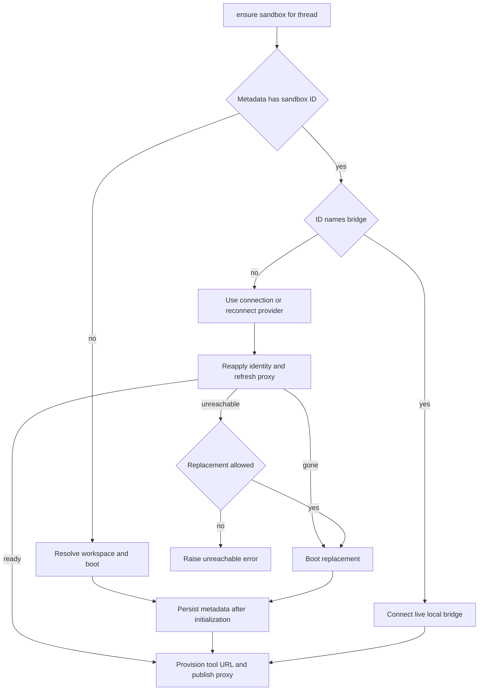

# Thread Sandbox Lifecycle

A normal agent thread is bound to one sandbox so its checkout and uncommitted work can survive runs. The durable binding is separate from the worker-local backend object: thread metadata names the sandbox, while a stable proxy lets tools keep one handle as a worker reconnects or replaces its target. A binding can also name a **bridge** to the user's own machine rather than a managed cloud sandbox.

Related: [Agent graph](agent-graph.md), [Threads and state](../concepts/threads-and-state.md), [Auth and security](../concepts/auth-and-security.md), and [Sandbox providers](../integrations/sandbox-providers.md).

## Binding, cache, and proxy

`thread.metadata["sandbox_id"]` is the durable identity. `get_sandbox_metadata` first accepts inline run metadata only when it contains a string ID, then reads the live thread. A live lookup error is allowed to propagate: treating a failed read as an unbound thread could overwrite the real binding with a newly created sandbox.

Two process-local maps complement that durable state:

- `SANDBOX_BACKENDS` maps thread IDs to stable `SandboxBackendProxy` handles used by the server and middleware.
- `SANDBOX_CONNECTIONS` maps a sandbox ID to a live provider connection. When a thread is rebound, the prior connection is removed if its ID differs.

`SandboxBackendProxy` is async-only; its `a*` operations resolve a current target and synchronous operations reject use. When no target is cached, it invokes the run's reconnect callback or reconnects from metadata. A lock and one shared startup task collapse concurrent callers into a single reconnect, and `asyncio.shield` prevents cancellation of one waiter from cancelling shared startup. The proxy subclasses `BaseSandbox`, retaining filesystem middleware's capture-at-source/offload behavior; if the underlying backend has no offload method, it returns an ordinary-execution fallback. Default execution timeout through the proxy is 300 seconds.

## Hosted sandbox provisioning

`ensure_sandbox_for_thread` is the normal lifecycle entry point. It reads metadata, uses an existing ID's live connection when available, otherwise asks the selected provider to reconnect. Reused or reconnected managed boxes have bot Git identity reapplied and, for LangSmith, GitHub proxy credentials refreshed. There is no preliminary ping: proxy refresh is the operation that establishes reachability.

For a new sandbox, `SandboxCreateConfig.resolve` loads the requested workspace unless `source="base"`; the default workspace is used when no slug is supplied. A workspace contributes its ready snapshot ID, resource settings, and create parameters. If no workspace is selected, `snapshot_id` is `None`, allowing LangSmith to use its root snapshot. An owner preference can add `preserve_memory_on_stop`. If a workspace snapshot is stale, its update script runs in the new sandbox before the first model call with a bounded timeout; errors and non-zero exits are logged but do not fail the usable box. A background workspace-update trigger is then started.

`SANDBOX_TYPE` chooses a lazily imported factory: `langsmith`, `daytona`, `modal`, `runloop`, `e2b`, or `local`. LangSmith alone receives snapshot, capacity, and raw creation parameters. Native async factories are awaited; synchronous provider wrappers are moved to a thread. The optional third-party providers require their matching `sandbox-<provider>` extra (or `sandbox-providers`), and startup validation imports the active optional provider early. LangSmith startup configuration is likewise validated before serving.

*Binding chooses a bridge, reconnects a managed sandbox, or provisions one; a managed replacement is persisted before it is published.*

Provisioning initializes the sandbox—including identity, proxy configuration, and an optional update script—before `sandbox_id` is written to thread metadata. The backend is published only after that write and tool-URL provisioning. Thus failures in creation or metadata binding do not expose a new backend through the stable proxy. The code relies on thread dispatch with `multitask_strategy="interrupt"` to avoid simultaneous provisioning for one thread; it does not use a cross-process creation sentinel.

## Reconnect and replacement policy

A provider-confirmed deletion is `SandboxGoneError`; it is always replaced because the old resource cannot hold the working tree and its stale ID would otherwise brick future runs. A connection or proxy-refresh failure becomes `SandboxUnreachableError`. By default it is surfaced, not replaced: the box may recover and may hold the only uncommitted work. `allow_replacement=True` is for reviewer runs, whose repository is re-derived on every run. If an allowed replacement itself fails, the caller still receives `SandboxUnreachableError`.

`recreate_sandbox_for_thread` is the deliberate rebind path. It requires an existing non-bridge binding, creates a distinct new sandbox from the selected workspace or base source, persists the new ID and remembered base proxy configuration, then swaps the stable proxy target. It does not delete the old box. A metadata-write failure leaves the old proxy target intact, although the new provider resource can remain detached. Choosing another workspace through the tool is admin-gated.

Command failures are not automatically lifecycle failures. `SandboxRetryableConnectionError` means a WebSocket upgrade was rejected before the execute frame was sent, so retries are safe; retry logic makes at most four attempts with exponential jitter. Command error frames remain ordinary tool errors. Non-transient connection failures are handled as unreachable and terminate the run after one user notification rather than silently continuing on an empty replacement.

## GitHub credential proxy

The managed GitHub proxy applies only to LangSmith sandboxes. On creation and reuse, the lifecycle obtains a workspace-scoped GitHub access token and configures proxy rules: `api.github.com` gets a Bearer header, while `github.com` and `*.github.com` get Basic authentication for `x-access-token:<token>`. The `gh` CLI sees only the `GH_TOKEN` proxy placeholder, not the credential itself. Workspace lookup or scoped-token failure therefore blocks proxy injection rather than falling back to broader installation access.

The base proxy configuration is recorded per thread and persisted in metadata on creation. Configuration removes previously managed rules, preserves custom rules, adds GitHub and thread-tool rules, and retries retryable transport or status failures. If the proxy PATCH says the sandbox is not ready, it best-effort starts the stopped sandbox and retries; stopped is distinct from deleted and retains its filesystem.

Token records are worker-local and retain expiry, recording time, repository scope, permission scope, workspace slug, and base configuration. Before each model call, middleware refreshes a LangSmith token within five minutes of known expiry or after 50 minutes when expiry is unavailable. Explicit requested repositories are intersected with recorded scope, so rotation cannot expand it; middleware logs a refresh failure and permits the model call to proceed.

## Local execution modes

The `local` provider is for development: it runs directly on the host without isolation. It makes `git config --global` target a root-local `.gitconfig-sandbox` (which includes the user's normal Git config) and builds a child environment that excludes model and provider API keys.

Desktop runs bypass the thread-managed lifecycle entirely. They receive a local shell rooted only in an allowlisted project or a desktop-created worktree, with a minimal inherited shell environment. Desktop artifact routes place large tool results and conversation history outside the project so internal agent files are not swept up by `git add -A`.

## CLI bridge: a thread sandbox on the user's machine

A bridge binding uses the same `sandbox_id` metadata key, with a reserved prefix and `sandbox_kind: "bridge"`. On seeing that ID, `ensure_sandbox_for_thread` connects `BridgeSandboxBackend` and skips cloud boot, Git configuration, and proxy refresh. It never replaces a disconnected bridge; it raises `SandboxUnreachableError` because the bound sandbox is the user's machine.

The bridge is a Postgres-backed request queue between the graph worker and a CLI long poll. Backend execute/upload/download calls subscribe before enqueueing, then wait for the CLI result while periodically re-reading request state and bridge liveness. Requests move `pending → claimed → done | failed`; `FOR UPDATE SKIP LOCKED` makes claims exclusive and conditional completion makes answers at most once. Notifications are an optimization, not a correctness dependency: every transition is committed with a Postgres notification and published in process, while polls and liveness ticks re-read storage. A heartbeat-pruning loop closes stale bridges and fails unanswered requests. A restarted owner CLI can reopen a closed or stale bridge and requeue previously claimed, unanswered requests; a concurrently live CLI is refused.

Bridge API routes require PostgreSQL and scope all operations to the authenticated owner. Foreign bridge IDs receive 404, claims report held request IDs so requests lost between claim and poll response can be requeued, and an answer must contain exactly one result or error.

## Repository portability and reviewer recovery

`resolve_sandbox_work_dir` caches the first writable directory found by trying provider work directories, shell `pwd`, provider home/root directories, then shell `$HOME`; `resolve_repo_dir` appends a non-empty repository name. This makes repository operations portable across provider wrappers.

Reviewer preparation clone-or-fetches the repository, fetches the relevant PR head/base, force-checks out and verifies the requested head SHA, and returns `False` rather than failing the whole review if preparation cannot finish. That re-derivable checkout is why reviewers may replace an unreachable managed sandbox. Reviewer skills are extracted from a trusted base reference into `.review-skills` outside the PR checkout, never read from PR-head content.

## Focused verification

Sandbox tests cover proxy startup collapse and publication ordering, provider and optional-extra selection, workspace-scoped GitHub access, retry classification, local-provider isolation boundaries, recovery and recreation ordering, paths, reviewer checkout behavior, and bridge queue/connection failure behavior. When changing lifecycle ordering, retain tests that assert no new target is published before durable binding and no unreachable working tree is silently replaced.
