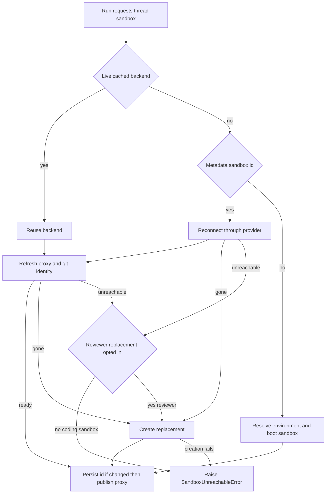

# Sandbox binding and recovery lifecycle

A coding thread's sandbox is its persistent working tree. The application is otherwise deliberately stateless: a process-local backend handle improves latency, but the thread metadata is the durable record that permits a later run or worker to reconnect. This makes recovery a data-safety concern rather than a simple availability retry.

> **Safety invariant:** never silently replace an unreachable coding sandbox. It may contain the only copy of uncommitted work. Replacement is automatic only when the provider establishes that the sandbox is gone; the read-only reviewer is the sole caller that opts into replacement after an unreachable failure.

Related: [agent graph](/openwiki/architecture/agent-graph.md), [reviewer and analyzer](/openwiki/architecture/reviewer-and-analyzer.md), [threads and state](/openwiki/concepts/threads-and-state.md), [authentication and security](/openwiki/concepts/auth-and-security.md), and [sandbox providers](/openwiki/integrations/sandbox-providers.md).

## Ownership and async handles

`agent.sandboxes.lifecycle.ensure_sandbox_for_thread` is the lifecycle entrypoint. The agent graph factory creates a stable `SandboxBackendProxy`, registers an async reconnect callback, and starts it before the prepare middleware awaits it. Thus graph construction can overlap sandbox startup with other preparation, while every actual backend operation awaits readiness. The analyzer follows the same proxy/reconnect pattern; desktop runs supply a desktop backend instead.

`SANDBOX_BACKENDS` is an in-process `thread_id → SandboxBackendProxy` cache shared by server and middleware. It is not durable and must not be treated as the binding. The durable binding is `metadata["sandbox_id"]`: metadata is first taken from the run configuration when present, otherwise fetched from the thread API. Lookup errors fail open to no metadata, allowing a subsequent lifecycle run to create rather than block on a failed read.

The proxy is intentionally **async-only**: synchronous backend methods raise `NotImplementedError`, and `a*` methods await the live backend. It subclasses `BaseSandbox`, preserving FilesystemMiddleware's capture-at-source/offload path and its in-sandbox output limit. When empty or while startup is in progress, `_aget_backend` serializes callers with a lock; it uses the registered callback when available, otherwise reads the persisted id and calls `create_sandbox`. The startup task is shielded from an individual awaiter's cancellation, and a failed task is cleared so a later call can retry. When a replacement is published, `set_sandbox_backend` updates the existing proxy in place so already-constructed graph backends remain valid.

## Provider and creation configuration

The provider registry selects `ENV.SANDBOX_TYPE` at runtime. It supports `langsmith`, `daytona`, `modal`, `runloop`, `e2b`, and `local`; an unknown type fails with `ValueError`. `create_sandbox` is the common async creation/reconnection boundary: it awaits coroutine factories directly and sends synchronous factory implementations to `asyncio.to_thread`. Snapshot, resource, and arbitrary create-body overrides are passed only to the LangSmith factory.

New lifecycle-created sandboxes use `SandboxCreateConfig.resolve(environment_slug)`. If the selected environment exists, its `ready_snapshot_id` wins; otherwise its resource settings and create parameters still apply, with the snapshot falling back to the admin base snapshot. With no environment, the admin base snapshot is used. The configuration's `boot()` passes the resolved snapshot, resources, and nonempty create parameters to the provider. LangSmith itself falls back from that input to `DEFAULT_SANDBOX_SNAPSHOT_ID` and then the platform root snapshot; it also supplies default resources and lifecycle TTLs. FastAPI validates the active provider configuration during lifespan startup, so malformed LangSmith numeric defaults fail at boot rather than on first creation.

The local provider is intentionally a development option, not isolation. Provider-specific operational setup belongs at the provider boundary; lifecycle callers rely only on `SandboxBackendProtocol` and its async surface.

## Binding, reconnecting, and recovery

The normal lifecycle reads both the cache and metadata, then follows the state machine below. A new sandbox is fully booted, configured, and initialized before its id is written to metadata. Only after the metadata update succeeds is it published through `set_sandbox_backend`. This ordering prevents future runs from adopting a half-initialized sandbox and prevents concurrent graph consumers from using a backend whose startup later failed. Dispatch uses `multitask_strategy="interrupt"`, so one thread does not provision two sandboxes concurrently and the lifecycle needs no cross-process “creating” sentinel.

*Per-thread lifecycle: reconnecting and recreating are separate from the deliberate unreachable-sandbox failure policy.*

For a cached backend, or one successfully reconnected by id, lifecycle re-applies git identity and refreshes the LangSmith proxy rather than performing a separate reachability ping. Proxy configuration must contact the box anyway, so its failure is the reachability result. Git identity is launched alongside proxy configuration because it needs the box but not proxy authentication; it is awaited before initialization is considered complete. The identity is applied on every reuse/reconnect because global git configuration may not survive, and commits must use the bot identity.

### Gone is not unreachable

`SandboxGoneError` represents a provider-confirmed missing sandbox (LangSmith maps `ResourceNotFoundError` to it). The stale id would otherwise cause every later run to reconnect to an object that no longer exists, and a deleted sandbox has no working tree to preserve. It is therefore always recreated and the metadata binding is updated.

All other reconnect or proxy-refresh failures are normalized to `SandboxUnreachableError`. This only says the sandbox did not answer this run; it may return on the next run. By default the error ends preparation and is surfaced to the relevant user channel rather than switching the coding agent to an empty filesystem. If a permitted replacement attempt itself fails, the lifecycle re-raises `SandboxUnreachableError`, preserving a single actionable failure type for notification.

The reviewer explicitly calls the lifecycle with `allow_replacement=True`. Its sandbox contains only a checkout that `prepare_review_repo` clone-or-fetches and force-checks out to the pull request head on every review. Reviewer threads are one per PR and can outlive a sandbox, so retaining an unreachable binding would permanently prevent later reviews. This narrow exception must not be generalized to coding or analyzer work.

## GitHub proxy and retained configuration

For `langsmith` only, sandbox creation and reuse configure an outbound proxy with a GitHub App installation token. The proxy injects `Authorization: Bearer` for `api.github.com` and Basic authentication derived from `x-access-token:<token>` for `github.com` and `*.github.com`. The sandbox receives only the `GH_TOKEN` placeholder needed by `gh`; it does not receive the real token on disk. A token is resolved from the GitHub App when the caller has not supplied one.

The lifecycle stores the original base proxy configuration in thread metadata as `sandbox_base_proxy_config` when it creates or replaces a binding. Reconnect reads that value (with an in-process recorded fallback) and supplies it on refresh, so custom rules survive worker restarts and managed rules can be reconstituted. LangSmith proxy configuration preserves un-managed custom rules while rebuilding managed GitHub, optional user-LangSmith, and Stagehand rules. If the proxy endpoint reports a not-ready sandbox, it best-effort starts it—stopped is not deleted—and retries the update; transient PATCH failures also have bounded retries.

## Explicit replacement and operations

Two explicit paths intentionally break the normal preservation rule:

- `recreate_sandbox_for_thread` creates a distinct fresh sandbox using the environment-based lifecycle configuration, configures it, then persists the new id before replacing the cached proxy target. It preserves but detaches the old sandbox; the user-facing `recreate_sandbox` tool warns that current files and worktree state are not copied.
- Admin-only `sandbox_reset` is LangSmith-only and accepts a raw sandbox create body. It creates a distinct box, configures proxy and git identity, persists the new id and base proxy configuration, then switches the proxy. It rejects other providers and warns callers not to submit secrets or credentials.

Neither path deletes the old binding target. The provider abstraction intentionally has no lifecycle delete operation: because metadata lookup can fail open, deletion keyed by an uncertain id could destroy a live working tree. Platform idle TTL and delete-after-stop settings reclaim LangSmith boxes instead.

Portable repository preparation uses `resolve_sandbox_work_dir`, which caches the first writable candidate: provider work directory, shell `pwd`, provider home/root, then shell `$HOME`; `resolve_repo_dir` appends a validated repository name. Reviewer repo preparation is best-effort: clone/fetch and strict PR-head verification return `False` on failure while leaving the sandbox usable for diff-based review. Trusted reviewer skills are extracted from the base ref—not the PR-controlled head—outside the checkout.

At command level, LangSmith retries only `SandboxRetryableConnectionError`, whose rejected WebSocket upgrade guarantees that the command frame was never sent. The bounded exponential-backoff retry is therefore safe from double-running a command; generic command failures are not evidence that the sandbox is unreachable.

## Focused verification

The sandbox tests exercise the boundaries that are easy to regress:

- `tests/sandbox/test_sandbox_state.py` verifies capture-offload compatibility, one lazy reconnect for concurrent callers, cancellation shielding, and retry after a failed startup.
- `tests/sandbox/test_sandbox_publish_ordering.py`, `test_sandbox_recreation.py`, and `test_sandbox_reset.py` verify that metadata persistence precedes cache handoff and that failures retain the old target.
- `tests/sandbox/test_reviewer_sandbox_recovery.py` verifies default failure for unreachable coding sandboxes, automatic gone replacement, and the reviewer-only opt-in.
- `tests/sandbox/test_sandbox_paths.py` verifies provider/shell path fallback and work-directory caching; `test_sandbox_recovery.py` distinguishes transient no-command-started failures and ordinary command errors from terminal sandbox-unreachable handling.
