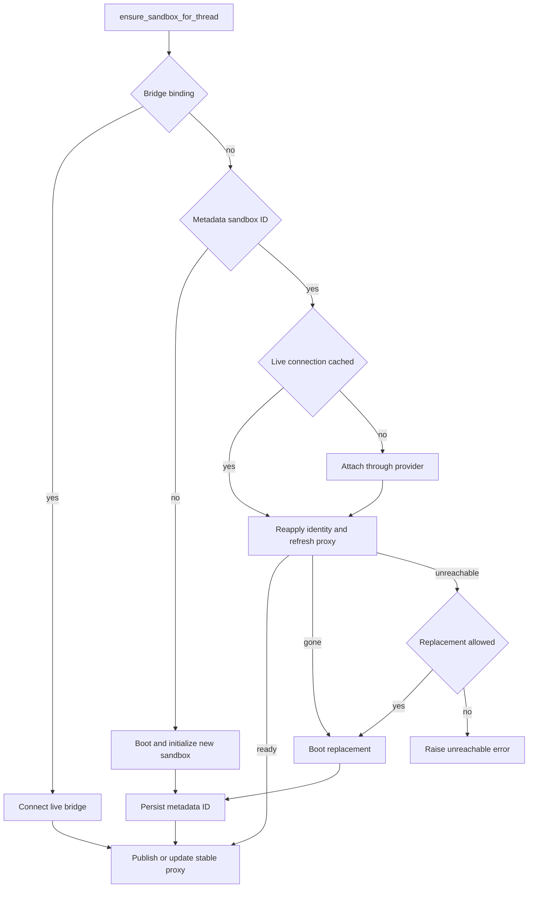

# Per-Thread Sandbox Lifecycle

A sandbox is the mutable execution environment for a thread: it can retain checkouts and uncommitted work across runs. The lifecycle separates the durable binding from worker-local connections so a run can resume after a worker restart without treating a temporary connection failure as permission to discard a working tree.

Related: [Agent graph](agent-graph.md), [Threads and state](../concepts/threads-and-state.md), [Auth and security](../concepts/auth-and-security.md), and [Sandbox providers](../integrations/sandbox-providers.md).

## Binding, cache, and stable handles

`thread.metadata["sandbox_id"]` is the authoritative durable binding. Sandbox metadata is read from the **live** LangGraph thread, not from a run configuration: a queued run can carry the ID from before a deliberate rebind. Failure to read metadata propagates rather than being interpreted as an unbound thread, which prevents overwriting the real binding with a new sandbox.

Two worker-local maps complement that durable record:

- `SANDBOX_CONNECTIONS` maps sandbox ID to a live provider connection. It is keyed by sandbox rather than thread, so a thread rebound elsewhere cannot accidentally receive its former box.
- `SANDBOX_BACKENDS` maps thread ID to a stable `SandboxBackendProxy`. `set_sandbox_backend` updates an existing proxy's target rather than replacing the proxy object; middleware and tools that already hold the handle therefore follow a successful handoff.

`SandboxBackendProxy` is deliberately async-only: synchronous operations raise `NotImplementedError`, while `a*` operations resolve the current target and delegate. On a cache miss it starts its registered reconnect callback, or, when no callback is installed, looks up the durable ID and invokes `create_sandbox(id)`. A lock and shared startup task collapse concurrent callers into one reconnect; `asyncio.shield` means cancellation of one waiter does not cancel that shared work. A failed startup is cleared so a later operation can retry.

The proxy subclasses `BaseSandbox`, rather than merely implementing the backend protocol. That preserves filesystem middleware's capture-at-source/offload path and its in-sandbox output limit. If a provider does not implement `aexecute_with_offload`, the proxy reports `offloaded=False` and performs ordinary async execution instead.

## Hosted provisioning and initialization

`create_sandbox` is the provider-neutral create-or-attach boundary. `SANDBOX_TYPE` selects a lazily imported factory for `langsmith`, `daytona`, `modal`, `runloop`, `e2b`, or `local`; unsupported values fail explicitly. LangSmith alone receives snapshot, resource, and arbitrary create-parameter overrides. Async factories are awaited; synchronous provider wrappers run in `asyncio.to_thread`. Startup validation imports optional providers early and validates the active LangSmith configuration, so missing extras or invalid settings fail at server boot rather than on the first thread.

`SandboxCreateConfig.resolve` loads a workspace unless the caller explicitly requests `source="base"`. A workspace supplies its ready snapshot, resource settings, and create parameters; without one, the sandbox uses the provider's base behavior. The owner preference may add `preserve_memory_on_stop`. After boot, the lifecycle configures Git identity and, for LangSmith, GitHub proxy access; it can also run a bounded, non-fatal workspace update script when the snapshot is stale and trigger a background snapshot update.

A local provider is not isolation: it executes on the host. Its setup uses a project-local `.gitconfig-sandbox` for Git configuration and deliberately removes model and provider API keys from the child environment.

## Bind, reconnect, replace, or fail

`ensure_sandbox_for_thread` is the normal hosted lifecycle entrypoint. It reads live metadata, narrows any requested GitHub repository scope to the thread's recorded scope, and then selects the existing connection, reconnects by durable ID, or creates a new sandbox. Reuse and reconnect reapply Git identity and refresh LangSmith proxy credentials. There is no preliminary ping: proxy refresh is itself the operation that establishes reachability.

```mermaid
flowchart TD
  Start["ensure_sandbox_for_thread"] --> Kind{"Bridge binding"}
  Kind -->|"yes"| Bridge["Connect live bridge"]
  Kind -->|"no"| Bound{"Metadata sandbox ID"}
  Bound -->|"no"| Create["Boot and initialize new sandbox"]
  Bound -->|"yes"| Cached{"Live connection cached"}
  Cached -->|"yes"| Refresh["Reapply identity and refresh proxy"]
  Cached -->|"no"| Attach["Attach through provider"]
  Attach --> Refresh
  Refresh -->|"ready"| Publish["Publish or update stable proxy"]
  Refresh -->|"gone"| Replace["Boot replacement"]
  Refresh -->|"unreachable"| Allowed{"Replacement allowed"}
  Allowed -->|"yes"| Replace
  Allowed -->|"no"| Failure["Raise unreachable error"]
  Create --> Bind["Persist metadata ID"]
  Replace --> Bind
  Bind --> Publish
  Bridge --> Publish
```

*The source-backed decision flow for hosted binding, reconnection, replacement, bridge attachment, and failure handling.*

For a newly created or replacement sandbox, initialization completes before `sandbox_id` (and, when present, base proxy configuration) is persisted. It is published to `SANDBOX_BACKENDS` only after that metadata update and tool-URL provisioning. Thus a failure during boot, initialization, or metadata persistence does not expose the new backend through a thread proxy; a later run will not adopt a half-initialized resource. Thread dispatch uses `multitask_strategy="interrupt"`, so this flow relies on dispatch rather than a cross-process `__creating__` sentinel to avoid concurrent provisioning.

### Deleted differs from unreachable

`SandboxGoneError` means the provider confirmed that the bound resource no longer exists. It is always replaced: its stale metadata would otherwise make all future runs reconnect to a resource that cannot hold work.

`SandboxUnreachableError` means this run could not attach to or reconfigure a potentially existing sandbox. It normally fails the run rather than replacing the box, because the unavailable filesystem may contain the thread's only uncommitted working tree. If replacement was selected—always for gone boxes, or with `allow_replacement=True`—and creation then fails, the lifecycle normalizes that failure to `SandboxUnreachableError`.

The reviewer is the intentional exception. Its repository is re-derived on every run: preparation clone-or-fetches, fetches relevant base and head commits, force-checks out the requested PR head, and verifies `HEAD`. Consequently reviewer calls may permit replacement of an unreachable sandbox. Trusted reviewer skills are extracted from the base reference into `.review-skills` outside the PR checkout, never from attacker-controlled PR-head content.

## LangSmith proxy credentials and refresh

For LangSmith, GitHub credentials are configured as proxy rules rather than written to the sandbox. `api.github.com` receives an opaque `Authorization: Bearer` header and `github.com`/`*.github.com` receive Basic authentication for `x-access-token:<token>`. The sandbox only receives the `GH_TOKEN` placeholder required by `gh`.

The configuration starts from a base proxy configuration, removes stale managed rules, adds current GitHub and per-thread tool rules, and preserves unrelated custom rules. Proxy PATCH requests retry configured transport and HTTP failures; when a configuration patch reports the sandbox is not ready, the provider best-effort starts it and retries. A stopped sandbox is not deleted: starting it preserves its filesystem.

Per-thread, worker-local token records include expiry time, recording time, repository scope, permission scope, workspace, and base proxy configuration. Before each model call, middleware refreshes a LangSmith proxy token within five minutes of known expiry, or after 50 minutes if expiry is unknown. A refresh preserves the recorded scope (or intersects a supplied repository request with it), preventing routine rotation from broadening access; refresh failures are logged and do not block the model call.

## Explicit recreation

`recreate_sandbox_for_thread` requires an existing non-bridge binding. It best-effort stops the old sandbox for up to ten seconds when using LangSmith, but continues even if stopping is unsupported, fails, or times out. It creates a distinct fresh sandbox, configures identity, persists the new metadata (and proxy base configuration when present), then replaces the cached proxy target and provisions the tool URL. Metadata persistence before the handoff means a failed update leaves the old target attached to the stable proxy. The old provider resource is not deleted by this operation.

A bridged thread cannot be recreated into a cloud sandbox; attempting it fails explicitly.

## Local-machine bridge bindings

A `sandbox_id` with the bridge prefix names the user's machine rather than a hosted provider resource. `ensure_sandbox_for_thread` recognizes it and connects a `BridgeSandboxBackend`, skipping hosted boot, proxy configuration, and global Git identity changes. A disconnected bridge fails as unreachable and is never replaced.

The bridge backend is async-only and turns execute, upload, and download calls into queued requests for the CLI long poll. It subscribes before enqueueing so a notification cannot be missed in the enqueue gap, checks liveness while waiting, and turns unavailable bridge-store conditions into `SandboxUnreachableError`. Bridge requests live in Postgres and move `pending -> claimed -> done | failed`; row locking and conditional completion ensure no two CLI claimers run the same request and that a request is completed at most once. Heartbeat expiry closes a bridge and fails pending requests rather than leaving a run waiting indefinitely.

## Portable repository paths and focused tests

Provider filesystems do not share one root. `resolve_sandbox_work_dir` tries exposed provider work directories, shell `pwd`, provider home/root paths, and shell `$HOME`, accepting only existing writable directories and caching the winner on the backend. `resolve_repo_dir` then appends a non-empty repository name; `resolve_checkout_dir` also recognizes an older `$HOME/<repo>` checkout.

Focused tests cover one-time proxy lazy reconnect, cancellation-safe startup and retry after a failed startup, reconnecting from current rather than stale run metadata, fresh creation without a sentinel, and recreation ordering that preserves the old proxy target until metadata persists. These tests protect the lifecycle's core invariant: durable thread metadata and the live stable proxy must never silently point at different, partially initialized sandboxes.
