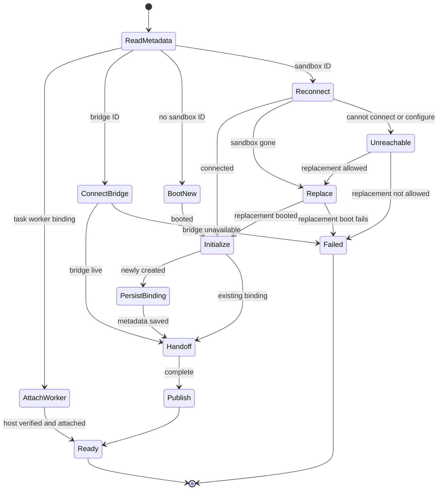

# Sandbox and backend lifecycle

A thread normally has one durable sandbox binding. It holds the checkout and uncommitted working tree between runs, so lifecycle code treats accidental replacement as data loss rather than routine availability recovery. The durable binding is thread metadata; live backend objects are deliberately process-local.

Related: [Agent graph](agent-graph.md), [Persistence, workspaces, and tasks](persistence-workspaces-and-tasks.md), [Local bridge and remote runtime](../integrations/local-bridge-and-remote-runtime.md), and [Sandbox providers](../integrations/sandbox-providers.md).

## Identity, cache, and stable handles

`thread.metadata["sandbox_id"]` is authoritative and is always read from the live thread, not a queued run configuration: a queued run can name the sandbox that a later rebind left. A metadata lookup failure propagates rather than being interpreted as an unbound thread, avoiding an overwrite of a real binding.

Two in-memory maps complement that durable ID:

- `SANDBOX_CONNECTIONS` maps sandbox ID to a live provider connection. It is keyed by sandbox rather than thread, so a thread rebound elsewhere cannot receive the connection it left behind.
- `SANDBOX_BACKENDS` maps thread ID to a stable `SandboxBackendProxy`. Publishing a replacement swaps the proxy's target and removes a prior connection when its ID differs, so tools and middleware retaining the proxy do not retain an obsolete backend.

The proxy is async-only and subclasses `BaseSandbox`, preserving capture-at-source behavior for filesystem tooling. Every async operation resolves its current target. A missing target invokes a registered reconnect callback, or obtains the metadata ID and calls `connect_sandbox`; a lock and one shared startup task collapse concurrent callers to one reconnect. Awaiters shield that task, so cancelling one waiter does not cancel startup for the others. A failed startup is cleared and can be retried. `aexecute_with_offload` delegates when available and otherwise returns an ordinary-execution result.

## Provisioning inputs and provider boundary

`create_sandbox` is the provider-neutral create-or-reconnect boundary, selected by `SANDBOX_TYPE`. The registry lazily imports `langsmith`, `daytona`, `modal`, `runloop`, `e2b`, or `local`; optional providers produce an actionable missing-extra error. LangSmith alone receives snapshot, resource, and arbitrary create-body options. Native async factories are awaited and synchronous wrappers run in `asyncio.to_thread`. Startup validation eagerly checks optional extras and LangSmith configuration so deployment errors appear at server boot.

`SandboxCreateConfig.resolve` loads the requested workspace (or, for `source="base"`, deliberately skips workspace lookup). A workspace that inherits the default sandbox uses the default workspace's ready snapshot, resources, and create parameters. Without a ready workspace snapshot, the provider uses its base snapshot. An owner preference can add `preserve_memory_on_stop`; a preference-read failure only logs a warning and does not block boot. After each boot, an asynchronous workspace-update trigger may start; when requested, lifecycle records that a stale workspace snapshot was used so the caller can report it.

For a new managed sandbox, initialization overlaps the bot `git config --global` write with LangSmith proxy configuration: both need the box, but identity does not need proxy credentials. Identity is reapplied on reuse because global configuration can disappear. For the local provider, commands run directly on the host without isolation; it scopes global Git configuration to `.gitconfig-sandbox` and removes model and provider API keys from the child environment.

## Acquisition and publication

`ensure_sandbox_for_thread` is the normal entrypoint. Dispatch uses `multitask_strategy="interrupt"`, so one thread does not provision twice concurrently and the lifecycle does not use a cross-process creation sentinel. It narrows any requested GitHub repository list to the immutable per-thread scope before obtaining credentials.

```mermaid
stateDiagram-v2
  [*] --> ReadMetadata
  ReadMetadata --> AttachWorker: task worker binding
  ReadMetadata --> ConnectBridge: bridge ID
  ReadMetadata --> BootNew: no sandbox ID
  ReadMetadata --> Reconnect: sandbox ID
  Reconnect --> Initialize: connected
  Reconnect --> Replace: sandbox gone
  Reconnect --> Unreachable: cannot connect or configure
  Unreachable --> Replace: replacement allowed
  Unreachable --> Failed: replacement not allowed
  ConnectBridge --> Handoff: bridge live
  ConnectBridge --> Failed: bridge unavailable
  BootNew --> Initialize: booted
  Replace --> Initialize: replacement booted
  Initialize --> PersistBinding: newly created
  Initialize --> Handoff: existing binding
  PersistBinding --> Handoff: metadata saved
  Handoff --> Publish: complete
  Publish --> Ready
  AttachWorker --> Ready: host verified and attached
  Replace --> Failed: replacement boot fails
  Ready --> [*]
  Failed --> [*]
```

*Source-grounded lifecycle for creation, attachment, recreation, and failure handling.*

For a normal remote ID, the entrypoint uses a cached connection for that exact ID or reconnects via the provider, then refreshes proxy credentials. A new or replacement sandbox is created and fully initialized before its `sandbox_id` and recorded base proxy configuration are persisted. Handoff and tool-URL provisioning occur before `set_sandbox_backend` publishes the target. Consequently a creation, initialization, or metadata-write failure does not expose the new box through the thread proxy.

A `bridge:` ID is different: it is the user machine, not a provider resource. Lifecycle connects a live `BridgeSandboxBackend`, completes any pending checkout handoff, and publishes it without booting a cloud sandbox, proxying GitHub, or rewriting the user's global Git identity. The bridge backend turns execute and file operations into queued CLI requests and checks liveness while awaiting a response; a disconnected bridge is unreachable and is never silently replaced.

## Recovery policy and explicit recreation

`SandboxGoneError` means the provider confirms that the bound resource no longer exists, so lifecycle always creates and binds a replacement. `SandboxUnreachableError` means this run cannot connect or configure the existing box; it may recover next run and may contain the only uncommitted work. The default is therefore to fail the run with the old binding intact. If a permitted replacement itself fails, its failure is normalized to `SandboxUnreachableError`.

`allow_replacement=True` is for the read-only reviewer, whose checkout is re-derived each run. `prepare_review_repo` clones or fetches, fetches PR/base references, force-checks out the requested PR head, and verifies `HEAD`; a prep failure returns `False` rather than making the sandbox unusable. Reviewer skills are extracted from a trusted base reference to `.review-skills` outside the PR checkout, never from attacker-controlled PR-head content.

`recreate_sandbox_for_thread` is the deliberate replacement operation. It refuses task-worker and bridge bindings, attempts to stop the old LangSmith sandbox with a ten-second bound, then creates a distinct new sandbox. It configures identity, persists the new ID and proxy base configuration, and only then swaps the stable proxy target and provisions its tool URL. Metadata failure retains the old target. A stop failure does not undo a successful rebind: the operation raises `SandboxRecreationStopError` containing both IDs so an operator can address the old resource.

## Shared task sandboxes and checkout handoff

A task worker never creates or replaces its own sandbox. It validates that its recorded host is the task coordinator and that task, owner, workspace, admin/visibility properties, and repository authorization are compatible. It then ensures the coordinator's existing sandbox, verifies that its binding did not change during attachment, records the host ID in worker metadata, and publishes that same backend under the worker's proxy. Workers cannot attach when their allowed repository scope would be narrower than the host's scope.

Changing a thread between cloud and local workspaces can set `sandbox_handoff_from`. Before publishing a new target, `complete_handoff` connects to that source and moves the checkout once. It packs the source branch, unpushed commits, and uncommitted index/worktree changes into a temporary Git bundle while leaving the source tree unchanged; the target fetches `origin`, restores the branch and changes, and then the marker is cleared. A missing repository metadata record simply clears the marker without transfer.

## Credentials and repository locations

GitHub proxy configuration is LangSmith-only. Lifecycle obtains a workspace token scoped to the narrowed repository list and configures opaque proxy rules: `api.github.com` gets a Bearer header, while `github.com` and `*.github.com` get Basic authentication for `x-access-token:<token>`. `GH_TOKEN` inside the sandbox is only a placeholder needed by `gh`; the real token is not placed in its environment.

The provider starts with a workspace base proxy configuration, replaces managed GitHub and tool rules, and preserves unrelated custom rules. Proxy PATCH calls retry transport and selected status failures; a not-ready response triggers a best-effort sandbox start before retrying. Token expiry, repository scope, workspace, and base configuration are recorded per thread for future refreshes.

Sandbox filesystem roots vary by provider. `resolve_sandbox_work_dir` tries provider work-directory methods, shell `pwd`, provider home/root methods, and shell `$HOME`, accepting only a writable directory and caching the winner. Repository resolution appends a repository name except on a bridge, where the bridged work directory is already the user's checkout; checkout lookup also supports legacy `$HOME/<repo>` locations.

## Desktop alternative and focused verification

A desktop run bypasses this remote lifecycle and uses a `LocalShellBackend` rooted in either an allowlisted project or a desktop-created worktree. Desktop artifact routes put large results, conversation history, and blobs outside that project so they are not collected by `git add -A`.

Focused sandbox tests cover lazy reconnection and cancellation, no publication before successful initialization, stale metadata/cache safety, gone-versus-unreachable recovery, recreation ordering, shared-task authorization, checkout handoff including unpushed and uncommitted changes, provider routing, workspace snapshot selection, proxy behavior, portable paths, and reviewer checkout/skill isolation.
