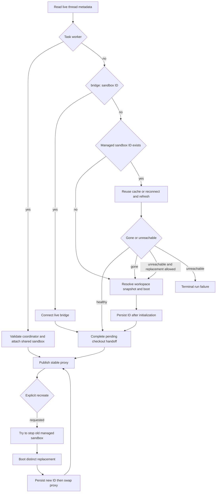

# Sandbox and Local Execution Lifecycle

A thread normally has one durable execution binding: `thread.metadata["sandbox_id"]` names the backend that retains its checkout and uncommitted working tree across runs. The binding is intentionally split from the process-local handles used during a run. This lets another worker reconnect after a restart without publishing a newly booted or only partly configured backend.

There are three forms of execution environment:

- **Managed sandbox** — a provider-created backend, normally seeded from a workspace snapshot and configured with GitHub and tool access.
- **Shared task sandbox** — a task worker attaches to its coordinator's existing sandbox after validating task, owner, workspace, visibility, and repository-scope compatibility; workers never create or replace the shared box themselves.
- **Bridge sandbox** — `sandbox_id` with the `bridge:` prefix represents the user's machine running the CLI or desktop application. It is a durable thread binding but not a provider resource, so it is never silently replaced by a cloud sandbox.

Related: [Agent graph](agent-graph.md), [Threads and state](../concepts/threads-and-state.md), [Sandbox providers](../integrations/sandbox-providers.md), and [Configuration](../operations/configuration.md).

## Durable binding and worker-local handles

`get_sandbox_metadata` always reads the live thread rather than run configuration. A queued run can carry pre-rebind metadata, so using it could reconnect to the sandbox the thread has already left. `sandbox_id` is consequently the durable source of truth.

`SANDBOX_BACKENDS` maps a thread ID to a stable `SandboxBackendProxy`; `SANDBOX_CONNECTIONS` maps a sandbox ID to a live backend connection. Both are worker-local caches. Publishing a new backend through `set_sandbox_backend` preserves an existing proxy and replaces its target, allowing tools and middleware holding the proxy to observe the rebind. It also removes an obsolete connection entry when the target ID changes.

The proxy is async-only. Its synchronous methods raise `NotImplementedError`; each `a*` operation resolves the target and delegates. If no target is ready, it uses a run-provided reconnect callback or reads the live `sandbox_id` and calls `connect_sandbox`. A per-proxy lock and one startup task coalesce concurrent callers, while `asyncio.shield` prevents cancellation of one waiter from cancelling the shared connection attempt. Failed startup is cleared so a later call can retry.

The proxy subclasses `BaseSandbox`, not merely the backend protocol. This retains the filesystem middleware's capture-at-source/offload behavior; `aexecute_with_offload` delegates when supported and otherwise returns a normal-execution result.

## Lifecycle decisions

`ensure_sandbox_for_thread` is the managed lifecycle entrypoint. It reads thread metadata, narrows any requested GitHub repositories to the immutable scope recorded for that thread, and follows the appropriate binding branch. Normal dispatch uses `multitask_strategy="interrupt"`, so the code relies on per-thread interruption rather than a cross-process “creating” sentinel.

```mermaid
flowchart TD
  Start["Read live thread metadata"] --> Task{"Task worker"}
  Task -->|"yes"| Attach["Validate coordinator and attach shared sandbox"]
  Task -->|"no"| Bridge{"bridge: sandbox ID"}
  Bridge -->|"yes"| ConnectBridge["Connect live bridge"]
  Bridge -->|"no"| Bound{"Managed sandbox ID exists"}
  Bound -->|"no"| Create["Resolve workspace snapshot and boot"]
  Bound -->|"yes"| Reconnect["Reuse cache or reconnect and refresh"]
  Reconnect --> Health{"Gone or unreachable"}
  Health -->|"healthy"| Handoff["Complete pending checkout handoff"]
  Health -->|"gone"| Create
  Health -->|"unreachable and replacement allowed"| Create
  Health -->|"unreachable"| Fail["Terminal run failure"]
  Create --> Bind["Persist ID after initialization"]
  Bind --> Handoff
  Attach --> Ready["Publish stable proxy"]
  ConnectBridge --> Handoff
  Handoff --> Ready
  Ready --> Recreate{"Explicit recreate"}
  Recreate -->|"requested"| StopOld["Try to stop old managed sandbox"]
  StopOld --> NewBox["Boot distinct replacement"]
  NewBox --> Rebind["Persist new ID then swap proxy"]
  Rebind --> Ready
```

*Thread acquisition includes shared attachment, managed creation or reconnection, a one-time checkout handoff, deliberate recreation, and terminal unreachable behavior.*

For a new managed sandbox, `SandboxCreateConfig.resolve` loads the selected workspace (or the default workspace when no slug is supplied), respects `inherit_default_sandbox`, and carries its ready snapshot, resource settings, and provider creation parameters into provisioning. Choosing `source="base"` skips workspace lookup entirely. An owner preference can add `preserve_memory_on_stop`; inability to read that preference does not prevent a boot. A stale workspace snapshot can still be used for the current boot while a background update is triggered.

`create_sandbox` selects a lazily imported factory from `SANDBOX_TYPE`: `langsmith`, `daytona`, `modal`, `runloop`, `e2b`, or `local`. LangSmith alone receives snapshot, sizing, and create-body options; coroutine factories are awaited and synchronous wrappers are offloaded to a thread. Optional third-party providers require their matching dependency extra and are checked at startup. LangSmith configuration validation also runs at startup, checking numeric capacity and retention values and extra create JSON rather than waiting until first use.

A new ID is written to thread metadata only after the box has booted and received initialization such as Git identity and proxy configuration. The backend is published only after metadata binding, handoff, and tool provisioning succeed. Therefore a failure in those stages does not expose the new backend through the thread proxy or bind a half-initialized box.

## Recovery preserves work

A missing provider resource is different from a bad connection:

- `SandboxGoneError` means the provider confirmed that the sandbox no longer exists. The lifecycle creates a replacement, because the old ID cannot recover and no longer holds work.
- `SandboxUnreachableError` means the bound sandbox could not be contacted or reconfigured during this run. Normal agent threads fail the run instead of switching to an empty box that would lose their only uncommitted work. If a chosen replacement itself fails to boot, the error is normalized to `SandboxUnreachableError`.
- The reviewer passes `allow_replacement=True`. Its checkout is deterministically re-prepared for every review run, and reviewer threads persist for a PR across pushes, so refusing to replace an unreachable reviewer sandbox would permanently block the PR.
- `require_existing=True`, used while a task worker attaches to its coordinator, prohibits creation or recovery until the host is available.

The LangSmith command retry policy is narrower still. It retries only `SandboxRetryableConnectionError`, which represents a rejected WebSocket upgrade before the command frame was sent; commands that might have run are not retried. Retry is bounded to four attempts with exponential jitter.

## Credentials, identity, and in-sandbox tool access

Managed LangSmith sandboxes receive GitHub access through proxy rules, not a real token in their filesystem. The proxy adds `Authorization: Bearer` for `api.github.com` and Basic authentication for `github.com` and `*.github.com`; `GH_TOKEN` is only the `proxy-injected` placeholder required by `gh`. Base proxy configuration is retained while managed credential and tool rules are rebuilt. A retryable configuration failure is retried; a not-ready response causes a best-effort start and retry, because a stopped sandbox retains its filesystem.

The lifecycle reapplies the Open SWE bot's global Git identity every run. It performs that write concurrently with proxy configuration, because both require the sandbox but identity does not require proxy credentials. For non-LangSmith backends, successful publication provisions a per-thread tool capability URL in `/tmp/open-swe-tools-url`; the token is tied to the host thread and sandbox ID, and is rejected if metadata no longer names that sandbox.

## Explicit recreation and provider-local development

The `recreate_sandbox` tool creates a deliberate fresh binding. Task workers and bridge-bound threads cannot use it. For a managed box, recreation first tries to stop the old LangSmith sandbox with a ten-second limit, then creates and configures a distinct new box. It persists the new metadata before swapping the cached proxy target. If stopping the old sandbox failed, the rebind still succeeds and the tool returns a successful result that reports the stop error; if metadata persistence fails, the old proxy target remains intact.

The provider-local `SANDBOX_TYPE=local` mode is only for human-in-the-loop development: it executes directly on the host without isolation. It sets `GIT_CONFIG_GLOBAL` to a root-local `.gitconfig-sandbox` (including the developer configuration when present), so lifecycle identity writes do not overwrite the developer's global Git identity. Its explicit child environment excludes model and provider API keys.

Sandbox repository roots are provider-portable. The resolver tries provider work-directory methods, shell `pwd`, provider home/root methods, then shell `$HOME`, verifies a writable directory, and caches the first success. A bridged backend is special: its work directory is already the user's checkout, so repository resolution does not append the repository name. Reviewer preparation clone-or-fetches, force-checks out, and verifies the requested PR head; trusted skills are extracted from the base reference outside the PR checkout so PR-head content cannot inject skills.

## Checkout and desktop handoff

A thread can move between cloud and a user's bridge only when it is stopped; moving to a bridge is restricted to the owner's private thread. Metadata records the target binding and `sandbox_handoff_from`. At the beginning of the next run, `complete_handoff` connects to that source, packages the source branch, unpushed commits, and uncommitted changes into a temporary Git bundle, and restores it into the target checkout. It fetches `origin` on both sides so already-pushed commits are not transferred. The marker is cleared only after the target restoration path completes. When moving to cloud, a disconnected bridge source is discarded and the cloud run starts from pushed state rather than waiting for an unavailable machine.

A bridge is a Postgres-backed request queue between graph workers and a CLI or desktop long poll. It is live only while heartbeats are recent. Requests transition `pending → claimed → done | failed`; database claiming uses `FOR UPDATE SKIP LOCKED`, and completion is conditional on not already being finished, so a request is answered at most once. The backend subscribes before enqueueing and checks liveness every 15 seconds while waiting. A closed or stale bridge fails pending requests and is surfaced as `SandboxUnreachableError`, never replaced.

`BridgeSandboxBackend` supports asynchronous execute and file transfer round trips, plus desktop worktree handoff. The desktop handoff tool is available only for bridge-backed threads; it asks the application to move the checkout and clears cached work-directory paths whether the answer succeeds or fails. A timeout warns that the move may have happened and tells the user to verify `pwd` and `git branch --show-current` before continuing.

There is also a separate desktop-run path. A run whose source is `desktop` builds a `LocalShellBackend` directly for an allowlisted project or for a worktree under `OPEN_SWE_LOCAL_WORKTREES_DIR`; it does not use the remote thread-sandbox lifecycle. Its shell receives only a small allowlist of host environment values. Artifact routes for large results, conversation history, and blobs are placed outside the project (in `OPEN_SWE_LOCAL_ARTIFACTS_DIR` or a per-user temporary directory) so they cannot be swept into `git add -A`.

## Focused verification and operations

Focused tests cover proxy reconnection coalescing, cancellation and retry behavior, recreation ordering, non-distinct provider IDs, task-worker restrictions, and workspace/base source resolution. Operators should select a provider through `SANDBOX_TYPE`, install the optional extra for a third-party provider, and treat local mode as host code execution. Bridge operation additionally requires PostgreSQL; bridge API calls are owner-scoped, reopening refuses a bridge still served by another CLI process, and a reconnect requeues previously claimed but unanswered requests.
