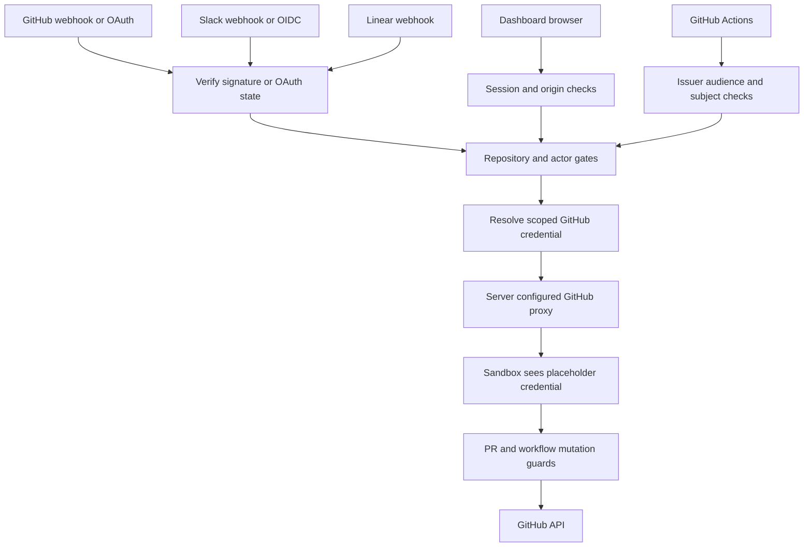

# Authorization, credentials, and safety controls

Open SWE handles powerful credentials and executes actions that can change repositories, CI, and third-party systems. Its controls therefore layer authentication of inbound data, authorization of the actor and target, constrained credential delivery, and approval of particularly sensitive mutations. Configure the allowlists and secrets described here for production; do not place credential values in prompts, repository files, or sandbox environment variables. See also [sandbox lifecycle](../architecture/sandbox-lifecycle.md), [tools](./tools.md), [dashboard UI](../integrations/dashboard-ui.md), [configuration](../operations/configuration.md), and [invocation](../workflows/invocation.md).

## Trust boundaries

This diagram shows the control points from external input through sandboxed work to a GitHub mutation.

## Inbound requests and repository gates

All three public integration routes read the **raw** request body before parsing it and reject an invalid signature with HTTP 401. GitHub uses `sha256=HMAC(GITHUB_WEBHOOK_SECRET, body)` and `X-Hub-Signature-256`; Slack validates its `v0:timestamp:body` HMAC and rejects timestamps more than 300 seconds away; Linear compares a raw-body HMAC-SHA256 with `Linear-Signature`. Each verifier fails closed when its secret is unset. The separate public `/webhooks/run-complete` route also fails closed: its query token must constant-time match `RUN_COMPLETE_WEBHOOK_SECRET`, otherwise completion processing and failure replies remain disabled.

Authentication does not itself authorize a target. Webhook repository selection accepts a repository when no repository/org restriction is configured, or when its owner is in `ALLOWED_GITHUB_ORGS` or its normalized `owner/name` is in `ALLOWED_GITHUB_REPOS`. Treat the unconfigured case as a compatibility default, not a production boundary: set one or both restrictions to confine agents to intended repositories.

`PUBLIC_REPO_ORG_GATE` adds an actor control for public GitHub repositories. When enabled, a trigger is accepted only for private repositories, known internal bot logins, or a sender who is an active member of that organization. Membership checks use a GitHub App token with `members: read` and treat missing installation/token, API errors, non-200 responses, malformed responses, and inactive memberships as denial. This requires the App's Organization Members read permission.

## GitHub credentials: user attribution and App fallback

`resolve_github_token` first tries the dashboard's per-user OAuth record for `slack`, `linear`, `dashboard`, and `schedule` runs that carry a `github_login`. That preference remains in effect in bot-token-only mode so PRs and comments can be attributed to the triggering user. If no valid user token is available, interactive mode raises `GitHubUserAuthRequired` rather than silently acting as a bot; bot-token-only mode instead falls back to a GitHub App installation token. That mode is enabled when `LANGSMITH_API_KEY` is set but neither `X_SERVICE_AUTH_JWT_SECRET` nor `USER_ID_API_KEY_MAP` enables per-user LangSmith resolution.

The deployment should grant the GitHub App only the repositories and permissions it needs. Installation tokens are minted by signing a short-lived RS256 App JWT and exchanging it with GitHub. Their in-process cache key includes installation, repository IDs/names, and requested permissions, preventing reuse across a broader scope; entries are reused only until ten minutes before expiry.

Resolved run tokens are also memory-only. Their `(thread_id, principal)` cache key isolates normalized `login:`/`email:` user identities and the distinct bot principal; an unbound user token is refused. Entries expire at the credential expiry with a 60-second skew or a hard 24-hour cap, and a detected stale/revoked token invalidates every cached token for that thread.

For LangSmith sandboxes, the real GitHub credential is configured in a server-side proxy that injects `Authorization` headers for `api.github.com` and `github.com`; the sandbox gets a placeholder `GH_TOKEN`, not the secret. Proxy refresh preserves the original repository and permission scope, refreshes within five minutes of expiry (or after a 50-minute fallback lifetime), and reconfigures only a recorded LangSmith sandbox.

## Dashboard, desktop, and CI identities

### Browser sessions and OAuth

The dashboard signs seven-day HS256 session JWTs with `DASHBOARD_JWT_SECRET` and stores them in the `HttpOnly` `osw_session` cookie. `require_session` rejects absent or invalid cookies. HTTPS `DASHBOARD_API_BASE_URL` yields `Secure; SameSite=None` session cookies for cross-origin deployment; local HTTP uses non-secure `SameSite=Lax`.

GitHub login binds its callback to the browser: `/auth/login` stores a random nonce in an `HttpOnly`, auth-path-scoped state cookie and its HMAC in a signed, ten-minute state JWT. `/auth/callback` constant-time compares them before exchanging the code, resolving the GitHub user, applying the organization gate, persisting OAuth tokens, and issuing a session. Post-login destinations are restricted to safe relative paths or origins in `DASHBOARD_BASE_URL` plus `DASHBOARD_ALLOWED_ORIGINS`; login/API callback paths, protocol-relative URLs, and unlisted origins fall back to the base URL.

`ALLOWED_GITHUB_ORGS` is a shared dashboard-login allowlist. A nonempty list admits only active members of at least one listed organization and fails closed on membership/token/API errors. An empty list intentionally permits any GitHub account for compatibility, but logs once per process that all logged-in users can read surfaced threads; production deployments should configure it.

Cookie-authenticated mutations require an allowed `Origin` or `Referer` when dashboard origins are configured. Safe methods are exempt, as is a request with only an explicit GitHub bearer token and no session cookie, because a browser cannot forge that header. No configured dashboard origin makes this CSRF check a local-development fail-open; credentialed CORS is enabled only for explicit origins and rejects `*`.

### Desktop and Slack identity linking

Desktop login uses PKCE rather than delivering a session to the loopback listener. The browser returns a short-lived handoff JWT containing identity and the application's S256 challenge; only the desktop holder of the matching verifier can redeem it for the session. The callback host/path are fixed to `127.0.0.1/callback`; only a bounded port is accepted. Cloud-terminal tickets are independently limited to 60 seconds and validated for both a fixed audience and the requested `thread_id`.

A desktop run may access only a real directory that is either listed in `OPEN_SWE_LOCAL_PROJECTS_FILE` or contained in `OPEN_SWE_LOCAL_WORKTREES_DIR`, after realpath resolution. `LocalShellBackend` receives a minimal shell environment rather than arbitrary process secrets. Agent scratch routes for large results and conversation history are moved outside the project and sanitize the thread identifier, reducing accidental inclusion in `git add -A` and traversal risk.

Slack-to-GitHub mapping is initiated by an already authenticated dashboard user and obtains the Slack member ID and email from Slack OIDC (`openid email profile`), not caller-supplied fields. The callback requires a verified email and, when `SLACK_TEAM_ID` is set, rejects another workspace including Slack Connect identities. Authentication-failure prompts in shared Slack threads contain only the token-free `build_settings_url()`; they must never publish a per-user authorization URL that another participant could complete.

### Administrative automation

Admin status matches email or login case-insensitively against `CONFIGURED_ADMINS`, and admin tools re-check the triggering `RunConfig` identity at invocation time rather than trusting thread metadata. Selected admin endpoints can additionally use a GitHub personal access token, resolved through GitHub `/user`, or GitHub Actions OIDC. The latter path is off until `ADMIN_OIDC_SUBJECTS` has an entry, verifies a GitHub-issued RS256 token against JWKS, issuer, expiry, and `ADMIN_OIDC_AUDIENCE` (default `open-swe`), then permits only an exact `sub` or an allowlisted `owner/repo`. An allowlisted repository grants its workflows this power, so restrict it to internal repositories and refs where necessary.

## Credential persistence and dashboard repository access

Tokens persisted in dashboard stores are encrypted before storage with `MultiFernet`. `TOKEN_ENCRYPTION_KEY` may hold one key or a most-recent-first comma/newline list: encryption uses the first key and decryption tries every key, supporting rotation. Invalid ciphertext or a missing key causes `decrypt_token` to return an empty string rather than leak or raise. GitHub access and refresh tokens use this storage; permanently unrecoverable refresh errors (`bad_refresh_token`, `unauthorized_client`) delete the authorization and require clean login.

Dashboard operations that name a repository call `require_repo_access_for_user`: it obtains the signed-in user's OAuth token and checks `GET /repos/{owner}/{repo}`. A 401 triggers one forced refresh/retry; unavailable/expired tokens produce re-login errors, 403/404 deny the target, and other statuses surface as an upstream error. This is a per-user access check, separate from webhook allowlists and App installation scope.

## Mutation safeguards

The agent assembly installs two complementary middleware controls around shell tools:

- `PullRequestCreationGuardMiddleware` blocks `execute` and `background_execute` fallbacks that create PRs through `gh pr create`, GitHub `/pulls` API calls, `curl`, or nested shells. It returns a non-recoverable error instructing the agent to use `open_pull_request`, preserving user attribution rather than masking a failed attributed creation. It is omitted only for local runs.
- `WorkflowPushGuardMiddleware` inspects a narrowly parsed standalone `git push origin` command and compares the actual outgoing ref against `.github/workflows/` changes. Before an unapproved push it stores a pending record on thread metadata containing a SHA-256 fingerprint of repository/ref/diff data, a bounded diff preview and statistics, and optionally sends a Slack approval prompt. Approval permits only the fixed commit-to-branch command for that exact fingerprint; a modified workflow produces a new fingerprint and another approval. Rejected or persistence-error states remain blocked. The web approval API is session- and same-origin-protected and records the approving actor.

Workflow changes are sensitive because CI may gain access to repository secrets. A change inherited from a base-branch merge is labelled as inherited for review, but still requires confirmation before this agent pushes it.

## Verification focus

Focused tests cover OAuth redirect/state/PKCE controls and organization-gate outcomes, Slack OIDC workspace validation, Actions OIDC issuer/audience/signature/subject enforcement, bearer-token admin authentication, local-project and artifact confinement, PR fallback detection including nested shells, and workflow-push fingerprint/approval behavior. When extending any boundary, add tests for both the authorized path and the relevant fail-closed or explicit compatibility default.
