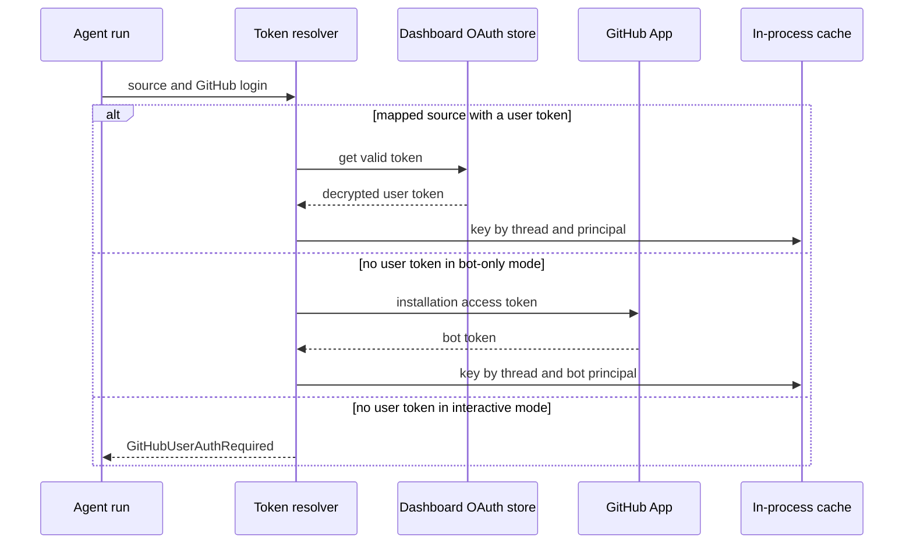
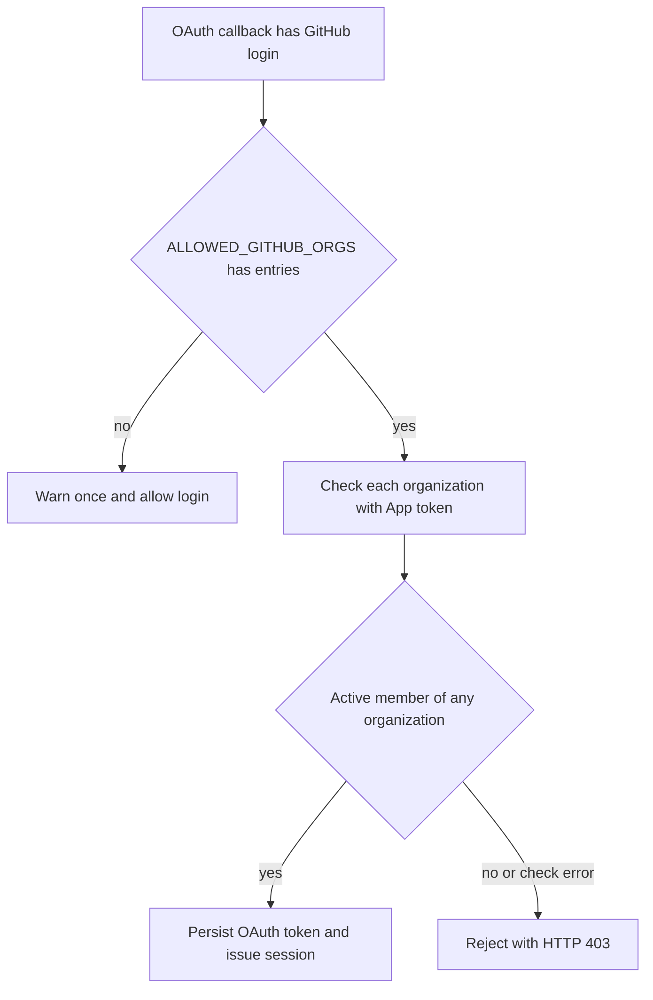

# Authentication, Authorization & Security Boundaries

Open SWE crosses several trust boundaries: it obtains a GitHub credential to act on a run, accepts externally delivered webhooks, authenticates dashboard and desktop users, stores third-party credentials, and exposes selected server-side tools. This page describes the boundary owners, defaults, and failure behavior. Related pages: [sandbox lifecycle](../architecture/sandbox-lifecycle.md), [threads and state](./threads-and-state.md), [tools](./tools.md), [dashboard UI](../integrations/dashboard-ui.md), [configuration](../operations/configuration.md), and [testing overview](../testing/overview.md).

## GitHub credentials for agent runs

`resolve_github_token` selects a token using the run source and deployment mode.

- For `slack`, `linear`, `dashboard`, and `schedule` runs carrying a `github_login`, it first retrieves that user's dashboard OAuth token. This preference applies even in bot-token-only mode, preserving attribution of PRs and comments to the triggering user.
- If that token is unavailable, **bot-token-only mode** may use a GitHub App installation token. In interactive mode, the same condition raises `GitHubUserAuthRequired`; it must prompt a re-authentication rather than silently acting as the bot.
- Bot-token-only mode means `LANGSMITH_API_KEY_PROD` is set while both `X_SERVICE_AUTH_JWT_SECRET` and `USER_ID_API_KEY_MAP` are absent. Without those per-user resolution facilities, git operations use the installation token unless the mapped dashboard token is available.

Token selection for a mapped, user-triggered run.

### Token lifetime and sandbox boundary

Resolved run tokens are process-memory-only cache entries keyed by `(thread_id, principal)`: normalized `login:` or `email:` principals keep users separate and a distinct bot principal keeps installation credentials separate. An unbound user token is not cached. Entries expire at token expiry minus 60 seconds or after 24 hours, whichever is earlier; a detected stale or revoked token clears the thread's cached entries.

GitHub App tokens are minted by signing a short-lived RS256 App JWT and exchanging it with GitHub. Their separate in-process cache is scoped by installation, repository IDs or names, and requested permissions. It reuses a token until ten minutes before expiry, leaving more time than the proxy refresh window to mint a fresh token.

The resolved credential is sent through the LangSmith GitHub proxy. Proxy rules put the actual credential in `Authorization` headers for `api.github.com` and `github.com`; the sandbox receives only a placeholder `GH_TOKEN`. A before-model middleware refreshes the proxy credential near expiry.

## Dashboard login and session boundary

The dashboard uses GitHub App OAuth and a seven-day HS256 session JWT signed with `DASHBOARD_JWT_SECRET` in the `osw_session` cookie. `require_session` rejects a missing or invalid cookie, and `/me` returns the signed-in identity and `is_admin`.

`GET /auth/login` creates a random nonce, stores its HMAC in the signed state JWT, places the raw nonce in an `osw_oauth_state` cookie, and redirects to GitHub. At `GET /auth/callback`, the server constant-time compares the cookie nonce's HMAC with the state claim, exchanges the OAuth code, resolves the GitHub account, applies the organization gate *before* persisting OAuth tokens and issuing a session, then redirects to the sanitized target.

The session and state cookies are `HttpOnly`. When `DASHBOARD_API_BASE_URL` is HTTPS, the session is `Secure; SameSite=None` for a separate dashboard origin; local HTTP uses non-secure `SameSite=Lax`. The OAuth state cookie is restricted to the auth path, is `SameSite=Lax`, and lives for the ten-minute state TTL.

Post-login redirect targets may be same-origin relative paths or an origin from `DASHBOARD_BASE_URL` plus `DASHBOARD_ALLOWED_ORIGINS`. `sanitize_redirect_to` rejects protocol-relative URLs, unknown origins, and login/API callback paths, falling back to the dashboard base URL.

### Organization login gate: an intentional fail-open compatibility default

`ALLOWED_GITHUB_ORGS` is a comma-separated, case-normalized shared allowlist for dashboard login and webhook-side organization gating. When configured, the dashboard admits only a user who is an **active** member of at least one listed organization. It resolves that organization's GitHub App installation and calls GitHub with an installation token scoped to `members: read`; an unavailable installation/token, HTTP failure, unexpected response, malformed response, inactive membership, or non-membership is a denial. The App therefore needs Organization Members read permission for this gate to work.

When `ALLOWED_GITHUB_ORGS` is unset, empty, or only blank entries, the dashboard gate is deliberately **fail-open** for compatibility: any GitHub account completing OAuth may log in. This is not silent. The process logs one warning stating that dashboard login is open and that every logged-in user can read all surfaced threads; set the allowlist in an organization deployment. The warning is cached once per process because the same gate also runs from thread tools. By contrast, once a nonempty allowlist is configured, membership/API failures and non-membership are **fail-closed** with HTTP 403.

Dashboard organization-gate behavior and its distinct unconfigured versus configured failure semantics.

### Cross-origin and CSRF controls

For configured dashboard origins, cookie-authenticated unsafe requests must pass `require_same_origin_for_mutations`: safe methods are exempt, while `Origin` or `Referer` must be an allowed dashboard origin, the request's base origin, or the desktop-app origin. A request using only an explicit bearer GitHub token and no session cookie is exempt because browser CSRF cannot forge that credential.

This has a separate local-development **fail-open** default: `require_same_origin` is a no-op when neither `DASHBOARD_BASE_URL` nor `DASHBOARD_ALLOWED_ORIGINS` provides an origin. Production deployments that use cross-origin cookies must configure these values. `create_app` enables credentialed CORS only when `DASHBOARD_ALLOWED_ORIGINS` is nonempty, and rejects `*` rather than pairing a wildcard with credentials.

### Desktop handoff and terminal tickets

Desktop OAuth uses PKCE rather than placing a session on the loopback URL. The browser carries a short-lived handoff JWT containing identity and the application's S256 challenge; only a matching verifier can redeem it, via constant-time comparison, for a session. Cloud-terminal access instead uses a 60-second JWT with a fixed audience and a specific `thread_id`, both verified during decoding.

Slack identity linking is a verified Slack OIDC flow. With `SLACK_TEAM_ID`, `verify_team` refuses a different workspace, including Slack Connect cross-workspace identities. Shared Slack threads receive only a token-free `build_settings_url()` link on authentication failure; a per-user authorization URL would let somebody else in the thread bind the wrong account.

## Authenticating inbound calls

Inbound webhook data is not trusted until the appropriate verifier succeeds. These verifier defaults are **fail-closed**: an unset secret rejects the request, unlike the explicitly warned organization-login compatibility default.

- GitHub recomputes `sha256=HMAC(GITHUB_WEBHOOK_SECRET, body)` and constant-time compares it with `X-Hub-Signature-256`; the GitHub webhook route enforces it.
- Slack verifies the `v0:timestamp:body` HMAC, constant-time compares it with Slack's signature, and rejects timestamps over 300 seconds old to limit replay.
- Linear constant-time compares a raw-body HMAC-SHA256 with `Linear-Signature` and rejects an unset `LINEAR_WEBHOOK_SECRET`.
- The public `/webhooks/run-complete` endpoint compares its bearer token to `RUN_COMPLETE_WEBHOOK_SECRET` in constant time. With no secret, it rejects every call and disables run-failure replies.

## Encrypting persisted credentials

Credential stores encrypt tokens before persistence. `TOKEN_ENCRYPTION_KEY` supplies one or a most-recent-first comma/newline-separated list of Fernet keys: `MultiFernet` encrypts with the first and attempts decryption with each key, enabling key rotation. Invalid ciphertext or an absent encryption key makes `decrypt_token` return an empty string rather than raise.

This protects GitHub OAuth access and refresh tokens in dashboard profiles plus per-user, team, and Notion credentials. GitHub OAuth refresh uses stored refresh tokens; `bad_refresh_token` and `unauthorized_client` are treated as unrecoverable, deleting the stored authorization so the user completes a clean login instead of receiving a known-stale token.

## Authorization after authentication

Authentication does not confer every capability.

- **Admin tools:** `CONFIGURED_ADMINS` matches email or login case-insensitively. `require_admin` rechecks the triggering identity at tool-call time rather than trusting thread metadata that claims admin status.
- **Observability:** configured admins and `OBSERVABILITY_AUTHORIZED_EMAILS` may receive team Datadog and LangSmith tools. The per-run, intentionally uncached `_observability_authorized` decision is made before exposure, so an untrusted contributor cannot use prompt injection to obtain team observability data.
- **Server-side tool credentials:** optional Datadog, LangSmith, and Corridor MCP tools run in the LangGraph server process, not the sandbox, and expose an intentionally read-only surface. Their returned traces, PR content, and comments remain attacker-influenceable. The prompt layer wraps external GitHub comments in reserved `<dangerous-external-untrusted-users-comment>` tags and strips those tags from raw content first, preventing a comment from spoofing the trust marker.

## Focused verification

`tests/auth` exercises source-routed token selection, cache principal isolation and TTL, OAuth refresh failure handling, encryption/key rotation, Slack OIDC linking, and credential storage. Dashboard redirect tests cover allowed, relative, and rejected targets, state-cookie binding, and PKCE handoff behavior. `tests/dashboard/test_dashboard_org_login_gate.py` separately verifies member/non-member handling, multiple organizations, blank/unset fail-open behavior, and the once-per-process warning.
