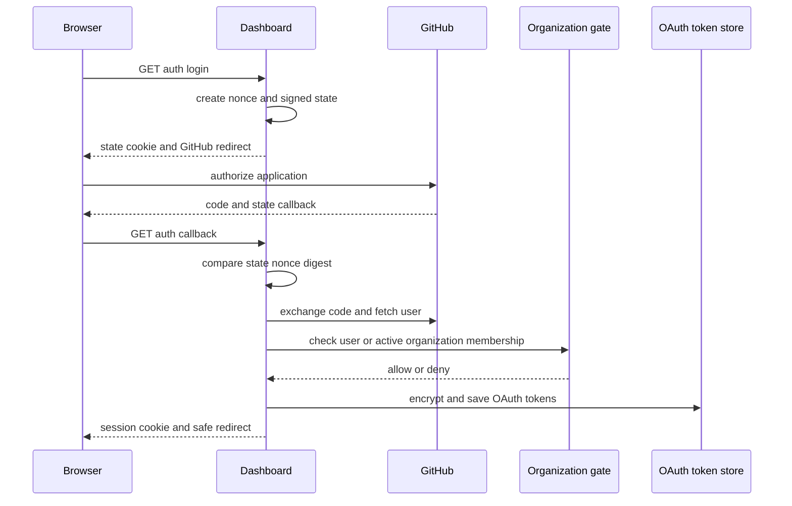
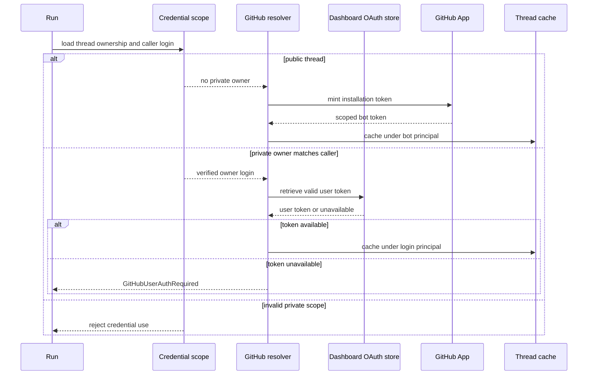

# Authentication, Authorization, and Credential Scope

Open SWE deliberately separates **who may use the service**, **what repositories and administrative actions they may access**, and **which credential a run may use**. Browser sessions, inbound webhook signatures, GitHub user OAuth, GitHub App installation tokens, and GitHub Actions OIDC serve different boundaries; they are not interchangeable. This page complements [sandbox lifecycle](../architecture/sandbox-lifecycle.md), [tools](./tools.md), [dashboard UI](../integrations/dashboard-ui.md), [configuration](../operations/configuration.md), and [invocation](../workflows/invocation.md).

## Dashboard identity and login admission

The dashboard's GitHub OAuth code flow establishes a browser identity, then issues an HS256 `osw_session` JWT signed by `DASHBOARD_JWT_SECRET`. Sessions contain the GitHub login, email, and avatar URL and expire after seven days. `require_session` rejects a missing or invalid cookie; endpoints derive admin status from the session identity rather than trusting client input.

At application startup, `validate_github_login_allowlist` requires either `ALLOWED_GITHUB_ORGS`, `ALLOWED_GITHUB_USERS`, or `OPEN_SWE_LOCAL_AUTH_TOKEN`. Thus a normal deployment cannot start with an unintentionally open GitHub-login policy. On callback, an exact, case-insensitive match in `ALLOWED_GITHUB_USERS` admits the user; otherwise they must be an active member of at least one configured organization. Organization membership is checked using a GitHub App installation token constrained to `members: read`. Missing App credentials, inaccessible membership, transport errors, non-200 responses, malformed data, and inactive membership all resolve to denial.

The diagram shows the normal browser login flow; a failed state check or admission gate stops before credentials are saved or a session is issued.

### State, redirects, and cookies

`/dashboard/api/auth/login` binds the OAuth round trip to the browser with a fresh random nonce: the raw nonce is held in `osw_oauth_state`, while its HMAC is embedded in the short-lived signed state JWT. The callback uses `hmac.compare_digest` to verify the cookie-derived digest before code exchange. State is valid for ten minutes.

`sanitize_redirect_to` accepts a same-origin relative path (not `//...`) or an absolute URL whose origin is `DASHBOARD_BASE_URL` or one of `DASHBOARD_ALLOWED_ORIGINS`. It rejects dashboard login/API paths as destinations and falls back to the dashboard base, avoiding attacker-origin redirects and redirect loops.

Session cookies are `HttpOnly`. When the API is HTTPS and the frontend is on another origin, they are `Secure; SameSite=None`; same-origin or local HTTP deployments use `SameSite=Lax`. The OAuth state cookie is also `HttpOnly` and `SameSite=Lax`, is scoped to `/dashboard/api/auth`, and carries the state TTL. Cookie-authenticated unsafe methods must pass `require_same_origin_for_mutations`: safe HTTP methods are exempt, while an allowed `Origin` or `Referer` is required when dashboard origins are configured. An explicit GitHub bearer request with no session cookie is exempt because its credential is not ambient browser state. No configured dashboard origin is an intentional local-development fail-open; credentialed CORS is installed only for configured origins, and wildcard origins are rejected.

### Desktop and CI entrypoints

Desktop login does not put a session on its loopback callback. Instead, a 120-second signed handoff code carries only inert identity claims and the desktop application's S256 PKCE challenge. The fixed `127.0.0.1` callback returns that code; redemption issues a session only after a constant-time verifier comparison. Cloud-terminal tickets are separate 60-second JWTs, restricted to the terminal audience and a particular `thread_id`.

Selected admin APIs also accept a GitHub Actions OIDC bearer token. This path is disabled when `ADMIN_OIDC_SUBJECTS` is empty. Otherwise the server fetches GitHub's JWKS and verifies an RS256 token's issuer, audience, and required time/subject claims, then admits only a configured exact `sub` or `repository` allowlist match. `ADMIN_OIDC_AUDIENCE` defaults to `open-swe`. Allowlisting a repository grants these endpoints to workflows able to run there, so it should contain only trusted repositories or precise subjects.

## Authorization: admins, repositories, and thread ownership

`CONFIGURED_ADMINS` is a comma-separated, case-insensitive set of email addresses or GitHub logins. Dashboard admin dependencies and tool-level `require_admin` check the live triggering identity. Scheduled administrative actions use saved schedule authorization instead. This prevents a user from acquiring admin authority merely by altering or inheriting thread metadata.

A dashboard session alone does not grant repository access. `require_repo_access_for_user` obtains the signed-in user's valid GitHub OAuth token and probes `GET /repos/{owner}/{repo}`. It maps a rejected token to reauthentication, a 403 to no private-repository access, a 404 to not found, and other failures to a gateway error; it retries once with a forced refresh after a 401. Review, review-chat, styles, and repository-scoped instruction routes use this gate before returning or modifying their records. Workspace-level jobs use the GitHub App token and separately report unavailable App access.

Thread metadata defines whether a run may reach personal integrations. Credential scope resolution requires a thread ID, accepts only `public` or `private` visibility and known owner types, and rejects a private system thread. For a private thread, `owner_login` must exist and match the initiating run's `github_login`; otherwise no personal credential is available. Public threads return no private credential owner. PR authorship is related but distinct: a public user-owned thread can attribute a PR to its saved owner, while system-owned threads have no user PR author.

## GitHub credentials and routing

`resolve_github_token` follows thread credential scope, not a legacy source heuristic. It first invalidates thread token cache entries. Public threads receive a GitHub App installation token; a private thread receives only its verified owner's dashboard OAuth token, and a missing user token raises `GitHubUserAuthRequired` rather than falling back to the workspace bot. This preserves the boundary between workspace authority and personal authority.

The routing flow keeps public workspace operations and private owner operations separate; no secret value is placed in the diagram or exposed to the caller.

### Persistence and cache lifetimes

Dashboard OAuth records live in a distinct `['oauth_tokens']` Store namespace from editable `['profiles']` data, avoiding callback/setting-write clobbering. Access and refresh tokens are Fernet-encrypted using `TOKEN_ENCRYPTION_KEY`. The value can hold a newest-first comma- or newline-separated key list: `MultiFernet` encrypts with the first and tries all configured keys when decrypting, enabling rotation. Invalid ciphertext or unavailable keys degrade to an empty result. A token nearing expiry is refreshed under a per-login lock. If GitHub reports `bad_refresh_token` or `unauthorized_client`, the authorization is deleted—unless a concurrent callback replaced its refresh token—so the user must log in again.

Thread GitHub token cache entries are in process only, keyed by `(thread_id, principal)`. `login:`/`email:` principals isolate users and `bot` is separate; unbound user tokens are not cached. Entries expire within 60 seconds of their token expiry or after 24 hours, whichever occurs first. The resolver clears a thread's entries before resolving again.

GitHub App credentials are different from user OAuth credentials. The service signs a nine-minute RS256 App JWT (backdated 60 seconds for clock skew), exchanges it for an installation token, and caches that token only in process. The cache key includes installation ID, repository IDs/names, and requested permissions; it is reused only until ten minutes before expiry. Missing App configuration returns no token.

## Sandboxed GitHub access

For LangSmith sandboxes, GitHub App installation authority is delivered through managed proxy rules rather than a real environment variable or credentials written to disk. The sandbox receives a placeholder such as `GH_TOKEN=proxy-injected`; opaque proxy headers authenticate calls to `api.github.com` and `github.com`. This is App authority for the sandbox, not a user's OAuth credential.

The proxy records each thread's expiry, original repository scope, permissions, and base proxy configuration in process. Within five minutes of expiry (or after 50 minutes if expiry is unknown), before-model middleware mints a replacement and reconfigures the sandbox. The recorded scope is reused to avoid broadening authority. If proxy configuration finds an idle sandbox not ready, the provider starts it and retries; a failure then propagates rather than treating a stale proxy as usable.

## Slack linking and inbound request authenticity

A signed-in GitHub user links Slack through Sign in with Slack OIDC, using `openid email profile` scopes. The Slack `userinfo` response supplies the verified Slack user ID, workspace ID, email verification flag, and name; the GitHub user cannot self-assert a Slack identity. If `SLACK_TEAM_ID` is configured, an identity from another workspace is rejected, including a Slack Connect identity. Mapping records are stored by GitHub login in `['user_mappings']`; their best-effort in-process indexes support hot-path lookup, and synchronous cold-cache reads conservatively behave as unmapped. Shared Slack-thread authentication notices contain only the generic settings URL, never a user-specific authorization URL.

Inbound webhooks are verified against the raw body before the routes parse or queue work:

- GitHub requires `sha256=` HMAC-SHA256 in `X-Hub-Signature-256`; an unset secret fails closed.
- Slack checks HMAC-SHA256 over `v0:timestamp:body`, uses constant-time comparison, and rejects timestamps more than 300 seconds away. The Slack route verifies it before decoding the event and refuses external or unverified channels before dispatch.
- Linear checks raw-body HMAC-SHA256 in `Linear-Signature` and fails closed without its secret.
- The public `/webhooks/run-complete` endpoint compares its query token with `RUN_COMPLETE_WEBHOOK_SECRET` in constant time. Without that secret every call is rejected and failure replies are disabled.

Unmapped GitHub comment bodies are surrounded by reserved untrusted-content tags before being put in a prompt. Any matching tags supplied in raw comment text are replaced first, preventing an external commenter from forging the delimiter.

## Operational checklist and focused verification

Configure dashboard signing, GitHub OAuth/App, encryption, and webhook secrets before exposing the service. In particular, configure a GitHub login allowlist or explicit local token; grant the GitHub App organization-members read permission when using organization admission; keep `DASHBOARD_BASE_URL` and `DASHBOARD_ALLOWED_ORIGINS` accurate for production CSRF/CORS behavior; and scope `ADMIN_OIDC_SUBJECTS` tightly.

Focused tests cover redirect/state/PKCE protections, bearer-token admin identity resolution, and credential source behavior. The organization-gate test path named in earlier documentation is not present in this checkout; the production startup and gate code are the current authority. Changes to credential routing should also test private owner mismatch, public App-token selection, cache principal separation, repository 401 refresh behavior, and proxy scope preservation.
