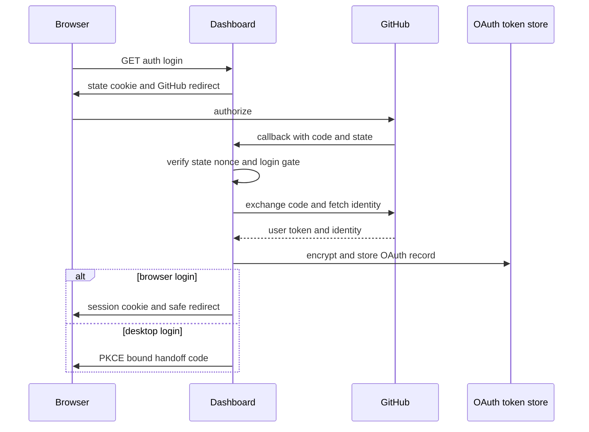
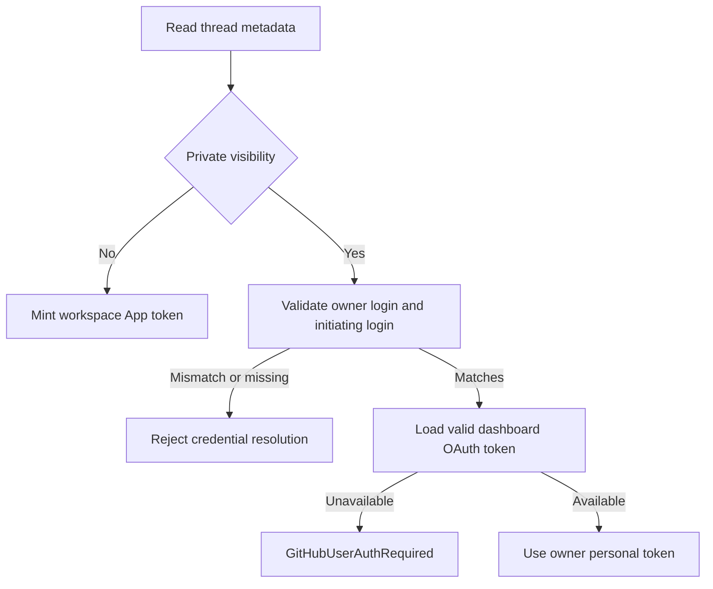

# Authentication, Authorization, and Security Boundaries

Open SWE deliberately separates browser identity, user GitHub authority, workspace GitHub authority, and sandbox access. A GitHub login establishes a dashboard session, but it does not by itself make a caller an administrator, grant access to a repository, or put a reusable credential into a sandbox. Related operational settings are documented in [configuration](../operations/configuration.md); see [invocation](../workflows/invocation.md), [tools](./tools.md), and [sandbox lifecycle](../architecture/sandbox-lifecycle.md) for the consuming flows.

## Dashboard login and sessions

The dashboard is mounted beneath `/dashboard/api`. `GET /auth/login` starts a GitHub App OAuth code flow. It requires `GITHUB_APP_CLIENT_ID`, generates a random nonce, signs a short-lived state JWT containing the nonce HMAC and a sanitized return location, then stores the raw nonce in `osw_oauth_state`. The callback verifies the state and cookie binding with a constant-time comparison before exchanging the code, fetching the GitHub identity, applying the login gate, and storing the OAuth tokens. It then either sets `osw_session` and redirects the browser, or returns a desktop handoff code.

This is the browser OAuth flow and its two post-login outcomes.

Sessions are HS256 JWTs signed with `DASHBOARD_JWT_SECRET`, carry the GitHub login in `sub`, and expire after seven days. `require_session` rejects absent or invalid cookies; `/me` returns that identity and calculates `is_admin` from current configuration. Session cookies are `HttpOnly`. On a split-origin HTTPS deployment they are `Secure; SameSite=None`; same-origin deployments and HTTP local development use `SameSite=Lax`. The short-lived state cookie is `HttpOnly`, `SameSite=Lax`, and scoped to `/dashboard/api/auth`.

Redirect handling is a separate defense. `sanitize_redirect_to` permits a relative non-protocol-relative path or an absolute URL whose origin is the dashboard base origin or an entry in `DASHBOARD_ALLOWED_ORIGINS`; it rejects login, dashboard API, and server-function targets. This prevents an OAuth login link from becoming an open redirect.

### Admission gates and non-browser login

Startup calls `validate_github_login_allowlist`: production dashboard login requires `ALLOWED_GITHUB_ORGS` or `ALLOWED_GITHUB_USERS` unless `OPEN_SWE_LOCAL_AUTH_TOKEN` is configured. At callback time, `enforce_github_login_gate` accepts a login only if it constant-time matches an allowed user or is an active member of an allowed organization. Organization membership is checked with a GitHub App installation token restricted to `members: read`; unavailable installation/token, API failures, non-200 responses, malformed responses, and inactive membership all deny access.

Desktop login does not deposit a browser session at a loopback server. The state can carry a validated S256 PKCE challenge and port; after GitHub login the browser receives a 120-second signed handoff code at a fixed `127.0.0.1` callback. The desktop app must present the corresponding verifier, checked in constant time, before it receives a session JWT. Cloud-terminal tickets are separate 60-second session-signed JWTs bound to both the terminal audience and a requested `thread_id`.

Cookie-authenticated unsafe requests are subject to `require_same_origin_for_mutations`. Safe HTTP methods are exempt; otherwise an allowed `Origin` or `Referer` is required when dashboard origins are configured. A request with an explicit GitHub bearer token and no session cookie is exempt because that credential is not ambient browser state. With no configured dashboard origin the origin check intentionally no-ops for local development. Credentialed CORS is installed only for explicitly configured origins, and `*` is rejected.

## OAuth records, user scope, and repository access

GitHub OAuth access and refresh tokens live in the LangGraph Store namespace `["oauth_tokens"]`, separate from editable profile data in `["profiles"]`, preventing concurrent profile edits and OAuth refreshes from overwriting each other. `TOKEN_ENCRYPTION_KEY` accepts a newest-first Fernet key list: `MultiFernet` encrypts with the first key and attempts every key when decrypting, allowing key rotation. Invalid ciphertext or a missing encryption key makes decryption return an empty value rather than leak an exception.

Near-expiry user access tokens are refreshed under a per-login lock. A refresh failure identified by GitHub as `bad_refresh_token` or `unauthorized_client` removes the old authorization unless a concurrent callback already installed a different refresh token. Consumers must then require a clean login. Dashboard actions that name a repository use the user's valid token to check `GET /repos/{owner}/{repo}`; an initial 401 triggers a forced refresh and retry, while 403 and 404 remain authorization/not-found outcomes. Workspace-scoped actions use the GitHub App credential instead and report an unavailable App separately.

Credential scope is based on persisted thread ownership, not an untrusted caller hint:

- A public thread uses workspace GitHub App authority.
- A private thread requires a valid `owner_login`, and only a run started by that same GitHub login may resolve personal credentials.
- System-owned threads cannot be private or use private credentials.
- A user-owned pull request is attributed to its initiator where ownership metadata permits it; a system-owned thread has no user PR author.

This is the credential decision for public and private thread runs.

Resolved tokens are cached only in process memory by `(thread_id, principal)`, with normalized `login:` or `email:` user principals and a separate `bot` principal. Unbound user tokens are not cached. Entries expire at the token expiry with a 60-second skew or after 24 hours, and a stale/revoked-token response can clear all entries for the thread.

## GitHub App authority and sandbox isolation

The GitHub App signs a short-lived RS256 JWT using `GITHUB_APP_PRIVATE_KEY`, then exchanges it for an installation token. App-token cache entries are in-memory and keyed by installation, requested repositories or repository IDs, and requested permissions, so a token cannot be reused across a broader scope. They are reused only until ten minutes before expiry. Missing App configuration returns no token rather than allowing unauthenticated GitHub access.

For LangSmith sandboxes, the real installation token is configured in proxy rules as an opaque Authorization header. The sandbox gets `GH_TOKEN=proxy-injected`, not the secret: the proxy injects Bearer authentication for `api.github.com` and Basic `x-access-token` authentication for `github.com`. The recorded proxy state retains its repository and permission scope; refresh therefore preserves rather than broadens authority. A before-model middleware refreshes a token near expiry, and proxy configuration retries transient failures, including by starting an idle sandbox when the service says it is not ready.

## Authorization beyond authentication

`CONFIGURED_ADMINS` is a case-insensitive allowlist of GitHub login or email. Dashboard admin dependencies calculate authorization from the current session rather than embedding an admin claim in the session. Selected administrative endpoints additionally accept `Authorization: Bearer`: either a personal GitHub token resolved through `/user` (and, when necessary, `/user/emails`) and matched to `CONFIGURED_ADMINS`, or a GitHub Actions OIDC token. The OIDC path validates GitHub's RS256 signature, issuer, expiry and configured audience, then accepts only an exact configured subject or configured `owner/repo`. It is disabled if `ADMIN_OIDC_SUBJECTS` is empty. An installation token that cannot resolve to a GitHub user is rejected.

Inbound GitHub webhooks have additional policy gates after signature validation. Repository events are accepted only when their owner is in `ALLOWED_GITHUB_ORGS` or their full name is in `ALLOWED_GITHUB_REPOS` when either list is configured. If `PUBLIC_REPO_ORG_GATE` is set, a public-repository trigger additionally needs an active membership in that organization, except for known internal bots; private repositories and an unset gate bypass this extra actor test.

## External requests and untrusted content

All webhook checks operate on the original bytes and fail closed when a required secret is missing:

- GitHub validates `X-Hub-Signature-256` against `sha256=HMAC(GITHUB_WEBHOOK_SECRET, body)` before JSON parsing.
- Slack validates the HMAC for `v0:timestamp:body` and rejects a timestamp more than 300 seconds away, limiting replay.
- Linear validates the raw-body HMAC-SHA256 in `Linear-Signature`.
- Public `/webhooks/run-complete` constant-time compares its query token to `RUN_COMPLETE_WEBHOOK_SECRET`; without the secret it rejects every request and completion failure replies remain disabled.

Unmapped GitHub commenters are untrusted prompt input. Their text is wrapped in the reserved `<dangerous-external-untrusted-users-comment>` delimiter, after any attempt to include those reserved tags is replaced. Thus external content cannot manufacture the trusted wrapper. Slack authentication failure notices likewise link only to the token-free dashboard settings URL, rather than publishing a user-specific OAuth URL into a shared thread.

## Focused tests and safe changes

`tests/dashboard/test_github_token_auth.py` verifies bearer parsing, primary-email fallback, rejection of non-admin identities, routing of Actions OIDC tokens, and the CSRF distinction between bearer-only and cookie-bearing requests. `tests/auth/test_thread_credential_scope.py` covers the ownership invariants that select workspace versus personal authority. When changing a login or credential path, retain the distinction between identity proof, admission, repository authorization, and credential scope; merging those checks is likely to either broaden authority or break a legitimate automation path.
