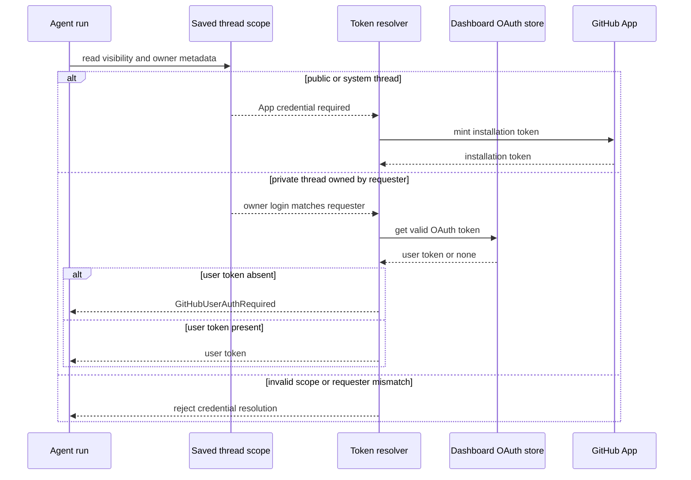

# Authentication, Authorization, and Credential Scope

Open SWE has three deliberately separate authority planes:

1. **Dashboard session authorization** identifies a browser user and controls dashboard access.
2. **GitHub API credentials for a run** select either a user's stored OAuth token or the workspace GitHub App installation token according to the saved thread scope.
3. **Managed sandbox GitHub proxy scope** gives a sandbox a restricted, opaque installation token for configured workspace repositories; it is not a browser session or a user's OAuth token.

This separation prevents a public or system-owned conversation from borrowing a person's credentials, and keeps a real GitHub token out of sandbox environment variables. See also [sandbox lifecycle](../architecture/sandbox-lifecycle.md), [dashboard UI](../integrations/dashboard-ui.md), [configuration](../operations/configuration.md), and [invocation](../workflows/invocation.md).

## Dashboard identity and authorization

The dashboard uses the GitHub App OAuth code flow. On `GET /auth/login`, it creates a random nonce, stores the raw nonce in the `osw_oauth_state` cookie, and puts its HMAC plus the requested post-login location in a signed state JWT. The callback validates the state and cookie with a constant-time comparison, exchanges the code, resolves the GitHub account, applies the login gate, persists the OAuth result, and mints a dashboard session.

`osw_session` is an HS256 JWT signed by `DASHBOARD_JWT_SECRET`, with a seven-day lifetime. `require_session` rejects missing or invalid cookies; `/me` reports the signed-in identity and evaluates admin status from the current session identity. Cookies are `HttpOnly`; split HTTPS deployments use `Secure; SameSite=None`, while same-origin or local HTTP uses `SameSite=Lax`. The short-lived state cookie is `HttpOnly`, `SameSite=Lax`, path-scoped to `/dashboard/api/auth`.

Post-login redirects are constrained to safe relative locations or to origins from `DASHBOARD_BASE_URL` and `DASHBOARD_ALLOWED_ORIGINS`; login and API paths are blocked to avoid redirect loops and open redirects. Startup requires at least one login gate—`OPEN_SWE_LOCAL_AUTH_TOKEN`, `ALLOWED_GITHUB_USERS`, or `ALLOWED_GITHUB_ORGS`. A listed login qualifies directly; organization membership is verified with an App token holding `members: read` and any lookup/API failure denies access.

`CONFIGURED_ADMINS` is a case-insensitive set of GitHub logins and emails. Dashboard dependencies and agent admin tools re-evaluate it against the caller rather than treating an `admin_thread` marker as sufficient authorization. For cookie-authenticated mutations, an allowed `Origin` or `Referer` is required when dashboard origins are configured. Safe methods are exempt, as is a bearer-only GitHub-token request with no ambient session cookie. CORS is credentialed only for explicitly configured origins and rejects `*`.

Desktop sign-in does not put a browser session on a loopback redirect: the callback sends a short-lived, PKCE-bound handoff code to a fixed `127.0.0.1` callback, and the app must present the matching verifier to mint the session. Cloud-terminal tickets are separate 60-second JWTs bound to both a fixed audience and `thread_id`.

## GitHub API credentials for agent runs

`resolve_github_token` reads the saved thread metadata before resolving GitHub authority. A thread must have recognized `visibility` (`public` or `private`) and `owner_type` (`user`, `system`, or absent); unknown values fail rather than granting credentials. A system thread cannot be private.

- **Public threads** always receive the workspace GitHub App installation token. Existing personal-token cache entries are cleared first and personal dashboard OAuth is not consulted.
- **Private threads** can use a dashboard-stored GitHub OAuth token only when the run's authenticated GitHub login equals the saved `owner_login`. A missing owner, a different requester, absent/invalid personal OAuth, or metadata lookup failure stops the run; it does not fall back to the App token.
- **System-owned threads** use the App token. For pull-request authorship, a public user-owned thread may select the requester or a named participant who has posted in that thread; private threads stay pinned to their owner and system threads stay App-owned. Background completion refuses user-owned/private publication because it cannot identify the requester.

*Credential selection is driven by persisted thread scope, not merely by the event source or a caller-supplied identity.*

OAuth access and refresh tokens are encrypted before persistence. `TOKEN_ENCRYPTION_KEY` accepts a newest-first Fernet key list, allowing the first key to encrypt while all listed keys can decrypt during rotation. Permanent GitHub refresh failures remove the saved authorization unless a concurrent OAuth callback has replaced it.

Resolved run tokens are process-memory-only and separated by `(thread_id, principal)`: normalized login/email principals isolate people, and `bot` isolates installation tokens. An unbound personal token is not cached. Entries expire at the token expiry (with 60 seconds of skew) or a 24-hour cap, and invalidation clears the thread's entries.

The GitHub App exchange caches installation tokens in-process by installation, repository IDs/names, and permissions. It reuses them only until ten minutes before expiry. This is a cache boundary, not a grant: an installation token is minted with the requested repository and permission scope.

## Managed sandbox GitHub proxy scope

A LangSmith sandbox does not receive a dashboard session or a user's OAuth token. Its GitHub access is an App installation token injected as an **opaque** proxy `Authorization` header: Bearer for `api.github.com`, and Basic `x-access-token` for `github.com` and subdomains. `GH_TOKEN` is only the literal placeholder `proxy-injected`, satisfying tools such as `gh` without disclosing the credential.

Workspace sandbox access begins with an installation-wide discovery token kept on the server. The service intersects requested repositories with the configured workspace repositories, resolves their installation repository IDs, then mints a token scoped only to those IDs and requested permissions. No matching repository means no sandbox credential; fallback from a snapshot must not broaden the scope. The proxy configuration also preserves non-built-in rules and can start an idle sandbox before retrying a configuration update.

## Authenticating inbound requests and untrusted content

Webhook routes verify raw request bodies before processing payloads:

- GitHub requires `sha256=HMAC(GITHUB_WEBHOOK_SECRET, body)` in `X-Hub-Signature-256`.
- Slack verifies the `v0:timestamp:body` HMAC and rejects timestamps more than 300 seconds away.
- Linear verifies its raw-body HMAC-SHA256 in `Linear-Signature`.
- `/webhooks/run-complete` constant-time compares its query token to `RUN_COMPLETE_WEBHOOK_SECRET`; without a configured secret it rejects every call and failure replies remain disabled.

All these verifiers fail closed when their signing secret is missing. GitHub comment text from an untrusted author is placed inside reserved dangerous-content tags after stripping any occurrence of those tags from the raw comment, so external text cannot forge its trust delimiter.

## Verification and operations

`tests/auth/test_thread_credential_scope.py` exercises the key scope invariant: public threads do not resolve personal GitHub authentication, private threads require the saved owner, system threads use the bot, invalid metadata fails closed, and participant-based PR authorship cannot borrow an unrelated account. `tests/dashboard/test_dashboard_oauth_redirect.py` covers redirect allowlisting, state-cookie binding, and desktop PKCE handoff; `tests/dashboard/test_github_token_auth.py` covers parsing bearer headers and the CSRF exemption boundary.

Operationally, configure `DASHBOARD_JWT_SECRET`, GitHub App OAuth credentials, `TOKEN_ENCRYPTION_KEY`, a login allowlist, and webhook secrets before relying on these surfaces. Configure the GitHub App installation and workspace repository records for agent and sandbox App access; a missing installation credential causes the relevant operation to fail rather than perform an unauthenticated fallback.
