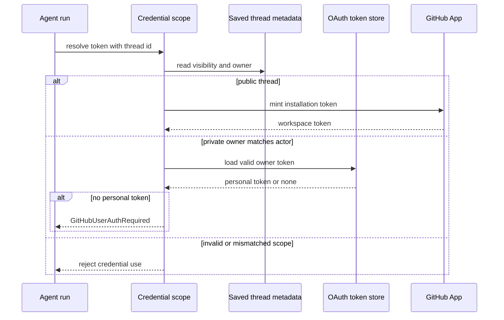

# Authorization, Credentials, and Security Boundaries

Open SWE separates identity proof from authority to act. Dashboard login establishes a GitHub-backed user session; repository and admin checks authorize a particular operation; run and sandbox credential selection prevents personal credentials from leaking into shared execution. This page covers those boundaries. See also [sandbox lifecycle](../architecture/sandbox-lifecycle.md), [dashboard UI](../integrations/dashboard-ui.md), [configuration](../operations/configuration.md), and [invocation](../workflows/invocation.md).

## Credential scope is determined by saved thread ownership

`resolve_github_token` does not select a credential based on the invocation source. It first loads the saved thread metadata through `private_credential_login` and rejects missing IDs, unknown visibility or owner types, and private system threads. A public thread—including legacy metadata that defaults to public—always receives a workspace GitHub App installation token. A private thread may receive a personal dashboard OAuth token only when the current `github_login` equals its saved `owner_login` case-insensitively. It never falls back to the bot for a private owner who has no usable token: it raises `GitHubUserAuthRequired`.

This makes thread state, rather than caller-provided configuration, the authority boundary. The resolver clears thread token cache before choosing a fresh credential. Personal tokens are stored and cached under normalized `login:` or `email:` principals; an unbound personal token is not cached. The only other cache principal is `bot`. Cache entries remain process-local and are removed at token expiry with a 60-second skew or after 24 hours.

Credential resolution from persisted thread scope; public execution cannot obtain personal integration credentials.

### Publishing and repository access are separate decisions

Git operations in a public run use App authority, but opening a pull request can deliberately obtain the requester’s personal OAuth token for attribution. For a user-owned public thread, the actor must be authenticated; a requested `on_behalf_of` login must already have posted in that thread. Private threads are pinned to their owner, system threads use the App, and a background completion cannot publish using a saved user identity because it cannot identify a requester.

Dashboard routes likewise verify access to each repository rather than treating a session as repository-wide authorization. `require_repo_access_for_user` calls GitHub’s repository endpoint with the user token, retries once after forced refresh on a 401, and maps 403/404 to access failures. Workspace checks use an App installation token and distinguish unavailable App authority from a repository unavailable to that App.

### App tokens and sandbox proxying

The GitHub App token issuer validates App configuration, exchanges App authentication for an installation token, and keeps an in-memory cache partitioned by installation ID, requested repository IDs or names, and permission map. It reuses a token only until ten minutes before expiry. In local development, an unconfigured App may use the `gh` CLI token; deployed callers receive no token when neither route is available.

For LangSmith sandboxes, the real installation token is put only into opaque proxy rules: `api.github.com` receives a Bearer header and `github.com` receives Basic `x-access-token` authentication. The sandbox gets only the `GH_TOKEN=proxy-injected` placeholder needed by `gh`. A per-thread proxy record retains the originally granted repository and permission scope; refresh intersects a newly requested repository set with that recorded scope and reconfigures the proxy when expiry is within five minutes (or after a 50-minute fallback when expiry is unknown). This prevents refresh from broadening sandbox authority.

## Dashboard identity and browser mutation defenses

The dashboard’s GitHub OAuth flow creates an HS256 `osw_session` JWT signed by `DASHBOARD_JWT_SECRET` for seven days. `require_session` rejects absent or invalid cookies, while `/me` derives its current `is_admin` result from the session login/email and configuration. GitHub OAuth login is gated by `ALLOWED_GITHUB_USERS` or active membership in `ALLOWED_GITHUB_ORGS`; startup refuses to run without either allowlist unless local-token authentication is configured. Organization membership failures are fail-closed.

`/auth/login` creates a random nonce, keeps its HMAC in the signed state JWT and the raw value in an HttpOnly state cookie. The callback uses constant-time comparison before code exchange, user lookup, authorization, OAuth-token persistence, and session issuance. Redirect targets are restricted to same-origin relative paths or configured dashboard origins, with login/API callback paths blocked. Desktop login redirects an inert, 120-second PKCE-bound handoff code to a fixed loopback host; only a holder of the matching verifier can mint the session. A separate terminal ticket is valid for 60 seconds, has a fixed audience, and is bound to one thread ID.

Cookie-authenticated unsafe requests require an allowed `Origin` or `Referer`; safe methods are exempt. A bearer-only GitHub-token request without a session cookie is exempt because it does not use an ambient browser credential. The check intentionally does nothing when no dashboard origin is configured for local development. CORS is credentialed only for configured origins and rejects wildcard configuration. Session cookies are HttpOnly; HTTPS split-origin API deployments use `Secure; SameSite=None`, otherwise they use `SameSite=Lax`.

`CONFIGURED_ADMINS` is a case-insensitive set of GitHub logins and emails. Both dashboard dependencies and agent administrative tools re-evaluate the active identity rather than trusting a thread’s admin flag. Observability tools are separately exposed only to admins or emails in `OBSERVABILITY_AUTHORIZED_EMAILS`, with the decision made per run.

Slack linking uses Slack OIDC claims, not a user-supplied Slack identity. When `SLACK_TEAM_ID` is configured, a different `team_id` is rejected, including Slack Connect users. In a shared Slack thread, an authentication failure notice deliberately contains only the token-free dashboard settings URL, not a per-user authorization link.

## Persisted secrets and inbound trust

OAuth access and refresh tokens are encrypted before persistence. `TOKEN_ENCRYPTION_KEY` accepts a newest-first comma- or newline-separated Fernet key list: `MultiFernet` encrypts with the first key and tries every configured key to decrypt, enabling rotation. Invalid ciphertext or an unavailable key becomes an empty value. Near-expiry OAuth tokens refresh under a per-login lock; permanent GitHub refresh failures (`bad_refresh_token` and `unauthorized_client`) delete the old authorization unless a concurrent callback has replaced it.

All inbound webhook checks operate on raw request bytes and fail closed when their secret is missing:

- GitHub recomputes `sha256=HMAC(GITHUB_WEBHOOK_SECRET, body)` and constant-time compares `X-Hub-Signature-256` before payload processing. The route then also ignores repositories not assigned to a workspace; transient workspace lookup failure returns 503 so GitHub retries.
- Slack validates the `v0:timestamp:body` HMAC and rejects a timestamp more than 300 seconds away, limiting replay.
- Linear constant-time compares its raw-body HMAC-SHA256 with `Linear-Signature`.
- `/webhooks/run-complete` constant-time compares a query token with `RUN_COMPLETE_WEBHOOK_SECRET`; it rejects every request when the secret is unset.

External GitHub comment text is also treated as untrusted prompt input. The service replaces its reserved trust-wrapper tags in raw content, then wraps comments from non-trusted authors in `<dangerous-external-untrusted-users-comment>` delimiters, preventing a commenter from forging the wrapper.

## Focused verification and operational checks

`tests/auth/test_thread_credential_scope.py` is the key regression suite for this boundary: it asserts public threads never resolve personal credentials, private owner matching, no private fallback to bot authority, invalid metadata rejection, requester-constrained PR attribution, and background-publish restrictions. `tests/auth/test_auth_sources.py` covers dashboard-store lookup and token-free Slack notices. Dashboard OAuth tests cover redirect, state, and PKCE protections; organization-gate tests cover configured membership behavior. For deployment, configure both a GitHub login allowlist and a dashboard JWT secret, supply App credentials for public/workspace operations, and set webhook secrets plus `TOKEN_ENCRYPTION_KEY`; treating missing values as harmless would either block expected traffic or weaken the intended boundary.
