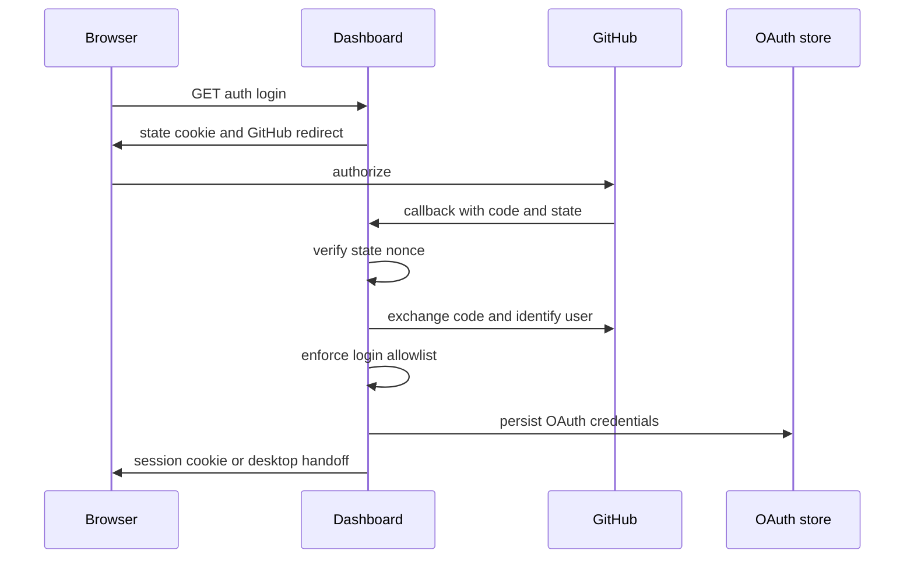
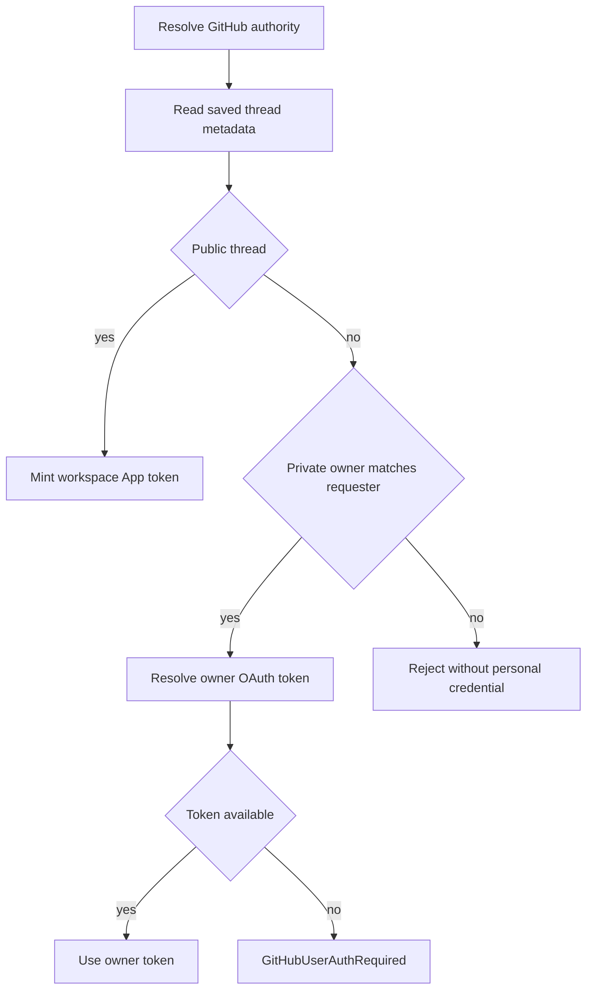

# Authentication, Authorization, and Security Boundaries

Open SWE has separate trust boundaries for browser users, external event sources, GitHub authority, workspace administration, and agent sandboxes. Authentication establishes an identity; authorization then decides whether that identity can log in, access a repository, operate on a thread, or use a privileged tool. The scope recorded on a thread is the primary guard against a collaborator or a background task reusing another person's credentials.

See [sandbox lifecycle](../architecture/sandbox-lifecycle.md), [tools](./tools.md), [dashboard UI](../integrations/dashboard-ui.md), and [invocation](../workflows/invocation.md).

## Dashboard sign-in and session boundary

The dashboard uses GitHub App OAuth. Its callback exchanges the authorization code, resolves the GitHub identity, applies the GitHub-login gate, persists the GitHub OAuth result, signs the user into the local user store, and finally either issues a browser session or starts a desktop handoff. Browser sessions are HS256 JWTs signed with `DASHBOARD_JWT_SECRET`, live for seven days, and are carried in the `HttpOnly` `osw_session` cookie. `require_session` rejects a missing or invalid cookie; `/me` derives `is_admin` again from the current configuration rather than treating it as a permanent session claim.

The OAuth browser flow binds `state` to the browser: login puts a random nonce in the `osw_oauth_state` cookie and its HMAC in a short-lived signed state JWT; the callback recomputes and constant-time compares the values before using the code. Post-login destinations pass through `sanitize_redirect_to`: relative paths and configured dashboard origins are accepted, while protocol-relative URLs, unknown origins, and login/API callback paths are rejected. This prevents state substitution and open redirects.

Cookie settings depend on deployment topology. The session is always `HttpOnly`; a cross-origin HTTPS dashboard uses `Secure; SameSite=None`, while same-origin and local HTTP use `SameSite=Lax`. The state cookie is `HttpOnly`, `SameSite=Lax`, restricted to `/dashboard/api/auth`, and expires with the ten-minute state lifetime.

### Who may log in

At startup, a non-local deployment must configure at least one of `ALLOWED_GITHUB_USERS` or `ALLOWED_GITHUB_ORGS`; otherwise startup fails. `OPEN_SWE_LOCAL_AUTH_TOKEN` permits the local exception. A login matches an explicit user case-insensitively or is accepted only when it is an active member of one configured organization. Organization membership is resolved through GitHub App authority; a non-member or any failed membership check does not authorize the login.

Desktop sign-in deliberately does not deposit a browser session at a loopback address. It returns a 120-second signed handoff code to a fixed `127.0.0.1` callback, and `/auth/desktop/exchange` mints the session only after constant-time validation of the desktop app's PKCE S256 verifier. Cloud-terminal connection tickets are a different, 60-second JWT type: they carry a fixed audience and thread ID, and terminal WebSocket setup checks both.

### Mutation protection and administration

Unsafe cookie-authenticated requests need an allowed `Origin` or `Referer` when dashboard origins have been configured. `GET`, `HEAD`, and `OPTIONS` are exempt. A request with an explicit GitHub `Authorization: Bearer` token *and no session cookie* is also exempt because that token is not an ambient browser credential; adding a session cookie restores the origin requirement. The development default with no configured origins is intentionally fail-open. CORS likewise enables credentialed origins only from configuration and rejects a wildcard.

`CONFIGURED_ADMINS` is a case-insensitive set of GitHub logins and emails. Dashboard admin dependencies evaluate it from the session identity, while agent tools recheck the triggering actor at execution time (or a specifically authorized schedule), so an `admin_thread` marker alone cannot confer authority. Slack account linking similarly uses Slack-verified OIDC identity claims; `SLACK_TEAM_ID`, when set, rejects identities from another workspace.

## Repository and thread authorization

A dashboard action that names a repository is not authorized merely because the caller has a valid dashboard session. `require_repo_access_for_user` obtains that user's valid GitHub OAuth token and calls GitHub's repository endpoint. A 401 causes one forced token refresh and retry; 403 and 404 distinguish private-access denial from a missing repository. Filters used for repository-scoped dashboard records omit 403/404-inaccessible records rather than disclosing them. Workspace-scope checks use the workspace GitHub App installation token instead and report an unavailable App scope without substituting a user credential.

Thread metadata constrains personal credentials:

- `public` threads always use the workspace GitHub App installation credential; personal integration credentials are unavailable.
- A `private` thread must have a nonempty `owner_login`, and only a run started by that same login may resolve the owner's personal credential.
- A `system` thread cannot be private and uses workspace authority. Unknown visibility or owner types fail rather than being interpreted permissively.
- Background completion may not publish a pull request with a saved user identity, because it cannot identify the current requester. User-owned public threads publish as the authenticated requester; a system thread publishes as the bot.

This shows the credential decision for a run. Public work never crosses into a user's saved credential, and private work never falls back to the bot when the owner's authorization is unavailable.

Resolved GitHub tokens live only in process memory, keyed by thread and principal. User principals are normalized `login:` or `email:` values, bot tokens use a distinct principal, and an unbound user token is not cached. Entries expire at their credential expiry with a 60-second skew or after 24 hours, whichever is earlier; invalidation clears every cached entry for the thread. A GitHub App token is also cached only in process memory and segregated by installation, repository IDs/names, and requested permissions.

## GitHub App and sandbox secret boundary

The GitHub App signs a short-lived RS256 JWT using its private key and exchanges it for an installation access token. GitHub App token acquisition returns no token when configuration is incomplete or the exchange fails, rather than making unauthenticated GitHub requests.

For LangSmith sandboxes, the real installation token is held by the provider's proxy configuration. The sandbox sees `GH_TOKEN=proxy-injected`, while proxy rules add opaque authorization for `api.github.com` and `github.com`. Proxy refresh records repository and permission scope and reuses it when it mints a replacement, preventing refresh from broadening the token. A before-model middleware refreshes a near-expiry token. These controls apply to the App credential supplied to the sandbox, not to a user's dashboard OAuth credential.

## Inbound event authentication and content boundary

Webhook routes verify signatures against the raw body before parsing or dispatching work. GitHub requires `X-Hub-Signature-256` to equal the constant-time compared `sha256=HMAC(GITHUB_WEBHOOK_SECRET, body)`. Slack requires the signed `v0:timestamp:body` value and rejects timestamps more than 300 seconds away, limiting replay. Linear similarly validates the raw-body HMAC-SHA256. All fail closed if their respective secret is unavailable. The public run-completion callback separately uses a constant-time comparison against `RUN_COMPLETE_WEBHOOK_SECRET`; leaving it unset rejects every call and disables run-failure replies.

Signature validity alone does not authorize a GitHub delivery for every workspace. The GitHub route first checks that its repository is routed to a workspace; routing lookup failure yields 503 so GitHub retries, while an unowned repository is ignored. Event-specific paths additionally apply supported-event/action, repository allowlist, mention, and public-repository organization gates before background work is scheduled.

GitHub comment text is untrusted input. Content from a login outside the trusted set is wrapped in reserved `<dangerous-external-untrusted-users-comment>` delimiters. The same delimiters are replaced in raw comments before wrapping, preventing an external author from forging the trust boundary. Slack authentication-failure messages are also intentionally generic: they link only to the token-free settings URL, not an authorization URL that someone else in a shared thread could redeem.

## Credential persistence and operations

Persisted OAuth credentials are encrypted with `MultiFernet` from `TOKEN_ENCRYPTION_KEY`. The configuration can contain a newest-first comma- or newline-separated key list: writes use the first key and reads try all keys, which supports key rotation. Invalid encrypted data or a missing key degrades to an empty value rather than an exception. GitHub OAuth refresh treats `bad_refresh_token` and `unauthorized_client` as permanent and deletes the stored authorization so the next action requires clean re-login; other refresh failures remain transient.

Operationally, configure `DASHBOARD_JWT_SECRET`, GitHub App OAuth client credentials, `TOKEN_ENCRYPTION_KEY`, at least one production login allowlist, and signing secrets for every exposed inbound route. Configure `DASHBOARD_BASE_URL` and optional `DASHBOARD_ALLOWED_ORIGINS` for production browser origin enforcement. Treat an absent GitHub App installation configuration, absent webhook secret, invalid thread scope, unavailable private token, or unavailable workspace App token as a denied operation—not a cue to broaden identity or silently change actor.

## Focused verification

`tests/dashboard/test_dashboard_github_login_gate.py` covers startup allowlist enforcement, explicit user matching, organization membership, and the local exception. `tests/dashboard/test_dashboard_oauth_redirect.py`, `test_dashboard_web_handoff.py`, and `test_dashboard_csrf.py` exercise redirect/state/PKCE behavior, terminal and handoff controls, and origin enforcement. `tests/auth/test_thread_credential_scope.py` verifies public-versus-private credential resolution, ownership, bot fallback restrictions, and PR authorship. `tests/auth/test_github_token_ttl.py` covers cache expiry, principal isolation, revocation invalidation, and private-thread follow-up rejection. Repository-facing dashboard tests and the repository-access helpers cover the second, GitHub-backed repository authorization step.
