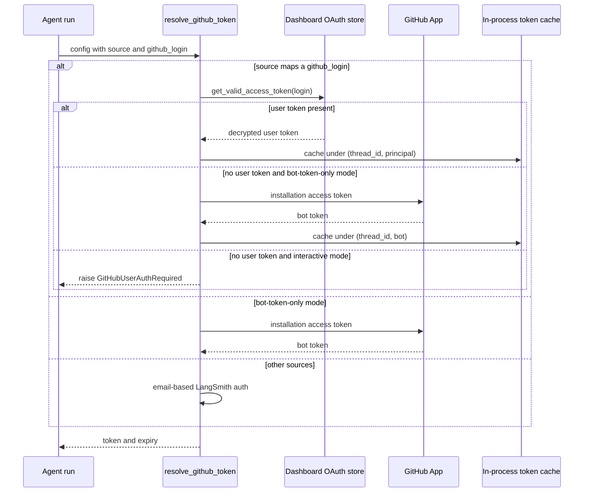

# Authentication, Authorization & Security Boundaries

This page documents the trust boundaries around Open SWE: how the agent obtains
a GitHub token to act on a user's behalf, how inbound webhooks from GitHub,
Slack, Linear, and the platform's own run-completion callback are authenticated,
how the dashboard authenticates browsers and desktop clients, how credentials
are encrypted at rest, and how server-side tools that read attacker-influenced
content are authorized and scoped.

Related pages: [integrations/observability-and-mcp](../integrations/observability-and-mcp.md),
[concepts/tools](./tools.md),
[architecture/sandbox-lifecycle](../architecture/sandbox-lifecycle.md),
[testing/overview](../testing/overview.md) (see `tests/auth`).

## GitHub dual-mode authentication

The agent needs a GitHub token to clone repos, open PRs, and post comments. It
resolves one of two token kinds, decided by deployment configuration and the run
source, through `resolve_github_token` in `agent/utils/auth.py`.

- **Per-user OAuth token.** For sources that carry a mapped GitHub login
  (`slack`, `linear`, `dashboard`, `schedule`), the agent prefers the triggering
  user's own GitHub OAuth token from the dashboard credential store so that PRs
  and comments are attributed to that user. This preference wins *even in
  bot-token-only mode*.
- **GitHub App installation token.** When no valid per-user token is available
  and the deployment is in bot-token-only mode, the agent falls back to a GitHub
  App installation token minted in `agent/utils/github_app.py`. In non-bot mode,
  a missing user token instead raises `GitHubUserAuthRequired` to force
  (re-)authentication rather than silently acting as the bot.

`is_bot_token_only_mode()` returns true when `LANGSMITH_API_KEY_PROD` is set but
neither `X_SERVICE_AUTH_JWT_SECRET` nor `USER_ID_API_KEY_MAP` is configured —
i.e. the deployment cannot resolve per-user OAuth tokens and must use the App
installation token for git operations.

Token resolution paths and their fallbacks in `resolve_github_token`.

### In-process-only token caching

Resolved GitHub tokens are cached only in process memory, keyed by
`(thread_id, principal)` where the principal isolates one user's token from
another (`login:` or `email:` normalized), plus a distinct `bot` principal for
installation tokens. The cache in `agent/utils/github_token.py` never persists
tokens; entries expire on the token's own expiry (with a 60-second skew) or a
hard 24-hour TTL cap, whichever comes first, and `invalidate_cached_github_token`
clears a thread's entries when a 401 (`GitHubAuthError`) shows the token is
stale. `cache_github_token_for_thread` refuses to cache an unbound user token
that has no principal.

GitHub App installation tokens are separately cached in `github_app.py`, keyed by
a scope tuple of installation id, repository ids/names, and requested
permissions, and reused until within a 10-minute margin of expiry. This margin is
deliberately larger than the proxy's refresh window so a near-expiry refresh
mints a genuinely fresh token.

### Powering the LangSmith GitHub proxy

Whatever token is resolved becomes the credential the sandbox uses through the
LangSmith GitHub proxy rather than being handed to the sandbox directly. The
proxy rules in `agent/integrations/langsmith.py` inject the real token on the
wire as an `Authorization: Bearer`/`Basic` header for `api.github.com` and
`github.com`, while the sandbox only ever sees a placeholder `GH_TOKEN` value. A
before-model middleware (`refresh_github_proxy_before_model`) refreshes the proxy
token as it nears expiry so long runs never operate with an expired credential.

## Dashboard authentication

The dashboard authenticates browsers via GitHub App OAuth and a signed-JWT
session cookie, implemented in `agent/dashboard/oauth.py` with routes in
`agent/dashboard/routes.py`.

- `GET /auth/login` starts the OAuth flow: it mints a random state nonce, stores
  its HMAC in a signed state JWT, sets the raw nonce in an `osw_oauth_state`
  cookie, and redirects to GitHub's authorize URL.
- `GET /auth/callback` verifies the state by comparing
  `hash_state_nonce(cookie_nonce)` against the state JWT's `nonce_hash` with a
  constant-time compare, exchanges the code for user-to-server tokens, resolves
  the login/email, enforces the org login gate, persists the encrypted tokens,
  and issues a session (a `HS256` JWT in the `osw_session` cookie signed with
  `DASHBOARD_JWT_SECRET`, valid 7 days).
- `GET /me` returns the signed-in identity plus `is_admin` and whether Slack
  OAuth is enabled; `require_session` rejects requests without a valid session
  cookie.

Post-login redirects are sanitized: `sanitize_redirect_to` allows only
same-origin relative paths or origins on the dashboard allowlist
(`DASHBOARD_BASE_URL` + `DASHBOARD_ALLOWED_ORIGINS`), blocking open-redirect
paths, so a login link cannot be steered to an attacker origin.

### Org login gate

`enforce_org_login_gate` rejects dashboard login for users outside the allowed
GitHub org(s) named in `ALLOWED_GITHUB_ORGS`. Membership is checked with the
GitHub App installation token and is **fail-closed** on any API error. When the
allowlist is empty the gate is disabled (fail-open) to preserve existing
deployments.

### CSRF and cross-origin defense

Cookie-authenticated mutations are protected by an origin allowlist.
`require_same_origin` (and `require_same_origin_for_mutations`) rejects a request
whose `Origin`/`Referer` is not in the dashboard allowlist, defending the ambient
session cookie against CSRF. Safe methods (`GET`/`HEAD`/`OPTIONS`) are exempt,
and a request whose only credential is an explicit bearer GitHub token (no
session cookie) is exempt because a browser cannot forge it.

### Desktop handoff and terminal tickets

Desktop login uses PKCE so a session is never placed on a loopback URL. The
browser receives a short-lived (`HANDOFF_TTL_SECONDS`) handoff JWT that carries
identity plus the desktop app's S256 challenge; `redeem_desktop_handoff` mints
the actual session only when presented with the matching verifier, compared in
constant time. Cloud-terminal access uses a 60-second `issue_terminal_ticket`
JWT bound to a specific `thread_id` and a fixed audience, re-verified by
`decode_terminal_ticket`.

### Slack account linking via verified OIDC

Slack accounts are linked to GitHub identities through Slack's OpenID Connect
flow (`agent/dashboard/slack_oauth.py`), which yields a *verified* Slack
identity. `verify_team` refuses identities from a different Slack workspace when
`SLACK_TEAM_ID` is configured — the Slack Connect / cross-workspace refusal.
Because a shared Slack thread must never carry a per-user auth URL (anyone in the
thread could complete it and bind the wrong account), auth-failure notices posted
to Slack are token-free and point the user to `build_settings_url()`, where they
sign in from their own session and connect Slack via verified OIDC.

## Webhook signature verification

Every inbound webhook is authenticated before its payload is trusted. All three
verifiers fail closed when their secret is unconfigured and use constant-time
comparison.

- **GitHub** — `verify_github_signature` (`agent/utils/github_comments.py`)
  recomputes `sha256=HMAC(secret, body)` and compares against
  `X-Hub-Signature-256`. It returns `False` when `GITHUB_WEBHOOK_SECRET` is
  unset (fail-closed) and is enforced by `agent/webhooks/github_routes.py`.
- **Slack** — `verify_slack_signature` (`agent/utils/slack.py`) validates the
  `v0:timestamp:body` HMAC against the Slack signature, and additionally rejects
  requests whose timestamp is more than 300 seconds old to block replay.
- **Linear** — `verify_linear_signature` (`agent/webhooks/common.py`) compares
  the raw-body HMAC against the `Linear-Signature` header.

### Run-completion webhook (fail-closed shared secret)

The platform POSTs run-completion payloads to the publicly reachable
`/webhooks/run-complete` route. `verify_run_complete_token` in
`agent/completion.py` authenticates the call with a shared-secret bearer token
(`RUN_COMPLETE_WEBHOOK_SECRET`) using constant-time compare. It is
**fail-closed**: when the secret is unset, every call is rejected and run-failure
replies stay disabled, so an attacker hitting the public route cannot trigger
completion side effects.

## Encryption at rest

All persisted third-party credentials are encrypted before storage.
`agent/encryption.py` builds a `MultiFernet` from `TOKEN_ENCRYPTION_KEY`, which
may hold a comma/newline-separated list of keys (most-recent-first): the first
key encrypts, every key is tried for decryption, enabling key rotation.
`encrypt_token`/`decrypt_token` are used by the credential stores —
`dashboard/profiles.py` (GitHub OAuth access/refresh tokens),
`dashboard/user_credentials.py`, `dashboard/team_credentials.py`, and
`dashboard/notion_oauth.py`. `decrypt_token` degrades gracefully (returns `""`)
on an invalid token or a missing key rather than raising.

Stored GitHub OAuth tokens are rotated with their refresh token; when GitHub
signals an unrecoverable refresh error (`bad_refresh_token`,
`unauthorized_client`), the stored authorization is deleted so callers prompt a
clean re-login instead of serving a known-stale token.

## Authorization gates

### Admin gate

`agent/dashboard/admin.py` derives admins from the `CONFIGURED_ADMINS` env var
(matched case-insensitively against email or login). `agent/tools/admin_gate.py`
re-checks the triggering user against `CONFIGURED_ADMINS` at tool-call time, so a
thread whose metadata merely claims to be an "admin" thread cannot act on behalf
of a non-admin.

### Observability authorization

`is_observability_authorized` grants team observability access to configured
admins plus any email in `OBSERVABILITY_AUTHORIZED_EMAILS`. In
`agent/server.py`, `_observability_authorized` evaluates this per run against the
triggering user's login and candidate emails, and only then does
`_load_observability_tools` expose the team's Datadog and LangSmith tools. The
gate is intentionally kept uncached so it always reflects the current run's
config. Its purpose is explicit: prompt-injected runs from untrusted
contributors must not be able to reach the team's Datadog/LangSmith data.

## Security posture for server-side tools

Optional server-side tools — Datadog and LangSmith observability, and the
Corridor MCP server — run inside the LangGraph server process and call their APIs
directly; the sandbox never holds these credentials. Their surface is
intentionally read-only (fetch a run/trace, list recent runs, `analyzePlan`),
and access to team data is gated by observability authorization, precisely
because the content these tools return is attacker-influenceable (PR bodies,
comments, trace contents) and could carry prompt-injection payloads. The prompt
layer additionally wraps untrusted GitHub comment content in reserved
`<dangerous-external-untrusted-users-comment>` tags, and
`sanitize_github_comment_body` strips those reserved tags from raw comment bodies
so external content cannot spoof the trust wrapper.

## Focused tests

The behaviors above are exercised under `tests/auth`: source-routed token
resolution (`test_auth_sources.py`), the in-process token cache TTL and
principal isolation (`test_github_token_ttl.py`), OAuth refresh and unrecoverable
refresh handling (`test_github_oauth_refresh.py`), Fernet encryption and key
rotation (`test_encryption.py`), Slack OIDC linking (`test_slack_oauth.py`), and
per-user/team credential storage (`test_user_credentials.py`).
