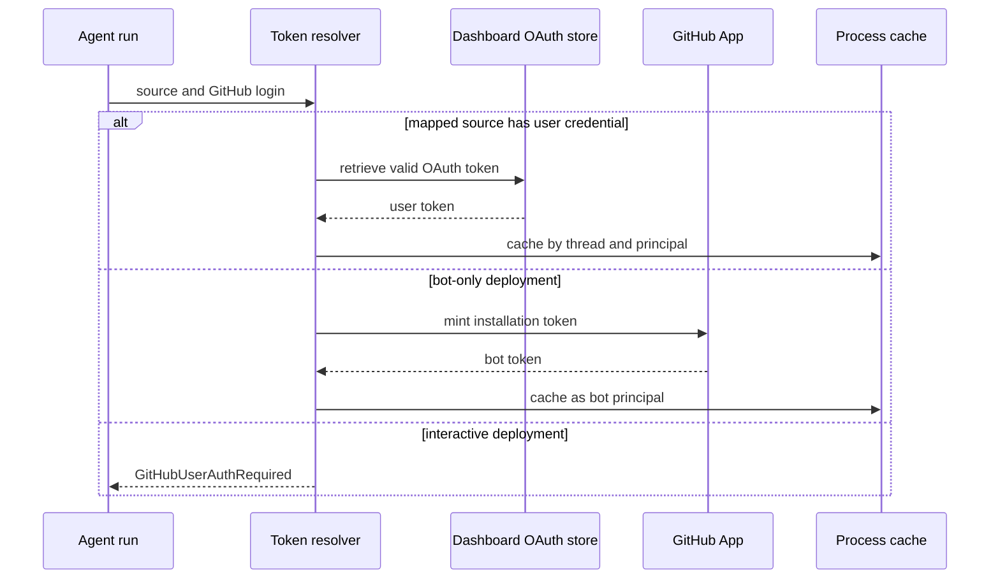

# Authentication, Authorization, and Secret Boundaries

Open SWE crosses distinct trust boundaries: dashboard users authenticate with GitHub, external systems deliver webhooks, agent runs need GitHub authority, and sandboxed code must not receive long-lived secrets. This page describes the enforcement points and their failure modes. See also [sandbox lifecycle](../architecture/sandbox-lifecycle.md), [tools](./tools.md), [dashboard UI](../integrations/dashboard-ui.md), [configuration](../operations/configuration.md), and [invocation](../workflows/invocation.md).

## GitHub authority for runs

`agent.github.token.resolve_github_token` chooses an acting credential from run context. For `slack`, `linear`, `dashboard`, and `schedule` runs with a mapped `github_login`, it first reads that user's valid dashboard OAuth credential. This lookup deliberately wins even in bot-token-only mode, preserving user attribution for operations such as pull-request creation. If it is unavailable, interactive mode raises `GitHubUserAuthRequired`; only bot-token-only mode falls back to the GitHub App installation credential. Bot-only mode is the deployed configuration where `LANGSMITH_API_KEY` is present and neither `X_SERVICE_AUTH_JWT_SECRET` nor `USER_ID_API_KEY_MAP` can support per-user LangSmith auth.

For other interactive paths, GitHub-originated runs map login to email and use the LangSmith user-auth flow; other sources use the configured user email. A missing source is an error because the system cannot safely route an auth failure response.

Token resolution for a mapped, user-triggered run.

### Cache and GitHub App lifetimes

Run-token cache entries live only in process memory and are keyed by `(thread_id, principal)`. Normalized `login:` or `email:` principals isolate users; `bot` is a separate principal. The cache refuses an unbound user token, expires an entry at token expiry with a 60-second skew or after 24 hours, and can invalidate every entry for a thread after stale or revoked credentials are detected.

The App signs an RS256 JWT—issued 60 seconds in the past for clock skew and valid for nine minutes—and exchanges it for an installation access token. Its in-process cache is segregated by installation ID, repository IDs/names, and requested permissions. Cached installation tokens are no longer reused within ten minutes of expiry. Missing App configuration or an invalid installation yields no token rather than an unauthenticated request.

### Sandbox proxy boundary

A LangSmith sandbox is configured with a GitHub **App installation** token through opaque proxy headers. The sandbox environment receives `GH_TOKEN=proxy-injected`, not the real token; API traffic to `api.github.com` receives Bearer auth and traffic to `github.com` receives Basic `x-access-token` auth. The proxy token expiry record retains repository and permission scope so a refresh cannot broaden authority. Before each model call, middleware refreshes a near-expiry proxy token; a reused sandbox that cannot be reconfigured is treated as unreachable rather than silently continuing with stale access.

## Dashboard authentication

The dashboard uses the GitHub App OAuth code flow and an HS256 session JWT signed with `DASHBOARD_JWT_SECRET`. `osw_session` is valid for seven days; `require_session` rejects absent or invalid sessions, and `/me` returns the session identity and a freshly evaluated `is_admin` flag.

`GET /dashboard/api/auth/login` generates a random nonce, places its HMAC in the signed state JWT, and stores the raw nonce in `osw_oauth_state`. The callback constant-time compares the recomputed HMAC before exchanging the OAuth code and identifying the GitHub user. It applies the organization gate before persisting the OAuth result or issuing a session. `sanitize_redirect_to` admits only a non-protocol-relative relative path or an absolute origin in `DASHBOARD_BASE_URL` plus `DASHBOARD_ALLOWED_ORIGINS`; it rejects login and API callback paths to prevent open-redirect loops and attacker-controlled destinations.

Session cookies are `HttpOnly`. The API uses `Secure; SameSite=None` only for HTTPS split-origin deployments; same-origin or HTTP deployments use `SameSite=Lax`. The state cookie is also `HttpOnly`, `SameSite=Lax`, scoped to `/dashboard/api/auth`, and has the 10-minute state lifetime.

### Membership, desktop, and automation entrypoints

`ALLOWED_GITHUB_ORGS` is a shared comma-separated allowlist. With entries, a login must be an active member of at least one organization; membership is checked through that organization's App installation with `members: read`, and missing installation/token, HTTP/parsing error, or inactive/non-member result fails closed with 403. With no entries, login intentionally fails open for compatibility and logs once per process that all GitHub accounts may log in and read surfaced threads.

Desktop login avoids placing a browser session on the loopback redirect. The callback instead sends a 120-second signed handoff code containing inert identity claims and the app's S256 PKCE challenge to a fixed `127.0.0.1` callback. The desktop exchange mints a session only after a constant-time verifier check. Cloud terminal tickets are separate 60-second JWTs, validated for fixed audience and the requested `thread_id`.

Cookie-authenticated mutations have an origin check: safe methods are exempt, and unsafe requests must have an allowed `Origin` or `Referer` when dashboard origins are configured. Bearer-only GitHub-token requests without a session cookie are exempt because the credential is not ambient browser state. No configured dashboard origins makes this check a local-development fail-open default. CORS is added only for configured origins and refuses `*` with credentials.

Certain admin endpoints additionally accept an explicit GitHub bearer token or Actions OIDC token. For a GitHub token, the service resolves `/user` and, if needed, the primary address from `/user/emails`, then requires that login or email to match `CONFIGURED_ADMINS`; an installation token that cannot identify a user is rejected.

Slack account linking uses Slack OIDC claims rather than user-supplied identity. If `SLACK_TEAM_ID` is configured, a different workspace is rejected, including Slack Connect identities. Authentication failure notices in shared Slack threads link only to the token-free dashboard settings URL, never to a user-specific authorization URL.

## Authenticating inbound calls

Webhook verifiers operate on raw request bodies and fail closed when their secret is missing:

- GitHub computes `sha256=HMAC(GITHUB_WEBHOOK_SECRET, body)`, constant-time compares `X-Hub-Signature-256`, and the GitHub route rejects failures before parsing the payload.
- Slack constant-time compares the HMAC of `v0:timestamp:body` and rejects timestamps more than 300 seconds from now, limiting replay.
- Linear constant-time compares its raw-body HMAC-SHA256 against `Linear-Signature`.
- `/webhooks/run-complete` compares its query token with `RUN_COMPLETE_WEBHOOK_SECRET` in constant time. Without that secret every call is rejected and run-failure replies remain disabled.

## Credential storage and authorization gates

`TOKEN_ENCRYPTION_KEY` may contain one key or a newest-first comma/newline-separated Fernet key list. `MultiFernet` encrypts with the first key and attempts all keys for decryption, supporting rotation. Invalid ciphertext or an unavailable key yields an empty decrypted value rather than raising. Dashboard profile OAuth records encrypt both GitHub access and refresh tokens before storing them. A near-expiry GitHub credential is refreshed under a per-login lock; GitHub's permanent `bad_refresh_token` and `unauthorized_client` errors cause the old authorization to be deleted unless a concurrent OAuth callback has already replaced it.

Authentication is not authorization. `CONFIGURED_ADMINS` matches emails or logins case-insensitively, and `require_admin` checks the triggering run identity at tool-call time instead of trusting thread metadata. Team observability tools are exposed only when the current run's identity is an admin or its email is in `OBSERVABILITY_AUTHORIZED_EMAILS`; the decision is intentionally evaluated per run to prevent attacker-influenced thread state from granting access.

Unmapped GitHub comment content is wrapped in reserved `<dangerous-external-untrusted-users-comment>` tags. Raw comments have those reserved tags replaced before wrapping, so an external author cannot forge the trusted delimiter.

## Focused verification

`tests/auth/test_auth_sources.py` covers source-aware selection, user-over-bot precedence, bot fallback, and Slack notice secrecy. `tests/dashboard/test_dashboard_oauth_redirect.py` covers redirect allowlisting, state-cookie binding, and PKCE desktop exchange. Organization-gate tests cover active membership, multiple organizations, configured fail-closed behavior, unconfigured fail-open behavior, and the once-only warning. `tests/dashboard/test_github_token_auth.py` covers GitHub bearer identity resolution and the admin gate; `tests/sandbox/test_proxy_auth.py` verifies opaque proxy injection and that real keys do not enter sandbox environment variables.
