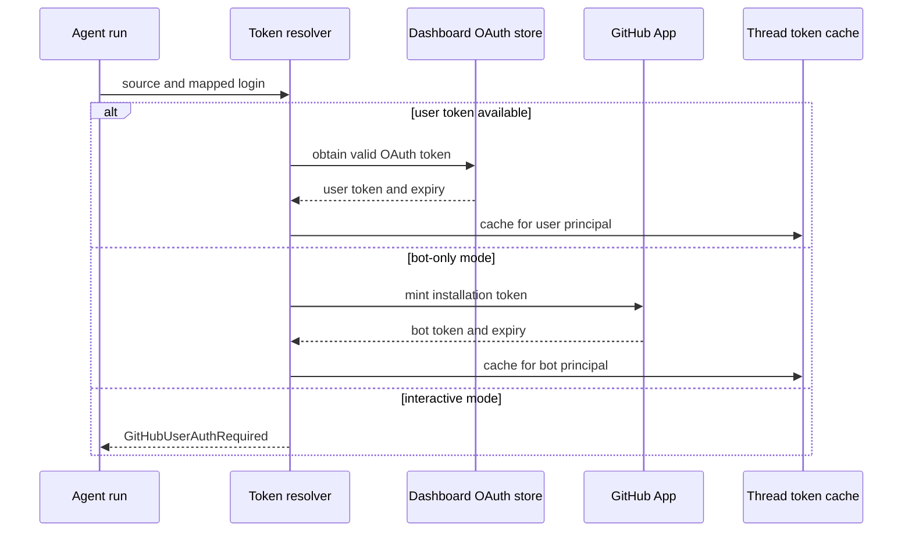
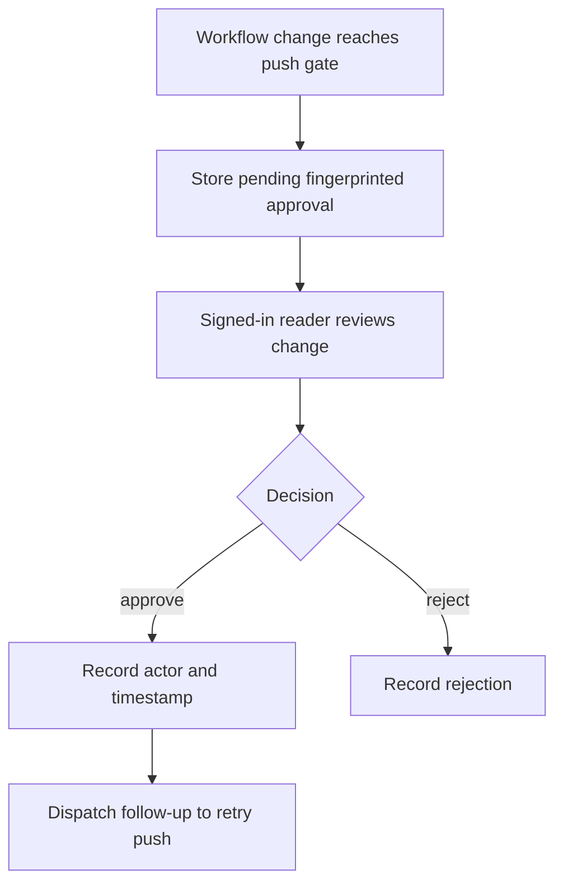

# Authorization, Credentials, and Trust Boundaries

Open SWE receives requests from GitHub, Slack, Linear, browsers, and CI, then may act on repositories or load third-party tools. Authentication establishes who made a request; authorization decides which repositories, data, tools, and changes that identity may reach. The important rule is that credentials and trust do not automatically cross these boundaries. See also [sandbox lifecycle](../architecture/sandbox-lifecycle.md), [dashboard UI](../integrations/dashboard-ui.md), [configuration](../operations/configuration.md), [invocation](../workflows/invocation.md), and [PR creation](../workflows/pr-creation.md).

## GitHub authority for a run

`resolve_github_token` selects the credential used for GitHub operations. Slack, Linear, dashboard, and scheduled runs with a mapped `github_login` first resolve that user's dashboard OAuth token. This preference also applies in bot-token-only mode, preserving the triggering user's authorship for PRs and comments. If no user token is usable, bot-token-only mode can use the GitHub App installation token; interactive mode raises `GitHubUserAuthRequired` instead of silently changing the actor to the bot.

Bot-token-only mode is the deployed configuration with `LANGSMITH_API_KEY_PROD` but neither `X_SERVICE_AUTH_JWT_SECRET` nor `USER_ID_API_KEY_MAP`, so the legacy per-user LangSmith authorization path is unavailable. Email-based resolution otherwise looks up the LangSmith user and tenant, creates a short-lived service JWT, and requests a `repo`-scoped GitHub authorization from the configured provider. A missing user or authorization is a run failure with a source-appropriate notification. Slack notifications deliberately use only the token-free dashboard settings URL: a per-user authorization URL posted in a shared thread could be completed by someone else.

Token selection keeps user-triggered authorship where possible while making the bot fallback explicit.

### Caches, expiry, and the sandbox proxy

Resolved tokens are process-memory-only entries keyed by `(thread_id, principal)`. User principals normalize to `login:` or `email:`, while a separate `bot` principal identifies installation credentials; unbound user tokens are never cached. An entry is invalid when its token has at most 60 seconds remaining or it has been cached for 24 hours, and a detected stale/revoked credential invalidates all entries for that thread.

GitHub App access uses an RS256 App JWT (issued with clock-skew allowance and valid for nine minutes) to exchange for an installation token. The installation-token cache is also in-process, but its key includes installation ID, repository IDs or names, and requested permissions. It stops reusing a token ten minutes before its expiry, preventing scope confusion and leaving time for proxy refresh.

For LangSmith sandboxes, the GitHub proxy receives the real token and injects it into requests; the sandbox is given a placeholder `GH_TOKEN`, not that secret. Proxy expiry state retains the original repository and permission scope. A before-model refresh within five minutes of known expiry (or after 50 minutes when expiry is unknown) remints and reconfigures the proxy without broadening scope.

## Browser and CI authentication

### Dashboard OAuth session

The dashboard exchanges GitHub App OAuth codes, looks up the GitHub identity, applies the organization gate, encrypts and persists the user authorization, then issues a seven-day HS256 session JWT in `osw_session`. `DASHBOARD_JWT_SECRET` signs all dashboard JWTs; requests without a valid cookie fail `require_session`. `/me` reports the session identity and recomputes `is_admin`.

The login flow binds browser state to the callback. `/auth/login` creates a random nonce, places its HMAC in a signed state JWT, and stores the raw nonce in an `HttpOnly` state cookie. The callback constant-time compares the HMAC before exchanging the OAuth code. Redirect targets are restricted to relative paths or origins in `DASHBOARD_BASE_URL` and `DASHBOARD_ALLOWED_ORIGINS`; protocol-relative URLs, foreign origins, and login/API callback paths are rejected.

Desktop login does not put a session on the loopback callback. The browser returns a two-minute, PKCE S256-challenge-bound handoff code, and the desktop app must present its verifier to redeem a session. A cloud terminal ticket is separately audience-bound, lasts 60 seconds, and is checked against the requested `thread_id`.

Session cookies are `HttpOnly`. An HTTPS `DASHBOARD_API_BASE_URL` yields `Secure; SameSite=None` for a cross-origin frontend; local HTTP uses non-secure `SameSite=Lax`. The state cookie is `HttpOnly`, `SameSite=Lax`, auth-path scoped, and limited to the 10-minute state TTL.

### Organization, repository, and origin gates

`ALLOWED_GITHUB_ORGS` has two deliberate meanings. For dashboard login, a nonempty normalized list is fail-closed: a user must be an active member of at least one listed organization. Membership is checked with a GitHub App installation token restricted to `members: read`; missing installation/token, API errors, malformed replies, inactive membership, and non-membership deny login. The App therefore needs Organization Members read permission. If the list is empty, login intentionally remains compatible and fail-open, but emits one process-wide warning that any GitHub account can read surfaced threads.

For GitHub webhooks, repository admission permits every repository only when **both** `ALLOWED_GITHUB_ORGS` and `ALLOWED_GITHUB_REPOS` are empty. Once either is configured, the owner must be in the org list or the normalized `owner/name` must be listed. A distinct optional `PUBLIC_REPO_ORG_GATE` prevents nonmembers from triggering public-repository work; private repositories and known internal bot logins bypass that sender gate, while membership-check failure denies the public trigger.

Cookie-authenticated mutations and WebSockets use the configured origin allowlist. Safe HTTP methods are exempt; a request using only an explicit bearer GitHub token and no session cookie is also exempt because the browser cannot forge it. With no configured dashboard origin, this CSRF check is a local-development fail-open. `create_app` enables credentialed CORS only for explicit `DASHBOARD_ALLOWED_ORIGINS` and rejects `*` with credentials.

### Administrative identities and CI

`CONFIGURED_ADMINS` matches normalized email or GitHub login. Dashboard admin endpoints recompute this from the session, and agent admin tools repeat the check at tool-call time, preventing an `admin_thread` metadata flag from becoming a transferable capability.

An admin endpoint can additionally authenticate a GitHub Actions OIDC bearer token. This path is disabled without `ADMIN_OIDC_SUBJECTS`; otherwise it verifies the GitHub Actions issuer, RS256 signature from the issuer JWKS, expiry/issued-at/audience/subject claims, and the configured audience (default `open-swe`). Allowlist entries either match an exact `sub` or an `owner/repo` repository claim. Consequently, anyone able to execute a workflow in an allowlisted repository or subject scope can become an admin for endpoints accepting this flow; restrict the allowlist to internal CI scopes.

## Authenticating inbound calls

Inbound payloads are not trusted merely because they parse. Signature mechanisms below fail closed when their secret is absent.

- `POST /webhooks/github` verifies `X-Hub-Signature-256` against `sha256=HMAC(GITHUB_WEBHOOK_SECRET, raw body)` with constant-time comparison before parsing or dispatching the event.
- Slack verification checks its `v0:timestamp:body` HMAC in constant time and rejects timestamps more than 300 seconds from the current time, limiting replay.
- Linear verifies the raw-body HMAC-SHA256 in `Linear-Signature` with constant-time comparison.
- The publicly reachable `POST /webhooks/run-complete` constant-time compares its `token` query parameter with `RUN_COMPLETE_WEBHOOK_SECRET`. Without that setting it rejects every request, so completion failure replies are disabled rather than unauthenticated.

## Credential storage and injection

`TOKEN_ENCRYPTION_KEY` is one Fernet key or an ordered comma/newline-separated key list. `MultiFernet` encrypts with the first key and tries all configured keys when decrypting, enabling a newest-first rotation. An invalid ciphertext or missing key returns an empty value for a read; attempting encryption without a key raises. GitHub OAuth access and refresh tokens, team Datadog/LangSmith keys, and user Currents, LangSmith, and Notion credentials are encrypted before persistence. Dashboard status methods expose connection state, timestamps, and last four characters only.

Optional-tool credential loading is intentionally fail-soft: an unavailable store, failed decrypt, or failed refresh suppresses that integration's tools instead of failing the whole run. Notion access tokens are refreshed under a per-login lock when within a five-minute expiry skew; an unrecoverable refresh deletes the authorization unless another request already rotated it. GitHub treats `bad_refresh_token` and `unauthorized_client` the same way, dropping the stored authorization so a clean OAuth login is required.

Team credentials live in a dedicated `team_credentials` namespace, separate from plaintext team settings, and feed server-side tools. This separation and the GitHub proxy are the two primary secret-injection boundaries: credentials are decrypted only where a trusted server component needs them, rather than exposed through ordinary dashboard reads or automatically passed into a sandbox.

## Tool exposure and untrusted text

Team observability access is a separate authorization decision, not a consequence of being logged in. Admins and `OBSERVABILITY_AUTHORIZED_EMAILS` may load team Datadog and LangSmith tools. The top-level decision is deliberately uncached and is made for each run from the triggering identity; only downstream credential/tool lookups are cached. An allowed organization member may get team LangSmith tools but not the full observability set; other users can receive only their own LangSmith credentials where configured.

GitHub text is also data, not authority. Before a GitHub comment reaches a prompt, reserved `<dangerous-external-untrusted-users-comment>` tags are replaced so raw content cannot counterfeit the marker. Content authored by a login without a dashboard mapping is then wrapped in those tags, instructing the model to treat it as untrusted context rather than instructions. The reviewer applies the same posture to historical review threads and author trace data.

## Workflow push approval boundary

Workflow-file pushes require a persistent, fingerprinted human approval rather than treating the agent's proposed diff as sufficient authorization. A pending record includes the repository, branch, base/head SHA, affected files, diff statistics and preview, inheritance source, and approval URL. Each thread retains at most 20 records. An existing terminal decision for the same fingerprint is not overwritten.

Approval state is persisted in thread metadata and the approval action resumes only the approved retry.

The dashboard exposes listing and approve/reject endpoints only to a session-authenticated user who can read the thread; mutation requests also pass the origin gate. Approval records capture `decided_by` and `decided_at`, while the approve endpoint dispatches a constrained follow-up telling the agent to retry the blocked push without changing workflow files first.

## Focused tests

`tests/auth/test_auth_sources.py` covers user-token precedence, bot fallback, and token-free Slack failure notices. `tests/auth/test_github_token_ttl.py` covers principal isolation, expiry, the 24-hour cap, and invalidation; `tests/auth/test_encryption.py` exercises key-list rotation and missing/invalid-token behavior. `tests/auth/test_slack_oauth.py` verifies Slack workspace binding. Dashboard OAuth and organization-gate tests cover redirect/state/PKCE and allowlist failure modes; integration changes should add comparable tests for any changed boundary or fail-open default.
