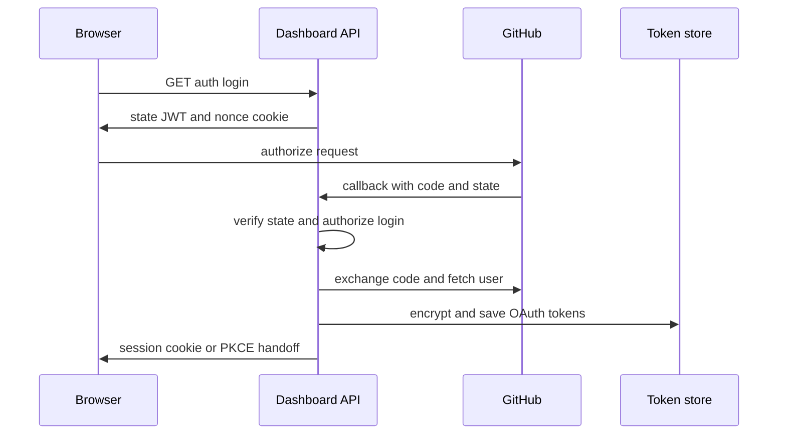

# Identity, Credentials, and Security Boundaries

Open SWE distinguishes browser identity, integration identity, GitHub acting authority, and local-machine authority. These are separate decisions: a valid dashboard session does not itself grant an arbitrary repository or personal credential; a valid webhook only establishes its sender; and a desktop run has filesystem access only within a locally approved root. Related operational settings are described in [configuration](../operations/configuration.md), dashboard behavior in [dashboard UI](../integrations/dashboard-ui.md), and run entrypoints in [invocation](../workflows/invocation.md).

## Dashboard identity and account linking

The dashboard's normal sign-in is GitHub App OAuth. `GET /auth/login` generates a random nonce, puts an HMAC of it in a short-lived signed `state` JWT, and places the raw nonce in `osw_oauth_state`. The callback decodes state, constant-time compares the cookie-derived HMAC, exchanges the code, obtains the GitHub user, applies the login gate, persists the OAuth result, signs the user in, and issues the dashboard session. A missing App client ID can use `gh`-CLI development login only when the development-login guard permits it; it is still subject to the same login gate.

```mermaid
sequenceDiagram
    participant Browser
    participant API as Dashboard API
    participant GitHub
    participant Store as Token store

    Browser->>API: GET auth login
    API->>Browser: state JWT and nonce cookie
    Browser->>GitHub: authorize request
    GitHub->>API: callback with code and state
    API->>API: verify state and authorize login
    API->>GitHub: exchange code and fetch user
    API->>Store: encrypt and save OAuth tokens
    API->>Browser: session cookie or PKCE handoff
```

The GitHub dashboard OAuth and desktop handoff flow.

`osw_session` is an HS256 JWT signed by `DASHBOARD_JWT_SECRET` and expires after seven days. `require_session` rejects absent or invalid cookies and binds the resulting person identity to the current audit entry. The `HttpOnly` session cookie is `Secure; SameSite=None` when the dashboard API base URL is HTTPS and cross-origin; otherwise it is non-secure and `SameSite=Lax`. The OAuth-state cookie is `HttpOnly`, `SameSite=Lax`, limited to the 10-minute state lifetime, and scoped to the authentication path. Redirect targets are restricted to safe relative paths or configured dashboard origins; login/API paths and unlisted origins are rejected.

At startup, production authentication requires `ALLOWED_GITHUB_USERS` or `ALLOWED_GITHUB_ORGS`, unless `OPEN_SWE_LOCAL_AUTH_TOKEN` is set for local operation. An allowed login is matched case-insensitively against the user list, or must be an active member of a configured organization. Organization membership is resolved through GitHub App authority and a failed check does not authorize the account. `CONFIGURED_ADMINS` is separate: it grants administration only when the current session login or email matches its case-insensitive entries.

Slack linking is performed after GitHub sign-in with Slack OIDC scopes `openid email profile`, so the link uses Slack's verified user claims rather than caller-supplied identifiers. If `SLACK_TEAM_ID` is configured, the returned Slack team must match, rejecting accounts from other workspaces. Shared Slack prompts send people to the token-free dashboard connections URL rather than embedding a credential-bearing authorization link.

### Desktop handoff

Desktop authentication deliberately does not leave a browser session on its loopback listener. The desktop app opens a listener only on `127.0.0.1`, generates a PKCE verifier and S256 challenge, and supplies the challenge and an ephemeral port to the dashboard flow. After GitHub authentication, the server redirects only to the fixed `http://127.0.0.1:<port>/callback` shape with a two-minute signed handoff code; the desktop exchange must prove possession of the verifier with a constant-time challenge comparison before it receives a session JWT. The handoff code contains identity claims, not a session.

## Authorization and GitHub credential scope

Thread metadata is the boundary for personal GitHub authority. Before resolving a token, `private_credential_login` reads the saved thread metadata. Public threads resolve no personal credential and use a GitHub App installation token. A private thread can use a personal GitHub OAuth token only when the initiating run's GitHub login matches the saved private `owner_login`; system threads cannot be private. Unknown visibility or owner type, a missing owner, or a mismatched requester fails rather than borrowing another account's credential. A missing valid personal token raises `GitHubUserAuthRequired`; it does not fall back to the App token.

This is also the authorship boundary. In shared user-owned threads, a requested PR author must be a recorded participant; for private threads, authorship remains pinned to the owner. Background completion cannot infer a user author for user-owned/private thread state and fails unless a permitted participant is explicitly named. System threads use App authority.

Resolved run tokens are process-memory entries keyed by `(thread_id, principal)`, where user principals normalize a login or email and bot tokens use a distinct principal. Unbound user credentials are not cached. User entries expire at their own expiry with a 60-second skew or after 24 hours; a token resolution clears prior entries for the thread, avoiding reuse under a changed actor. A bot entry can be re-minted with its recorded repository scope rather than widened.

GitHub App installation tokens are also in-memory only. The App client exchanges its App authentication for an installation token, and caches it by installation ID, requested repository IDs/names, and requested permissions. A token is no longer reused within ten minutes of its known expiry. Missing App configuration returns no installation token (except the explicitly local `gh` CLI fallback), so callers must handle the absence rather than proceed unauthenticated.

For LangSmith sandboxes, proxy configuration is a routing/proxy control, not a general isolation guarantee. The proxy's per-thread record retains expiry, repository scope, permission scope, workspace, and base proxy configuration. Within five minutes of expiry (or after a 50-minute fallback age), refresh reconfigures the sandbox proxy using the recorded scope; a newly requested repository list is intersected with an existing recorded restriction. This prevents refresh from silently broadening an already scoped token.

## Credentials at rest

GitHub OAuth access and refresh tokens are stored in the `oauth_tokens` namespace separately from editable profiles, so profile updates cannot overwrite a concurrent login/refresh result. They are encrypted with `encrypt_token` before storage. `TOKEN_ENCRYPTION_KEY` accepts a most-recent-first comma- or newline-separated Fernet key list: `MultiFernet` encrypts with the first key and attempts all configured keys for decryption, enabling key rotation. Invalid ciphertext or a missing encryption key is logged and reads as an empty value rather than propagating plaintext or an exception.

## Request-origin and inbound-webhook boundaries

For configured dashboard origins, unsafe cookie-authenticated methods require an allowed `Origin` or `Referer`; safe methods are exempt. A request carrying only an explicit GitHub bearer token and no session cookie is exempt because it does not rely on an ambient browser credential. With no configured dashboard origin this CSRF check is deliberately a local-development no-op. Application CORS enables credentials only for configured origins plus `open-swe://app`, and startup rejects a wildcard origin with credentials.

Inbound integrations verify raw request bodies before interpreting their payload:

- GitHub requires `X-Hub-Signature-256` to constant-time match `sha256=HMAC(GITHUB_WEBHOOK_SECRET, body)`.
- Slack requires the `v0:timestamp:body` HMAC and rejects a timestamp more than 300 seconds away, limiting replay.
- Linear requires a constant-time raw-body HMAC-SHA256 match and separately rejects deliveries with a signed `webhookTimestamp` more than 60 seconds old.

All three signature helpers fail closed when their secret or required signature fields are absent. GitHub then routes only repositories assigned to a workspace; an unreadable ownership lookup returns 503 so GitHub can retry, while an unassigned repository is ignored. Linear additionally applies the repository allowlist before scheduling work.

External GitHub comment text is untrusted input. Reserved `<dangerous-external-untrusted-users-comment>` delimiters are replaced in raw bodies before the system adds its own wrapper, preventing a commenter from spoofing the trust marker.

## Audit trail

`AuditLogMiddleware` creates an audit envelope for every HTTP `POST`, `PUT`, `PATCH`, or `DELETE`, but persists it only for a dashboard API route whose request has an authenticated actor bound. It records the operation name, success inferred from response status, actor/user/API-key/workspace identifiers when supplied, request method/path, UUID path resources, and declared enrichments—not the request payload. Tool mutations can use `audit_tool`, which records their outcome and run/thread/workspace/sandbox delegation context without retaining arguments or return values. Writes use `append_safely`, so audit-store failures do not replace the primary request or tool outcome. Audit history is an admin-only read API with a maximum 31-day query range and cursor pagination.

## Desktop filesystem boundary

A desktop run's `local_project_path` is not trusted merely because it came from run configuration. The backend resolves symlinks with `realpath`, requires an existing directory, and permits it only if it exactly matches an entry in `OPEN_SWE_LOCAL_PROJECTS_FILE` or is below `OPEN_SWE_LOCAL_WORKTREES_DIR`. The local shell backend is rooted there and receives only a small allowlist of shell environment variables (`HOME`, locale, `PATH`, `SHELL`, and `TMPDIR`). Agent scratch results are routed outside the project to per-thread artifact directories, preventing normal artifacts from becoming repository changes. This is a local-path authorization boundary; it does not claim sandbox isolation for desktop execution.

## Focused tests

`tests/auth/test_auth_sources.py` exercises personal-token resolution and the refusal to downgrade a private run to bot authority. `tests/auth/test_thread_credential_scope.py` covers public/private/system scope, owner checks, participant authorship, cache separation, and background-completion restrictions. Encryption, OAuth refresh, Slack OAuth, private webhook ingress, and GitHub-token TTL behavior have focused tests in the remaining `tests/auth/` modules. Desktop loopback login is covered by `desktop/test/login-server.test.cjs`.
