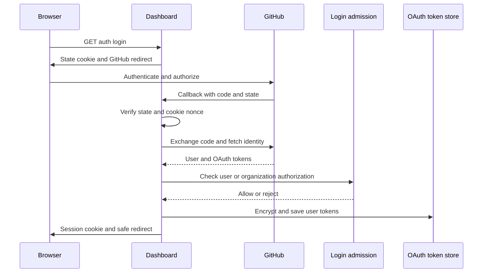

# Identity, Credentials, and Safety Boundaries

Open SWE separates **authentication** (who sent a request or owns an account) from **authorization** (which account, data, repository, or operation that identity may use). The main boundaries are the dashboard session, signed inbound webhooks, GitHub OAuth and App credentials, persisted per-user connections, and sandbox proxy injection. These controls are intentionally fail-closed at the places where a wrong identity could disclose credentials or mutate a repository.

Related topics: [Dashboard and Desktop Clients](../integrations/dashboard-ui.md), [Sandbox Provider Integration](../integrations/sandbox-providers.md), [invocation](../workflows/invocation.md), and [pull-request creation](../workflows/pr-creation.md).

## Dashboard identity and admission

The dashboard uses GitHub App OAuth. `GET /dashboard/api/auth/login` creates a cryptographically random nonce, puts its HMAC in a signed, ten-minute `state` JWT, stores the raw nonce in the HTTP-only `osw_oauth_state` cookie, and redirects to GitHub. At callback, the service decodes state and, for a browser login, constant-time compares the state HMAC against the cookie value before exchanging the authorization code and fetching `/user` (and, if necessary, primary email). The login gate runs **before** saving the GitHub token response and issuing a session.

A process cannot start normally without a configured admission mechanism: `validate_github_login_allowlist()` requires local auth, `ALLOWED_GITHUB_USERS`, or `ALLOWED_GITHUB_ORGS`. A login is admitted when it equals an allowed user or is an active member of an allowed organization. Organization membership is checked with a GitHub App installation token limited to `members: read`; absent App configuration, API failures, non-200 responses, malformed payloads, and non-active membership all deny access. This means an empty organization/user allowlist is not a production-wide-open fallback.

Successful authentication creates a seven-day HS256 session JWT signed by `DASHBOARD_JWT_SECRET` and places it in `osw_session`. `require_session` validates it and attaches the person identity to audit context. `/me` derives `is_admin` at request time rather than trusting a stale session claim. Sessions are `HttpOnly`; split-origin HTTPS deployments use `Secure; SameSite=None`, while same-origin and local HTTP use `SameSite=Lax`. The short-lived OAuth state cookie is `HttpOnly`, `SameSite=Lax`, and scoped to `/dashboard/api/auth`.

```mermaid
sequenceDiagram
    participant Browser
    participant Dashboard
    participant GitHub
    participant Admission as Login admission
    participant Store as OAuth token store

    Browser->>Dashboard: GET auth login
    Dashboard->>Browser: State cookie and GitHub redirect
    Browser->>GitHub: Authenticate and authorize
    GitHub->>Dashboard: Callback with code and state
    Dashboard->>Dashboard: Verify state and cookie nonce
    Dashboard->>GitHub: Exchange code and fetch identity
    GitHub-->>Dashboard: User and OAuth tokens
    Dashboard->>Admission: Check user or organization authorization
    Admission-->>Dashboard: Allow or reject
    Dashboard->>Store: Encrypt and save user tokens
    Dashboard->>Browser: Session cookie and safe redirect
```

Diagram: a browser is authenticated by GitHub, then separately authorized by the configured login gate before its credentials and dashboard session are created.

`sanitize_redirect_to` permits a relative non-protocol-relative path or an absolute URL whose origin is `DASHBOARD_BASE_URL` or `DASHBOARD_ALLOWED_ORIGINS`; it excludes login and API callback paths. This prevents an OAuth completion from becoming an open redirect. For local development only, `auth/dev-login` may use the `gh` CLI identity when development login is enabled; it still applies the same login gate.

### Desktop, sessions, and browser mutation defense

Desktop login never places a browser session on the loopback redirect. The desktop client supplies an S256 PKCE challenge and port; after normal OAuth and admission, the browser receives a 120-second handoff JWT containing identity claims and the challenge, addressed only to fixed `127.0.0.1`. `POST /auth/desktop/exchange` mints the session only when the client presents a verifier whose hash constant-time matches that challenge. Cloud-terminal tickets are distinct 60-second signed JWTs, audience-bound and constant-time bound to the requested `thread_id`.

Every dashboard router is guarded by `require_same_origin_for_mutations`. Safe HTTP methods are exempt; unsafe cookie-authenticated requests need an allowed `Origin` or `Referer`. A request carrying only an explicit GitHub bearer token and no session cookie is exempt because it is not an ambient browser credential. With no configured dashboard origins, this check intentionally does nothing for local setups. CORS allows credentials only for configured origins (and `open-swe://app`) and rejects `*`.

## Authority: admins, repositories, and credentials

Authentication alone is not permission to administer a workspace. `CONFIGURED_ADMINS` is compared case-insensitively against GitHub login and email; dashboard `require_admin` evaluates the current session identity. Agent tools call `require_admin` at operation time, using the current triggering identity (or an authorized schedule), rather than accepting admin-shaped thread metadata. Repository-scoped dashboard actions also use the signed-in person's GitHub OAuth token to call GitHub's repository endpoint; lack of a usable token or repository access rejects the request.

GitHub OAuth access and refresh tokens are persisted per GitHub login in the OAuth-token namespace, encrypted with `TOKEN_ENCRYPTION_KEY`. `MultiFernet` supports a newest-first comma/newline key list: the first key encrypts and all keys can decrypt, supporting rotation. Invalid ciphertext and missing encryption keys degrade to an empty token rather than exposing an exception. Near-expiry GitHub tokens refresh under a per-login lock. On GitHub's permanent `bad_refresh_token` or `unauthorized_client` errors, the stale authorization is deleted unless a concurrent callback has already saved a different refresh token.

Other personal integrations are stored under `user_credentials/<login>` and have redacted status responses. For example, Notion access tokens, refresh tokens, and client secrets are encrypted; retrieval fails soft—tools are omitted rather than failing the run—and a refresh error requiring reauthorization deletes that provider connection.

### Thread scope prevents credential borrowing

`credential_scope` reads saved thread metadata from LangGraph before resolving personal authority. Unknown visibility or owner types are errors. Public threads always use workspace/App authority, never a personal GitHub or Notion credential. A private thread may use personal credentials only when the run's GitHub login equals the saved private owner; system threads may not be private. A missing owner, a different requester, or metadata lookup failure therefore cannot fall back to another person's token.

PR authorship has a related but distinct rule. In a shared user-owned thread, a requested author must be a recorded participant; otherwise the authenticated requester is used. Private threads remain pinned to their owner, system threads use the App, and an ambiguous background completion must name a participant rather than publish with a saved user identity. These constraints prevent a run, prompt, or stale cache from selecting an uninvolved person's credential.

`resolve_github_token` enforces the scope decision: it invalidates existing thread cache entries, resolves the private owner's dashboard OAuth token only for an eligible private thread, and raises `GitHubUserAuthRequired` if that token is unavailable. All other threads use a GitHub App installation token. The in-memory run-token cache is keyed by `(thread_id, principal)`—normalized `login:`/`email:` identities or the separate `bot` principal—and refuses unbound user tokens. User entries expire at their own expiry with a 60-second skew or after 24 hours; expired bot entries are retained only up to that cap so they can be re-minted with the original repository scope rather than widened.

GitHub App installation tokens are server-side, in-process cached by installation ID, repository IDs/names, and permissions. A missing App configuration returns no token (except the local development `gh` fallback); valid App tokens are reused only until ten minutes before their GitHub expiry. A repository-scoped sandbox token is minted only for repository IDs that the installation can access. Discovery tokens used to list an installation's repositories never enter a sandbox.

## Sandbox credential boundary

LangSmith sandboxes receive GitHub authentication only through proxy rules. The service injects an opaque Bearer header for `api.github.com` and opaque Basic `x-access-token` credentials for `github.com` and subdomains. The sandbox sees only `GH_TOKEN=proxy-injected`, which satisfies `gh` without revealing the App token. No token produces no GitHub proxy rules.

For long-lived sandboxes, the service records expiry, original repository scope, permission scope, workspace, and optional base proxy configuration in process. Near expiry (within five minutes, or after a 50-minute fallback lifetime when expiry is unknown), the before-model middleware refreshes the proxy. A refresh reuses or narrows the recorded repository scope and retains recorded permissions, so refresh cannot broaden access. Proxy configuration retries transient errors; a stopped sandbox is started and retried. A reused sandbox which cannot be reconfigured fails rather than being silently replaced with an empty filesystem.

## Authenticating inbound requests

Webhook handlers verify the raw body before processing it:

- GitHub requires `X-Hub-Signature-256` to constant-time match `sha256=HMAC(GITHUB_WEBHOOK_SECRET, body)`. An unset secret or missing/incorrect signature is rejected.
- Slack requires `v0:timestamp:body` HMAC validation against `X-Slack-Signature`, with constant-time comparison and a 300-second timestamp window to limit replay. The Slack routes perform this check before dispatch.
- Linear constant-time validates raw-body HMAC-SHA256 from `Linear-Signature` and rejects missing configuration or mismatch.
- `/webhooks/run-complete` constant-time checks its `token` query parameter against `RUN_COMPLETE_WEBHOOK_SECRET`; without a secret, every call is rejected and failure replies remain disabled.

External GitHub comment text is also an input-trust boundary: unregistered authors' text is wrapped in reserved untrusted-comment tags, and literal copies of those reserved tags are replaced before wrapping. An untrusted commenter therefore cannot forge the delimiter that marks trusted prompt content.

## Operations and focused tests

Operators must configure `DASHBOARD_JWT_SECRET`, GitHub OAuth client settings, an admission allowlist (unless explicitly using local auth), and `TOKEN_ENCRYPTION_KEY` for any persisted OAuth connection. Production webhook endpoints additionally need their respective signing secrets; `RUN_COMPLETE_WEBHOOK_SECRET` is required to enable authenticated completion replies. GitHub App configuration must be present for workspace and sandbox authority, including `members: read` when organization admission is used.

Focused tests document the key failure cases: `tests/auth/test_thread_credential_scope.py` covers public/private/system ownership, named PR authors, background completions, and absence of personal credentials in public threads; `tests/auth/test_user_credentials.py` verifies encrypted storage, redaction, refresh, and disconnect behavior. `tests/auth/test_auth_sources.py` exercises private-owner token resolution and no bot fallback. `tests/sandbox/test_proxy_auth.py` and `tests/github/test_github_proxy_refresh.py` cover opaque proxy configuration, retry/failure behavior, expiry refresh, and retained scope. Dashboard OAuth redirect and bearer-token tests cover state/PKCE, redirects, CSRF behavior, and administrative identity resolution.
