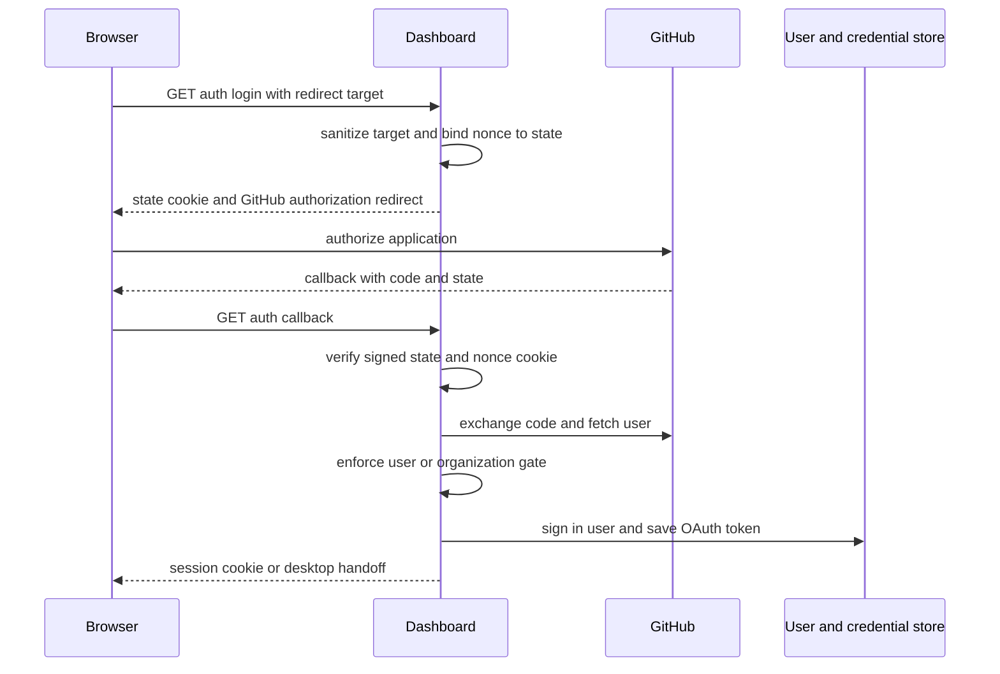

# Identity, authorization, and credential scope

Open SWE has separate trust boundaries for people using the dashboard, machine callers starting threads, inbound integration webhooks, credentials used by agent runs, and sandboxed processes. Authentication establishes one of those identities; authorization then determines which thread, operation, repository, or secret that identity may reach. This page focuses on the boundaries themselves; see [sandbox lifecycle](../architecture/sandbox-lifecycle.md), [dashboard UI](../integrations/dashboard-ui.md), [GitHub, Slack, and Linear](../integrations/github-slack-and-linear.md), and [configuration](../operations/configuration.md) for their broader operational context.

## Dashboard sign-in and browser protections

The dashboard authenticates through the GitHub App OAuth code flow. A successful sign-in resolves the GitHub account, passes the configured admission gate, creates or updates the application user, stores the OAuth result, and issues an HS256 `osw_session` JWT signed by `DASHBOARD_JWT_SECRET`. It contains the GitHub login, optional email and avatar URL, application user ID, issue time, and a seven-day expiry. `require_session` rejects a missing or invalid cookie; `/me` is deliberately able to return the signed session identity even when the user database cannot be read, and repairs a stale session user ID when possible.

```mermaid
sequenceDiagram
    participant Browser
    participant Dashboard
    participant GitHub
    participant UserStore as User and credential store

    Browser->>Dashboard: GET auth login with redirect target
    Dashboard->>Dashboard: sanitize target and bind nonce to state
    Dashboard-->>Browser: state cookie and GitHub authorization redirect
    Browser->>GitHub: authorize application
    GitHub-->>Browser: callback with code and state
    Browser->>Dashboard: GET auth callback
    Dashboard->>Dashboard: verify signed state and nonce cookie
    Dashboard->>GitHub: exchange code and fetch user
    Dashboard->>Dashboard: enforce user or organization gate
    Dashboard->>UserStore: sign in user and save OAuth token
    Dashboard-->>Browser: session cookie or desktop handoff
```

The browser OAuth handoff and the point at which admission occurs.

`/auth/login` creates a random nonce, puts only its HMAC in a signed, ten-minute state JWT, and puts the raw nonce in a state cookie. The standard callback performs a constant-time comparison before exchanging the code. `sanitize_redirect_to` accepts a non-protocol-relative relative URL or an absolute URL whose origin is `DASHBOARD_BASE_URL` or `DASHBOARD_ALLOWED_ORIGINS`; it rejects auth/API paths and other origins. These checks bind the OAuth response to the initiating browser and avoid an attacker-directed post-login redirect.

Cookies are `HttpOnly`. `cookie_security()` selects `Secure; SameSite=None` only for a HTTPS split-origin dashboard; same-origin and local HTTP use `SameSite=Lax`. The state cookie is also `HttpOnly`, has `SameSite=Lax`, is limited to `/dashboard/api/auth`, and expires with the state. For unsafe cookie-authenticated requests, `require_same_origin_for_mutations` requires an allowed `Origin` or `Referer` when origins are configured. Safe methods and bearer-only GitHub-token requests without a session cookie are exempt; no configured origins is explicitly a local-development fail-open mode.

Desktop sign-in does not set a browser session on the loopback redirect. It carries an S256 PKCE challenge in the state, returns a two-minute signed handoff code to a fixed `127.0.0.1` callback, and issues a session only when the desktop application proves the verifier with a constant-time comparison. Cloud-terminal tickets are separately audience- and `thread_id`-bound for 60 seconds.

### Admission and linked identities

Login authorization is fail-closed by configuration: deployment validation requires `ALLOWED_GITHUB_ORGS` or `ALLOWED_GITHUB_USERS`, except when the local authentication token is configured. A login explicitly listed in `ALLOWED_GITHUB_USERS` is accepted; otherwise it must be an active member of an allowed organization, as established through GitHub App-backed membership checking. An unlisted login, missing membership, or unsuccessful membership check is denied.

Slack linking relies on Slack OpenID Connect claims (`openid email profile`) rather than an asserted Slack identity. When `SLACK_TEAM_ID` is configured, `verify_team` rejects an identity from any other workspace, including an identity encountered through Slack Connect. A shared-channel auth prompt contains only the ordinary dashboard Connections URL, never a user-specific authorization link.

## Request principals and thread boundaries

The thread API recognizes three principal kinds: a browser-session person, a workspace API key, and a federated GitHub Actions workflow. Bearer tokens are first matched to workspace API keys; only otherwise federated-looking tokens are verified as GitHub Actions OIDC. A person falls back to the optional dashboard session. API keys and workflows are machine principals with a workspace and a `started_by_id`; people have login, optional email, and dynamically computed admin status.

The requested thread type is authorized rather than inferred from the caller: machines may create only `system` threads, people may create `workspace` or `private` threads, and only an admin person may create a system thread. A machine can read or post only a thread it started; a mismatch returns 404 to avoid revealing another thread's existence. People use the thread ownership/readability rules. Workflow tokens are additionally admitted only when the workflow repository is allowed to start threads in a workspace; workflows from public repositories receive a repository-limited token scope, while private/internal workflow repositories can use the installation scope.

## Credential scope for agent work

`resolve_github_token` first reads the saved thread metadata through `private_credential_login`; it does not make credential scope decisions from request configuration alone.

- A **public** thread always uses the workspace GitHub App installation token. Personal credentials are never read for it.
- A **private** thread may use a personal GitHub OAuth token only when the run was started by the saved private-thread owner. Missing, malformed, or mismatched owner metadata fails rather than borrowing another account; a private run with no usable user token raises `GitHubUserAuthRequired` and never falls back to the App.
- A system thread cannot be private and uses the App token. User-owned public threads may select a PR author only from recorded participants; private threads remain pinned to their owner and system threads remain pinned to the App. Background completion cannot infer a user author for an owned thread.

This deliberately separates public collaboration from personal authority. It also means the historical “bot-token-only” mode is not an authorization escape hatch: personal credentials are used only in the private-owner case, and absence of the credential is an authentication failure.

Resolved tokens are cached only in process memory by `(thread_id, principal)`. User principals are normalized `login:` or `email:` values; the bot has a distinct principal, and an unbound user token is refused. User entries expire at their token expiry with a 60-second skew or after 24 hours. Bot entries preserve their repository scope when expired so `resolve_thread_github_token` can re-mint at the original scope rather than broadening access. A downstream 401 can clear every cached token for the thread.

### Stored OAuth and GitHub App credentials

GitHub dashboard OAuth records keep encrypted access and refresh tokens. A near-expiry token is refreshed under `refresh_guard`, which combines a local async lock with a PostgreSQL advisory transaction lock when PostgreSQL is configured. The caller rereads inside the lock because refresh-token rotation makes concurrent refresh unsafe. A GitHub `bad_refresh_token` or `unauthorized_client` result deletes the still-current authorization (but preserves an authorization concurrently replaced by a new callback), forcing a clean sign-in instead of returning a known-stale credential.

`TOKEN_ENCRYPTION_KEY` accepts a single Fernet key or a newest-first comma/newline-separated list. `MultiFernet` encrypts with the first key and attempts every configured key during decryption, permitting key rotation. Decryption of malformed ciphertext or when no key is configured returns an empty string rather than propagating the secret failure.

A GitHub App installation token is minted by the GitHub SDK using the App ID and private key. Its in-process cache key includes installation ID, requested repository IDs or names, and requested permissions; a cached result is discarded ten minutes before its GitHub expiry. Sandbox repository tokens are narrowed to installation-reachable repository IDs: discovery uses an installation-wide token only on the server, and a repository name that cannot be matched receives no sandbox credential.

## Sandbox proxy boundary

A LangSmith sandbox is given GitHub access through its proxy configuration, not through a durable sandbox environment secret. The proxy injects the App token into rules for GitHub traffic while the sandbox receives only the configured placeholder token. Proxy-token tracking records the thread's expiry, repository scope, permission scope, workspace, and base proxy configuration. A refresh uses the recorded scope—or an intersection with a narrower requested repository set—so a refresh cannot broaden prior authority. `refresh_github_proxy_before_model` checks this before every model call; it refreshes tokens within five minutes of expiry (or after a 50-minute fallback age when expiry is unknown).

The LangSmith provider preserves user-supplied proxy rules while removing stale built-in credential rules and adding current GitHub and thread-tool rules. If a proxy update is rejected because an idle sandbox is not ready, it starts the sandbox and retries the update; other failures surface rather than silently treating stale credentials as usable.

## Inbound webhook authentication

Webhook checks are performed over the raw request body and fail closed when their secret is absent:

- GitHub computes `sha256=` plus HMAC-SHA256 of the body with `GITHUB_WEBHOOK_SECRET`, compares it in constant time with `X-Hub-Signature-256`, and the route rejects a failed check before decoding JSON.
- Slack computes and constant-time compares the `v0:timestamp:body` HMAC using `SLACK_SIGNING_SECRET`. It rejects absent, non-numeric, or older-than-300-second timestamps as replay protection; Slack routes invoke this check before handling the payload.
- Linear compares the raw-body HMAC-SHA256 with `Linear-Signature` in constant time and rejects calls without `LINEAR_WEBHOOK_SECRET`.
- The publicly reachable `/webhooks/run-complete` endpoint constant-time compares its query `token` to `RUN_COMPLETE_WEBHOOK_SECRET`. If unset, all requests are rejected and run-failure replies remain disabled.

Inbound authorization extends beyond signature validity. GitHub webhook routing ignores repositories that no workspace owns, and a private-thread follow-up is rejected before it reads GitHub credentials or dispatches a run when the triggering GitHub login is not permitted to prompt that thread. Untrusted GitHub comment bodies are wrapped in reserved trust tags; occurrences of those reserved tags in raw input are replaced first, preventing an external comment from forging the delimiter.

## Administration and verification focus

`CONFIGURED_ADMINS` is a case-insensitive set of GitHub logins and emails. It determines the admin flag on a principal and session-facing responses, but routes and tools should enforce the specific authorization dependency at the operation boundary rather than trusting client-provided metadata.

Focused tests document the most important invariants: `tests/auth/test_thread_credential_scope.py` exercises public-versus-private credential resolution, private-owner pinning, participant-bound PR authorship, system-thread behavior, and background completion; `tests/auth/test_github_token_ttl.py` covers token principal isolation, expiry, scope-preserving bot renewal, 401 invalidation, and private webhook ingress; `tests/auth/test_encryption.py` covers malformed ciphertext and key rotation; `tests/auth/test_auth_sources.py` verifies private Slack/Linear user-token selection and no bot fallback; and `tests/auth/test_slack_oauth.py` covers the Slack workspace gate.
