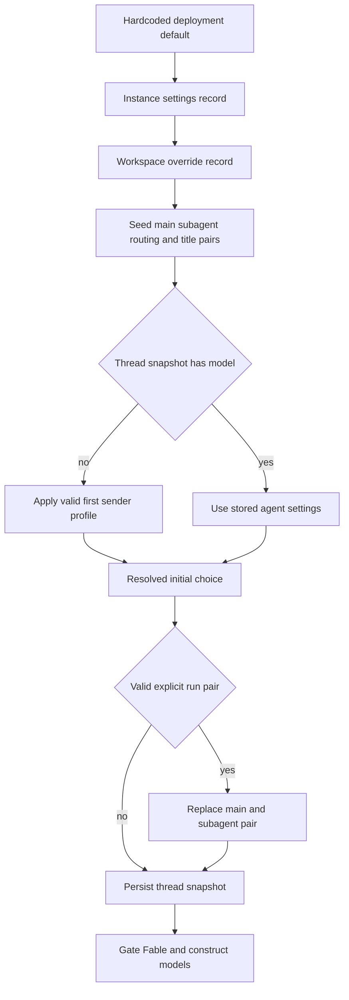

# Models, Profiles, and Instruction Resolution

A hosted agent separates **thread-stable operating settings** from **per-message identity and preferences**. On a thread’s first run it resolves models and repository custom instructions into `agent_settings` metadata; later runs preserve that snapshot unless an explicit valid per-run selection replaces it. In contrast, participant identity, personal instructions, and PR preferences are loaded for the current preparation pass. This prevents a later participant’s profile from silently changing a shared thread’s model or repository policy. See [Agent graph](../architecture/agent-graph.md), [Authentication and security](auth-and-security.md), [Configuration](../operations/configuration.md), and [Context engineering](../workflows/context-engineering.md).

## Model registry, validation, and recovery

`agent/dashboard/options.py` is the curated registry for selectable models. Each `ModelOption` has a provider-prefixed identifier, display label, allowed `efforts`, default effort, image capability, and optionally `can_be_default`; `SUPPORTED_MODEL_IDS` is the membership set used by resolution. Effort is model-specific rather than a global enum: Kimi K3 permits only `low`, `high`, and `max`, while Gemini has `minimal` through `high`. Code that accepts persisted choices must use `model_supports_effort`, and image-bearing paths must use `model_supports_images`.

`default_model_pair()` is the terminal deployment fallback. It takes `LLM_MODEL_ID` and `LLM_REASONING_EFFORT`, falling back to a credential-sensitive built-in model and compatible default effort. The resulting model must be supported, eligible as a default, and compatible with the effort; invalid environment configuration raises `ValueError` instead of constructing an arbitrary provider model. `default_vision_model_pair()` separately chooses an image-capable OpenAI or Anthropic pair when possible.

Persisted identifiers need not remain in the registry. For an unknown, non-deprecated identifier, `provider_fallback_pair()` chooses a supported model from the same provider—preferring the same Claude family—and retains a compatible effort or substitutes the selected model’s default. Gemini maps a stale `none` effort to `minimal`. Explicitly deprecated identifiers take a different path: they are not recovered to another model on their provider, `canonical_model_pair()` currently returns `None`, and callers defer to workspace or deployment defaults.

The registry does not contain context-window values. The options response enriches copies using Codex overrides first, LangChain model profile metadata next, and a fallback table last. Fable models are selectable but cannot be saved as defaults; they are subject to the workspace-wide Fable gate described below.

## Workspace, profile, and thread precedence

Workspace settings have three durable tiers: hardcoded deployment defaults, an instance record at `['team_settings'] / 'default'`, and sparse per-workspace records at `['workspace_settings'] / <slug>`. A `None` or absent value inherits the lower tier. Settings reads fail soft to hardcoded defaults so a store outage does not prevent all agent or reviewer runs. Each resolved role pair is validated through `_resolve_default_pair`: valid supported choice, then same-provider recovery, then `default_model_pair()`.

There are separate defaults for agent, agent subagent, reviewer, reviewer subagent, review chat, thread title, and adaptive-routing fast/balanced/performance tiers. Review chat inherits the agent default when its own pair is absent or invalid. The title resolver also avoids an OpenAI title model on an Anthropic-only direct deployment. A profile in `['profiles']` can supply main and optional subagent pairs, repository/branch/PR preferences, and a tri-state adaptive-routing preference. Its editable fields are intentionally isolated from encrypted OAuth records in `['oauth_tokens']`, avoiding read-modify-write clobbering between profile saves and token refreshes.

*Caption: model choices are layered at first use, frozen in the thread, and only a valid explicit run choice moves the snapshot.*

`build_agent` implements this lifecycle for hosted runs. It seeds main and subagent pairs from the selected workspace; only if no stored `model_id` exists does it load the triggering sender’s profile. A valid profile main pair replaces both main and subagent pairs unless a valid profile subagent pair replaces the latter. Stored settings then win. A valid `configurable.agent_model_id` and `agent_effort` is the explicit override: it replaces both pairs and is written back. `agent_settings` is a typed metadata snapshot cached for five minutes; malformed legacy data normalizes to an empty snapshot, and read/write failures are logged without aborting the run.

`resolve_agent_model_id` is the lighter resolution helper for callers that need only an id: supported per-thread id, valid profile id, then the effective workspace agent default. Profile reads on the run-start path are fail-soft—loss of the store costs user overrides rather than the run—whereas dashboard profile reads use `get_profile` and surface their failures. Profile and workspace update validation reject unsupported pairings and defaults that may not be saved.

### Adaptive routing and Fable

Adaptive routing is opt-in: a profile `model_routing_enabled` value overrides the workspace value, and a stored thread value freezes the decision. Dashboard `model_selection` can set `auto` or `explicit` for a run; Slack ask mode disables routing. When enabled, the factory builds the three stored routing models and `ModelSelectionMiddleware` selects `fast`, `balanced`, or `performance` before model calls. `auto` invokes a hidden structured-output classifier on the latest actual human request, while the deterministic `fast` mode skips classification. The chosen route is retained in state, so later calls reuse it; classifier failures fall back to `balanced`, and an `auto` selection emits a UI routing event.

Fable is a workspace ZDR kill switch. When disabled, saving workspace settings rewrites any Fable defaults to a non-Fable Anthropic fallback, and `gate_fable_model()` gates resolved main, subagent, and title pairs immediately before construction. This protects old thread snapshots as well as current defaults. Enabling Fable does not permit it to be stored as a normal default.

## Provider construction, gateway, and runtime fallback

`provider_model_kwargs()` translates the already resolved effort at the provider boundary: OpenAI receives a `reasoning` dictionary and requests `summary: "auto"` except at `none`; Anthropic receives adaptive summarized `thinking` plus `effort`; Gemini 3 receives `thinking_level`; Fireworks receives `model_kwargs.reasoning_effort`; and Baseten receives `reasoning_effort` for `low`, `high`, or `max`.

`make_model()` calls `init_chat_model` with six retries and a 600-second timeout for shipped provider prefixes. OpenAI uses the Responses API with `store=False`, `output_version="responses/v1"`, and included encrypted reasoning content. In direct mode, desktop OAuth is used when no `OPENAI_API_KEY` is available. Baseten is configured as OpenAI-compatible and requires `BASETEN_API_KEY` plus its direct base URL when the gateway is not active. Configured Codex variants receive a profile override that supplies the context window.

Gateway enablement is tri-state: a workspace `True` or `False` is authoritative, while `None` inherits `LANGSMITH_GATEWAY_ENABLED`; if that variable is absent, a dedicated `LANGSMITH_GATEWAY_API_KEY` enables it. For supported providers with a LangSmith key, `gateway_overrides()` replaces the direct base URL and API key and controls OpenAI Responses use. An unsupported provider or missing key only logs a warning and leaves the call direct.

Provider routing is distinct from runtime fallback. The factory adds `ModelFallbackMiddleware` with `LLM_FALLBACK_MODEL_ID` when configured, otherwise mapping Anthropic primaries to OpenAI and OpenAI primaries to Anthropic. Google, local, and self-hosted prefixes have no automatic cross-provider fallback. Construction failures are deferred into an error model so graph construction itself can complete and expose the failure through the run.

## Instruction sources, persistence, and authority

Repository custom instructions are records in `['agent_instructions']`, keyed by normalized `owner/name`. Dashboard operations require repository access, and the record is resolved for the effective default repository when a thread has no model snapshot. The text is saved in `agent_settings.repo_instructions`, then rendered in the shared system prompt as **Repository-specific Custom Instructions**. It therefore remains stable for the thread even if the repository record later changes; lookup errors omit it rather than fail the run.

Workspace instructions are separate from model settings: the factory loads the run’s workspace and passes its name and instructions to `construct_system_prompt`. The prompt’s source templates define the authority relationship: workspace instructions are mandatory system-prompt-level rules but yield to repository-specific custom instructions and `AGENTS.md`; repository custom instructions yield to `AGENTS.md`. The system prompt also loads the configured default prompt from `DEFAULT_PROMPT_PATH` or the bundled default.

Personal instructions are isolated in `['user_instructions']`, keyed by GitHub login and capped at 20,000 characters. Both the dashboard and `save_user_instructions` write this namespace, avoiding collisions with profile writes. While preparing a run, the agent gathers each thread participant’s current personal instructions into that participant’s dynamic person context. The collaboration prompt says standing instructions apply when acting on that person’s request and yield to repository instructions and `AGENTS.md`; they are not shared repository policy. The save tool validates identity and size, persists the replacement, and returns a system reminder because the prompt copy for the already-open thread is stale.

## Focused tests and safe changes

`tests/models/test_model_fallback_resolution.py` exercises deployment defaults, same-provider stale recovery, deprecated-id deferral, profile/workspace validation, context enrichment, and Fable behavior. `tests/models/test_agent_subagent_models.py` verifies main/subagent profile inheritance and Fable gating in the factory. `tests/middleware/test_model_selection.py` covers route persistence, classifier failure, the fast bypass, UI events, and extraction of the real human request instead of injected context. When adding a provider or effort, update the registry, provider-kwargs translation, gateway support where appropriate, and these focused tests together.
