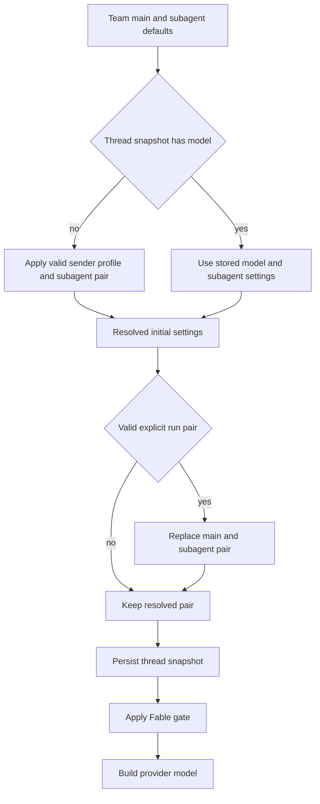

# Models, Profiles, and Instruction Precedence

A hosted agent run resolves a constructible `(model_id, effort)` pair once for its thread, but retains the identity, PR preference, and personal instructions of each message sender. This distinction prevents one participant's changing profile from silently changing a multi-party thread. The resulting model configuration feeds the main agent, its subagent, and title generation; review, review-chat, and diff grouping have corresponding team defaults. See [Agent graph](../architecture/agent-graph.md), [Reviewer and analyzer](../architecture/reviewer-and-analyzer.md), [Configuration](../operations/configuration.md), and [Context engineering](../workflows/context-engineering.md).

## Selectable models and valid pairs

`agent/dashboard/options.py` is the registry boundary. `SUPPORTED_MODELS` is a maintained list of `ModelOption` records containing a provider-prefixed identifier, label, allowed `efforts`, `default_effort`, image capability, and, where applicable, a `can_be_default` restriction. `SUPPORTED_MODEL_IDS` is the frozen membership set used by resolution code. An effort is not globally valid: for example, Kimi K3 permits only `low`, `high`, and `max`, Haiku permits only `none`, and other choices differ in whether they offer `none`, `xhigh`, or `max`. `model_supports_effort` and `model_supports_images` validate against the selected model record.

The dashboard `/options` endpoint returns copies enriched with `context_window`, leaving the static registry unchanged. Lookup uses explicit Codex overrides first, then LangChain partner profiles, then a small fallback table. It also filters Fable options when Fable is disabled and gates both advertised agent defaults.

### Defaults, stale IDs, and Fable

`default_model_pair()` is the deployment fallback rather than an unconditional constant. It accepts `LLM_MODEL_ID` and `LLM_REASONING_EFFORT` when they name a selectable default-capable model and compatible effort; otherwise it uses the credential-sensitive `DEFAULT_MODEL_ID` and `DEFAULT_MODEL_EFFORT`. An invalid environment model or effort raises `ValueError`, making a broken deployment setting visible instead of silently choosing another provider. Team resolvers call `_resolve_default_pair`: valid configured pair, same-provider stale-ID fallback, then this deployment default.

A stale ID that is **not** explicitly deprecated can use `provider_fallback_pair`. It selects the first supported model of the same provider, preferring a matching Claude family, preserves a compatible effort (including Gemini `none` to `minimal`), or takes that option's default effort. An unknown provider has no same-provider fallback. In contrast, IDs in `DEPRECATED_MODEL_IDS` are intentionally excluded from that route and defer to team or deployment defaults. `DEPRECATED_MODEL_REPLACEMENTS` contains empty values and `canonical_model_pair()` currently returns `None`: deprecated IDs are not automatically migrated.

Fable is an additional workspace-wide ZDR guard. Fable models cannot be saved as a default-capable choice; if a previously resolved Fable ID reaches a construction path while `fable_enabled` is false, `gate_fable_model` replaces it with a supported non-Fable Anthropic pair. The hosted factory gates main, subagent, and title models; dashboard resolution and `/options` similarly avoid constructing or advertising a disabled Fable choice.

## Hosted agent resolution and thread lifecycle

The hosted `get_agent` factory obtains team main/subagent defaults, then conditionally reads the triggering sender's profile **only if no stored thread model exists**. A valid profile main pair replaces both main and subagent choices; a valid profile subagent pair then overrides the inherited subagent pair. Stored thread settings, when present, supersede these defaults. A valid explicit `configurable.agent_model_id` plus `agent_effort` is the intentional way to move a thread: it replaces both main and subagent choices and is saved as the revised snapshot. Fable gating occurs after snapshot persistence so toggling it remains effective on every run.

*Caption: first-run defaults become a thread snapshot; only a valid explicit run pair rewrites model selection, while the Fable gate remains live.*

`agent_settings` is metadata on the LangGraph thread and contains the main/subagent pairs and repository instructions. It is TTL-cached for five minutes, strictly typed, and strips invalid or obsolete fields. Read errors yield `{}` and write errors are logged without failing a run. Consequently, a storage outage may lose snapshot stability for that invocation rather than prevent agent creation.

The smaller `resolve_agent_model_id` helper uses valid per-thread ID, then valid profile override, then team default for callers needing only an ID. Dashboard new-message resolution starts with the team agent pair, applies a valid profile pair and then a valid request pair; a deprecated request leaves the team pair in place. For dashboard image-bearing creation, a text-only resolved model is replaced with `default_vision_model_pair()`. Image-content validation rejects a missing or text-only model with HTTP 422.

## Team settings and profiles

Team settings are a single LangGraph Store record keyed `"default"` in `["team_settings"]`. `get_team_settings` overlays non-`None` stored values on hardcoded defaults and fails soft to those defaults on read failure. `TeamSettingsUpdate` validates every stored model/effort pair, clears deprecated choices, and rewrites Fable choices when Fable is disabled. It exposes independent main/subagent defaults for agents and reviewers. Review chat inherits the team agent pair when its own pair is absent or invalid; diff grouping inherits the reviewer subagent pair; title generation has its own pair and can switch an otherwise unusable OpenAI title model to Haiku on an Anthropic-only direct deployment.

Profiles in `["profiles"]`, keyed by GitHub login, hold the main and optional subagent pair alongside repository, branch, CI, draft-PR, and review preferences. Profile input validation rejects non-default-capable models and incompatible pairs. OAuth material is deliberately separate in `["oauth_tokens"]`, with encrypted access and refresh tokens; independent writes avoid the profile-save versus OAuth-refresh clobbering race. On a run-start path, `load_profile` logs a storage failure and returns `None`, sacrificing personal overrides rather than the run; dashboard reads call `get_profile` and surface failures.

## Provider construction, gateway, and model-call fallback

After resolution, `provider_model_kwargs` translates the effort for its provider: OpenAI receives a `reasoning` dictionary (with `summary: "auto"` except for `none`); Anthropic receives adaptive, summarized `thinking` and an `effort`; Gemini 3 receives `thinking_level`; Fireworks receives `model_kwargs.reasoning_effort`; and Baseten receives `reasoning_effort` only for `low`, `high`, or `max`.

`make_model` supplies six retries and a 600-second per-request timeout for shipped provider prefixes before calling `init_chat_model`. OpenAI defaults to the Responses API with `store=False`, `output_version="responses/v1"`, and `reasoning.encrypted_content`; if direct OpenAI lacks `OPENAI_API_KEY` but desktop OAuth is available, it builds the desktop OAuth client instead. Baseten is configured through the OpenAI-compatible provider and requires `BASETEN_API_KEY` plus its base URL when gateway routing is not applied. Models are cached by ID, explicit gateway argument, max tokens, frozen kwargs, and event-loop identity; `close_cached_models` clears and closes the cache.

Gateway routing is tri-state. `gateway_enabled=True` or `False` in team settings is authoritative; `None` inherits `LANGSMITH_GATEWAY_ENABLED`. For routable providers with a LangSmith key, `gateway_overrides` replaces direct configuration with a gateway base URL and key and chooses whether gateway OpenAI uses Responses via `LANGSMITH_GATEWAY_OPENAI_USE_RESPONSES`. Missing gateway credentials or an unroutable provider are logged and use the direct provider instead.

This is separate from runtime model-call fallback. The factory installs `ModelFallbackMiddleware` with `LLM_FALLBACK_MODEL_ID` when set, otherwise `fallback_model_id_for`: Anthropic primary models fall back to OpenAI and vice versa, while Google, local, and other self-hosted providers have no silent cross-provider fallback. Construction failures are deferred into an error model so the agent can report setup failure rather than fail graph construction.

## Instruction stores, scope, and authority

Repository-specific custom instructions are records in `["agent_instructions"]`, keyed by normalized `owner/name`. On the first hosted run, the factory resolves the prompt default repository, reads that repository's text, and saves it in thread settings. `construct_system_prompt` renders it as **Repository-specific Custom Instructions**, so the text is shared and stable for the thread. A missing record simply produces no section.

User custom instructions are separate `["user_instructions"]` records keyed by GitHub login and capped at 20,000 characters. The dashboard profile endpoint and the agent's `save_user_instructions` tool can both write this state, so it is intentionally not co-located with the profile. During preparation, the current triggering user's text is loaded and passed to `construct_sender_context`, which emits a trusted sender-context system message after the run input. It applies only to that turn and sender, not to other participants or later messages.

Environment instructions are another shared system-prompt layer, supplied by the resolved sandbox environment on each preparation. They describe how to work in that environment. Their renderer explicitly gives repository custom instructions and `AGENTS.md` precedence on conflict.

The effective instruction authority described by the prompt is:

1. Repository `AGENTS.md`, when present, overrides prompt defaults with prompt-level authority.
2. Repository custom instructions are mandatory and yield to `AGENTS.md`.
3. Environment instructions yield to repository custom instructions and `AGENTS.md`.
4. Sender-level personal instructions yield to repository custom instructions and `AGENTS.md` and are turn-scoped.

This ordering does not weaken fixed system safety and source-context rules elsewhere in the prompt; custom instruction text is rendered within those system messages rather than becoming an independent trust boundary.

## Focused regression coverage

`tests/models/test_model_fallback_resolution.py` exercises environment defaults, same-provider fallback and effort behavior, deprecated-ID deferral, response normalization, context-window enrichment, and Fable gating. `tests/models/test_agent_subagent_models.py` verifies profile inheritance, explicit profile subagent selection, and the hosted Fable gate. Dashboard thread tests cover profile/request precedence plus image capability rejection and vision fallback. Update those tests when changing the registry, pair normalization, or precedence behavior.
