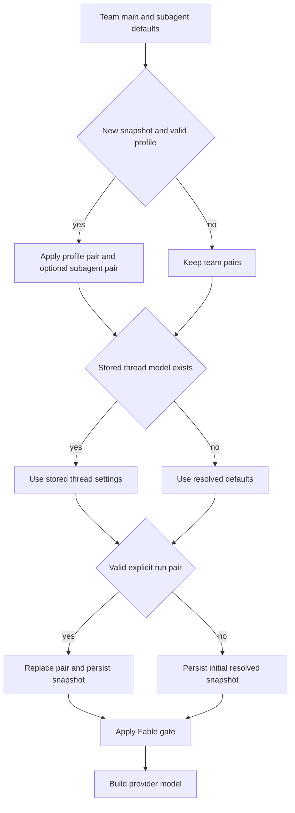

# Models, Profiles, Team Defaults & Instructions

A run needs both a constructible `(model_id, effort)` pair and the instructions
that apply to its repository and current sender. These are separate layered
systems: model selection is resolved into a thread snapshot, while repository
instructions are thread-stable and personal instructions are attached per
message. See [Agent graph](../architecture/agent-graph.md), [Threads and
state](threads-and-state.md), [Dashboard UI](../integrations/dashboard-ui.md),
and [Context engineering](../workflows/context-engineering.md) for the adjoining
runtime, persistence, UI, and prompt concerns.

## Selectable models and validation

`agent/dashboard/options.py` is the selectable-model registry. Its
`SUPPORTED_MODELS` records provide the provider-prefixed id, display label,
allowed `efforts`, `default_effort`, and `supports_images`; `SUPPORTED_MODEL_IDS`
is the membership set used by resolvers. Effort is intentionally model-specific:
for example, Kimi K3 accepts only `low`, `high`, and `max`, while other models
may accept `none`, `xhigh`, or both. `model_supports_effort` and
`model_supports_images` check against that record rather than a global effort
vocabulary.

The `/options` dashboard endpoint filters Fable choices when disabled, gates its
returned agent and subagent defaults too, and returns *copies* enriched with a
`context_window` where it can be determined. Context-window lookup first uses
Codex overrides for the GPT-5.6 variants, otherwise the LangChain partner
profile loader, then a small fallback table for models whose profile is absent.
The static registry itself does not carry those enriched values.

### Stale and deprecated IDs

There are two materially different stale-selection paths:

* An **unsupported but non-deprecated** provider-prefixed id can use
  `provider_fallback_pair`. It selects the first supported option on the same
  provider, preferring the matching Claude family when available, preserves a
  compatible effort (including Gemini's `none` to `minimal` accommodation), and
  otherwise uses that option's default effort. An unknown provider has no such
  fallback.
* An ID in `DEPRECATED_MODEL_IDS` is deliberately not selectable and is excluded
  from provider fallback. Profile response normalization removes its pair; team
  settings normalize it to an unset pair; resolution therefore defers to the
  applicable team or global default.

`DEPRECATED_MODEL_REPLACEMENTS` currently has empty replacement values and
`canonical_model_pair()` currently always returns `None`. Callers may invoke
that helper, but it **does not canonicalize or replace deprecated IDs**. Do not
add a claim that a deprecated id is automatically migrated unless the helper
and its callers are changed together.

`default_model_pair()` is the final hardcoded fallback: it returns
`DEFAULT_MODEL_ID` / `DEFAULT_MODEL_EFFORT` when that pair remains valid, or the
first registry option and its default effort if not. Team resolvers use a valid
configured pair first, then the same-provider fallback, then this global pair;
this protects runs from stale store values.

## Resolution, snapshotting, and dashboard choice

For a new hosted agent thread, `get_agent` starts with the team main and
subagent defaults. A valid sender profile can replace the main pair and, unless
there is an explicit profile subagent pair, replaces the subagent pair as well.
It then stores the resulting settings on the thread. Once a thread has a stored
`model_id`, later runs use that snapshot rather than reapplying the current
sender's profile; sender identity, personal instructions, and PR preferences
remain per-message. A valid explicit `configurable.agent_model_id` plus
`agent_effort` is the intentional exception: it replaces the main and subagent
choice and the revised snapshot is persisted. Thread settings also cache the
repository instructions; reads and writes are fail-soft, so an unreadable
snapshot behaves as absent and a failed write does not abort the run.

*Caption: hosted-agent model resolution freezes a first-run choice into thread settings; a valid explicit run pair is the route that rewrites it.*

The compact `resolve_agent_model_id` helper follows per-thread input, then
profile, then team default for callers that only need an id. The dashboard's
`_resolve_agent_model_choice` starts at the team agent default, applies a valid
profile choice, then a valid request pair. A deprecated request suppresses those
overrides and leaves the team default. Before accepting image input, the
dashboard checks the resolved model's image capability; for a newly enriched
run with images it substitutes `default_vision_model_pair()` when the selected
model is text-only. Direct message-content validation otherwise rejects images
for a text-only or missing model with HTTP 422.

## Team settings and profiles

Team settings are one LangGraph Store record, key `"default"`, in
`["team_settings"]`. `get_team_settings` overlays non-`None` stored values on
hardcoded defaults and fails soft to those defaults if the store cannot be
read. The team exposes separate defaults for agent, reviewer, and review chat;
chat inherits the agent setting when its own pair is absent or invalid.
Grouping similarly inherits the reviewer subagent pair, while thread-title
resolution has its own configured default.

The `TeamSettingsUpdate` and `ProfileUpdate` models validate model/effort pairs
on writes. Non-deprecated stale profile ids may be normalized to a same-provider
choice during an update; deprecated values are cleared for responses and do not
receive a canonical replacement. When Fable is disabled, team-settings
validation also rewrites any submitted Fable defaults to a safe non-Fable
fallback so the stored record does not advertise a disabled model.

Profiles live in `["profiles"]` and include the main and optional subagent pair,
default repository and branch preferences, CI and draft-review preferences, and
other user-editable settings. OAuth credentials deliberately live separately in
`["oauth_tokens"]`; profile writes and encrypted-token refreshes consequently do
not overwrite each other. The run-start `load_profile` path logs and returns
`None` on store failure, sacrificing a per-user override rather than the run.
Dashboard profile reads use `get_profile`, so storage failures surface instead.

## Construction, gateway, and fallback

`provider_model_kwargs` converts resolved effort into provider-specific
arguments: OpenAI receives `reasoning` (with `summary: "auto"` except for
`none`), Anthropic receives adaptive summarized `thinking` plus supported
`effort`, Gemini 3 receives `thinking_level`, Fireworks receives
`model_kwargs.reasoning_effort`, and Baseten accepts `reasoning_effort` for
`low`, `high`, or `max`.

`make_model` supplies a default of six retries and a 600-second request timeout
for each shipped provider prefix, then constructs through `init_chat_model`. It
uses OpenAI's Responses API with `store=False`, `output_version="responses/v1"`,
and `reasoning.encrypted_content`; when direct OpenAI has no API key but desktop
OAuth is available, it builds the desktop OAuth model instead. Baseten is passed
to the OpenAI-compatible integration and, without the gateway, requires
`BASETEN_API_KEY` and its service base URL. Constructed models are cached by
model id, gateway argument, max tokens, frozen kwargs, and event-loop identity;
`close_cached_models` clears and closes them.

Gateway selection is tri-state: an explicit team `gateway_enabled` boolean wins,
and `None` inherits `LANGSMITH_GATEWAY_ENABLED`. If routing can be applied,
`gateway_overrides` provides gateway URL, LangSmith key, and OpenAI Responses
API choice. An unroutable provider or absent gateway key is logged and falls
back to direct-provider configuration rather than failing merely because the
gateway was requested.

This operational fallback is different from stale-id recovery. The factory
installs `ModelFallbackMiddleware` using `LLM_FALLBACK_MODEL_ID` when set, else
`fallback_model_id_for`: Anthropic and OpenAI primary models cross-fallback to
each other, while Google, local, and self-hosted prefixes receive no automatic
cross-provider fallback.

Fable models are workspace-gated. `gate_fable_model` turns a resolved Fable id
into the non-Fable Anthropic fallback when `fable_enabled` is false while
preserving a supported effort. The factory gates its main, subagent, and title
models after snapshot resolution; the dashboard resolver and `/options` output
also gate choices, preventing disabled Fable from being offered or constructed.

## Instruction stores and authority

Repository custom instructions are records in `["agent_instructions"]`, keyed by
`owner/name`. At the first hosted run the factory resolves the effective default
repository, reads its instruction text, and puts that text in the thread
snapshot. `construct_system_prompt` renders it as **Repository-specific Custom
Instructions**, so it stays shared across the thread. The lookup is fail-soft;
an unavailable instruction store produces no repository custom section.

Personal instructions are independent `["user_instructions"]` records keyed by
GitHub login and limited to 20,000 characters. The dashboard can edit them and
the agent can use `save_user_instructions`, so separating them from the profile
avoids conflicting writers. During preparation, the factory loads the triggering
user's current text and `construct_sender_context` renders it in a trusted
sender-context message. It applies only to that sender's current turn, not to
other participants or future messages.

Instruction conflict authority is explicit in the rendered prompt:

1. Repository `AGENTS.md`, if present, overrides prompt defaults.
2. Repository-specific custom instructions are mandatory but yield to
   `AGENTS.md`.
3. Sender-level personal instructions yield to both repository custom
   instructions and `AGENTS.md`.

Thus the relevant order is `AGENTS.md > repository custom instructions >
user-level instructions`; environment instructions are below the repository
custom layer as well.

## Focused regression coverage

`tests/models/test_model_fallback_resolution.py` covers non-deprecated
same-provider fallback, effort preservation/defaulting, deprecated-id deferral,
profile/team behavior, context-window enrichment, and Fable gating.
`tests/models/test_agent_subagent_models.py` verifies profile inheritance and
explicit subagent overrides through the factory. Dashboard thread tests cover
profile/request precedence, deprecated request behavior, image capability
rejection, and vision fallback. When changing the registry or a normalization
path, update these cases before adding a new provider or changing a model's
effort list.
