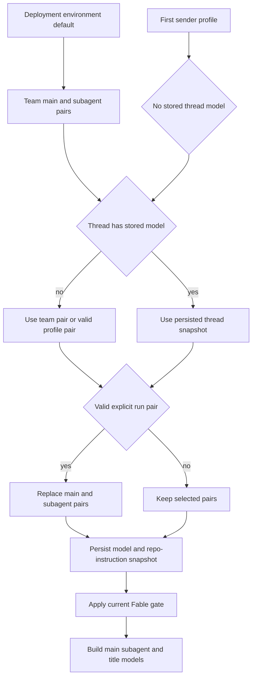
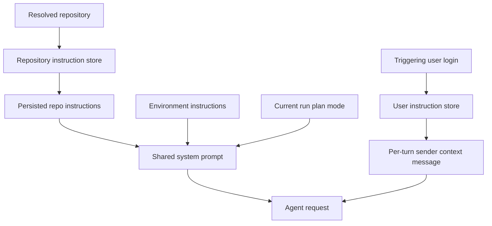

# Model, profile, and instruction resolution

A hosted run resolves a constructible main/subagent `(model_id, effort)` pair and
builds a system prompt plus a sender-specific context message. The two systems
have different lifetimes: model and repository-instruction choices are captured
in the thread snapshot, while identity, user instructions, PR preference, and
plan-mode state are resolved for each run or turn. This is the configuration
boundary feeding the [agent graph](../architecture/agent-graph.md); see also
[configuration](../operations/configuration.md), [auth and security](auth-and-security.md),
and [context engineering](../workflows/context-engineering.md).

## Model registry and validity

`agent/dashboard/options.py` is the registry for selectable models.
`SUPPORTED_MODELS` defines each provider-prefixed ID, display label, allowed
reasoning efforts, default effort, image capability, and (where applicable)
whether it can be an administrative default. `SUPPORTED_MODEL_IDS` is the
membership check used throughout resolution. Effort is not a global enum: for
example, Kimi K3 permits only `low`, `high`, and `max`; Haiku permits `none`;
and the Gemini entry starts at `minimal`. Always validate both the model and its
pair with `model_supports_effort`, and validate image input with
`model_supports_images`.

The dashboard enriches copies of the registry with `context_window`, leaving the
static choices unchanged. It prefers configured Codex context-window overrides,
then LangChain provider model profiles, then a small provider fallback table.
`make_model` also supplies the Codex profile override when constructing a model
that has one.

### Defaults, stale IDs, and Fable

The deployment fallback is `default_model_pair()`, not an unconditional constant:
it reads `LLM_MODEL_ID` and `LLM_REASONING_EFFORT`, with a credential-sensitive
`DEFAULT_MODEL_ID` fallback. It returns only a supported, default-eligible pair
and raises `ValueError` for an unsupported environment model or effort. Team
resolution protects stored values by choosing a valid configured pair, then a
same-provider fallback, then that deployment fallback.

For a stale non-deprecated ID, `provider_fallback_pair()` selects the first
supported model on the same provider, preferring an equivalent Claude family. It
preserves a supported effort, translates Gemini `none` to `minimal` where
applicable, or uses the replacement model's default effort. An unknown provider
cannot take this route. In contrast, entries in `DEPRECATED_MODEL_IDS` are not
selectable and explicitly receive no provider fallback. The replacement mapping
is empty and `canonical_model_pair()` returns `None`; deprecated values defer to
a team or deployment default rather than silently migrating.

Fable is a workspace-wide kill switch. A Fable model is non-default-eligible,
and `gate_fable_model()` swaps a resolved Fable ID to a supported non-Fable
Anthropic pair whenever `fable_enabled` is false. The gate is used after thread
resolution for main, subagent, and title models and in dashboard choice
resolution, while disabled settings writes replace submitted Fable defaults.
This prevents a disabled Fable model from being offered as a default or reaching
construction.

## What resolves when

Team settings are the durable baseline. They are one LangGraph Store record,
key `"default"` in `['team_settings']`, overlaid on hardcoded defaults; a read
failure falls back to those defaults. There are distinct main/subagent defaults
for agent and reviewer roles. Review chat inherits the agent default when no
valid chat-specific pair exists; diff grouping inherits reviewer-subagent; title
generation has a separate default and may switch an unusable OpenAI title model
to Haiku on an Anthropic-only direct deployment.

Profiles are per-login records in `['profiles']`. They include a main pair, an
optional subagent pair, default repository and branch choices, CI behavior, and
PR preferences. Profile writes are separated from encrypted GitHub tokens in
`['oauth_tokens']`, preventing dashboard profile saves and token refreshes from
overwriting one another. Dashboard reads surface store failures, but the
run-start profile loader is fail-soft: losing a profile drops personal overrides
rather than failing the run.

*Caption: model and repository instructions are snapshotted per thread; deployment gates and explicit run choices are resolved around that snapshot.*

In `get_agent`, a hosted run begins with team main/subagent defaults. **Only if
there is no stored thread model**, the first sender's valid profile main pair
replaces both pairs; its optional subagent pair then replaces only the subagent.
A stored model overrides those candidates on later runs. A valid explicit
`configurable.agent_model_id` plus `agent_effort` is the intentional mechanism
for moving a thread: it replaces both pairs and the updated snapshot is saved.
The snapshot is written before the Fable gate, so toggling Fable continues to
affect existing threads.

`agent_settings` in thread metadata holds `model_id`, effort, subagent pair, and
repository instructions. It is cached for five minutes; malformed metadata
normalizes to an empty snapshot and read/write errors are logged without
aborting the run. Consequently a failed snapshot write can cause a later run to
resolve afresh. `resolve_agent_model_id` is the smaller helper for callers that
need only an ID: valid per-thread input wins over a valid profile, then the team
default.

The dashboard's new-message resolver starts from the team agent pair, applies a
valid profile pair, then a valid request pair. A deprecated request intentionally
suppresses those overrides and retains the team pair. For image-bearing dashboard
run creation, a text-only resolved choice is substituted with
`default_vision_model_pair()`; direct image content on a missing or text-only
model is rejected with HTTP 422.

## Construction, gateway, and operational fallback

`provider_model_kwargs()` maps the resolved effort to the provider's API:
OpenAI uses `reasoning` and requests `summary: "auto"` except for `none`;
Anthropic receives adaptive, summarized `thinking` plus `effort`; Gemini 3
receives `thinking_level`; Fireworks receives
`model_kwargs.reasoning_effort`; and Baseten accepts `reasoning_effort` for
`low`, `high`, and `max`.

`make_model()` invokes `init_chat_model` (or desktop OpenAI OAuth), defaults to
six retries, and sets a 600-second deadline for shipped provider prefixes. It
uses the OpenAI Responses API with `store=False`, `output_version="responses/v1"`,
and encrypted reasoning content unless gateway settings force Chat Completions.
Without gateway routing, Baseten is configured as OpenAI-compatible and requires
`BASETEN_API_KEY`. Constructed clients are cached by model ID, requested gateway
state, token limit, frozen kwargs, and event-loop identity; `close_cached_models`
closes and clears them.

Gateway routing is tri-state: `gateway_enabled=True` or `False` in team settings
wins, while `None` inherits `LANGSMITH_GATEWAY_ENABLED`. A routable provider with
a LangSmith key receives gateway base URL, API key, and for OpenAI the configured
Responses-API choice. An unsupported gateway provider or missing gateway key is
logged and falls back to direct-provider setup.

This is distinct from stale-setting recovery. At call time,
`ModelFallbackMiddleware` uses `LLM_FALLBACK_MODEL_ID` when configured, otherwise
`fallback_model_id_for()`: Anthropic and OpenAI primary models cross-fallback,
while Google and other local/self-hosted prefixes do not silently reroute.

## Prompt sources, scopes, and authority

Repository custom instructions are records in `['agent_instructions']`, keyed by
`owner/name`. On the first hosted resolution, the factory determines the default
repository, reads its custom instructions fail-soft, and stores the result in
the thread snapshot. `construct_system_prompt()` renders it as
**Repository-specific Custom Instructions**, making it shared and stable for the
thread.

User custom instructions are separate `['user_instructions']` records keyed by
GitHub login and capped at 20,000 characters. Both the dashboard Profile tab and
the `save_user_instructions` tool can write them, so separation prevents either
writer from clobbering profile fields. During preparation the current triggering
user's instructions are loaded and rendered by `construct_sender_context()` in a
trusted sender-context message appended after the run input. They apply only to
that sender and turn, not to prior history or another participant.

*Caption: repository instructions are resolved into the shared thread snapshot, whereas sender instructions and plan mode are resolved for the current run.*

The prompt assigns explicit instruction authority:
`AGENTS.md > repository custom instructions > user-level instructions`.
Environment instructions yield to repository instructions and `AGENTS.md`.
`AGENTS.md` is read after a repository is set up and has prompt-level authority;
therefore neither a custom repository instruction nor a sender preference can
override it.

## Plan mode lifecycle

Plan mode is not model/profile snapshot state. The factory reads
`configurable.plan_mode` for the current run and always installs
`PlanModeMiddleware`. On each model request, that middleware removes its
excluded mutating tools while mode is active. Its `before_agent` hook resets
state to the current run's initial value, avoiding a stale graph-state `True`
from forcing a later implementation run back into planning.

The agent can call `enter_plan_mode` mid-run: it persists a planning status when
possible and sets `plan_mode=True` in graph state, so the next model turn is
read-only. `approve_plan` verifies active mode and plan content, persists the
approved status with `plan_mode=False`, and returns graph state to implementation
mode with the plan and comments. Dashboard plan approval follows the same
thread-metadata/status checks and dispatches follow-up work with plan mode off.

## Focused regression coverage

`tests/models/test_model_fallback_resolution.py` exercises provider-preserving
fallbacks, deprecated deferral, deployment defaults, model-pair validation,
context-window enrichment, profile behavior, and Fable gating.
`tests/models/test_agent_subagent_models.py` covers factory inheritance and
explicit subagent overrides. Dashboard thread tests cover request/profile/team
precedence and image validation. Update these focused tests when changing a
registry entry, normalization rule, or a resolution layer.
