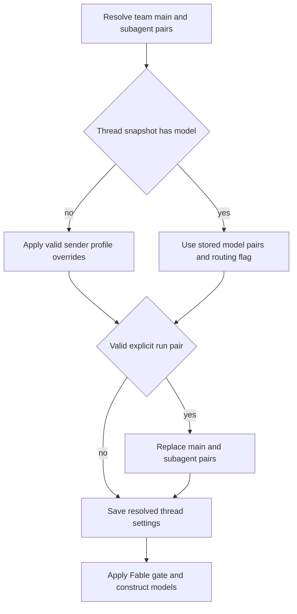

# Models, Profiles, and Instructions

A hosted agent separates choices that must remain stable for a long-lived, multi-party conversation from context that belongs to the sender of one message. Model, subagent, adaptive-routing, and repository-instruction settings are snapshotted on the thread. Identity, credentials, draft-PR preference, and personal instructions are recomputed for the current turn. This makes a later participant's preferences unable to silently take over the thread's operational configuration.

See [Agent graph](../architecture/agent-graph.md), [Middleware stack](../architecture/middleware-stack.md), [Tools](tools.md), [Configuration](../operations/configuration.md), and [Context engineering](../workflows/context-engineering.md).

## Selectable models, effort, and recovery

`SUPPORTED_MODELS` is the one hand-maintained registry presented by the dashboard and consumed by resolution. A `ModelOption` specifies its provider-prefixed ID, display label, supported `efforts`, default effort, image capability, and optional eligibility as a saved default. `SUPPORTED_MODEL_IDS` is the frozen membership set used to reject unknown selections. Do not treat effort as a global enum: Haiku offers only `none`, Kimi K3 offers `low`, `high`, and `max`, while other entries have different subsets. Use `model_supports_effort` and `model_supports_images` against the selected model.

The `/options` response enriches copies rather than mutating registry records. It obtains context-window values from explicit Codex overrides first, then LangChain provider profiles, and finally a small fallback table. This is display metadata, not a new model-selection source.

`default_model_pair()` is the terminal deployment default. It reads `LLM_MODEL_ID` and `LLM_REASONING_EFFORT`, falling back to a credential-sensitive built-in model ID and compatible effort. The result must be a supported, default-eligible pair; invalid model IDs or effort values raise `ValueError`. Localhost startup also checks that the configured default has provider credentials.

### Stale versus deprecated IDs

An ID that is merely no longer in the registry is different from one in `DEPRECATED_MODEL_IDS`:

- `provider_fallback_pair` can keep a stale selection with its provider, preferring the same Claude family where applicable. It retains an allowed effort, maps Gemini `none` to `minimal` where appropriate, or uses the fallback model's default effort.
- Explicitly deprecated IDs do **not** take that path. `DEPRECATED_MODEL_REPLACEMENTS` currently maps them to empty values and `canonical_model_pair()` returns `None`, so they defer to team or deployment defaults rather than being silently migrated.
- Team resolvers enforce the final invariant: return a valid saved pair, otherwise a same-provider pair, otherwise `default_model_pair()`.

Fable is additionally a workspace-wide ZDR gate. Fable models cannot be saved as normal defaults, and disabling the switch rewrites submitted Fable defaults to a non-Fable Anthropic fallback. `gate_fable_model` runs at construction-facing resolution points, including main, subagent, title, dashboard selection, and option listing, so a stale snapshot cannot construct or advertise disabled Fable.

## Team defaults and profile state

The team record is stored under key `"default"` in the LangGraph Store namespace `["team_settings"]`. `get_team_settings` overlays non-null stored values on hardcoded defaults and intentionally fails soft to those defaults when the store cannot be read. It holds main and subagent defaults for agent and reviewer, three adaptive-routing tiers (`fast`, `balanced`, and `performance`), gateway and Fable switches, and related operational preferences.

Role resolvers have deliberate inheritance rules. Review chat inherits the agent pair if its own pair is absent or invalid; review diff grouping inherits the reviewer subagent pair; title generation has an independent default and can substitute Haiku for an unusable OpenAI title model on an Anthropic-only deployment. The routing tiers are independently resolved through the same valid-pair recovery rule.

A profile is a user-editable `["profiles"]` record with main and optional subagent pair, repository and branch defaults, PR/CI preferences, and an optional routing preference. Profile validation rejects invalid pairings and non-default-eligible models. OAuth tokens instead live encrypted in `["oauth_tokens"]`; splitting the records prevents a profile update and an OAuth refresh/login from read-modify-write clobbering each other. The run-start `load_profile` path is fail-soft, while dashboard `get_profile` reads surface store failures.

A valid profile pair overrides team selection only when it supplies both a supported model and supported effort; a stale but recognizable provider can be normalized through same-provider fallback. An absent or unknown-provider profile pair contributes no override. Selection-only callers resolve supported per-thread ID, then profile, then team default. Dashboard thread creation resolves the full pair as team, profile, request; a deprecated request leaves the team pair in effect instead of applying the profile.

## Hosted-thread resolution and adaptive routing

*Caption: a first run snapshots resolved settings; a valid explicit model pair is the normal mechanism that changes that snapshot.*

`get_agent` begins with the team main/subagent defaults. It looks up a profile only if no stored thread model exists; a valid profile main pair becomes the subagent pair unless the profile supplies a valid subagent pair. A stored snapshot then wins. Finally, only a valid `configurable.agent_model_id` and `agent_effort` replace both pairs. The resolved values are persisted before applying the Fable gate, so changing the workspace gate still affects every later run.

`agent_settings` is the thread metadata snapshot. Its typed fields are model/subagent pairs, `model_routing_enabled`, and `repo_instructions`; it is cached for five minutes. Strict normalization removes unknown legacy fields, or returns an empty snapshot for invalid shapes. Thread read and write failures are logged and fail soft rather than aborting a run.

Adaptive routing is distinct from stale-ID recovery and runtime fallback. A profile boolean wins over the organization setting; otherwise the team setting is used, and dashboard `model_selection` explicitly chooses `auto` or `explicit`. The resolved routing flag is snapshotted. When active, `ModelSelectionMiddleware` builds fast, balanced, and performance models. It classifies only the latest genuine human request (or an approved plan), hides that classifier call from streaming, and retains the chosen route in state. Plan mode temporarily uses the performance model without persisting a route; classifier failure falls back to `balanced`.

Dashboard image-bearing thread creation replaces a text-only resolved pair with `default_vision_model_pair()`. Image block construction still rejects a missing or text-only model with HTTP 422 and limits accepted MIME types, count, and decoded size.

## Provider construction, gateway, and runtime fallback

The selected effort is translated at the provider boundary by `provider_model_kwargs`: OpenAI gets a `reasoning` object; Anthropic gets adaptive summarized `thinking` plus `effort`; Gemini 3 gets `thinking_level`; Fireworks receives nested `model_kwargs.reasoning_effort`; and Baseten accepts its limited `reasoning_effort` set.

`make_model` calls `init_chat_model` with six retries and a 600-second timeout for shipped provider prefixes. It caches models by model ID, requested gateway setting, max tokens, frozen kwargs, and event-loop ID; `close_cached_models` clears and closes them. OpenAI defaults to Responses API settings that disable provider-side storage, use `responses/v1`, and request encrypted reasoning content. If it is direct and no `OPENAI_API_KEY` is available, desktop OAuth may build the OpenAI client. Baseten uses the OpenAI-compatible API and requires `BASETEN_API_KEY` and the Baseten base URL when gateway routing is not applied.

Gateway enablement is tri-state. A team `True` or `False` is authoritative; `None` inherits `LANGSMITH_GATEWAY_ENABLED`, or the presence of `LANGSMITH_GATEWAY_API_KEY` when that variable is unset. For supported providers with a LangSmith credential, gateway overrides replace direct base URL/API key and decide OpenAI Responses versus Chat Completions. Unsupported providers or missing gateway credentials log and continue direct.

Runtime failure fallback is separate again: `ModelFallbackMiddleware` uses `LLM_FALLBACK_MODEL_ID` if set; otherwise Anthropic primaries fall back to OpenAI and vice versa. Google, local, and self-hosted providers return no automatic cross-provider alternative. The provider call timeout middleware is innermost so a deadline can propagate outward to this fallback.

## Instructions and skills

Repository custom instructions are workspace-admin-managed `["agent_instructions"]` records keyed by `owner/name`. On the first hosted run, the factory looks them up for the resolved default repository and stores the text in the thread snapshot; prompt construction renders it as **Repository-specific Custom Instructions** in the shared system prompt. Lookup failure simply omits the section.

Personal instructions are `["user_instructions"]` records keyed by GitHub login and capped at 20,000 characters. They are independent of profiles because both the dashboard and the `save_user_instructions` tool can update them. During prepare-run, the factory loads the credential-scoped sender's current instructions and passes them into `construct_sender_context`; that trusted context explicitly applies only to the current turn and is not shared thread policy.

Prompt templates establish the conflict rule: `AGENTS.md` wins over repository-specific and environment instructions, while repository-specific instructions win over environment and sender-level personal instructions. Sender instructions therefore cannot override repository policy. The reviewer fetches root `AGENTS.md` (falling back to `CLAUDE.md`) at the review base SHA, with a 64 KiB cap; it also fetches applicable directory-scoped instruction files for changed paths, ordered shallow to deep so narrower scopes can take precedence.

Skills are virtual `SKILL.md` files. User skills are stored below `["user_skills", login]`; organization skills are stored in `["organization_skills"]`. Names are lowercase hyphenated identifiers and descriptions/instructions have bounded lengths. Hosted agents expose bundled and organization skills through read-only backend routes, adding credential-scoped user skills when a private credential is available; desktop uses user and bundled sources. `WorkspaceSkillsMiddleware` filters retained metadata to configured sources and clears load errors, preventing personal skill context from leaking through public thread checkpoints.

## Change and test guide

When changing model inventory, effort support, stale recovery, defaults, or Fable behavior, update `tests/models/test_model_fallback_resolution.py`. For snapshot schema behavior, use `tests/agent/test_thread_settings.py`; dashboard thread tests cover precedence and image validation. Changes to routing must preserve the focused cases in `tests/middleware/test_model_selection.py`: route reuse, plan-mode override, classifier failure, and exclusion of injected sender context from classifier input. Add validation and lifecycle tests alongside any new profile field, model provider, skill source, or instruction scope.
