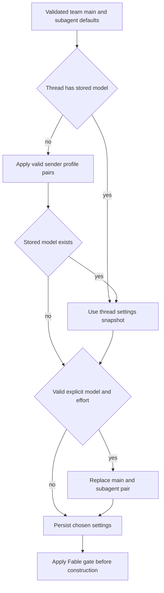
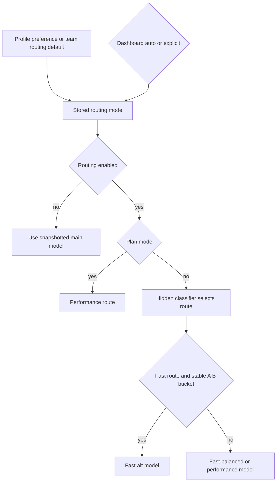
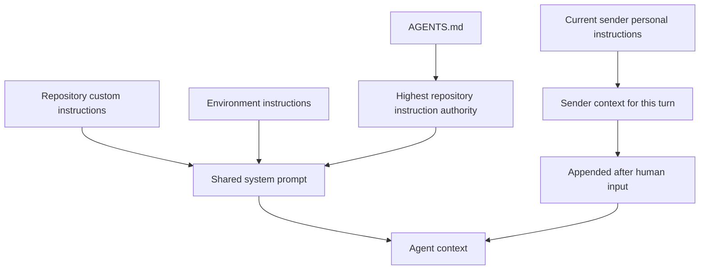

# Models, Profiles, and Instructions

A hosted agent freezes operational choices—main and subagent model pairs, adaptive-routing mode, and repository custom instructions—into thread metadata. In contrast, the sender identity, personal instructions, and PR preference are prepared for each message. This separation is essential for long-lived, multi-participant threads: a later participant does not silently change the thread model or inherit another participant's personal context. See [Agent graph](../architecture/agent-graph.md), [Threads and state](threads-and-state.md), [Configuration](../operations/configuration.md), and [Context engineering](../workflows/context-engineering.md).

## Model registry, validation, and recovery

`SUPPORTED_MODELS` in `agent/dashboard/options.py` is the curated registry used by the selection layers. A `ModelOption` supplies a provider-prefixed ID, display label, allowed reasoning efforts, default effort, image capability, and optionally `can_be_default`. `SUPPORTED_MODEL_IDS` is the membership set. Effort is deliberately model-specific, not a global enum: for example, Haiku only accepts `none`, Kimi K3 accepts `low`, `high`, and `max`, while Gemini offers `minimal` through `high`. Use `model_supports_effort` and `model_supports_images` before accepting a pair or image content.

`default_model_pair()` is the deployment terminal fallback. It reads `LLM_MODEL_ID` and `LLM_REASONING_EFFORT`, verifies both the registry membership and default eligibility, and raises `ValueError` for an invalid configured model or effort. This prevents an invalid deployment setting from reaching provider construction.

Stale IDs have intentional recovery semantics. A non-deprecated model can recover to the first supported model on its provider, preferring a matching Claude family and retaining effort when valid; otherwise it uses the replacement model's default effort. Deprecated IDs do **not** take that path: their replacement mapping is presently empty and `canonical_model_pair()` returns `None`, so they defer to a higher-level default. Every team-default resolver ultimately applies valid pair, same-provider fallback, then deployment default, preserving the invariant that it returns a constructible pair.

The `/options` endpoint returns copied, context-window-enriched options rather than changing the registry. Context limits prefer explicit Codex overrides, then partner-provider profiles, then fallbacks. It also filters Fable models and gates defaults when Fable is disabled.

## Defaults, profiles, and the thread snapshot

Team settings are one Store record, key `"default"` in `["team_settings"]`. A read overlays stored non-null fields on hardcoded defaults and fails soft to those defaults if the Store is unavailable. The record includes agent/reviewer main and subagent pairs, a chat pair, grouping and title choices, gateway/Fable switches, and adaptive-routing configuration. Chat inherits the agent default when unset; grouping inherits the reviewer subagent default when unset. The title resolver can substitute Haiku for an OpenAI title model on an Anthropic-only deployment that has neither applicable gateway routing nor desktop OpenAI OAuth.

Profiles are per-login records in `["profiles"]`. They hold a main pair, optional subagent pair, default repository and branch data, PR preferences, and a tri-state routing preference. Profile updates deliberately do not share the `["oauth_tokens"]` record that holds encrypted GitHub credentials, avoiding a profile-save versus OAuth-refresh read-modify-write collision. Run-start profile reads are fail-soft; dashboard profile reads use the direct Store accessor and surface failures.

*Caption: hosted-run model precedence and the point at which the resolved selection becomes thread state.*

`get_agent` first obtains team pairs. It only loads a sender profile while the thread lacks a stored main model; a valid profile main pair initially supplies both main and subagent unless its optional subagent pair is valid. Stored settings then win. A valid explicit `agent_model_id` and `agent_effort` is the deliberate escape hatch: it replaces both pairs and is persisted for future runs. `agent_settings` is a typed `ThreadSettings` snapshot under thread metadata, cached for five minutes. Invalid legacy shapes normalize to `{}`, and load/write failures are logged and do not abort the run.

Repository instructions follow the same snapshot rule: on the initial hosted run the factory resolves custom instructions for the effective default repository and saves the result in `repo_instructions`; later runs use that saved value. The Fable gate is intentionally applied **after** persistence, so a workspace-wide disablement changes a stale Fable snapshot at each construction rather than freezing the substitute forever.

Dashboard thread creation has its own preflight resolver: team pair, then valid profile pair, then valid request pair. A deprecated requested ID deliberately leaves the team pair rather than applying the profile. For image-bearing dashboard requests, a text-only resolved pair is replaced by `default_vision_model_pair()`; lower-level image block construction rejects absent or text-only models with HTTP 422.

## Adaptive routing and runtime fallback

Adaptive routing is separate from the thread's explicit main-model choice. Team settings define valid `fast`, optional `fast_alt`, `balanced`, and `performance` pairs. `model_routing_enabled` is opt-in at the organization level; a profile boolean overrides it and `None` inherits it. Once resolved, this boolean is stored in `ThreadSettings`, but dashboard `model_selection` of `auto` or `explicit` overrides that mode for the run and updated snapshot.

When enabled, the factory constructs the routing models and installs `ModelSelectionMiddleware`. A hidden structured-output classifier selects a route from the latest real human request; classifier failures retain `balanced`. Plan mode always selects `performance`, and an existing `model_route` is reused. A `fast` decision may become `fast_alt` according to a deterministic SHA-256 bucket of the thread ID, making the configured A/B split stable for a thread. The middleware emits a cosmetic `model_routed` stream event and overrides the model for the model call; routing attribution is recorded in thread metadata.

*Caption: adaptive routing chooses a per-turn main model while the thread retains its resolved mode and base model snapshot.*

Runtime failure fallback is different again. The factory installs `ModelFallbackMiddleware` with `LLM_FALLBACK_MODEL_ID` when configured; otherwise Anthropic primaries fall back to OpenAI and OpenAI primaries to Anthropic. Google, local, and self-hosted providers have no automatic cross-provider fallback.

Fable models are workspace-gated ZDR choices. They cannot be saved as ordinary defaults; disabling Fable rewrites submitted Fable team defaults, while `gate_fable_model` independently protects factory construction, dashboard selection, and option listing. Therefore disabled Fable is neither advertised nor constructed, including from a stale thread snapshot.

## Provider construction and gateway

`provider_model_kwargs` converts the resolved effort at the provider boundary: OpenAI receives `reasoning` with an automatic summary except for `none`; Anthropic receives adaptive summarized thinking and effort; Gemini 3 receives `thinking_level`; Fireworks receives `model_kwargs.reasoning_effort`; and Baseten receives `reasoning_effort` for its supported values.

`make_model` calls `init_chat_model`, defaulting shipped providers to six retries and a 600-second request timeout. OpenAI normally uses the Responses API with `store=False`, `output_version="responses/v1"`, and `reasoning.encrypted_content`; desktop OAuth is used when no direct OpenAI key exists and gateway routing was not applied. Baseten is OpenAI-compatible and requires `BASETEN_API_KEY` plus its direct base URL when gateway routing is unavailable. Constructed models are cached by ID, gateway argument, max tokens, frozen kwargs, and event-loop identity; `close_cached_models()` clears the cache and closes each model.

Gateway enablement is tri-state: an explicit team `True`/`False` wins, otherwise `gateway_env_default()` reads `LANGSMITH_GATEWAY_ENABLED` or treats a dedicated gateway API key as opt-in. For routable providers with a LangSmith key, gateway overrides supply base URL, API key, and OpenAI Responses-versus-Chat-Completions selection. Missing gateway credentials or an unroutable provider logs a warning and continues with direct provider access rather than failing the run.

## Instruction context and authority

Repository custom instructions are records in `["agent_instructions"]`, keyed by normalized `owner/name`. Users with repository access can create and update them through the dashboard APIs. The run factory loads their trimmed text for the initial thread snapshot, and `construct_system_prompt` renders it as **Repository-specific Custom Instructions** for the shared system prompt. A lookup failure omits this optional section rather than aborting the run.

Personal instructions are independently stored in `["user_instructions"]` by GitHub login and capped at 20,000 characters. The dashboard and the agent's `save_user_instructions` tool are both writers, which is why this data is not embedded in a profile record. During prepare-run, the factory obtains the current instructions for the credential owner and passes them to `construct_sender_context`; the result is inserted after the user's input as trusted sender context and applies only to that turn.

Environment instructions are resolved for the current sandbox environment during prepare-run and, like repository instructions, are rendered into the shared system prompt. Prompt authority is explicit: `AGENTS.md` outranks repository custom instructions; repository custom instructions outrank environment instructions; and sender-level personal instructions yield to repository instructions and `AGENTS.md`. This authority ordering and per-turn sender envelope prevent a personal preference from becoming shared thread policy.

*Caption: system-prompt instruction sources are shared for the run, while personal instructions travel in a current-turn sender envelope.*

## Change and test guide

When changing selection semantics, update focused tests for fallback resolution, dashboard thread creation, thread settings, and model selection. In particular, cover unsupported and deprecated IDs separately, model-specific effort validation, image fallback and HTTP 422 rejection, snapshot persistence, routing classifier failure and deterministic `fast_alt` selection, and Fable-disabled paths. Adding a provider requires aligned registry capability data, provider kwargs, gateway routability if supported, credential validation, and a deliberate runtime fallback policy.
