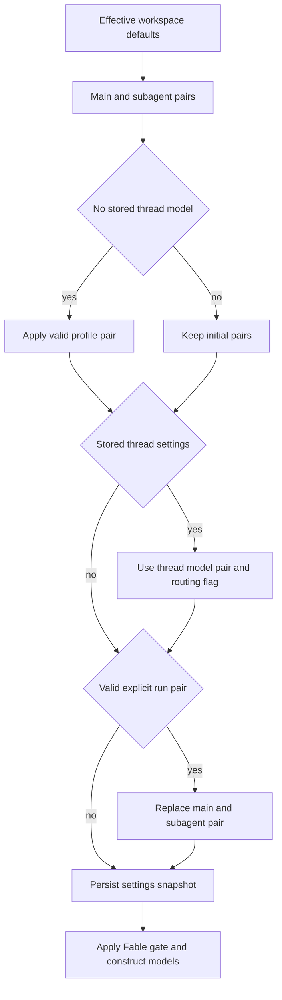

# Configuration Resolution for Models, Profiles, and Instructions

A hosted run separates **thread-stable operating choices** from **per-message sender context**. The first run snapshots its main/subagent model pair, routing choice, and repository custom instructions on the thread. The user who triggers each later message still supplies current identity, PR preference, personal instructions, and (when applicable) a routing attribution. This prevents a participant's profile edit from silently changing a long-lived, multi-party conversation. See [Agent graph](../architecture/agent-graph.md), [Dashboard UI](../integrations/dashboard-ui.md), [Configuration](../operations/configuration.md), and [Context engineering](../workflows/context-engineering.md).

## Registry, validity, and recovery

`SUPPORTED_MODELS` in `agent/dashboard/options.py` is the shared selectable-model registry. A `ModelOption` specifies its provider-prefixed id, label, allowed `efforts`, default effort, image support, and optionally whether it may be a saved default; `SUPPORTED_MODEL_IDS` is the membership check used by resolution layers. Effort is intentionally model-specific rather than a global enum: Haiku accepts `none` only, Kimi K3 accepts `low`/`high`/`max`, and Gemini accepts `minimal` through `high`. Validate a pair with `model_supports_effort`, and image capability with `model_supports_images`.

`default_model_pair()` is the terminal deployment fallback. It takes `LLM_MODEL_ID` and `LLM_REASONING_EFFORT` when supplied, otherwise derives a credential-sensitive built-in model id and a compatible effort. It rejects unsupported, non-default-eligible, or effort-incompatible environment choices with `ValueError`; it does not construct an arbitrary provider model.

Persisted ids can outlive the registry. For an unknown, non-deprecated id, `provider_fallback_pair` chooses a current model on the same provider, preferring the same Claude family, preserves a compatible effort (including Gemini `none` → `minimal`), and otherwise chooses that model's default effort. An unknown provider has no such recovery. Explicitly deprecated ids deliberately do **not** use it: replacement entries are empty and `canonical_model_pair()` currently returns `None`, so they defer to a workspace/deployment default. All workspace role/default resolvers therefore apply: valid saved pair → same-provider fallback → `default_model_pair()`.

The options response enriches copies of the registry with context-window data, using explicit Codex overrides first, then LangChain provider profiles, then narrow fallback values. The underlying registry is not mutated. `make_model` applies the Codex context override as a LangChain profile as well.

## Workspace and profile configuration

Workspace settings have three tiers: hardcoded defaults, the instance record `['team_settings']`/`'default'`, then a sparse record in `['workspace_settings']` keyed by slug. Missing or `None` workspace fields inherit the instance tier. Reads fail soft to hardcoded defaults if the store is unavailable, because model choice is on the agent, reviewer, and webhook critical path. Workspace names are slugified; an unusable runtime name falls back to the default workspace.

`WorkspaceSettingsUpdate` validates every configured model/effort pair before persistence. It provides defaults for agent/reviewer main and subagent roles, the review chat model (otherwise inherits agent), review diff grouping (otherwise inherits reviewer subagent), thread title, and three agent-routing tiers: `fast`, `balanced`, and `performance`. Workspace reads expose both effective merged values and the workspace's explicit overrides. Authenticated users can read `/settings` and `/workspaces/{workspace}/settings`; administrators write them with the corresponding `PUT` endpoints. The legacy `/team-settings` aliases the instance endpoints.

Profiles are separate `['profiles']` records keyed by GitHub login. They contain the main and optional subagent pair, repository/branch preferences, PR/CI preferences, continuous-DM preference, and optional `model_routing_enabled`. Profile writes intentionally do not touch encrypted OAuth records in `['oauth_tokens']`, preventing a profile save and a token refresh/login from clobbering each other. `GET`/`PUT /profile` read and validate the current session's profile. On the run-start path, `load_profile` logs and returns `None` on store failure, while dashboard `get_profile` allows failures to surface.

### Model resolution and persistence

*Caption: `get_agent` resolves a first-run snapshot, then only an explicit valid run pair can replace its model selection.*

For hosted runs, `get_agent` starts with the workspace agent main/subagent defaults and loads a sender profile only when no thread `model_id` exists. A valid profile main pair replaces both main and subagent pairs unless its valid optional subagent pair replaces the latter. Stored thread settings then win. Finally, a valid `configurable.agent_model_id` and `agent_effort` replaces both pairs. The resulting `agent_settings` snapshot stores the pairs, routing flag, and repository instructions in thread metadata. It is TTL-cached for five minutes; typed normalization discards malformed legacy metadata, and load/write errors are logged and treated as an empty snapshot or nonfatal failed persistence.

The dashboard's new-thread resolver starts with the workspace pair, applies a valid profile pair, then a valid request pair. A deprecated request leaves the workspace pair in effect rather than applying the profile. Image-bearing dashboard requests replace a text-only resolved pair with `default_vision_model_pair()` before constructing message blocks; image blocks with no image-capable model are rejected with HTTP 422.

### Adaptive routing and Fable

Adaptive routing is an independent choice layered over the saved main model. A profile `model_routing_enabled` takes precedence over the workspace toggle; its `None` value inherits the workspace, and the resolved flag is snapshotted. For dashboard runs, `model_selection='auto'` enables routing and `'explicit'` disables it for that run. When enabled, `ModelSelectionMiddleware` selects among the workspace fast/balanced/performance models for a turn: plan mode forces `performance`, a persisted route is reused, otherwise a hidden structured-output classifier receives the latest human task and defaults to `balanced` if it fails. The selected id is emitted for the UI, and middleware substitutes the routed model for the call. Slack `/oswe` questions bypass adaptive routing and use the fast route.

Fable is a workspace-wide ZDR gate, not a normal saved default. It cannot be saved as a profile or workspace default; disabling Fable rewrites Fable defaults to a safe non-Fable Anthropic fallback. The factory also gates resolved main, subagent, and title models after thread resolution, so a stale snapshot cannot construct Fable while disabled. The dashboard resolver uses the same gate.

## Provider construction and operational controls

`provider_model_kwargs` converts the resolved effort at the provider boundary: OpenAI receives a `reasoning` object (with `summary: "auto"` except at `none`); Anthropic receives adaptive/summarized `thinking` plus effort; Gemini 3 uses `thinking_level`; Fireworks receives `model_kwargs.reasoning_effort`; and Baseten receives `reasoning_effort` only for `low`, `high`, or `max`.

`make_model` calls `init_chat_model`, defaults known provider prefixes to six retries and a 600-second per-request timeout, and caches models by id, requested gateway state, max tokens, frozen kwargs, and event-loop id. `close_cached_models` clears the cache and closes each model. OpenAI uses the Responses API with `store=False`, `output_version="responses/v1"`, and encrypted reasoning content included. Without an applied gateway and without `OPENAI_API_KEY`, desktop OpenAI OAuth may construct the model instead. Baseten is configured as OpenAI-compatible and requires `BASETEN_API_KEY` and its base URL when not gateway-routed.

Gateway enablement is tri-state: a workspace `True`/`False` is authoritative, while `None` inherits `LANGSMITH_GATEWAY_ENABLED` (or the presence of `LANGSMITH_GATEWAY_API_KEY` when that variable is unset). For routable providers with a LangSmith key, gateway overrides provide the base URL, API key, and OpenAI Responses-API choice. Missing keys and unroutable providers log and remain direct rather than failing a run.

Runtime fallback is separate from stale configuration recovery. The agent installs `ModelFallbackMiddleware` using `LLM_FALLBACK_MODEL_ID` when set; otherwise Anthropic primary models fall back to OpenAI and OpenAI primary models fall back to Anthropic. Google, local, and self-hosted providers have no automatic cross-provider fallback.

## Instructions: storage, scope, and authority

Repository custom instructions are records in `['agent_instructions']`, keyed by `owner/name`. Dashboard endpoints list/create/read/update/delete them after repository-access checks. On a new hosted thread, the factory resolves the effective default repository's instructions and snapshots their text; `construct_system_prompt` renders nonblank text using the repository-instructions prompt section. A lookup failure omits the section rather than aborting the run. Consequently, repository instructions are shared by the thread and are not retroactively changed by an admin edit.

Personal instructions use a different `['user_instructions']` record keyed by login and are capped at 20,000 characters. The separate namespace prevents dashboard Profile-tab writes and the agent's `save_user_instructions` tool from competing with profile fields. The authenticated dashboard API is `GET`, `PUT`, and `DELETE /me/instructions`.

At prepare-run, the factory reloads the triggering user's personal instructions and passes them to `construct_sender_context`. That trusted context message also carries sender identity, PR-draft preference, and model attribution, explicitly applies only to the current turn, and must not be attributed to other participants. It is therefore distinct from thread-snapshotted repository instructions in the shared system prompt.

Prompt authority is explicit: applicable `AGENTS.md` overrides prompt defaults; repository-specific custom instructions yield to `AGENTS.md`; workspace instructions yield to repository instructions and `AGENTS.md`; and sender personal instructions yield to repository instructions and `AGENTS.md`. Do not treat a personal preference as shared repository policy.

## Change and test guide

When changing catalog membership, stale-id handling, default validation, or Fable policy, update `tests/models/test_model_fallback_resolution.py`. It exercises provider-preserving fallback, deprecated-id deferral, profile/workspace normalization, context enrichment, environment defaults, and Fable gating. `tests/models/test_agent_subagent_models.py` verifies profile main/subagent inheritance and factory construction; `tests/models/test_model_request_timeout.py` verifies timeout defaults and explicit override behavior. Changes to routing should additionally preserve the classifier's plan-mode, persisted-route, and failure-to-balanced semantics in `agent/middleware/model_selection.py`.
