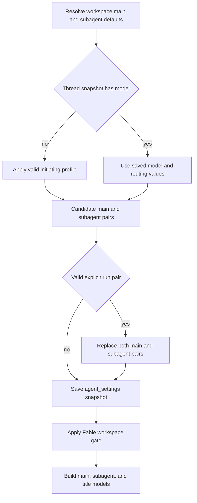

# Model, Profile, and Instruction Resolution

A hosted run combines workspace policy, the initiating user's preferences, and durable thread state. The important boundary is **time**: workspace and profile values seed a thread, while a valid explicit run choice can replace the model snapshot; sender identity, personal instructions, and PR preferences are reloaded for each message. This allows a long-lived, multi-person conversation to retain operational settings without applying one participant's personal preferences to another. See [Agent graph](../architecture/agent-graph.md), [Tools](tools.md), [Configuration](../operations/configuration.md), and [Context engineering](../workflows/context-engineering.md).

## Valid model pairs and recovery

`SUPPORTED_MODELS` is the hand-maintained picker registry. A `ModelOption` identifies a provider-prefixed model, label, allowed `efforts`, default effort, image support, and optional `can_be_default` restriction; `SUPPORTED_MODEL_IDS` is the membership set used by resolvers. Effort is model-specific, not a global enum: for example, Haiku accepts only `none`, Gemini accepts `minimal` through `high`, and Kimi K3 accepts `low`, `high`, and `max`. Use `model_supports_effort` and `model_supports_images` rather than assuming an effort or vision capability.

`default_model_pair()` is the terminal deployment default. It reads `LLM_MODEL_ID` and `LLM_REASONING_EFFORT`, falling back to a credential-sensitive built-in model and a compatible effort. It rejects an unsupported, non-default-eligible model or unsupported effort with `ValueError`; it never constructs an arbitrary provider/model string.

Persisted values can become stale. For an unsupported, non-deprecated model id, `provider_fallback_pair()` selects a supported choice on the same provider, preferring the same Claude family, preserves a supported effort (mapping Gemini `none` to `minimal`), and otherwise uses the replacement's default effort. Explicitly deprecated ids do **not** receive a canonical replacement: `canonical_model_pair()` returns `None`, and deprecated ids bypass provider fallback so the caller defers to its default. Workspace default resolution is therefore always: valid configured pair, same-provider recovery, then `default_model_pair()`.

The `/options` endpoint returns copies enriched with context-window metadata from explicit Codex overrides, LangChain provider profiles, or fallback values; it does not mutate the registry. It also filters Fable options and gates returned defaults for the requested workspace.

## Workspace and profile layers

Workspace settings resolve in three tiers:

1. Hardcoded defaults, including the deployment default model pair.
2. The instance record, stored at key `"default"` in `["team_settings"]`.
3. A sparse per-workspace record in `["workspace_settings"]`; missing or `None` fields inherit the lower tier.

`get_workspace_settings()` fails soft to hardcoded defaults if settings storage is unavailable, because a settings outage must not stop every run. The resulting `WorkspaceSettings` supplies separate main/subagent defaults for agent and reviewer roles, three adaptive-routing tiers, and a title model. Review chat inherits the agent default when no valid chat-specific pair exists. The title resolver can substitute Haiku for an OpenAI title model on an Anthropic-only direct-provider deployment.

Profiles in `["profiles"]`, keyed by GitHub login, contain a default main pair, optional subagent pair, repository and branch preferences, PR/CI preferences, and user routing preference. The profile namespace is deliberately separate from encrypted OAuth records in `["oauth_tokens"]`, so profile saves cannot clobber a concurrent OAuth refresh. Dashboard profile reads surface storage failures; run-start lookup (`load_profile`) logs and returns `None`, sacrificing user overrides rather than the run.

A profile pair is accepted only when the model is selectable, default-eligible, and supports its effort. A stale non-deprecated id may use same-provider recovery; an absent, deprecated, or unknown-provider selection returns no override and lets the workspace default apply.

## Hosted-run precedence and persistence

*Caption: profile settings seed a new thread; a valid explicit run selection is the normal mechanism that changes its durable model snapshot.*

`build_agent()` first reads `agent_settings` from thread metadata. When a stored `model_id` exists, it does not load a profile for model selection; otherwise it resolves workspace defaults and applies the initiating profile. A profile main pair becomes both main and subagent pair unless a valid profile subagent pair is supplied. A valid `configurable.agent_model_id` **and** `agent_effort` then replaces both pairs. The final pre-gate choice, routing toggle, and repository custom instructions are stored back to the thread.

`agent_settings` is a typed, five-minute-cached metadata snapshot containing main/subagent pairs, model-routing preference, and repository instructions. Unknown legacy fields are stripped; an invalid snapshot becomes empty. Reads and writes are fail-soft, so unavailable thread storage does not abort a run, but it means a fresh resolution may not persist.

This snapshot does not freeze all user context. The factory reloads the sender profile to obtain `draft_prs`, and constructs participant context per message. For selection-only callers, `resolve_agent_model_id()` uses supported per-thread id, then valid profile id, then the workspace agent default. Dashboard new-thread selection similarly applies workspace, profile, then request, except a deprecated requested id intentionally retains the workspace default rather than falling back to profile. Image-bearing dashboard creation changes a text-only resolved choice to `default_vision_model_pair()`; direct image construction rejects no model or a text-only model with HTTP 422.

## Routing, Fable, provider construction, and fallback

Fable is a workspace-wide ZDR gate. Fable models cannot be saved as normal defaults; when disabled, writes replace Fable defaults with a safe non-Fable Anthropic fallback. The factory gates resolved main, subagent, and title pairs after storing the snapshot, and `/options` filters Fable choices. Thus turning off Fable takes effect even for a stale snapshot.

Adaptive routing is separate from model-pair resolution. A profile `model_routing_enabled` value overrides the workspace toggle; otherwise the workspace value applies. That result is snapshotted. Dashboard `model_selection` can set it for a run, while Slack ask mode disables it. When enabled, `ModelSelectionMiddleware` selects from the workspace's `fast`, `balanced`, and `performance` pairs.

Gateway routing is also distinct. `gateway_enabled=True` or `False` in effective workspace settings is authoritative; `None` inherits `LANGSMITH_GATEWAY_ENABLED`, or (when unset) the presence of `LANGSMITH_GATEWAY_API_KEY`. For routable providers with a LangSmith key, `gateway_overrides()` replaces direct `base_url`, `api_key`, and OpenAI Responses choice. Unsupported providers or missing gateway credentials are logged and proceed directly.

`provider_model_kwargs()` translates the validated effort at the provider boundary: OpenAI gets `reasoning` (with `summary: "auto"` except for `none`), Anthropic gets adaptive summarized thinking plus effort, Gemini 3 gets `thinking_level`, Fireworks gets `model_kwargs.reasoning_effort`, and Baseten accepts `low`, `high`, or `max`. `make_model()` uses `init_chat_model`, defaults known providers to six retries and a 600-second request timeout, configures OpenAI Responses with `store=False`, `output_version="responses/v1"`, and encrypted reasoning content, and can use desktop OpenAI OAuth when direct OpenAI lacks an API key. Baseten is OpenAI-compatible but requires `BASETEN_API_KEY` without gateway routing. Constructed models are cached per model id, gateway argument, max tokens, frozen kwargs, and event loop; `close_cached_models()` closes and clears them.

Runtime fallback applies only after model construction. `LLM_FALLBACK_MODEL_ID` wins when set; otherwise Anthropic primaries use an OpenAI fallback and OpenAI primaries use an Anthropic fallback. `ModelFallbackMiddleware` alternates primary and fallback on retryable failures, rather than silently rerouting Google, local, or self-hosted providers.

## Instruction sources and authority

Repository custom instructions are admin-editable `["agent_instructions"]` records keyed by `owner/name`. For a new thread, the factory resolves the effective default repository's instructions and includes them in `agent_settings`; later runs use the snapshot. They are rendered into the shared system prompt as repository-specific custom instructions. If lookup fails, the section is simply absent.

Workspace instructions come from the resolved workspace record and are rendered into the system prompt on every preparation. Deployment custom instructions are loaded from `DEFAULT_PROMPT_PATH` when configured, otherwise the packaged default prompt. Repository setup requires the agent to read a repository-root `AGENTS.md` after synchronization or clone.

Personal instructions are distinct `["user_instructions"]` records keyed by GitHub login and capped at 20,000 characters. They are separate from profiles because both the dashboard and `save_user_instructions` can write them. While preparing a run, the factory resolves each participant's current instructions fail-soft and emits their `standing_instructions` in a dynamic person-context message. These are person-scoped context, not a thread-wide system-prompt snapshot; context is reintroduced only when its content is no longer visible after summarization.

Authority is explicit in the prompt resources: `AGENTS.md` overrides default behavior; repository custom instructions yield to `AGENTS.md`; workspace instructions yield to repository instructions and `AGENTS.md`; and a person's standing instructions yield to repository instructions and `AGENTS.md`. Personal instructions must therefore be applied only when acting on that person's request and must not override shared repository policy.

## Change and test guide

When modifying the registry, fallback, or normalization, update `tests/models/test_model_fallback_resolution.py`, which covers environment defaults, provider-preserving recovery, deprecated-id deferral, profile and workspace validation, context windows, and Fable. `tests/dashboard/test_dashboard_thread_api.py` covers dashboard precedence and image behavior. `tests/agent/test_thread_settings.py` exercises strict snapshot normalization; `tests/agent/test_agent_assembly_context.py` covers model precedence and routing snapshot behavior. Add focused cases whenever a provider's effort contract, a persistence boundary, or a precedence rule changes.
