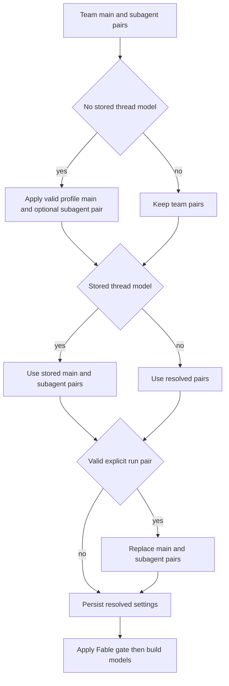

# Models, Profiles, and Instructions

A hosted agent run resolves a valid `(model_id, effort)` pair and a thread-stable repository-instruction value before it builds models. The triggering user's identity, credentials, PR preference, and personal instructions are deliberately re-evaluated for each message. This split lets a multi-party, long-lived thread keep its operational choices while avoiding attribution of one participant's preferences to another. See [Agent graph](../architecture/agent-graph.md), [Authentication and security](auth-and-security.md), [Configuration](../operations/configuration.md), and [Context engineering](../workflows/context-engineering.md).

## Model registry and stale selections

`SUPPORTED_MODELS` is the curated selectable-model registry. Each `ModelOption` contains the provider-prefixed id, label, allowed `efforts`, `default_effort`, image capability, and, where applicable, whether it may be saved as a default. `SUPPORTED_MODEL_IDS` is the membership set used during resolution. Effort is not a global enum: for example, Kimi K3 accepts only `low`, `high`, and `max`; Haiku accepts only `none`; and Gemini uses `minimal` through `high`. Always validate a pair with `model_supports_effort`, and validate multimodal input with `model_supports_images`.

The dashboard's `/options` response does not mutate this registry. It returns copied records enriched with context-window information, preferring explicit Codex overrides, then a LangChain provider profile, then a small fallback table. It removes Fable choices when the workspace switch is off and gates returned defaults as well.

### Defaults and recovery

`default_model_pair()` is the deployment-level terminal default. It reads `LLM_MODEL_ID` and `LLM_REASONING_EFFORT`, with a credential-sensitive built-in model id and default effort as fallbacks. The selected default must be a supported, default-eligible model and support its effort; otherwise it raises `ValueError` rather than constructing an arbitrary model. Local development startup separately validates the credential required by the configured default.

A selection that has fallen out of the registry is handled differently from one explicitly listed in `DEPRECATED_MODEL_IDS`:

* For a non-deprecated id, `provider_fallback_pair` chooses the first supported model on the same provider, preferring the same Claude family. It preserves effort where supported (including mapping Gemini `none` to `minimal`) and otherwise uses the fallback model's default effort. An unknown provider yields no pair.
* Deprecated ids are excluded from that recovery path and defer to a team or deployment default. `DEPRECATED_MODEL_REPLACEMENTS` currently contains empty values and `canonical_model_pair()` returns `None`; there is no automatic canonical migration.

All team default resolvers use a valid saved pair first, then same-provider recovery, then `default_model_pair()`. This is the invariant that stale persisted settings still produce a constructible pair.

## Precedence, roles, and thread lifecycle

Team settings are a single LangGraph Store record keyed `"default"` in `["team_settings"]`. Reads overlay non-null stored fields over hardcoded defaults and fail soft to those defaults on store failure. The team can set main and subagent pairs for agent and reviewer roles; review chat inherits the agent pair when its own pair is absent or invalid, and diff grouping inherits the reviewer subagent pair. Thread-title selection has a separate default and can switch an OpenAI title model to Haiku on an Anthropic-only deployment with neither gateway routing nor desktop OpenAI OAuth.

Profiles in `["profiles"]` carry a main pair, optional subagent pair, default repository and branch preferences, and PR/CI preferences. Profile writes are separate from encrypted OAuth records in `["oauth_tokens"]`, preventing concurrent profile saves and token refreshes from overwriting each other. Run-start profile lookup is fail-soft, while dashboard profile reads deliberately surface store failures.

*Caption: first-run resolution creates the thread snapshot; only a valid explicit run pair intentionally changes its model choice.*

`get_agent` seeds hosted runs from the team pairs. It reads a sender profile only if the thread has no stored main model; a valid profile main pair also becomes the subagent pair unless a valid profile subagent pair is supplied. Stored settings then take precedence. Finally, a valid `configurable.agent_model_id` plus `agent_effort` replaces both pairs and is persisted. `agent_settings` lives in thread metadata, is cached for five minutes, accepts only its typed fields, and reads or writes fail soft; malformed legacy metadata becomes an empty snapshot.

For selection-only callers, `resolve_agent_model_id` applies supported per-thread id, then valid profile id, then team default. Dashboard run creation uses the full pair in the order team, profile, request. A deprecated request intentionally leaves the team default, rather than allowing the profile to take effect. If dashboard input contains images, a text-only resolved selection is replaced with `default_vision_model_pair()`; direct image-content construction rejects a missing or text-only model with HTTP 422.

Fable is a workspace-wide ZDR gate. A Fable option cannot be saved as a normal default, and disabling Fable rewrites submitted Fable team defaults to a non-Fable Anthropic fallback. `gate_fable_model` is also applied after snapshot resolution to main, subagent, and title models, and by dashboard resolution and option listing. Thus a stale snapshot cannot cause a disabled Fable model to be advertised or constructed.

## Provider construction, reasoning, gateway, and runtime fallback

`provider_model_kwargs` translates the resolved effort at the provider boundary: OpenAI receives `reasoning` and uses `summary: "auto"` except for `none`; Anthropic receives adaptive, summarized `thinking` and an `effort`; Gemini 3 family models receive `thinking_level`; Fireworks receives `model_kwargs.reasoning_effort`; and Baseten receives `reasoning_effort` only for `low`, `high`, or `max`.

`make_model` constructs through `init_chat_model` with six retries and a 600-second timeout for shipped provider prefixes. OpenAI defaults to the Responses API with `store=False`, `output_version="responses/v1"`, and included encrypted reasoning; if gateway routing is not applied and no `OPENAI_API_KEY` exists, desktop OAuth can provide the model instead. Baseten is configured as OpenAI-compatible and, without gateway routing, requires `BASETEN_API_KEY` and its service URL. Models are cached by model id, requested gateway value, max tokens, frozen kwargs, and event-loop id; `close_cached_models` clears the cache and invokes `aclose` or `close`.

Gateway enablement is tri-state: a `True` or `False` team value wins, while `None` inherits `LANGSMITH_GATEWAY_ENABLED` (or the presence of a dedicated gateway key if that variable is unset). When routing is possible, gateway overrides replace direct base URL and API key, and select whether OpenAI uses Responses. A non-routable provider or absent LangSmith key is logged and remains direct rather than failing the run.

Provider request routing is distinct from runtime model fallback. `ModelFallbackMiddleware` uses `LLM_FALLBACK_MODEL_ID` when set; otherwise Anthropic primaries fall back to OpenAI and OpenAI primaries to Anthropic. Google, local, and self-hosted providers have no automatic cross-provider fallback.

## Instruction sources and authority

Repository custom instructions are workspace-admin-authored records in `["agent_instructions"]`, keyed by `owner/name`. On a new hosted thread the factory resolves instructions for the effective default repository and saves the text in the thread snapshot. `construct_system_prompt` renders it as **Repository-specific Custom Instructions**, so it is shared by the thread; if lookup fails, that section is absent rather than aborting the run.

Personal instructions are separate `["user_instructions"]` records keyed by GitHub login, capped at 20,000 characters. They can be changed from the dashboard or by `save_user_instructions`, so keeping them out of the profile avoids competing writers. During prepare-run, the factory loads the triggering user's current text and passes it to `construct_sender_context`, which emits a trusted sender-context message. It explicitly applies to that turn only.

Prompt authority is explicit:

1. A repository `AGENTS.md`, if present, overrides prompt defaults with the same authority as the system prompt.
2. Repository-specific custom instructions are mandatory but yield to `AGENTS.md`.
3. Environment instructions yield to repository instructions and `AGENTS.md`.
4. Sender-level personal instructions yield to repository instructions and `AGENTS.md`.

In particular, user instructions are not shared thread instructions and must not override repository policy.

## Change and test guide

When changing the registry, fallback, or profile normalization, exercise `tests/models/test_model_fallback_resolution.py`: it covers provider-preserving recovery, deprecated-id deferral, environment defaults, profile/team behavior, context enrichment, and Fable handling. Dashboard thread tests cover team/profile/request precedence and image validation/fallback. `agent/test_thread_settings.py` covers typed snapshot normalization, caching, and fail-soft persistence, while `models/test_agent_subagent_models.py` covers factory-level inheritance and explicit subagent selection. Update these focused cases when adding a provider, changing an effort set, or altering precedence.
