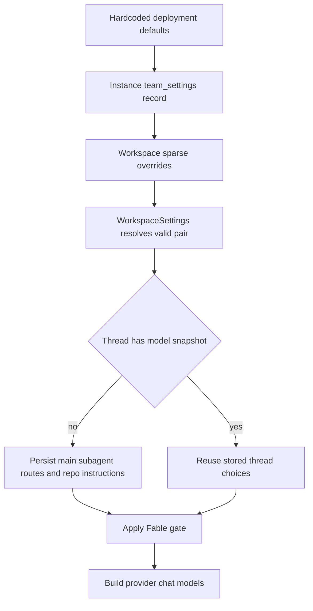

# Models, profiles, instructions, and prompts

Open SWE separates **workspace policy**, **thread-stable operational choices**, and **the people participating in a conversation**. Workspace settings select valid model defaults and feature policy; the factory snapshots the chosen models and repository instructions in thread metadata; participant data—including a person's standing instructions and PR preference—is refreshed as dynamic context. That separation is important for long-lived, multi-party threads: an administrator changing a workspace default affects new snapshots, while a later sender's personal settings are not attributed to the first sender.

See [Agent graph](../architecture/agent-graph.md), [Tools](tools.md), [Configuration](../operations/configuration.md), and [Context engineering](../workflows/context-engineering.md).

## Selectable models and validity

`openswe/dashboard/options.py` owns the curated `SUPPORTED_MODELS` registry. Each `ModelOption` couples a provider-prefixed id with its display label, allowed reasoning efforts, default effort, image capability, and optionally whether it can be a saved default. `SUPPORTED_MODEL_IDS` is the membership boundary used by settings and run resolution. Efforts are deliberately model-specific: for example, Kimi K3 accepts `low`, `high`, and `max`, while Gemini accepts `minimal` through `high`. Callers must validate a complete pair with `model_supports_effort`, rather than treating effort as a global enum; `model_supports_images` is the corresponding input-capability check.

The dashboard `GET /options` endpoint resolves defaults for the requested workspace, excludes Fable models when that workspace disables Fable, and enriches copies of options with context-window information. Context window discovery prefers explicit Codex overrides, then LangChain provider profiles, then a small fallback table. It never mutates the curated registry.

### Defaults, stale data, and Fable

`default_model_pair()` is the deployment terminal fallback. It reads `LLM_MODEL_ID` and `LLM_REASONING_EFFORT`, otherwise selects a credential-sensitive built-in default, and rejects an unsupported, non-default-eligible, or effort-incompatible choice with `ValueError`. `default_vision_model_pair()` similarly selects an OpenAI or Anthropic image-capable pair when image input requires it.

Persisted model ids can outlive the registry. A non-deprecated stale id is recovered by `provider_fallback_pair`: it stays with the same provider where possible, prefers the same Claude family, preserves a compatible effort (with Gemini `none` mapped to `minimal`), or takes the fallback option's default effort. An explicitly deprecated id does **not** receive that recovery: replacement entries are currently empty, so it falls through to a workspace or deployment default. Workspace resolvers enforce the final invariant: valid saved pair, then provider fallback, then `default_model_pair()`.

Fable is a workspace-wide ZDR control. Fable options are not eligible as saved defaults. When Fable is disabled, `gate_fable_model` replaces a resolved Fable id with a non-Fable Anthropic fallback while preserving effort when compatible. The write path rewrites affected workspace defaults, the options endpoint hides Fable, and the factory gates main, subagent, and title models immediately before construction. Therefore a stale thread snapshot cannot construct a disabled Fable model.

## Workspace settings supersede model profiles

Profiles no longer own model selection. `ProfileRecords` removes retired model and routing fields on every profile write and response normalization. A profile retains user-facing repository, branch, PR, and feature preferences; OAuth tokens are held in a separate encrypted record so a profile save cannot race with a login or token refresh and overwrite credentials. Run-start profile reads intentionally fail soft, whereas dashboard reads can surface storage failures.

Model defaults instead resolve at two workspace tiers:

1. Hardcoded defaults, derived from `default_model_pair()`.
2. The instance record `["team_settings"]`, key `"default"` (the retained pre-workspace storage location).
3. A sparse `["workspace_settings"]`, keyed by workspace slug, whose non-null fields override the instance record.

`get_workspace_settings()` is fail-soft: a store failure returns hardcoded defaults rather than taking down all agent and webhook work. `None` means inherit at the relevant tier, so clearing a workspace override restores the instance value. Factories cache the effective settings for 60 seconds using a slug-qualified key; the slug is essential because one worker serves multiple workspaces.

`WorkspaceSettings` provides role-aware resolution. Agent, reviewer, and chat defaults are distinct; chat inherits the agent default when it has no usable explicit pair. Main and subagent defaults are separate, as are fast, balanced, and performance routing tiers. The title model is resolved separately and switches an OpenAI title pair to Anthropic on an Anthropic-only deployment when neither usable gateway routing nor OpenAI credentials/OAuth are available.

```mermaid
flowchart TD
  Hardcoded["Hardcoded deployment defaults"] --> Instance["Instance team_settings record"]
  Instance --> Workspace["Workspace sparse overrides"]
  Workspace --> Resolve["WorkspaceSettings resolves valid pair"]
  Resolve --> Fresh{"Thread has model snapshot"}
  Fresh -- "no" --> Snapshot["Persist main subagent routes and repo instructions"]
  Fresh -- "yes" --> Stored["Reuse stored thread choices"]
  Snapshot --> Gate["Apply Fable gate"]
  Stored --> Gate
  Gate --> Build["Build provider chat models"]
```

*Caption: workspace tiers seed a thread once; a later workspace change normally affects only new thread snapshots.*

## Factory lifecycle and adaptive routing

`build_agent()` receives the run's workspace slug explicitly, loads normalized `agent_settings` metadata, and obtains cached workspace settings. A new hosted thread begins with the workspace agent/subagent pair, routing tiers, title pair, and repository instructions. The factory persists this snapshot before Fable gating. Existing threads reuse the stored main/subagent model, effort, routing state, routing tiers, and repository instructions, so default changes do not silently change an ongoing conversation.

The thread snapshot is typed and stored under `agent_settings`. Invalid or obsolete metadata normalizes to an empty snapshot; reads fail soft and are cached for five minutes. Ordinary writes are fail-soft, but strict writes used to pin a validated model request propagate a persistence failure. An explicit valid `agent_model_id`/`agent_effort` can replace the main and subagent pair, subject to conditions that protect an already pinned natural-language model request; a temporary image-input override is handled separately. Invalid ids or efforts never replace the resolved pair.

Model selection is also not simply a static default. Workspace `model_routing_enabled` enables fast/balanced/performance defaults, while dashboard `model_selection="auto"` enables adaptive routing unless a requested model has been pinned. Auto initially constructs the fast tier and the selection middleware records a route; an uncertain route remains fast rather than escaping the configured tiers. An explicit selection disables routing. The initial natural-language model handoff validates both availability and effort against the workspace's available options, rejects unsupported image/model combinations, and persists the accepted choice. Incidents disable adaptive routing and use the performance tier unless an explicit model is supplied.

Image capability is enforced in two places: dashboard creation can choose a vision default for text-only resolution, and the preparation handoff refuses an image-bearing request for a selected model that does not advertise `supports_images`.

## Provider construction, gateway, and runtime fallback

After resolution, `provider_model_kwargs()` translates the selected effort at the provider boundary: OpenAI uses a `reasoning` object (with an automatic summary except for `none`), Anthropic gets adaptive summarized thinking plus `effort`, Gemini 3 gets `thinking_level`, Fireworks gets nested `model_kwargs.reasoning_effort`, and Baseten supports `low`, `high`, and `max` through `reasoning_effort`.

`make_model()` calls LangChain `init_chat_model`, defaults to six retries, and gives shipped providers a 600-second request deadline. OpenAI uses the Responses API with `store=False`, `output_version="responses/v1"`, and encrypted reasoning content included. If it is direct-routed and has no `OPENAI_API_KEY`, desktop OAuth can build the OpenAI model. Baseten is treated as OpenAI-compatible and requires `BASETEN_API_KEY` plus its service base URL when not gateway-routed. Codex context-window overrides are passed as a model profile.

Gateway routing is tri-state. A workspace `gateway_enabled=True` or `False` is authoritative; `None` inherits `LANGSMITH_GATEWAY_ENABLED`, or the presence of `LANGSMITH_GATEWAY_API_KEY` if the flag is unset. For supported providers with a LangSmith key, gateway overrides supply the base URL and API key and choose the OpenAI Responses API behavior. Unsupported gateway providers or a missing LangSmith key are logged and remain direct, not failed.

Request routing is separate from runtime fallback. `ModelFallbackMiddleware` uses `LLM_FALLBACK_MODEL_ID` when set; otherwise Anthropic primaries fall back to OpenAI and OpenAI primaries to Anthropic. Google and other non-OpenAI/Anthropic prefixes deliberately have no cross-provider fallback.

## Prompt resources and instruction authority

`openswe.prompts.prompt()` is the prompt-resource boundary. It permits only relative `.md` and `.md.jinja` resource names under `openswe.resources/prompts`, rejects absolute paths and traversal, caches static loads, and renders Jinja templates with `StrictUndefined`. A static prompt cannot receive substitution values. `apply_tool_descriptions()` uses the same loader to attach `tools/<name>` prompt resources to registered tools, leaving a tool unchanged when no resource exists.

`construct_system_prompt()` composes the main system resource with source guidance, working-environment guidance, dashboard context, optional deployment default prompt, repository scope, collaboration guidance, repository instructions, recent context, and workspace instructions. A deployment can replace the default prompt through `DEFAULT_PROMPT_PATH`; a read failure is logged and simply omits that optional section.

Repository custom instructions are records in `["agent_instructions"]` keyed by `owner/name`, guarded by repository access at the dashboard API. On a new thread, the factory resolves the effective default repository's instructions and saves them in the thread snapshot; subsequent runs use that saved value. The system prompt renders them as **Repository-specific Custom Instructions**. Workspace instructions come from the workspace object and are rendered separately.

Personal instructions are records in the `instructions` user-record collection, keyed by GitHub login and capped at 20,000 characters. Both the profile UI endpoint and `save_user_instructions` can update them, so their separate record prevents profile saves from clobbering agent-authored changes. While preparing a run, the factory loads instructions for thread participants and serializes them as the participant `standing_instructions` field in deduplicated `person` context blocks. The prompt tells the agent that a person's instructions apply when acting on that person's requests and must never be carried to another participant.

Authority is explicit in the prompt resources: `AGENTS.md` overrides defaults; repository-specific instructions have system-prompt authority but yield to `AGENTS.md`; workspace instructions yield to repository instructions and `AGENTS.md`; personal standing instructions yield to repository instructions and `AGENTS.md`.

## Focused verification and safe changes

When changing model options or recovery, start with `tests/models/test_model_fallback_resolution.py`; it exercises provider-preserving stale recovery, deprecated model behavior, default credential selection, Fable fallback, and write validation. `tests/dashboard/test_workspace_settings_tiers.py` verifies instance/workspace inheritance and cache isolation, while `tests/models/test_agent_subagent_models.py` verifies that workspace defaults—not retired profile model fields—feed agent construction. `tests/agent/test_agent_assembly_context.py` covers snapshot stability, routing behavior, and per-sender preferences.

When adding a provider or effort, update the registry, provider-kwargs mapping, gateway support if appropriate, default validation, and focused tests together. Do not add model preference fields back to profiles: preserve the workspace → thread snapshot precedence and keep identity/personal instructions dynamic.
