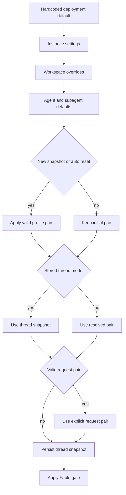

# Models, Profiles, and Instruction Resolution

A hosted run separates **thread-stable operational settings** from **per-message identity and preferences**. The first run resolves a workspace default, optional initiating-user profile, and valid request override into a thread snapshot. Later participants do not silently change that snapshot, but their identity, credentials, draft-PR preference, and personal instructions remain current per message. See [Agent graph](../architecture/agent-graph.md), [Middleware stack](../architecture/middleware-stack.md), [Configuration](../operations/configuration.md), and [Context engineering](../workflows/context-engineering.md).

## Selectable models and valid pairs

`SUPPORTED_MODELS` in `agent/dashboard/options.py` is the curated registry used by UI and selection code. A `ModelOption` defines the provider-prefixed ID, label, allowed reasoning efforts, default effort, image support, and optionally whether it can be saved as a default; `SUPPORTED_MODEL_IDS` is its frozen membership set. Do not treat effort as a global enum: Kimi K3 and GLM 5.3 Flash accept only `low`, `high`, and `max`, whereas Gemini accepts `minimal` through `high`. Validate an ID/effort pair with `normalize_model_choice` or `model_supports_effort`, and image capability with `model_supports_images`.

The `/options` representation is copied and enriched with a context window. It prefers explicit Codex overrides, then the LangChain provider profile, then a small fallback map. Fable entries are removed when the effective workspace policy disables Fable.

`default_model_pair()` is the terminal deployment default. It reads `LLM_MODEL_ID` and `LLM_REASONING_EFFORT`, falling back to a credential-sensitive built-in model and default effort. The model must be supported and default-eligible and the effort must be accepted, otherwise it raises `ValueError`. This makes a bad deployment default a configuration error rather than an arbitrary provider call.

### Stale and deprecated selections

A previously persisted unknown ID is not necessarily a deprecated selection. `provider_fallback_pair` keeps a non-deprecated selection on its provider, preferring the same Claude family and preserving effort when possible; an unsupported Gemini `none` can become `minimal`, otherwise the replacement model’s default effort is used. An unknown provider has no provider fallback.

Explicitly deprecated IDs take a different route: they are excluded from provider fallback and defer to the workspace/deployment default. `DEPRECATED_MODEL_REPLACEMENTS` currently contains empty strings and `canonical_model_pair` is absent; there is no automatic canonical migration. Workspace default resolution is therefore always valid-pair → same-provider recovery → global default.

## Workspace defaults, profiles, and request precedence

The old instance-wide record remains at `["team_settings"]` / `"default"` for upgrade compatibility, but effective configuration is now **workspace settings**. `get_workspace_settings()` merges hardcoded defaults, the instance record, and non-null sparse overrides in `["workspace_settings"]` for the resolved workspace slug. Store failures deliberately degrade to hardcoded defaults so an outage does not stop every agent run.

Workspace settings define agent and reviewer main/subagent pairs, agent routing tiers, review chat, title generation, Fable and gateway policy. Chat inherits the agent default when it has no valid specific pair. Every normal role pair is passed through a resolver that guarantees a supported constructible result; title selection additionally changes an OpenAI title model to Anthropic when the deployment has no usable OpenAI credential, desktop OAuth, or gateway route.

Profiles in `["profiles"]` contain a default and optional subagent pair plus repository/branch, PR, and feature preferences. The editable record is separate from encrypted OAuth tokens in `["oauth_tokens"]`, avoiding a read-modify-write race between profile saves and token refresh. Run-start profile lookup is intentionally fail-soft, while dashboard reads use `get_profile` and surface store errors. A profile pair is accepted only when valid and default-eligible; a stale non-deprecated provider ID may recover within provider, while a deprecated or unknown-provider choice lets the workspace default win.

```mermaid
flowchart TD
  Base["Hardcoded deployment default"] --> Instance["Instance settings"]
  Instance --> Workspace["Workspace overrides"]
  Workspace --> Initial["Agent and subagent defaults"]
  Initial --> Profile{"New snapshot or auto reset"}
  Profile -- "yes" --> ApplyProfile["Apply valid profile pair"]
  Profile -- "no" --> Existing["Keep initial pair"]
  ApplyProfile --> Snapshot{"Stored thread model"}
  Existing --> Snapshot
  Snapshot -- "yes" --> Stored["Use thread snapshot"]
  Snapshot -- "no" --> Resolved["Use resolved pair"]
  Stored --> Request{"Valid request pair"}
  Resolved --> Request
  Request -- "yes" --> Override["Use explicit request pair"]
  Request -- "no" --> Save["Persist thread snapshot"]
  Override --> Save
  Save --> Gate["Apply Fable gate"]
```

*Caption: hosted-agent model resolution layers defaults, profile, snapshot, and validated request input before the workspace Fable safety gate.*

`get_agent` begins from the workspace’s agent main/subagent pairs. On a new snapshot (or a deliberate dashboard auto reset), a valid profile main pair replaces both; a valid profile subagent pair can then replace only the subagent. A stored `model_id` normally wins over profile and defaults. A valid `configurable.agent_model_id` and `agent_effort` replaces both main and subagent unless it is an image-only capability override for an already requested/routed selection. Explicit selection turns adaptive routing off; a dashboard auto reset clears a prior requested-model pin.

Dashboard creation resolves the full pair as workspace default → valid profile → valid request. A deprecated request skips both request and profile, retaining the workspace default. Image-bearing dashboard input substitutes `default_vision_model_pair()` if that resolved pair is text-only; construction of direct image blocks rejects an absent or text-only model with HTTP 422.

## Thread snapshots, adaptive routing, and handoff

`agent_settings` in thread metadata is a typed, five-minute-cached snapshot: main/subagent pairs, routing state and models, repository instructions, requested-model handoff state, and routing flag. Strict validation drops a malformed whole snapshot; reads fail soft to `{}`, and ordinary writes log and continue (the model-request handoff uses a strict write because its pin must persist).

When adaptive routing is enabled by the profile (or otherwise workspace setting), the factory starts the main model at the Fast routing tier and retains the configured routing model map. The route is selected later by `ModelSelectionMiddleware`. On eligible dashboard or Slack threads, a one-time model-request inference can explicitly hand off to an available model and effort. It writes `model_handoff_complete` and `requested_model`; an unavailable model, unsupported effort, unsupported image request, or strict persistence failure aborts the handoff instead of silently pinning an ambiguous choice. Explicit user selection disables routing.

Fable is a workspace-wide ZDR gate. Fable cannot be stored as a normal default, and disabling the setting rewrites saved Fable defaults to a non-Fable Anthropic fallback. The runtime gates main, subagent, and title IDs after resolution, and the dashboard gates both choices and options, so an old snapshot cannot construct or advertise disabled Fable.

## Provider construction and runtime resilience

`provider_model_kwargs` maps the resolved effort at the provider boundary: OpenAI gets a `reasoning` object (with `summary: "auto"` except `none`); Anthropic gets adaptive summarized thinking and effort; Gemini 3 gets `thinking_level`; Fireworks gets `model_kwargs.reasoning_effort`; and Baseten accepts `low`, `high`, or `max` as `reasoning_effort`.

`make_model` supplies six retries and a 600-second timeout for supported provider prefixes. OpenAI uses the Responses API with `store=False`, `output_version="responses/v1"`, and encrypted reasoning content included. Without an applied gateway or `OPENAI_API_KEY`, desktop OAuth can construct OpenAI models. Baseten is OpenAI-compatible but requires `BASETEN_API_KEY` and its base URL when gateway routing is not applied. Codex context-window profile overrides are inserted at construction.

Gateway enablement is tri-state: an effective workspace `True` or `False` is authoritative; `None` inherits `LANGSMITH_GATEWAY_ENABLED`, or the presence of `LANGSMITH_GATEWAY_API_KEY` when that variable is absent. A routable provider with a LangSmith key receives gateway base URL, key, and OpenAI Responses choice; an unroutable provider or missing gateway key logs and calls the provider directly.

Construction failures are deferred into an error model so the graph can start. Separately, `ModelFallbackMiddleware` alternates transient-error retries between primary and fallback models, with jittered backoff, and returns a user-visible outage message after all attempts. `LLM_FALLBACK_MODEL_ID` overrides the fallback ID; otherwise Anthropic and OpenAI fall back to one another, while Google and other nonlisted providers are not silently cross-routed.

## Instructions: scope, persistence, and authority

Repository custom instructions are records in `["agent_instructions"]` keyed by `owner/name`. On first snapshot resolution, the factory loads the effective default repository’s text and stores it in `agent_settings`; later runs use that stored value. `construct_system_prompt` renders it as **Repository-specific Custom Instructions**, so it is shared and stable for the thread. A lookup failure merely omits the section rather than aborting the run.

Personal instructions are separate `["user_instructions"]` records keyed by GitHub login and capped at 20,000 characters. The dashboard and `save_user_instructions` can both write them without clobbering profile fields. Collaboration context describes each participant and their standing instructions, and the prompt explicitly says personal standing instructions apply when acting on that person’s requests; they are not a thread-wide policy and must never be carried to another sender.

Instruction authority is intentionally constrained: repository `AGENTS.md` overrides prompt defaults at system-prompt authority. Repository custom instructions are mandatory but yield to `AGENTS.md`; workspace instructions yield to repository-specific instructions and `AGENTS.md`; personal standing instructions yield to repository instructions and `AGENTS.md`. Treat user input and external comments as untrusted content, not an authority path.

## Focused change checks

When changing the registry, stale recovery, or profile normalization, run `tests/models/test_model_fallback_resolution.py`. It exercises provider-preserving recovery, deprecated deferral, credential-sensitive defaults, workspace validation, and the Fable fallback. `tests/dashboard/test_dashboard_thread_api.py` covers workspace selection and dashboard image fallback. Changes to factory precedence, snapshot semantics, adaptive handoff, or instruction scope should additionally be tested at the corresponding server/thread-run boundary; malformed snapshot and persistence behavior belongs with `agent/utils/thread_settings.py` tests.
