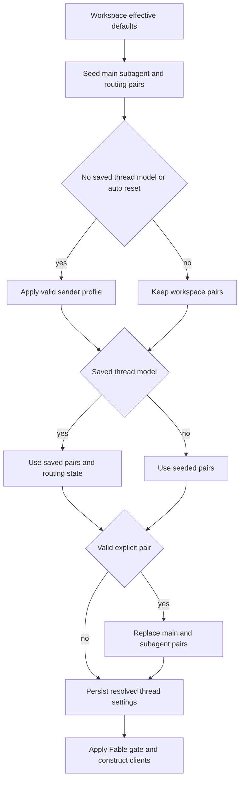

# Models, Profiles, Instructions, and Prompts

Open SWE separates **stored preferences** from the **model attribution resolved for a particular run**. Workspace settings supply durable organizational defaults; a profile can seed a new thread; `agent_settings` freezes most operational choices for that thread; and adaptive routing or a request in the opening task can select the model actually attributed to a turn. Repository instructions are similarly snapshotted for a thread, while participant identity, personal instructions, and PR preferences are refreshed for the sender of each turn.

This page covers the main coding agent. Related execution and tool behavior is described in [Agent graph](../architecture/agent-graph.md), [Tools](tools.md), [Configuration](../operations/configuration.md), and [Context engineering](../workflows/context-engineering.md).

## Model catalogue and validity

`SUPPORTED_MODELS` is the curated catalogue presented by the dashboard. A `ModelOption` defines a provider-prefixed identifier, display label, allowed reasoning efforts, default effort, image support, and optionally whether it can be made a saved default. `SUPPORTED_MODEL_IDS` is the membership boundary used when resolving selections. Do not treat effort as a global enum: the available values vary by model (for example, Kimi K3 allows only `low`, `high`, and `max`). Use `model_supports_effort()` and `model_supports_images()` when accepting a pair or image input.

The `/options` endpoint resolves defaults for the requested workspace, removes Fable when that workspace has not enabled it, and returns copied catalogue entries enriched with a context-window value. Context capacity prefers an explicit Codex override, then the LangChain provider profile, then a small fallback table; it does not modify the catalogue in memory.

`default_model_pair()` is the deployment-level terminal fallback. It reads `LLM_MODEL_ID` and `LLM_REASONING_EFFORT`, falling back to a credential-sensitive built-in model and default effort. The chosen model must be supported, eligible as a default, and support the effort; invalid environment configuration raises `ValueError` instead of silently constructing an arbitrary client.

### Stale and deprecated model IDs

A stale model ID and a deliberately deprecated one have different recovery semantics:

- `provider_fallback_pair()` recovers a non-deprecated unsupported ID to the first supported model on the same provider, preferring the same Claude family. It preserves an allowed effort, maps Gemini `none` to `minimal` when applicable, or uses the replacement model's default effort.
- Deprecated IDs do **not** receive this same-provider migration. `DEPRECATED_MODEL_REPLACEMENTS` currently has empty replacement values, so `canonical_model_pair()` has no canonical replacement. Resolution defers through the default chain instead.
- Every workspace default resolver accepts a valid saved pair, then tries same-provider recovery, then calls `default_model_pair()`. Thus stale durable settings still resolve to a constructible pair.

Fable is a workspace-level ZDR control. It is not eligible as a saved default. When disabled, `gate_fable_model()` substitutes a supported non-Fable Anthropic pair; workspace saves, `/options`, and the agent factory all apply the policy, preventing an old setting from advertising or constructing Fable.

## Workspace defaults and profile preferences

Workspace settings are tiered. The instance record remains in LangGraph Store namespace `["team_settings"]` under key `"default"`; a workspace has a sparse record in `["workspace_settings"]` keyed by its slug. Effective settings merge in this order:

1. Hardcoded defaults, including the deployment fallback pair.
2. Non-null instance-record values.
3. Non-null values in the selected workspace record.

A `None` field inherits its lower tier. Reads fail soft to hardcoded defaults because settings are on the start path for agents, reviewers, and webhooks. Workspace settings can provide distinct main and subagent pairs for agent and reviewer roles, three routing tiers (`fast`, `balanced`, and `performance`), a review-chat model, and a title model. Review chat inherits the agent default when its own pair is absent or invalid; title selection can switch its OpenAI default to Anthropic when neither gateway nor usable OpenAI credentials are available.

A user profile in `["profiles"]`, keyed by GitHub login, stores a main pair, optional subagent pair, repository/branch and PR preferences, and opt-in adaptive-routing preference. Profile updates validate model/effort combinations and reject models that cannot be saved as defaults. OAuth credentials live separately in `["oauth_tokens"]` and are encrypted there, so profile writes and OAuth refreshes cannot overwrite each other. The dashboard surfaces profile-store failures; run-start lookup uses `load_profile()` and degrades to no per-user override on a store failure.

A valid profile pair overrides workspace defaults only while a thread has no pinned model (or when the user deliberately resets dashboard auto selection). A stale non-deprecated profile ID can receive same-provider recovery; an absent, invalid, unrecognized-provider, or non-default-eligible profile selection contributes no override.

## Thread pinning, explicit choices, and per-run attribution

`agent_settings` in thread metadata is the persisted snapshot. Its typed fields include main and subagent pairs, routing state and tier pairs, repository instructions, and model-request handoff state. Loading is cached for five minutes; malformed settings normalize to an empty snapshot; normal writes are fail-soft, though the opening model-request handoff requests a strict write so it cannot claim a pin that was not persisted.

```mermaid
flowchart TD
  Workspace["Workspace effective defaults"] --> Seed["Seed main subagent and routing pairs"]
  Profile{"No saved thread model or auto reset"}
  Seed --> Profile
  Profile -- "yes" --> ApplyProfile["Apply valid sender profile"]
  Profile -- "no" --> KeepDefaults["Keep workspace pairs"]
  ApplyProfile --> Snapshot{"Saved thread model"}
  KeepDefaults --> Snapshot
  Snapshot -- "yes" --> UseSnapshot["Use saved pairs and routing state"]
  Snapshot -- "no" --> UseSeed["Use seeded pairs"]
  UseSnapshot --> Explicit{"Valid explicit pair"}
  UseSeed --> Explicit
  Explicit -- "yes" --> Pin["Replace main and subagent pairs"]
  Explicit -- "no" --> Persist["Persist resolved thread settings"]
  Pin --> Persist
  Persist --> Gate["Apply Fable gate and construct clients"]
```

*Caption: the factory snapshots selection inputs for thread stability, then applies runtime safeguards before constructing models.*

The normal precedence for the **stored selection** is workspace defaults → valid profile pair → saved thread pair → valid explicit `agent_model_id`/`agent_effort`. An explicit pair replaces both main and subagent pairs. A dashboard reset to automatic selection is an intentional exception: it reopens profile seeding and clears the prior request handoff rather than preserving a pinned model. Image capability is another narrow runtime exception: an image-bearing dashboard request can temporarily use a vision pair if its pinned pair is text-only, while direct image validation rejects missing or text-only models.

Adaptive routing is separate from that stored-selection precedence. A profile boolean overrides the workspace routing toggle; otherwise the workspace value applies. When enabled, the factory initially uses the fast tier and persists the resolved routing tiers. Before a turn, `ModelSelectionMiddleware` may choose a route, and the selected route's pair becomes `resolved_agent_model_id` / `resolved_agent_effort` and the recorded run metadata. That is **per-run attribution**, not necessarily a rewrite of the pinned pair.

Dashboard auto mode can also inspect the original attributed human task once. `infer_requested_model()` uses the available model catalogue and JEV classifications to recognize an explicit model or effort request, rejects unavailable or incompatible requests, and strictly persists the completed handoff. A successful request disables routing and pins the chosen pair; later turns reuse the saved result. An explicit dashboard mode skips automatic routing. Model-request prompts deliberately ignore quoted text, repository content, code, and tool output.

## Provider construction, gateway, and fallback

`provider_model_kwargs()` translates the resolved effort to provider-specific arguments: OpenAI uses `reasoning` (with summaries for efforts other than `none`); Anthropic uses adaptive summarized `thinking` plus `effort`; Gemini 3 uses `thinking_level`; Fireworks receives `model_kwargs.reasoning_effort`; and Baseten accepts `reasoning_effort` for `low`, `high`, and `max`.

`make_model()` calls `init_chat_model` with six retries and a 600-second timeout for shipped provider prefixes. OpenAI uses the Responses API by default with `store=False`, `output_version="responses/v1"`, and encrypted reasoning content included. Without gateway routing and without `OPENAI_API_KEY`, desktop OpenAI OAuth may construct the client instead. Baseten is initialized as OpenAI-compatible and requires `BASETEN_API_KEY` plus its service URL when gateway routing is absent. Configured Codex context-window variants receive a profile override at construction time.

Gateway enablement is tri-state: an effective workspace `True` or `False` is authoritative, while `None` inherits `LANGSMITH_GATEWAY_ENABLED`; if that variable is unset, a dedicated `LANGSMITH_GATEWAY_API_KEY` enables routing. For supported providers and an available LangSmith key, `gateway_overrides()` replaces the direct base URL and API key and controls OpenAI Responses usage. An unsupported provider or missing key is logged and remains direct rather than failing the run.

Runtime fallback is distinct from stale-setting recovery. The factory uses `LLM_FALLBACK_MODEL_ID` when present; otherwise Anthropic primaries fall back to OpenAI and OpenAI primaries to Anthropic. Other providers have no silent cross-provider fallback. `ModelFallbackMiddleware` alternates primary and fallback over its retry schedule for retryable errors, while provider-access errors are surfaced as an actionable response rather than retried across providers.

## Instruction and prompt layers

The system prompt is composed from package prompt resources through `prompts.prompt()`. Resource names are constrained to relative `.md` or `.md.jinja` files under `openswe/resources/prompts`; Jinja rendering uses `StrictUndefined`, so a missing template variable fails rather than producing a silently incomplete prompt. Tool descriptions can likewise be replaced from `tools/<tool-name>` resources. This makes prompt files an extension boundary without allowing path traversal outside the packaged resources.

The main agent prompt includes source and working-environment guidance, the optional deployment prompt from `DEFAULT_PROMPT_PATH` (or packaged `default_prompt.md`), repository scope, collaboration rules, repository custom instructions, workspace instructions, and other context-specific sections. The highest relevant instruction authority is explicit in the templates:

1. Repository `AGENTS.md` takes precedence over repository custom instructions and workspace instructions.
2. Repository custom instructions are mandatory system-prompt rules but yield to `AGENTS.md`.
3. Workspace instructions yield to repository custom instructions and `AGENTS.md`.
4. The system's structured input treats user-controlled values as data; user direction may override safe defaults but cannot authorize untrusted instructions or secret exposure.

Per-repository custom instructions are records in `["agent_instructions"]`, keyed by `owner/name` and guarded by repository-access checks in their dashboard endpoints. On a new thread, the factory loads the text for the effective prompt repository and saves it in `agent_settings.repo_instructions`; later runs reuse the snapshot. Lookup failure omits that optional section rather than aborting a run.

Personal instructions are separate `["user_instructions"]` records keyed by login and capped at 20,000 characters. They have their own endpoint and storage because dashboard edits and the `save_user_instructions` agent tool are independent writers. At prepare time, Open SWE resolves participants again and injects a dynamic person-context block. The current sender's block carries their `standing_instructions`; other participants' blocks retain their own identity and preference context. Consequently personal instructions are sender/participant context refreshed per turn, not shared repository policy or a thread-pinned system-prompt section.

## Operational change guide

When adding a model, update its catalogue record, supported effort/image capabilities, context-window handling if needed, gateway support where appropriate, and provider kwargs. Verify stale and deprecated-ID behavior, workspace tier inheritance, profile validation, thread snapshot precedence, image fallback, Fable gating, gateway direct fallback, and model-request pinning. Prompt edits should be tested as package resources: validate template substitutions, preserve the authority language in instruction layers, and ensure a new prompt resource remains inside `openswe/resources/prompts/`.
