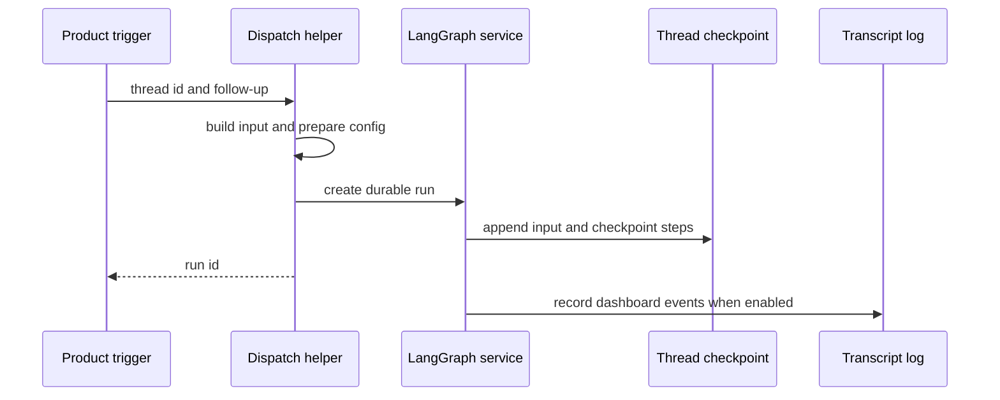

# Threads, Runs, and Durable State

A **thread** is the durable conversation identity: it selects LangGraph checkpoint state and its metadata indexes the conversation across Slack, GitHub, Linear, and the dashboard. A **run** is one execution against that thread. A follow-up must reuse the thread identity and append a new input; it must not create a random thread merely because it arrives through a different surface.

There are three complementary state stores:

- **LangGraph thread state and checkpoints** retain graph messages and execution progress.
- **LangGraph thread metadata** holds durable, queryable conversation facts such as source context, visibility, participants, settings, and sandbox binding.
- **LangGraph Store** holds independently namespaced application records, including Slack mappings and queues. It is not a replacement for thread metadata.
- When PostgreSQL is configured, the **transcript** is an append-only event log and projection for dashboard reads. It mirrors the metadata required to authorize those reads, but does not replace graph state.

## Identity is a routing contract

`agent/thread_ids.py` owns deterministic derivation. Its keys and namespaces are persisted cross-process contracts: webhook handlers, dashboard code, and reviewers re-derive an ID from the same external identity to locate a live conversation. Altering a formula leaves existing threads reachable only through migration or exceptional recovery.

| Purpose | Stable key and derivation |
| --- | --- |
| Slack location | UUIDv5 URL namespace over `slack:{channel}:{timestamp}:{nonce}` |
| PR agent conversation | UUIDv5 URL namespace over `{owner}/{repo}/pr/{pr_number}` |
| PR reviewer | UUIDv5 URL namespace over `{owner}/{repo}/pr/{pr_number}/reviewer` |
| Review chat | UUIDv5 URL namespace over `{owner}/{repo}/pr/{pr_number}/chat/{login.lower()}` |
| Review style or scout | UUIDv5 URL namespace over a repository- or PR-specific key |
| Linear or GitHub issue | SHA-256-derived UUID over its prefixed issue ID |
| Baby-sit lock | UUIDv5 URL namespace over `open-swe:baby-sit-lock:{key}` |

The reviewer key is distinct from the normal PR-comment key, so a PR reviewer cannot collide with the agent conversation. A GitHub PR-comment trigger can recover an Open SWE-created branch's embedded UUID; otherwise it uses the PR-comment identity. A Linear issue delivery deterministically returns to the issue thread.

### Slack is explicitly bound, then deterministically recoverable

A Slack `(channel_id, thread_ts)` maps to an Open SWE thread in Store namespace `("slack_thread_map", channel)`, keyed by timestamp. Resolution checks that mapping first, then searches thread metadata for the same `source_context` location, rejects ambiguity, and finally derives the Slack ID using any stored nonce. It binds the selected result and reads it back. Binding rejects an attempt to replace a location already mapped to another thread; one Slack location therefore cannot silently acquire two active identities.

Detachment writes a new nonce rather than merely removing the record. The next fallback derivation is consequently different, protecting a retired conversation from a later reuse of the same Slack location. A code channel deliberately uses the sentinel timestamp `"0"`: it is a whole-channel session, not a reply thread. That sentinel selects `conversations.history`; ordinary Slack conversations use `conversations.replies` for their thread timestamp.

## Metadata, settings, and Store boundaries

`source_context` is durable metadata describing the originating Slack location, Linear issue, GitHub issue, or PR. It accepts extras and dumps only supplied fields so enrichment by another integration survives; malformed historical context becomes empty rather than failing a run. Metadata upsert preserves a conversation's opening context and title rather than allowing later activity to repoint it.

Participants are represented as key-per-person `participant_logins` and `participant_emails` objects, allowing JSONB containment queries for a particular participant. Thread-level `agent_settings` is a snapshot: model and repository settings are resolved for the first run, then retained until explicitly replaced. Its strict schema drops invalid or obsolete values; reads are cached for five minutes and reads/writes fail soft so settings storage does not stop an execution.

`agent/store.py` is the sanctioned Store wrapper. A missing item yields `None`; transport failures propagate, preventing an outage from masquerading as no data. `TypedStore` validates one requested record strictly, while searches log and skip malformed historical records so one corrupt value does not break a listing.

## Follow-up input, invocation identity, and durable run creation

`dispatch_agent_run` is the shared entrypoint for Slack, Linear, GitHub, and dashboard triggers. It either accepts a complete prepared input or builds one from content and identities—not both. The input builder emits escaped `<input-message>` envelopes, validates namespaced entity IDs, and can introduce channel and system context. Dynamic-context blocks are content-hashed and suppressed if still visible; summarization hides messages before its cutoff, so their introductions become eligible again.

`RunConfig` is the per-run `configurable` transport contract, not durable thread state. It accepts unknown keys and emits only supplied fields, preserving data across independent writers. Parsing discards only fields that fail validation, rather than sacrificing a usable `thread_id` because another field is malformed.

This sequence shows that a follow-up creates a new run on an existing thread while checkpoints retain continuity; the optional transcript is a separate dashboard projection.

`create_durable_run` defaults to `multitask_strategy="interrupt"`, `durability="sync"`, `if_not_exists="create"`, and resumable streaming. Interrupt preserves the active run's sync checkpoint and runs the follow-up with retained history; background callers can request `enqueue`. Before calling LangGraph, dispatch ensures a system-owned title when requested, merges metadata, assigns or reconciles an invocation ID into both metadata and `configurable`, stamps its start time, and enables the v3 streaming compatibility marker. It requests values, updates, messages, custom, tasks, and checkpoints plus subgraphs, so a dashboard attaching to an externally started run can replay it.

A completion webhook is included only when the completion secret is set and the configured URL is an absolute non-loopback HTTP(S) URL. A bad or local URL disables completion replies with a warning instead of causing every run creation to fail. Checkpoints use deletion TTL: 43,200 minutes by default, swept every 60 minutes. Durable state is therefore recoverable during that retention period, not permanent archival.

## Transcript state for dashboard reads

When PostgreSQL is available, dashboard-created threads are marked with the transcript version and receive an initial `thread.created` event. The event log has a distinct role from LangGraph state: it provides a durable, streamable UI record of turns, messages, tool activity, metadata, attachments, and projections.

`transcript.engine.append` is the only writer. Under a per-thread PostgreSQL advisory transaction lock it reads the current head, allocates gapless versions, writes events, projections, command receipts, and any attachment or full tool-output side data, updates the head, then notifies listeners in the same transaction. A repeated `command_id` returns the originally recorded version instead of appending a duplicate. The full tool output stays out of the event payload; events carry a preview and readers fetch the protected output separately.

The transcript API authorizes against its local metadata mirror, with authorization and read sharing a repeatable-read snapshot. A thread without a transcript row is not served by this API. Metadata updates mirror only authorization-relevant keys and title; mirroring is best effort and logged on failure so the caller's primary metadata update is not blocked, but drift is observable. Live subscribers terminate with distinct `deleted` or `revoked` events if the transcript disappears or their permission is lost.

Dashboard follow-ups give the graph message a stable ID and append a `turn.requested` event keyed by that message before starting the run. A retry with the same client message ID therefore joins the recorded turn rather than producing a second request. A message sent while a run is live is recorded on that live turn for the agent to consume before its next model call.

## Cross-surface continuation and sandbox continuity

The dashboard can fork a collaborative public conversation into a new private thread. It creates a fresh UUID and private owner metadata, records `continued_from_thread_id`, copies LangGraph messages while annotating them with `collaborative_origin_thread_id`, and deletes the new thread if copying state fails. Later dashboard runs carry the continuation reference in `configurable`; it is provenance, not an instruction to resume the original public thread.

A thread's `sandbox_id` metadata binds its durable conversation to its working environment. `ensure_sandbox_for_thread` reuses a cached backend or reconnects using that ID. A missing or deleted sandbox is created or replaced, but an unreachable existing sandbox raises by default because replacing it could discard uncommitted work; callers may allow replacement for rebuildable read-only reviewer checkouts. A new ID is written only after sandbox creation and initialization, then the backend is published to the thread proxy cache, preventing a later run from adopting a half-built environment.

## Change and test guidance

- Treat ID formulas, Slack mapping behavior, and `source_context` shape as data migrations, not refactors.
- Test durable-run defaults and bad completion webhook degradation alongside any new trigger.
- Test transcript command idempotency, event ordering, access revocation, and metadata-mirror behavior when modifying dashboard state.
- Preserve the distinction between graph checkpoints, metadata, Store records, and transcript projections.
- For sandbox failure and replacement semantics, see [Sandbox Lifecycle](../architecture/sandbox-lifecycle.md). Related workflows: [Invocation](../workflows/invocation.md), [Follow-up Messages](../workflows/follow-up-messages.md), and [Models, Profiles, and Instructions](./models-profiles-instructions.md).
