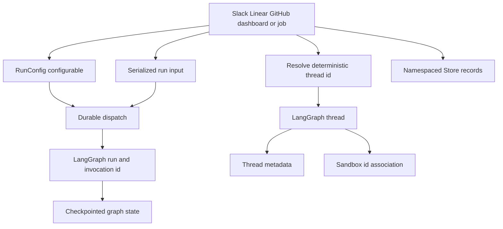

# Threads, Invocations, and Durable State

A LangGraph **thread** is Open SWE's durable conversation boundary: its stable `thread_id` selects checkpointed graph state and history. A **run** executes new input against that thread. An **invocation** identifies one application-level attempt across the run's configurable data, metadata, and completion/telemetry handling. Thread metadata and the LangGraph Store are separate persistence planes; neither should be treated as a replacement for checkpointed graph state.

This separation is an integration contract. A Slack, Linear, GitHub, dashboard, reviewer, or background entrypoint must select the existing thread identity, construct a fresh run input, and preserve durable metadata. It must not invent an arbitrary ID, repoint the opening source context, or replace a reachable-but-failing sandbox.

## Identities and ownership

| Identity or state | Scope and owner | Purpose |
| --- | --- | --- |
| `thread_id` | Durable LangGraph thread | Conversation routing, checkpoints, history, metadata, and sandbox association. |
| `run_id` | One LangGraph run | Platform execution instance. |
| `invocation_id` | One Open SWE dispatch attempt | Correlates run config, metadata, completion, and telemetry; `prepare_run_id` is its rolling legacy alias. |
| `configurable` / `RunConfig` | Per-run transport contract | Trigger, actor, repo, source, model, and graph-specific inputs. |
| Thread metadata | Durable, queryable thread index | Opening source context, participants, settings snapshot, type, title, and `sandbox_id`. |
| LangGraph Store | Namespaced application records | Slack location mappings, queues, watches, and other records independent of graph state. |

This lifecycle shows the thread as the durable convergence point while a run and invocation remain per-dispatch identities.

## Thread identity is a persistence contract

`agent/thread_ids.py` is the single home for deterministic derivation. Its input strings and UUID namespaces are persisted routing contracts: separate processes re-derive an ID from the same external identifiers, so changing a formula or key orphans live threads from normal entrypoints.

| Conversation or purpose | Derivation key |
| --- | --- |
| Slack location | `slack:{channel}:{timestamp}:{nonce}` |
| PR agent thread | `{owner}/{repo}/pr/{pr_number}` |
| PR reviewer | `{owner}/{repo}/pr/{pr_number}/reviewer` |
| Per-user PR review chat | `{owner}/{repo}/pr/{pr_number}/chat/{login.lower()}` |
| Review scout | `{owner}/{repo}/pr/{pr_number}/review-scout` |
| Repository review style | `{owner}/{repo}/review-style` |
| Linear or GitHub issue | `linear-issue:{issue_id}` or `github-issue:{issue_id}` |
| Baby-sit lock | `open-swe:baby-sit-lock:{key}` |

Slack, PR-related, review-style, and baby-sit IDs use URL-namespaced UUIDv5; issue IDs use the SHA-256-derived UUID representation. In particular, reviewer and PR-comment keys differ, preventing an autonomous reviewer from colliding with the normal agent conversation. GitHub PR comments first recover an Open SWE-created branch's embedded UUID and only then fall back to the PR key; Linear redeliveries use the issue ID and converge on its thread.

### Slack locations and code channels

A Slack `(channel, timestamp)` has a Store mapping in a per-channel namespace. Resolution first uses that mapping, then searches thread metadata for matching `source_context`, and rejects ambiguous multiple matches. It binds either the discovered ID or the deterministic fallback and verifies the stored result; binding refuses to overwrite a location owned by another thread. Detaching a location writes a fresh nonce rather than merely deleting it, so later fallback derivation cannot collide with the retired thread.

A Slack code channel is a channel-wide session, not a reply thread. It uses `CODE_CHANNEL_SESSION_TS = "0"`; moving work into a code channel binds `(channel_id, "0")` to the current agent thread and updates its source context. The sentinel makes context retrieval use whole-channel `conversations.history` rather than thread-scoped `conversations.replies`. Its Slack UI statuses—`processing`, `active`, `suspended`, and `closed`—are not LangGraph thread statuses.

## Metadata: durable provenance and thread policy

`SourceContext` is the durable description of where a thread began (Slack, Linear, GitHub, or PR). It permits and round-trips unknown supplied fields and emits only supplied fields; malformed historical values parse as empty context rather than failing a run. Metadata upsert preserves a nonempty opening context and the first title, so later activity cannot silently repoint a conversation.

Participant logins and emails are key-per-person objects, such as `{"octocat": true}`, rather than lists. This is deliberately queryable through JSONB containment. Reviewer threads additionally carry `kind = "reviewer"`; reviewer metadata can record PR, SHA, watch, and findings-related state, while completion logic uses the kind to apply reviewer-specific handling.

Thread-level `agent_settings` is a different metadata snapshot. Model, effort, subagent settings, and repository instructions are resolved on the first run; sender identity, personal instructions, and PR preferences stay per-message. A later profile edit does not mutate the snapshot unless an explicit operation rewrites it, such as a per-run model override. Reads are cached for five minutes, settings are strictly normalized to the declared shape, and settings read/write failures fail soft rather than breaking a run.

## Per-run configuration and input

`configurable` is not durable thread state. It is a per-run contract that crosses webhooks, dashboard, cron, agent, reviewer, and analyzer code. `RunConfig` makes cross-surface compatibility a deliberate invariant: it allows unknown keys, dumps only supplied fields, and iteratively drops only fields that fail validation. Thus a malformed `pr_number` cannot discard a valid `thread_id`, and a newer writer's unknown key survives read–enrich–write hops. Non-mapping input becomes an empty configuration. Conflicting or malformed `invocation_id`/`prepare_run_id` is rejected as an identity conflict rather than guessed.

`prepare_run_config` resolves an existing invocation identity or creates a UUID, writes both `invocation_id` and the legacy `prepare_run_id` during migration, and records one `invocation_started_at`. It puts the identity in both run metadata and `configurable`, allowing completion and usage telemetry to correlate the same invocation. Do not use invocation identity as a thread key: a follow-up has a new invocation but normally reuses the durable thread.

Run input is newly authored input, not metadata. `build_run_input` serializes requests in escaped `<input-message>` envelopes with validated namespaced identities, surface, kind, optional channel, and structured data. It can prepend hashed channel and system `<dynamic-context>` introductions. Previously injected introductions are suppressed; when summarization hides old messages beyond its cutoff, only visible hashes count, so necessary context can be injected again.

## Durable dispatch, checkpoints, and follow-ups

`dispatch_agent_run` is the common agent/reviewer launch boundary. It accepts either a prebuilt input or content/source identities, never both, then calls `create_durable_run`. Default dispatch is `multitask_strategy="interrupt"` and `durability="sync"`: a follow-up interrupts active work with its checkpoint preserved, while an idle thread starts normally. Background work can elect `enqueue` instead.

Each created run has `if_not_exists="create"`, resumable event streaming, V3 stream modes (`values`, `updates`, `messages`, `custom`, `tasks`, `checkpoints`), subgraph streaming, and the `__event_streaming_v2` compatibility marker. This permits a dashboard that did not create the run to replay events, show it as active, and receive tool/subagent namespaces. The completion webhook is attached only when its secret exists and the configured URL is an absolute non-loopback HTTP(S) URL; invalid configuration degrades to no webhook rather than making every `runs.create` fail.

The Store FIFO is intentionally narrower than dispatch concurrency. Webhook triggers no longer require an in-process busy lock, but dashboard injection and Slack message edits can queue `pending_messages` in `("queue", thread_id)`. Queue IDs deduplicate an already-enqueued payload; the queue is capped at `MAX_QUEUED_MESSAGES` (100) and drops oldest entries. Checkpoints themselves have deletion TTL configuration: `delete` strategy, 43,200-minute default TTL, and a 60-minute sweep interval. Durable history is therefore durable within configured retention, not perpetual.

## Store failure boundary

`agent/store.py` is the sanctioned Store wrapper. A missing item reads as `None`; every other Store failure propagates. This prevents an outage from being mistaken for an empty record. A critical path that can legitimately degrade must catch its own exception and make that choice locally. `TypedStore` binds a namespace to a Pydantic record model: fetching a requested unreadable record raises, whereas searches log and skip malformed records so one corrupt historical entry does not prevent a listing.

## Sandbox association and recovery

Thread metadata's `sandbox_id` associates conversational continuity with a working tree. `ensure_sandbox_for_thread` first uses a cached connection or reconnects with that ID, then creates only when no association exists. Creation includes initialization, proxy setup, git identity, and optional workspace refresh. The ID is persisted only after that succeeds, and the backend is published to the per-thread proxy only last; a failed setup therefore leaves neither a half-built ID to adopt nor a backend that consumers can use.

An existing but unreachable agent sandbox raises `SandboxUnreachableError` rather than being silently replaced, because replacement risks losing uncommitted work. A `SandboxGoneError` is replaced because the deleted sandbox cannot be recovered and its ID would otherwise brick the thread. `allow_replacement=True` also permits replacement of an unreachable reviewer sandbox because its read-only checkout is re-derivable. The thread-keyed proxy preserves references across a reconnect or replacement.

## Change and test checklist

Focus tests on the contracts that survive process and surface boundaries:

- Test deterministic derivation, branch UUID recovery, Slack mapping conflict/ambiguity/retirement, and the code-channel `"0"` sentinel.
- Test `RunConfig` unknown-key round trips, field-local malformed-value removal, legacy/equal dual invocation IDs, and conflicting invocation rejection. This tolerant parsing and preservation is a cross-surface compatibility invariant.
- Test durable dispatch defaults, V3 streaming marker/modes, resumable opt-out where requested, completion-webhook degradation, and interrupt versus enqueue behavior.
- Test source-context preservation, envelope escaping and identity validation, dynamic-context deduplication, and reintroduction after summarization.
- Test Store not-found versus outage behavior, typed listing tolerance, sandbox publication ordering, and the unreachable-versus-gone replacement distinction. See [Sandbox Lifecycle](../architecture/sandbox-lifecycle.md).

For surrounding flows, see [Invocation](../workflows/invocation.md), [Follow-up Messages](../workflows/follow-up-messages.md), and [Models, Profiles, and Instructions](./models-profiles-instructions.md).
