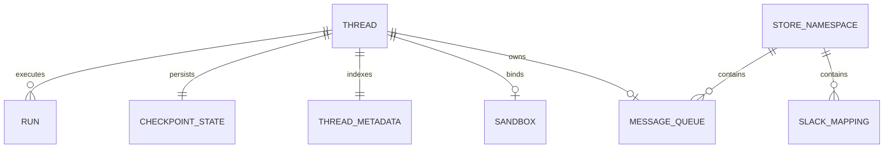
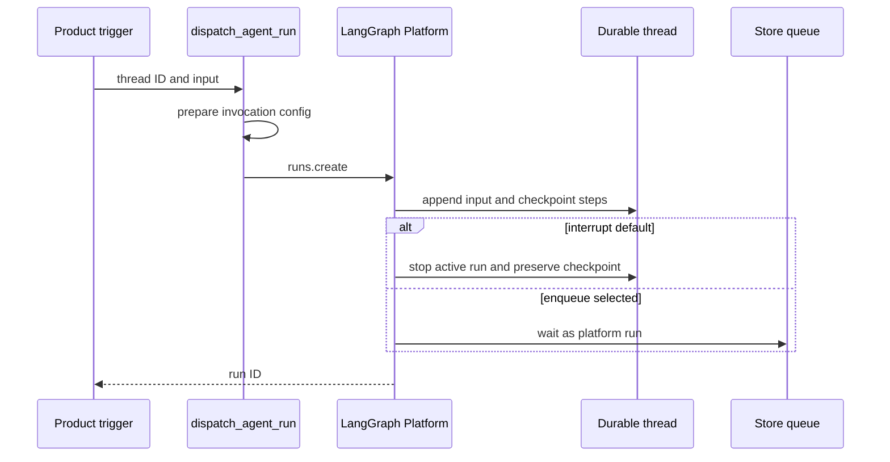

# Threads, Runs, and Durable State

A **LangGraph thread** is Open SWE's unit of continuity: its stable `thread_id` selects checkpointed graph state and history. A **run** is one execution on that thread, adding input and advancing state; it is not a new conversation. Thread metadata is the durable, queryable cross-surface index for facts such as origin, participants, settings, and `sandbox_id`. The LangGraph Store is separate namespaced key/value storage for application records such as mappings and queues.

This separation is a safety boundary. A new integration turn should resolve an existing identity and add a run, rather than create a random thread; metadata updates should enrich the opening context rather than repoint it; and sandbox reconnection failure must not be mistaken for permission to discard a working tree.

A thread owns graph continuity and metadata, while Store namespaces hold application-owned mapping and queue records.

## Identity is a persistence contract

`agent/thread_ids.py` is the single home for deterministic thread-ID derivation. Its keys and namespaces are cross-process routing contracts: webhooks, dashboard paths, and reviewer logic independently re-derive the same ID from external identifiers. Changing a formula or input string therefore orphans live threads from their normal entrypoints.

| Purpose | Function and stable key | Derivation |
| --- | --- | --- |
| Slack location | `slack_thread_id`: `slack:{channel}:{timestamp}:{nonce}` | URL-namespaced UUIDv5 |
| PR comment | `pr_comment_thread_id`: `{owner}/{repo}/pr/{pr_number}` | URL-namespaced UUIDv5 |
| PR reviewer | `reviewer_thread_id`: `{owner}/{repo}/pr/{pr_number}/reviewer` | URL-namespaced UUIDv5 |
| Review style | `review_style_thread_id`: `{owner}/{repo}/review-style` | URL-namespaced UUIDv5 |
| Baby-sit lock | `baby_sit_lock_thread_id`: `open-swe:baby-sit-lock:{key}` | URL-namespaced UUIDv5 |
| Linear issue | `linear_issue_thread_id`: `linear-issue:{issue_id}` | SHA-256-derived UUID |
| GitHub issue | `github_issue_thread_id`: `github-issue:{issue_id}` | SHA-256-derived UUID |

The reviewer suffix deliberately places a review agent on a distinct thread from a PR's coding-agent conversation. For a PR branch created by Open SWE, the GitHub comment handler first recovers the UUID embedded in the branch using `thread_id_from_branch`; only a branch without one falls back to the PR-comment formula. Linear redelivery derives the same issue thread ID.

### Slack location resolution and code channels

Slack locations have an explicit Store mapping in `("slack_thread_map", channel_id)`, keyed by the Slack timestamp. `resolve_slack_thread_id` first uses that mapping. On a miss it searches thread metadata for an exactly matching `source_context`, rejects ambiguous matches, and binds either the one match or the deterministic Slack fallback. `bind_slack_thread_id` validates the location, refuses to overwrite a mapping to another thread, and reads it back after writing. Consequently a location is not silently assigned to two Open SWE threads.

Retiring a location writes a new nonce instead of merely removing the mapping. The next fallback derivation is therefore different and cannot collide with the retired conversation. Retirement also removes Slack run-map records for that location.

A Slack code channel is one session spanning the channel, not a reply thread. It uses `CODE_CHANNEL_SESSION_TS = "0"`; `manage_code_channel` binds the agent thread to `(channel_id, "0")` and updates its source context. That sentinel switches context retrieval from `conversations.replies` with `ts` to whole-channel `conversations.history` without `ts`. Its Slack UI statuses—`processing`, `active`, `suspended`, and `closed`—are separate from LangGraph thread/run status.

## Metadata, state, and Store ownership

`source_context` is durable thread metadata identifying the opening Slack location, Linear issue, GitHub issue, or PR. `SourceContext` preserves unknown supplied fields and converts malformed historical input to an empty context so legacy metadata does not fail a run. Metadata upsert keeps the opening source context and title rather than allowing later activity to repoint the conversation. Participants use key-per-person maps such as `{"octocat": true}` for logins and emails, rather than lists, because JSONB containment can match an individual object entry.

Reviewer threads are marked `kind = "reviewer"`. That enables metadata searches and makes completion handling skip normal agent-Slack success work for reviewer state.

Thread-level model and repository settings live in metadata under `agent_settings`. They are resolved on the first run so a multi-party, long-lived conversation is stable despite later participant profile edits. Sender identity, personal instructions, and PR preferences remain per-message context. The declared settings schema is strict; values are normalized, cached for five minutes, and storage reads/writes fail soft. An explicit replacement, currently including a per-run model override, is required to alter the snapshot.

Use `agent/store.py` for application Store access. It distinguishes an absent item (`None`) from any non-404 failure (raised), so an outage is not rendered as empty state. `TypedStore` binds a namespace to a Pydantic model: a requested unreadable record raises, but listings log and skip invalid records so one corrupt historical entry does not fail an entire listing.

## Inputs and configuration survive handoffs

A run supplies new `RunInput`; the graph retains the thread state. Authored requests are serialized in escaped, validated `<input-message>` envelopes. Person, channel, and system introductions are serialized as hashed `<dynamic-context>` messages; invalid or non-namespaced identity IDs are rejected, and channel topic/purpose are explicitly marked untrusted.

Previously injected context hashes suppress duplicate introductions. Summarization hides messages before its cutoff while leaving them in state, so `visible_dynamic_context_hashes` examines only prompt-visible messages. Hidden introductions may then be added again, preventing a summary from leaving the model unable to identify a sender it still sees.

`RunConfig` is a per-run `configurable` transport contract, not thread state. It is deliberately forward-compatible: unknown keys survive, output includes only supplied keys, and parsing drops only fields that cannot validate. This lets webhooks, dashboard routes, cron launchers, and graphs enrich configuration through multiple hops without one malformed field losing the rest.

## Durable dispatch, checkpoints, and concurrency

`dispatch_agent_run` is the common entrypoint for agent and reviewer execution. It accepts either a prebuilt `RunInput` or content plus source identities, never both; it selects the `agent` or `reviewer` graph and delegates to `create_durable_run`. Dispatch merges supplied metadata, resolves or creates a shared invocation ID in both `configurable` and metadata, and enables the LangGraph v3 streaming compatibility marker.

A product trigger creates a durable run on an existing thread; interrupt and enqueue are run-level concurrency choices.

The defaults are `multitask_strategy="interrupt"`, `durability="sync"`, `if_not_exists="create"`, resumable streaming, all v3 stream modes, and subgraph streaming. Sync durability checkpoints before each step, allowing a crash or recycle to resume from the last checkpoint. Interrupt preserves that checkpoint while superseding active work; background follow-ups can opt into `enqueue`. This durable platform arbitration replaces webhook busy locks and is also the reason a thread does not provision two sandboxes concurrently.

`stream_resumable=True` retains events for later attachment. Together with the v3 marker, modes, and subgraph streaming, it lets the dashboard replay an externally-triggered run and observe tool/subagent events rather than incorrectly appearing idle.

The Store FIFO at `("queue", thread_id) / "pending_messages"` is different from platform run enqueueing: it is for deliberately injecting a message into a run already in flight, notably dashboard handoff and Slack edits. It keeps at most `MAX_QUEUED_MESSAGES` (100), discarding oldest messages; an optional `queue_id` deduplicates an already queued dictionary message.

A completion webhook is attached only when `RUN_COMPLETE_WEBHOOK_SECRET` is configured and `COMPLETION_WEBHOOK_URL` is an absolute non-loopback HTTP(S) URL. Otherwise dispatch warns and omits it, avoiding a rejected platform webhook that would fail every `runs.create`. The completion route itself verifies the secret fail-closed. Terminal `error` and `timeout` can produce an idempotent source-surface failure reply; `interrupted` is intentionally not treated as failure because it is the normal replacement path. Checkpoints use the configured delete TTL: 43,200 minutes by default, swept every 60 minutes, so dormant checkpoint state eventually expires.

## Sandbox attachment and recovery

Thread metadata's `sandbox_id` connects durable conversation state to its working tree. `ensure_sandbox_for_thread` reuses a cached backend or reconnects using this ID; it creates a sandbox only when neither exists. A new or replacement ID is written only after creation and initialization succeed, then the backend is published to the stable per-thread proxy cache. This publication order prevents a later run from adopting a half-built sandbox or using a backend whose initialization only failed in the background.

An existing but unreachable normal-agent sandbox raises `SandboxUnreachableError` rather than being replaced, because replacement can discard uncommitted work. A `SandboxGoneError` is replaced, since a deleted sandbox cannot be recovered and a stale ID would otherwise brick the thread. `allow_replacement` also permits replacement of an unreachable sandbox when its checkout is re-derivable, which is used by the read-only reviewer. Reconnection refreshes managed GitHub proxy credentials and reapplies git identity where relevant.

## Focused change checks

- Test deterministic derivations and the GitHub branch UUID fallback before changing routing keys.
- Test Slack mapping hit, metadata fallback, duplicate-match rejection, nonce retirement, and code-channel sentinel behavior.
- Test `dispatch_agent_run` argument exclusivity, invocation-ID preservation, v3 resumable stream configuration, and invalid completion URL degradation.
- Keep run enqueue and Store message injection distinct in tests, including the FIFO cap and `queue_id` deduplication.
- Test input escaping, identity validation, context de-duplication, and reintroduction after summarization.
- Test sandbox create/bind/publish ordering and the unreachable-versus-gone recovery distinction. See [Sandbox Lifecycle](../architecture/sandbox-lifecycle.md).

For entrypoint flow see [Invocation](../workflows/invocation.md); for live follow-up and stop behavior see [Follow-up Messages](../workflows/follow-up-messages.md); for profile inputs to the settings snapshot see [Models, Profiles, and Instructions](./models-profiles-instructions.md).
