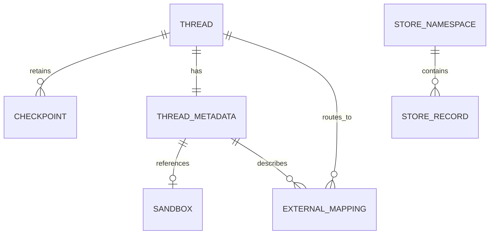

# Threads, run state, and durable records

A LangGraph **thread** is Open SWE's unit of conversation continuity. A stable `thread_id` lets a Slack, GitHub, Linear, dashboard, or reviewer trigger find the same conversation; its checkpoints retain graph state and message history, while thread metadata retains queryable, durable facts about that conversation. The LangGraph **Store** is separate, namespaced durable key/value storage for records that are not inherently a property of one thread.

This distinction matters operationally: checkpoint retention is finite, sandbox state is external to LangGraph and referenced by metadata, and a Store read that is missing is not the same failure as an unavailable Store.

The ownership model: checkpoints belong to a thread, metadata describes it, and Store records hold separately namespaced application data and external mappings.

## Stable identity is a persistence contract

`agent/thread_ids.py` is the single home for deterministic thread-id formulas. These IDs are not disposable request IDs: independently running webhooks, dashboard code, and the reviewer re-derive them from external identifiers to route a later event to an existing thread. Consequently, changing a stable-key string, namespace, or derivation algorithm is a data migration concern: existing threads become unreachable by the new formula.

| Conversation or purpose | Derivation |
| --- | --- |
| Slack location | UUIDv5 of `slack:{channel}:{timestamp}:{nonce}` |
| GitHub PR comment on a non-agent branch | UUIDv5 of `{owner}/{repo}/pr/{pr}` |
| Reviewer for a PR | UUIDv5 of `{owner}/{repo}/pr/{pr}/reviewer` |
| Review style or baby-sit lock | UUIDv5 of their documented stable keys |
| Linear or GitHub issue | SHA-256-derived UUID of the issue-specific stable key |

The reviewer key deliberately differs from the ordinary PR-comment key, so an agent conversation and the review process for the same PR do not share state. For a PR created by Open SWE, the GitHub handler can instead recover the original agent ID from a UUID embedded in its branch name; otherwise it uses the PR-comment formula.

### External conversation mappings

A deterministic fallback cannot express every lifecycle decision, so Slack also has an explicit Store mapping from a `(channel, timestamp)` location to a thread. Resolution prefers that mapping, then searches thread `source_context` metadata, and only then derives and binds the fallback ID. Binding rejects a conflicting target and verifies persistence; ambiguous metadata matches raise rather than silently selecting a conversation. Detaching an association stores a new nonce, making the next fallback ID distinct from the retired thread.

This mapping layer is also how code channels use one agent session for an entire channel: their sentinel timestamp is `CODE_CHANNEL_SESSION_TS = "0"`. The sentinel selects channel-wide Slack history instead of replies for one Slack thread and is bound to the session thread like any other location.

## What belongs where

### Checkpoints and run input

A run is submitted against a thread with a structured `RunInput`, rather than raw, surface-specific text. `build_run_input` serializes the authored input plus person, channel, and system identities; the dispatch layer derives a fallback identity from `RunConfig` when callers have not built that input already. `RunConfig` is a permissive, optional per-run `configurable` contract: unknown fields survive a parse/dump round trip, while malformed known fields are dropped individually so one bad value does not discard the rest of the run context.

Checkpoints belong to the LangGraph thread and are created with the durable-run policy below. They are the recovery point for graph execution, not a general application database. `langgraph.json` configures their TTL to delete after `43200` minutes, with a 60-minute sweep. A dormant thread can therefore retain metadata and Store records while its checkpointed graph state has expired.

### Thread metadata

Thread metadata is the durable, queryable home for facts that describe a particular conversation and that must travel across workers. Important examples include:

- `source_context`, repository information, and participant maps used to discover and authorize a conversation;
- `agent_settings`, the first-run snapshot of thread-level model, subagent, and repository-instruction settings;
- `sandbox_id` and sandbox proxy configuration, which reference the external working environment rather than storing its working tree; and
- reviewer `kind`, PR identity, findings, and review progress. Reviewer metadata uses `kind = "reviewer"` so completion, dashboard, and review workflows can distinguish reviewer threads from agent threads.

Participant maps are objects keyed by normalized login or email, with `true` values, not lists. This is intentional: JSONB containment can filter inside an object to find one participant, which permits efficient thread discovery by participant.

Settings are deliberately a thread snapshot because conversations are long-lived and can have multiple participants. They are resolved on the first run; later profile changes do not rewrite an existing conversation unless an explicit operation, such as a per-run model override, writes a replacement. The settings helper validates the stored shape, caches reads for five minutes, and fails soft on metadata read/write errors so optional settings persistence cannot prevent a run.

### Store records and error policy

`agent/store.py` is the sanctioned boundary for LangGraph Store access. It establishes a non-negotiable invariant: a missing item yields `None`; all other failures raise. In particular, an outage must never masquerade as an empty record. A caller may introduce a fallback only when it is explicitly appropriate on a critical path, by catching the failure locally and documenting why continuing is safer than failing the run.

`TypedStore` associates a namespace with a Pydantic model. Its direct `get` lets a malformed requested record raise, while search operations log and skip invalid records so one historical corrupt record does not break a listing. Use Store for independently addressable data such as Slack mappings and dashboard's bounded pending-message queue, rather than enlarging thread metadata with an unbounded collection.

## Sandbox binding and recovery

The in-process `SANDBOX_BACKENDS` registry maps a thread ID to a stable `SandboxBackendProxy`; the proxy may replace its live backend without changing the object held by middleware. If no backend is cached, it reads `sandbox_id` from the run metadata when available or from the live LangGraph thread, and reconnects through the sandbox provider. Concurrent proxy users share one startup task, and cancelling one waiter does not cancel startup for the others; a failed startup clears the task so a later call can retry.

The sandbox lifecycle owns the stronger policy. It reuses a cached backend first, reconnects when metadata has an ID, and creates only when neither exists. A merely unreachable sandbox raises `SandboxUnreachableError` rather than being silently replaced, protecting uncommitted working-tree changes. A deleted sandbox is replaced because its stale ID would otherwise permanently brick the thread; read-only reviewer callers may explicitly allow replacement of an unreachable sandbox because their checkout is re-derivable. The new `sandbox_id` is written to thread metadata only after creation and initialization, then the backend is published to the in-memory proxy.

See [Sandbox lifecycle](../architecture/sandbox-lifecycle.md) for provider and replacement details.

## Durable dispatch and interruption semantics

All normal agent and reviewer triggers should use `dispatch_agent_run` / `create_durable_run`, not make bespoke `runs.create` calls. The shared dispatch contract prepares run configuration and applies:

- `durability="sync"`, which checkpoints before each step so an interrupted worker can resume from the last checkpoint;
- `multitask_strategy="interrupt"` by default, which interrupts an active run for a new follow-up while preserving checkpointed progress; explicitly background work such as `/baby-sit` can use `enqueue` instead;
- the event-streaming marker, stream modes, subgraph streaming, and `stream_resumable=True`, allowing the dashboard to attach later and replay a run started by another surface; and
- a completion webhook only when `RUN_COMPLETE_WEBHOOK_SECRET` is set and `COMPLETION_WEBHOOK_URL` is absolute and non-loopback. Invalid or local URLs degrade to no webhook with a warning rather than causing every run creation to fail.

The dashboard retains one exceptional Store-backed FIFO: when a user deliberately injects a follow-up into an already busy run, it queues up to `MAX_QUEUED_MESSAGES` and discards the oldest excess messages. Webhook triggers do not use that queue; the platform-level interruption strategy handles their in-flight follow-ups.

The dashboard presents a just-cancelled run as `interrupted` even while the thread temporarily reports `busy`; otherwise cancellation's asynchronous status update could look like a still-running agent. It reports pending or running runs (or a busy thread) as running, failed/error/timeout as error, success as finished, and all other states as idle.

## Safe change checklist

- Treat thread-id formula changes, metadata-key renames, and mapping-key changes as persistence migrations.
- Do not use Store failure as evidence that a record is absent. Preserve the missing-versus-failure invariant and put any critical-path fallback at the call site.
- Keep per-run context in `RunConfig`/input messages and durable conversation facts in metadata; reserve Store for namespaced records and checkpoints for graph recovery.
- Do not automatically replace an unreachable agent sandbox. Use the lifecycle's typed error and explicit replacement policy.
- Exercise sandbox proxy behavior with `tests/sandbox/test_sandbox_state.py`: lazy metadata reconnection, one shared startup under concurrency, waiter cancellation, retry after startup failure, and capture-offload delegation are all regression-sensitive.

Related reading: [Invocation](../workflows/invocation.md), [Follow-up messages](../workflows/follow-up-messages.md), [Models, profiles, and instructions](./models-profiles-instructions.md), and [Configuration](../operations/configuration.md).
